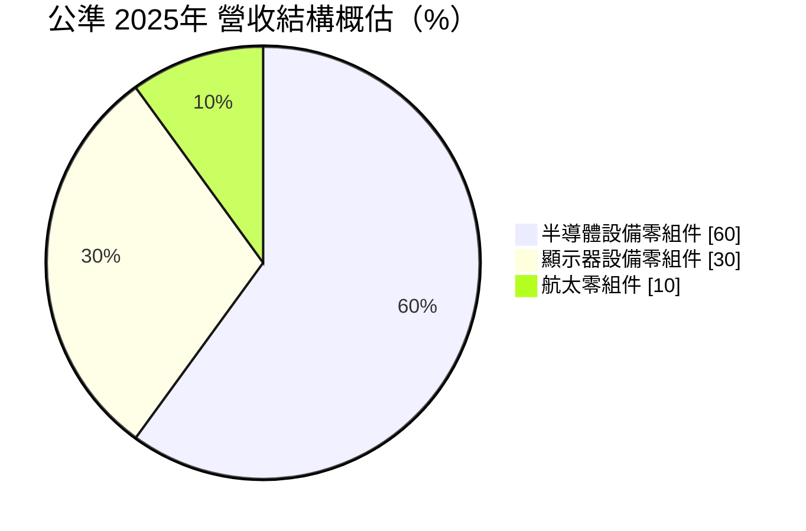
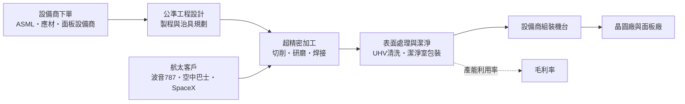
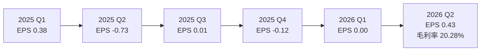
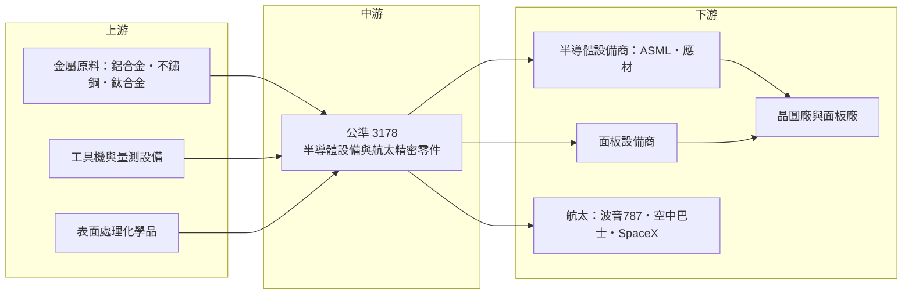

# 3178 公準

> 上櫃｜[[產業索引-半導體業|半導體業]]｜上市（櫃）日期 2018/11/19

# 第一章：企業模式與商業藍圖

> [!info] 撰寫說明
> 本文由 Claude 依公開資料整理，架構比照 [[2330台積電]] 的四章研究，資料截至 2026-10-07。財務數字來源：富果研究 2025 年 12 月法說會整理、nstock 公司資料頁、Winvest 營收快訊、Yahoo 股市 EPS 頁、理財周刊報導；產業描述為整理性內容，尚未逐條比對原始文件。#待校對

在評估單一個股的長期投資價值時，首要步驟是拆解企業的底層獲利邏輯。本章針對公準精密工業（股票代號：3178，以下簡稱公準）的商業模式進行定性分析，說明一家從模具加工起家的精密機械廠，如何成為國際半導體設備商與航太客戶的零組件供應商，以及為何獲利在 2024 至 2025 年大幅下滑。

## 一、核心定位：高精度、高潔淨度的設備零組件代工廠

公準成立於 1978 年 3 月，2018 年 11 月掛牌上櫃，資本額約 4.5 億元。營業項目登記為「各種模具、特殊機械、電子零件及航空引擎與結構之模具等之製造加工與銷售」，實際業務是替設備商加工高精度金屬零組件，再做表面處理、潔淨與組裝。

它的位置在半導體供應鏈的最上游：晶圓廠向 [[ASML艾司摩爾]]、[[AMAT應用材料]]買設備，這些設備商再把機台裡的真空腔體、精密結構件、光學平台零件發包給公準這類零組件廠。依理財周刊報導，ASML 與應材都是公準的重要客戶，公司也在 2019 年取得 SpaceX 的合格供應商認證，2020 年開始供應低軌衛星零組件。

公準的核心能力有三項：

* **超精密加工：** 公差控制在微米等級的金屬切削與研磨。
* **[[超高真空]]（UHV）與高潔淨度製造：** 半導體設備內部需要極高真空與無微粒環境，零件須經過特殊清洗、表面處理與潔淨室包裝。
* **航太品質系統：** 航太零件需通過嚴格的品質認證，從材料追溯到每道加工都要記錄。

## 二、終端應用／產品板塊：半導體設備為主、航太為第二支柱

依 2025 年 12 月法說會，公準的營收結構如下：

* **半導體設備零組件（約六成）：** 供應曝光機（微影）、電子束檢測、光學量測、薄膜與封裝製程設備的零件。微影相關是最重要的一塊，公司規劃 2030 年後配合 High NA [[EUV]] 世代導入相關零件。
* **顯示器設備零組件（約三成）：** LCD 與 OLED 製程中的 [[CVD]]、[[PVD]] 設備核心零件，需求取決於面板廠的擴產週期，法說會預估 2026 年持平。
* **航太零組件（約一成）：** 應用於波音 787、空中巴士 A330 等商用客機的引擎與結構零件，以及起落架致動器。
* **自有品牌產品：** 伺服閥、微渦輪與衛星[[反應輪]]，是公司由代工走向自有技術的嘗試。

## 三、資本轉化邏輯（營運模式）：接單生產的精密加工

* **接單式生產：** 公準依客戶圖面生產，每一種零件都要先通過客戶的首件檢驗與製程認證。這讓客戶不容易更換供應商，但也代表公準的營收直接跟著設備商的出貨週期起伏。
* **重資產、高固定成本：** 精密工具機、潔淨室與表面處理線都屬固定資產，折舊與人力成本固定。產能利用率下降時毛利率會快速下滑，這是 2024 至 2025 年毛利率由 28% 掉到 15% 的主因之一。
* **據點擴張：** 高雄路竹科學園區的高科廠預計 2026 年第三季投入營運，專注半導體設備與航太零組件，報導估計產能增加約 15%；表面處理廠新產線已於 2025 年中完成，總廠則計畫擴建超高真空半導體製程產線。

## 四、企業長期藍圖：ASML 加航太衛星雙主軸

* **跟著微影設備升級：** 公司以「ASML 半導體設備加航太衛星精密零組件」為雙主軸，若能在 High NA EUV 世代維持供應地位，單一零件的價值會比現有世代更高。
* **航太復甦：** 波音加速 787 生產交付，法說會預估 2026 年航太營收顯著回升。
* **低軌衛星：** 衛星反應輪與相關零組件供應 SpaceX 等客戶，屬於量小但技術門檻高的市場。
* **獲利回復：** 2023 年 EPS 4.52 元、2022 年 5.01 元是歷史高峰，2025 年轉為每股虧損 0.46 元，2026 年第二季 EPS 0.43 元重新轉正。能否回到高峰水準，取決於新廠產能能否被訂單填滿。

# 第二章：護城河深度與競爭優勢

在長期價值投資中，「護城河」指企業抵禦競爭、維持超額利潤的保護機制。本章分析公準的護城河構成、主要競爭對手，以及代工型零件廠能守住多少議價能力。

## 一、護城河的核心組成要素

* **1. 客戶認證與轉換成本：** 半導體設備零件要通過設備商的製程認證，航太零件要通過 AS9100 等品質系統與客戶個別審核，認證時間動輒一兩年。設備商一旦把某個零件交給合格供應商，除非品質出問題，很少主動更換。
* **2. 超高真空與潔淨技術：** 微影與檢測設備的零件需要極低的表面微粒與釋氣，公準持續投資超高真空產線與表面處理廠，這類製程經驗需要長時間累積。
* **3. 多產業分散：** 同一套精密加工能力同時服務半導體、面板與航太，各產業景氣週期不同步，可以分散單一產業的衰退衝擊。

整體而言，公準的護城河屬於「窄護城河」：客戶黏著度高，但議價能力有限，價格與數量多由設備商主導。

## 二、全球主要競爭對手格局

| 對手 | 定位 | 對公準的威脅 |
|---|---|---|
| [[3413京鼎]] | 鴻海集團旗下，應材重要的模組與零件供應商 | 規模大、在應材供應鏈地位深 |
| [[6196帆宣]] | 設備代工與廠務工程，ASML 模組供應商之一 | 在 ASML 台灣供應鏈直接競爭 |
| 荷蘭與歐洲精密加工廠 | ASML 在地供應商，如 VDL 等 | 地理接近、與 ASML 共同開發 |
| [[2634漢翔]] | 台灣航太引擎與結構件大廠 | 在航太零件競爭，規模與認證更完整 |

註：上表各家與公準的實際重疊程度為依產品線推估。

## 三、優勢轉化：守得住、守不住與觀察重點

* **守得住：** 已通過認證的微影與檢測設備零件、航太引擎零件。這些零件在設備或機型的生命週期內都會持續訂購。
* **守不住：** 價格與匯率。公準的報價多以美元計，2025 年前三季毛利率降到 15%，法說會將原因指向美元匯率波動；設備商在景氣下行時也會要求降價。
* **觀察重點：** 高科廠 2026 年第三季投產後的產能利用率、High NA EUV 相關零件的導入進度，以及波音 787 交機速度。三者若同步改善，毛利率才有機會回到 2023 年 28% 的水準。

# 第三章：財務體質與盈利規模

資料日期：2026-10-07。數字取自富果研究法說會整理、nstock、Winvest 營收快訊、Yahoo 股市 EPS 頁與理財周刊，表格是撰寫當時的快照；最新月營收、毛利率、累計 EPS 由自動排程寫在本筆記的屬性欄位（月營收、毛利率、累計EPS 等）。#待校對

財務報表是檢驗護城河是否真實存在的最終標準。本章用三率、ROE、現金流與資本報酬，檢視公準在景氣與匯率雙重壓力下的獲利品質。

## 一、獲利能力的基石：三率

| 項目 | 2023 全年 | 2024 全年 | 2025 全年 | 2026 Q1 | 2026 Q2 |
|---|---|---|---|---|---|
| 營收（新台幣） | 未查得 | 未查得 | 12.57 億 | 未查得 | 未查得 |
| [[毛利率]] | 28% | 17% | 前三季 15% | 未查得 | 20.28% |
| [[營業利益率]] | 未查得 | 未查得 | 未查得 | 未查得 | 6.93% |
| EPS（元） | 4.52 | 1.05（四季加總） | -0.46 | 0.00 | 0.43 |

註：2026 年 1 至 8 月累計營收 9.08 億元，年增 6.28%；6 月單月 1.31 億元、年增 36.03%。2026 年第二季淨利率 5.27%。

* **[[毛利率]]：** 從 2023 年 28% 降到 2024 年 17%、2025 年前三季 15%。原因包括美元匯率波動、半導體設備客戶調整庫存，以及新產能折舊。2026 年第二季回升到 20.28%，代表營收回溫後固定成本被重新攤提。
* **[[營業利益率]]：** 2026 年第二季 6.93%，仍遠低於景氣高峰期。精密加工的費用結構以人力為主，毛利率每回升幾個百分點，對營業利益的放大效果很明顯。
* **業外：** 2025 年第二季 EPS -0.73 元，當季新台幣急升，匯兌損失推估是虧損擴大的主因。

## 二、[[ROE]]：資本效率

2022 至 2023 年 EPS 約 4.5 至 5 元，ROE 推估在兩成上下；2025 年轉為虧損，ROE 為負。公準的 ROE 波動大，主要受毛利率與產能利用率影響。由於新廠擴建，股東權益中有相當比例投入尚未產生營收的固定資產，短期 ROE 會被壓低。

## 三、資本支出與自由現金流

* **[[CapEx]]：** 高雄高科廠、表面處理廠新產線與總廠超高真空產線，是近兩年的主要資本支出（具體金額未查得）。
* **[[自由現金流]]：** 獲利下滑加上擴廠，自由現金流推估轉弱。2024 年配發現金股利 0.5 元，2025 年度因虧損未配息，近五年平均現金股利約 1.25 元。
* **折舊壓力：** 新廠在 2026 年第三季投產後開始提列折舊，若初期訂單不足，會壓低 2026 下半年至 2027 年的毛利率。

## 四、[[ROIC]] 與 [[WACC]]：價值創造利差

2022 至 2023 年的高獲利期，公準的投入資本報酬率推估明顯高於資金成本；2024 至 2025 年獲利急降並轉虧，ROIC 低於 WACC，處於價值毀損期。新廠投資能否創造價值，關鍵在於產能利用率能否在投產後一至兩年內拉回高檔。

# 第四章：總體風險與地緣政治

任何企業都無法脫離宏觀環境獨立存在。本章分析公準未來必須面對的地緣政治、產業週期與營運風險。

## 一、地緣政治

* **出口管制：** 曝光機與檢測設備屬於美國與荷蘭出口管制重點，若管制範圍擴大，設備商對中國的出貨下降，可能連帶減少零件需求。
* **美國關稅：** 航太與部分設備零件直接出口美國，美國關稅政策變動會影響報價與客戶採購意願。
* **供應鏈在地化：** ASML 與應材在地緣政治壓力下分散供應商，台灣供應商可能增加訂單，也可能面對其他地區供應商的競爭。

## 二、產業週期與市場結構

* **半導體設備週期：** 晶圓廠資本支出循環決定設備商出貨，零件廠位於最上游，[[長鞭效應]]明顯。設備商去庫存時，零件訂單可能先砍再補。
* **面板設備週期：** 面板產業擴產已趨緩，顯示器設備零件需求在 2026 年預估持平，長期成長有限。
* **航太週期：** 波音的生產問題曾使 787 交機延後，航太零件需求受單一機型與客戶影響大。

## 三、營運環境的隱性風險

* **匯率：** 以美元計價為主，新台幣升值直接壓縮毛利與造成匯兌損失，2025 年就是明顯例子。
* **客戶集中：** 營收高度集中於少數設備商，單一客戶調整採購會大幅影響營收。
* **新廠爬坡與人力：** 精密加工需要熟練技術人員，高雄新廠爬坡期間的良率與人力招募是執行風險。

## 四、科技或法規演進

* **微影技術世代交替：** High NA EUV 機台結構與現行機台不同，公準需重新取得零件認證，若未能進入新世代供應鏈，長期份額可能流失。
* **航太法規：** 航太零件須持續符合各國航空主管機關與客戶的品質規範，任何品質事件都可能導致資格暫停。
* **淨零要求：** 設備商要求供應鏈減碳，表面處理與加工的耗能、廢液處理需符合更嚴格的環保規範。

# 專有名詞解析

## 半導體

- **[[EUV]]**：極紫外光微影，以 13.5 奈米波長光源曝光，是 7 奈米以下先進製程的關鍵設備技術。
- **[[High NA EUV]]**：數值孔徑提高到 0.55 的新一代 EUV 曝光機，可印出更細線寬，用於 2 奈米以下製程。
- **[[超高真空]]**：壓力極低的真空環境，半導體設備內部需要以減少污染，零件須經特殊處理才能使用。
- **[[CVD]]**：化學氣相沉積，以氣體在基板表面反應成膜，用於半導體與面板製程。
- **[[PVD]]**：物理氣相沉積，以濺鍍等物理方式把金屬鍍在基板上，常用於金屬導線層。

## 金融

- **[[產能利用率]]**：實際產出占總產能的比例，固定成本高的製造業毛利率高度取決於此數字。
- **[[毛利率]]**：毛利除以營收，反映產品定價能力與成本控制。
- **[[自由現金流]]**：營業活動現金流減去資本支出，代表企業可自由用於配息、還債或併購的現金。
- **[[長鞭效應]]**：終端需求的小幅變動，沿供應鏈往上游傳遞時被逐級放大，造成上游庫存與訂單劇烈波動。

## 產業

- **[[反應輪]]**：衛星姿態控制裝置，透過改變飛輪轉速讓衛星調整方向。
- **[[伺服閥]]**：以電訊號精密控制液壓流量的閥件，用於飛機致動器與工業機械。
- **[[AS9100]]**：航太產業的品質管理系統標準，航太零件供應商普遍須取得此認證。

# 核心供應鏈

## 1. 上游：原料與加工設備
- 特殊金屬材料：鋁合金、不鏽鋼與鈦合金（供應商未查得）
- 精密工具機與量測設備

## 2. 中游：公準本身
- 半導體設備零組件、顯示器設備零組件、航太零組件
- 自有品牌：伺服閥、微渦輪、衛星反應輪

## 3. 下游：主要客戶
- 微影與量檢測設備：[[ASML艾司摩爾]]
- 薄膜與製程設備：[[AMAT應用材料]]
- 航太：波音、空中巴士、SpaceX
- 終端晶圓廠：[[2330台積電]] 等（間接）

## 4. 同業
- 半導體設備零件：[[3413京鼎]]、[[6196帆宣]]
- 航太零件：[[2634漢翔]]

延伸閱讀：[[台積電供應鏈]]

## 最新新聞
<!-- news:start -->
<!-- news:end -->

## 相關連結
- [公開資訊觀測站](https://mopsov.twse.com.tw/mops/web/t05st03?step=1&firstin=1&co_id=3178)
- [Goodinfo](https://goodinfo.tw/tw/StockDetail.asp?STOCK_ID=3178)
- [Yahoo 股市](https://tw.stock.yahoo.com/quote/3178)
- [鉅亨網新聞](https://www.cnyes.com/twstock/3178/news)
