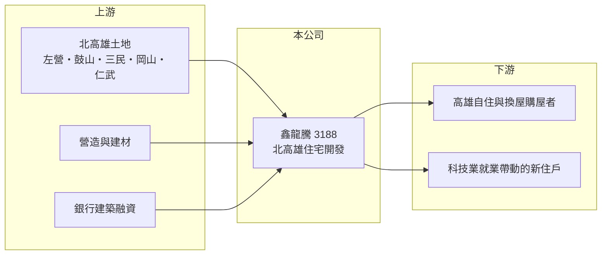

# 3188 鑫龍騰

> 上櫃｜[[產業索引-建材營造業|建材營造業]]｜上市（櫃）日期 2004/03/17

# 第一章：企業模式與商業藍圖

> [!info] 撰寫說明
> 本文由 Claude 依公開資料整理，架構比照 [[2330台積電]] 的四章研究，資料截至 2026-10-08。財務數字來源：Goodinfo 年度經營績效頁、富果研究 2026 年 3 月法說會整理；產業描述為整理性內容，尚未逐條比對原始文件。#待校對

在評估單一個股的長期投資價值時，首要步驟是拆解企業的底層獲利邏輯。本章說明鑫龍騰（股票代號：3188）如何把資源集中在北高雄，以中大型住宅社區經營建設本業。

## 一、核心定位：北高雄的區域型建商

鑫龍騰的核心業務是房地產開發與銷售，近年推案幾乎都集中在高雄，尤其是左營、鼓山、三民、岡山與仁武等北高雄區域。代表案包括「鑫天地 2」（三民區，總銷約 40 億元）、「鑫巨蛋 2」（鼓山區，約 31 億元）、「鑫悅」（左營區，約 35 億元）與「鑫首席」（岡山區，約 30 億元）。

經營層表示，公司布局北高雄早於台積電高雄設廠的議題，半導體聚落是強化既有需求的因素，而不是唯一理由。北高雄同時有高鐵、捷運、巨蛋商圈與楠梓、橋頭科學園區，長期具備就業與交通建設帶動的自住需求。

## 二、資本轉化邏輯：成屋與預售並行

鑫龍騰同時有預售與成屋銷售，成屋從簽約到過戶認列營收約需 2 至 3 個月。截至 2026 年 3 月，待交屋及未售戶總銷約 73 億元，其中[[已售未入帳]]約 20 億元。這種「完工後仍有餘屋可賣」的結構，讓營收可以分散到多個年度，減少交屋空窗。

## 三、長期方向

公司策略是持續聚焦需求穩健的北高雄，並以餘屋去化填補新案完工前的空檔。2027 年的營收空窗是法人關注的重點，經營層認為多個建案仍有餘屋可認列，不致大幅波動。長期而言，公司能否在北高雄持續以合理價格取得土地，決定成長是否延續。

# 第二章：護城河深度與競爭優勢

「護城河」指企業抵禦競爭、維持超額利潤的保護機制。本章分析鑫龍騰作為區域型建商的優勢與限制。

## 一、相對優勢

鑫龍騰的優勢是區域專注。長期在北高雄推案，熟悉各區的價格帶、買方結構與土地來源，能在土地成本較低時提前布局，這也反映在 2024 至 2025 年 45% 以上的高毛利率。系列化的建案品牌（鑫天地、鑫巨蛋）也有助於在地客群辨識。

## 二、主要競爭對手

| 對手 | 定位 | 對鑫龍騰的威脅 |
|---|---|---|
| [[2542興富發]] | 全台大量推案，高雄為重要市場 | 以量能與價格競爭 |
| [[2501國建]] | 全台推案，高雄有大型案 | 品牌型建商爭取換屋客 |
| 高雄在地建商 | 京城建設、三發地產等 | 爭取同一批北高雄土地與買方 |

## 三、守得住／守不住／觀察重點

守得住的是早期低成本土地與在地經驗；守不住的是高雄房價快速上漲後的追價空間，以及科技業設廠帶動的需求若放緩，北高雄的供給可能過剩。長期觀察重點是新購土地的成本、餘屋去化速度，以及 2027 年以後的推案量。

# 第三章：財務體質與盈利規模

資料日期：2026-10-08。數字取自 Goodinfo 年度經營績效與富果研究法說會整理，表格是撰寫當時的快照；最新月營收、毛利率、累計 EPS 由自動排程寫在本筆記的屬性欄位（月營收、毛利率、累計EPS 等）。#待校對

財務報表是檢驗護城河是否真實存在的最終標準。本章用五年的三率、ROE 與資本報酬檢視鑫龍騰的獲利品質。

## 一、多年度經營績效

| 年度 | 營收（新台幣） | [[毛利率]] | [[營業利益率]] | EPS（元） | [[ROE]] |
|---|---|---|---|---|---|
| 2021 | 14.9 億 | 27.2% | 18.1% | 1.78 | 13.2% |
| 2022 | 10.6 億 | 21.8% | 10.6% | 0.61 | 4.30% |
| 2023 | 20.5 億 | 33.5% | 24.6% | 2.05 | 15.3% |
| 2024 | 15.0 億 | 47.8% | 35.4% | 2.21 | 15.1% |
| 2025 | 27.0 億 | 45.3% | 36.2% | 4.05 | 24.8% |

2021 至 2025 年營收年複合成長率約 16%（推算），平均 ROE 約 14.5%（推算），2025 年營收約 27 億元創歷史新高。毛利率從 2022 年的 22% 一路升到 45% 以上，反映高雄房價上漲而土地是早年取得，這種利差在後續新購土地的案子中不一定能維持。股利政策為年度獲利的 50% 至 70%，近期提高到約 EPS 八成；Goodinfo 統計歷年平均現金股利約 0.5 元，近年明顯提高。

## 二、營建業指標

截至 2026 年 3 月，待交屋及未售戶總銷約 73 億元、已售未入帳約 20 億元，約為 2025 年營收的 2.7 倍與 0.7 倍。依 ROE 與 ROA 推算，2025 年總資產約為股東權益的三倍（推算），負債比約 67%，為建商常見的槓桿水準；部分可轉債已轉換為股票，股本變動為 18.86 億元。

## 三、[[ROIC]] 與 [[WACC]]：價值創造利差

**ROIC 推算：** 2025 年營業利益約 9.8 億元（27 億 × 36.2%），稅後約 7.8 億元。股東權益約 33 億元（每股淨值 17.54 元 × 約 1.86 億股），依 ROA 推算負債約 67 億元，假設其中四分之三為有息負債約 50 億元（推估），投入資本約 83 億元，ROIC 約 9.4%（推算）。

**WACC 推算：** 台灣 10 年期公債 1.75%、市場風險溢酬 6%、β 取營建同業常見值 0.9，股東權益成本約 7.2%；負債成本 3%、稅後 2.4%；權益占投入資本約 39%，WACC 約 4.3%（推算）。

**結論：** 2023 至 2025 年鑫龍騰 ROIC 明顯高於 WACC，代表北高雄的早期布局確實創造了價值。這份超額報酬有相當部分來自房價上漲，未來需觀察在土地成本較高的新案中，能否維持類似的利差。

# 第四章：總體風險與地緣政治

任何企業都無法脫離宏觀環境獨立存在。本章分析鑫龍騰長期必須面對的風險。

## 一、區域集中風險

所有重要建案集中在北高雄，公司的營運與當地房市、科技業設廠進度、交通建設高度連動。若半導體投資放緩或區域供給過多，去化與售價都可能同時受壓。

## 二、房市週期與政策

央行[[信用管制]]、限貸與房地合一稅等政策會影響購屋需求，尤其是投資型買盤。房市景氣循環長，高雄過去數年漲幅大，未來若進入盤整期，餘屋去化速度會變慢。

## 三、營收空窗與配息持續性

建商營收依交屋認列，2027 年可能出現新案銜接空窗；配息率提高到約 EPS 八成，若獲利回落，股利也會隨之下降。高負債結構下，利率上升也會增加財務成本。

# 專有名詞解析

## 金融

- **[[信用管制]]**：央行限制購屋與建商貸款成數的政策，會影響房市成交與建商資金。
- **[[ROIC]]**：投入資本報酬率，稅後營業利益除以股東權益加有息負債，衡量本業運用資本的效率。
- **[[WACC]]**：加權平均資金成本，股東與債權人要求報酬率的加權平均，是 ROIC 要超越的門檻。

## 產業

- **[[建案交屋]]**：建商在房屋完工並交付買方時才認列營收，因此營建公司的營收常集中在交屋年度。
- **[[已售未入帳]]**：已經賣出、但尚未完工交屋而未認列營收的建案金額，是建商未來營收的主要能見度指標。

# 核心供應鏈

## 1. 上游：土地、營造與資金
- 土地：北高雄各區
- 建材：[[1101台泥]]、[[2002中鋼]] 等；營造廠
- 資金：銀行建築融資、可轉換公司債

## 2. 中游：鑫龍騰與同業
- 同業：[[2542興富發]]、[[2501國建]]、京城建設

## 3. 下游：客戶
- 高雄自住與換屋購屋者，受 [[2330台積電]] 高雄設廠等科技聚落帶動

## 最新新聞
<!-- news:start -->
<!-- news:end -->

## 相關連結
- [公開資訊觀測站](https://mopsov.twse.com.tw/mops/web/t05st03?step=1&firstin=1&co_id=3188)
- [Goodinfo](https://goodinfo.tw/tw/StockDetail.asp?STOCK_ID=3188)
- [Yahoo 股市](https://tw.stock.yahoo.com/quote/3188)
- [鉅亨網新聞](https://www.cnyes.com/twstock/3188/news)
