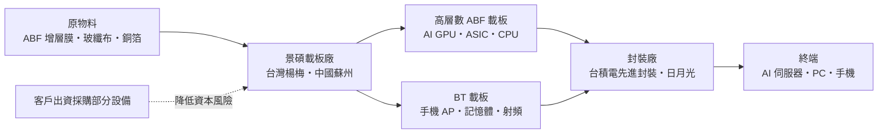
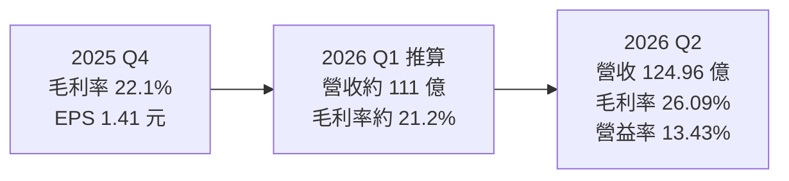
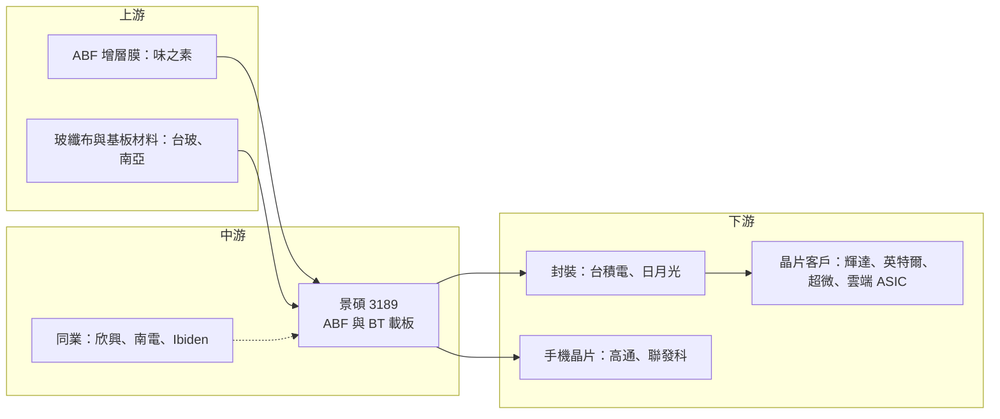

# 3189 景碩

> 上市｜[[產業索引-半導體業|半導體業]]｜上市（櫃）日期 2004/11/01

# 第一章：企業模式與商業藍圖

> [!info] 撰寫說明
> 本文由 Claude 依公開資料整理，架構比照 [[2330台積電]] 的四章研究，資料截至 2026-10-07。財務數字來源：工商時報 2026 年 8 月財報與法說報導、經濟日報 2025 年自結財報報導、三立新聞網 2026 年 8 月報導、Brodog Investment 研究整理；產業描述為整理性內容，尚未逐條比對原始文件。#待校對

在評估單一個股的長期投資價值時，首要步驟是拆解企業的底層獲利邏輯。本章針對景碩科技（股票代號：3189，以下簡稱景碩）的商業模式進行定性分析，說明一家過去以手機載板見長的廠商，如何把營運重心轉向 AI 晶片所需的高層數載板，以及這個轉型背後的資本邏輯。

## 一、核心定位：AI 晶片的 ABF 載板第二梯隊大廠

景碩是台灣的 [[IC 載板]]製造商，屬於和碩集團體系（推估，源自華碩集團分拆）。IC 載板是晶片與電路板之間的橋樑：晶片上的接點非常細密，無法直接焊到主機板上，必須先封裝在一塊多層、細線路的載板上，再由載板連接到系統。AI GPU、[[ASIC]] 與伺服器 CPU 的尺寸越來越大、層數越來越多，載板因此成為 AI 晶片供應鏈中最吃緊的零組件之一。

全球 [[ABF 載板]]市場由 Ibiden、[[3037欣興]]、AT&S、[[8046南電]]、新光電氣等大廠主導。Brodog Investment 的研究將景碩定位為「第二梯隊」：在一線廠產能滿載時承接外溢訂單，並逐步打入 AI 平台的主力供應名單。這個定位有兩層意義：

* **以供給缺口換取成長：** AI 需求暴增、一線廠產能不足時，景碩是客戶分散供應來源的首選之一，成長速度可以快於整體市場。
* **以產品升級拉高獲利：** 過去以 [[BT 載板]]與手機應用為主、毛利率偏低，轉向高層數 ABF 載板後，產品單價與毛利率都有拉升空間。

## 二、產品板塊：ABF 為主軸、BT 為基本盤

景碩的產品分兩大類。本次查得的資料未公開 ABF 與 BT 的營收比重，因此不畫營收結構圓餅圖，以下以定性方式說明各板塊。

* **高層數 ABF 載板（16 層以上）：** 用於 AI 加速器與伺服器 CPU，是景碩成長的主軸。研究報告提及客戶包括 [[NVDA輝達]]（Vera／Rubin 平台）、谷歌與臉書等美系雲端業者的 ASIC，以及長期合作的 [[INTC英特爾]]、[[AMD超微]] CPU 載板。工商時報報導，公司目標在 Vera CPU 載板取得完整份額，並在數季內拿下 AI GPU 載板約兩成市占。
* **一般 ABF 載板：** 用於 PC、消費性電子與網通晶片，需求相對平淡。
* **BT 載板：** 手機 [[AP]]、記憶體、射頻與感測模組用，與消費電子景氣連動。
* **新技術：** 三立新聞網報導，景碩與 [[2330台積電]] 合作開發類 [[EMIB]] 的橋接載板與陶瓷材料載板等新世代技術，預估陶瓷載板 2028 年量產。

## 三、資本轉化邏輯：重資產擴產換取高階訂單

* **產能布局：** 主要生產基地在台灣（含楊梅廠區），並在中國蘇州設有據點。依 Brodog Investment 整理，楊梅六廠擴產計畫將使 ABF 月產能由約 4,000 萬顆擴增至 5,000 萬顆；三立新聞網也報導 ABF 產能預計擴充 25%、月產能上看 5,000 萬顆，新產能自 2027 年起陸續開出。工商時報引述高盛預估，景碩到 2029 年底 ABF 月產能可倍增至 8,000 萬顆，這屬外資推估。
* **客戶共同出資：** 工商時報報導，公司規劃三年投入約 196 億元擴產，並由客戶出資採購部分設備。這種模式把一部分擴產風險轉給客戶，也代表客戶對中長期需求有一定承諾。
* **[[良率]]決定獲利：** 高層數大尺寸載板的良率爬坡是最大挑戰。產能開出後若良率順利拉升，增加的營收大部分會轉為利潤；反之，新產線初期會拖累毛利率。

## 四、企業長期藍圖：集中 AI、卡位新結構

* **集中 AI 高層數 ABF：** 把資本支出集中在高層數、大尺寸 ABF 載板，提高高單價產品比重。
* **成本轉嫁：** 原物料價格上漲時與客戶協商漲價，2025 年下半年起已反映在毛利率回升。
* **新材料與新結構：** 透過與台積電合作的類 EMIB 橋接載板與陶瓷載板，卡位下一代[[先進封裝]]。同時，[[玻璃基板]]等新材料是整個載板產業必須面對的技術路線選擇。

# 第二章：護城河深度與競爭優勢

在長期價值投資中，「護城河」指企業抵禦競爭、維持超額利潤的保護機制。本章分析景碩的護城河構成、全球主要競爭對手，以及這些優勢在 AI 載板的供需循環中能守住多少。

## 一、景碩護城河的核心組成要素

景碩的護城河屬於「中等寬度」，主要來自產業結構與客戶認證，而非獨占技術：

* **1. 高進入門檻：** ABF 載板需要大量資本、細線路製程與長期良率經驗，高層數大尺寸載板的良率是最大技術門檻，新進者難以短期追上。
* **2. 客戶認證與平台綁定：** AI 平台的載板需要和晶片設計、封裝廠一起驗證，一旦打入某代平台，該平台生命週期內很少更換供應商。
* **3. 寡占結構：** 全球具備高階 ABF 量產能力的廠商不多，AI 需求暴增時，供給吃緊讓議價能力轉向載板廠。
* **4. 與台積電的技術合作：** 共同開發新世代載板技術，有助於提早卡位 [[CoWoS]] 後續世代的封裝需求。

## 二、全球主要競爭對手格局

| 對手 | 定位 | 對景碩的威脅 |
|---|---|---|
| Ibiden（日本） | 全球高階 ABF 載板龍頭，與輝達、英特爾長期合作 | 最高階 AI GPU 載板的技術與客戶關係領先 |
| [[3037欣興]] | 台灣最大載板廠，ABF 產能與技術領先 | 在台灣客戶與 AI 平台上直接競爭 |
| [[8046南電]] | 台塑集團旗下，ABF 與 BT 並重 | 在一般 ABF 與 BT 載板重疊 |
| AT&S（奧地利）、新光電氣（日本） | 國際主要 ABF 供應商 | 爭取同一批 CPU 與 AI 客戶 |
| 三星電機、深南電路等 | 韓國與中國業者，中國廠商積極擴產 | 在 BT 與部分 ABF 以價格競爭 |

## 三、優勢轉化：哪些市場守得住、哪些守不住

* **守得住：** AI 載板供給吃緊期間，景碩承接一線廠外溢訂單，並在特定平台（如 Vera CPU）取得重要份額，2026 年第二季營業利益率回升到 13.43%。
* **守不住：** 在最高階 AI GPU 載板，Ibiden 與欣興的技術與客戶關係仍領先；景碩在一般 ABF 與 BT 載板則面臨中國業者的價格競爭。2025 年毛利率僅約 21.1%，低於一線大廠，顯示產品結構仍待升級。
* **觀察重點：** 高層數 ABF 新產能 2027 年開出後的良率爬坡、AI GPU 載板市占能否達到兩成目標，以及原物料（如玻纖布、ABF 膜）缺貨對出貨的限制。這三點決定景碩能否從「第二梯隊」升級為 AI 平台的主力供應商。

# 第三章：財務體質與盈利規模

資料日期：2026-10-07。數字取自工商時報、經濟日報與三立新聞網，表格是撰寫當時的快照；最新月營收、毛利率、累計 EPS 由自動排程寫在本筆記的屬性欄位（月營收、毛利率、累計EPS 等）。#待校對

財務報表是檢驗護城河是否真實存在的最終標準。本章用三率、ROE、資本支出與資本報酬，檢視景碩在 AI 載板上行週期中的獲利品質。

## 一、獲利能力的基石：三率

| 項目 | 2025 全年 | 2025 Q4 | 2026 Q1（推算） | 2026 Q2 |
|---|---|---|---|---|
| 營收（新台幣） | 393.5 億 | 未查得 | 約 111.05 億 | 124.96 億 |
| [[毛利率]] | 21.1% | 22.1% | 約 21.2% | 26.09% |
| [[營業利益率]] | 未查得 | 未查得 | 約 8.0% | 13.43% |
| EPS（元） | 3.51 | 1.41 | 約 1.2 | 約 2.49 至 2.57 |

* **營收與獲利：** 2025 年營收年增 28.8%，稅後淨利約 15.9 億元，較 2024 年大幅成長；第四季營收季增 3%、年增 32.6%，稅後淨利約 6.4 億元。2026 年第二季營收 124.96 億元創新高、年增 30.7%，稅後淨利約 13.1 億元，為 15 季新高；上半年獲利已超過 2025 年全年。
* **推算說明：** 2026 年第一季數字由上半年（營收 236.01 億元、毛利率 23.77%、營業利益 25.69 億元、EPS 3.74 元）減去第二季推算，僅供參考。第二季 EPS 各媒體報導為 2.49 元至 2.57 元不等。
* **[[毛利率]]與營運槓桿：** 載板業固定成本高，產品組合往高層數 ABF 移動、產能利用率提高時，毛利率與營業利益率同步擴張。第二季毛利率較第一季提升約 5 個百分點，營業利益率提升幅度更大，是典型的營運槓桿。
* **限制因素：** 管理層表示原物料供應短缺可能壓抑成長約 10% 至 15%，消費性電子需求仍弱。

## 二、[[ROE]]：資本效率

載板業屬資本密集產業，景碩在 2023 至 2024 年景氣低谷時獲利微薄，股東權益報酬率偏低；2025 年起隨 AI 需求回升、2026 年上半年獲利倍增，ROE 明顯改善（推估，精確數字未查得）。不過，現金增資會擴大股本與股東權益，對 ROE 有稀釋效果。

## 三、資本支出與自由現金流

* **[[CapEx]]：** 各來源說法不一。工商時報報導董事會通過約 196 億元三年擴產計畫，並由客戶出資採購部分設備；Brodog Investment 整理為楊梅六廠約 235 億元擴產，2026 至 2028 年資本支出約 80 億、100 億、85 億元。
* **籌資：** Brodog Investment 也提到公司辦理現金增資 7,000 萬股，以支應擴產資金需求，股本將因此擴大。
* **[[自由現金流]]：** 大規模擴產期間，自由現金流將受壓縮，未來數年折舊上升；若需求不如預期，毛利率可能承壓。2025 年度股利本文未查得。

## 四、[[ROIC]] 與 [[WACC]]：價值創造利差

企業創造價值的條件是投入資本報酬率高於資金成本。景碩在 2021 至 2022 年載板缺貨期間 ROIC 應明顯高於 WACC，2023 至 2024 年供過於求時利差縮小甚至轉負（推估，具體數值未查得）。2026 年起的擴產能否創造價值，取決於新產能開出後的良率與價格：若高層數 ABF 在 2027 至 2028 年仍供不應求，新增資本可望維持正利差；若全產業同步擴產導致價格回落，大額投入可能壓低整體資本報酬。

# 第四章：總體風險與地緣政治

任何企業都無法脫離宏觀環境獨立存在。本章分析景碩未來必須面對的地緣政治、產業週期、營運與技術風險。

## 一、地緣政治風險

* **美國關稅與在地化：** AI 晶片供應鏈若被要求在美國或東南亞生產，載板廠可能需要跟進海外設廠，資本支出與營運成本會增加。
* **中國據點：** 蘇州廠區暴露在美中科技對抗與中國本土競爭之下，中國載板廠在政策支持下積極擴產。
* **台灣集中風險：** 主要高階 ABF 產能在台灣，面臨兩岸地緣政治風險。

## 二、產業週期與市場結構風險

* **載板景氣循環：** 2021 至 2022 年載板大缺貨、2023 至 2024 年供過於求，景碩獲利大起大落；AI 需求雖強，但全產業同步擴產可能在 2028 年後再度造成供過於求。
* **AI 資本支出依賴：** 高層數 ABF 的成長高度依賴輝達與雲端業者的 AI 投資，若 AI 投資放緩，影響直接且明顯。
* **[[長鞭效應]]：** BT 載板與一般 ABF 仍與手機、PC 需求連動，終端需求變化會沿供應鏈放大。
* **匯率：** 以美元計價為主，新台幣升值會壓縮營收與毛利。

## 三、營運環境的隱性風險

* **原物料短缺：** 玻纖布、ABF 膜等關鍵材料供應吃緊，可能限制出貨並推高成本。
* **新廠良率爬坡：** 高層數、大尺寸載板良率難度高，新產能開出初期可能拖累毛利率。
* **股本稀釋：** 現金增資與大規模擴產可能稀釋每股盈餘。

## 四、科技演進風險

先進封裝技術正在演進，玻璃基板、陶瓷載板、橋接（EMIB 類）結構與[[面板級封裝]]都可能改變載板的需求形態。若玻璃基板快速取代有機 ABF 載板，既有產線的價值可能下降；景碩與台積電合作的新世代技術能否如期量產，是因應這項風險的關鍵。

# 專有名詞解析

## 半導體

- **[[IC 載板]]**：晶片與電路板之間的多層細線路基板，負責把晶片上密集的接點轉接到主機板，並提供散熱與訊號傳輸路徑。
- **[[ABF 載板]]**：以味之素增層膜（ABF）製作的高階 IC 載板，線路細、層數多，用於 CPU、GPU 與 AI 加速器。
- **[[BT 載板]]**：以 BT 樹脂為基材的 IC 載板，成本較低，主要用於手機處理器、記憶體與射頻模組。
- **[[ASIC]]**：特定應用積體電路，為單一客戶或用途客製設計的晶片，例如雲端業者自研的 AI 加速器。
- **[[EMIB]]**：英特爾的嵌入式多晶片互連橋接技術，在載板內埋入小片矽橋連接相鄰晶片，是 CoWoS 以外的另一種先進封裝路線。
- **[[先進封裝]]**：把多顆晶片以中介層、混合鍵合等方式高密度整合的封裝技術，例如 CoWoS、SoIC。
- **[[CoWoS]]**：台積電的 2.5D 先進封裝技術，把 GPU 與 HBM 並排放在矽中介層上，是 AI 晶片的主流封裝方式。
- **[[玻璃基板]]**：以玻璃取代有機樹脂作為載板核心材料，平整度與耐熱性較好，被視為下一代大尺寸 AI 晶片載板的候選技術。
- **[[面板級封裝]]**：以方形大面板取代圓形晶圓進行封裝，可一次處理更多晶片、降低成本，是先進封裝的發展方向之一。
- **[[良率]]**：合格產品占總產出的比例，高層數大尺寸載板的良率是決定成本與獲利的關鍵。

## 應用

- **[[AP]]**：應用處理器，手機與平板的主晶片，整合 CPU、GPU 與數據機等功能。

## 金融

- **[[自由現金流]]**：營業活動現金流減去資本支出，代表企業可自由用於配息、還債或併購的現金。
- **[[長鞭效應]]**：終端需求的小幅變動，沿供應鏈往上游傳遞時被逐級放大，造成上游庫存與訂單劇烈波動。

# 核心供應鏈

## 1. 上游：材料與設備
- ABF 增層膜：日本味之素（Ajinomoto）
- 玻纖布與銅箔基板材料：[[1802台玻]]、[[1303南亞]]（推估）
- 載板設備與化學品：國內外設備商（具體名單未查得）

## 2. 中游：景碩本身與同業
- ABF 同業：[[3037欣興]]、[[8046南電]]、Ibiden、AT&S、新光電氣
- 集團關係：[[4938和碩]]（推估）

## 3. 下游：封裝廠與晶片客戶
- 先進封裝：[[2330台積電]]、[[3711日月光投控]]
- AI 與 CPU 晶片：[[NVDA輝達]]、[[INTC英特爾]]、[[AMD超微]]
- 雲端 ASIC：[[GOOGL谷歌]]、[[META臉書]]（研究報告提及）
- 手機晶片（BT 載板）：[[QCOM高通]]、[[2454聯發科]]（推估）

延伸閱讀：[[台積電供應鏈]]

## 供應鏈關係
- 供應給 [[2330台積電]]：BT與ABF載板製造（台積電供應鏈 › 下游：先進封裝大聯盟 (CoWoS 設備與載板) › ABF 高階載板三雄 (先進封裝必備)）

## 最新新聞
<!-- news:start（自動產生，請勿手動編輯此範圍） -->
- 2026-10-08 📰 媒體 19:26｜國巨*、景碩觸及跌停！兇手抓到了 71萬股東慘遭血洗｜[自由時報](https://news.google.com/rss/articles/CBMiWEFVX3lxTFBFbzE0S2VIVUF2V1h5dFNXSXZ4NXNRc2xncFFGbm15M2NQSWsyNE50T3lrc24yUGZDcWluWHRXSndZWHl2b0xrNkFGd0JlLUFvVXRuOVVRNGQ?oc=5)
- 2026-10-08 📰 媒體 18:47｜景碩(3189) 個股概覽 ／ 個股 - 股市｜[CMoney](https://news.google.com/rss/articles/CBMiU0FVX3lxTE9Jd3R0c2VFTEJyUmFjWmFEZDkyT3dLa2RxaTVHczNyUHU2NXJlS0syZVloTkczWGs3RzNjNXpjOXB1MWV3TEJFT0xhdlFhLUdUeGVR?oc=5)
- 2026-10-08 📰 媒體 12:10｜鉅亨速報 - Factset 最新調查：景碩(3189-TW)EPS預估下修至11.36元，預估目標價為1057元｜[鉅亨網](https://news.cnyes.com/news/id/6624694)
- 2026-10-08 📰 媒體 11:15｜PCB漲跌互見！「這檔」連7漲62.4%同聯茂噴48.8%創高 欣興、景碩、南電一起走弱｜[FTNN](https://news.google.com/rss/articles/CBMiS0FVX3lxTE5PV3lUT29TT1p4WXhwM2xwNkVpOWpYdXFiajJWU1dYX2h1d0xxdDV1U2pyWElkclNEZHVIdklsdTFxU3dqbUJtRkZWbw?oc=5)
- 2026-10-08 📰 媒體 10:37｜欣興、南電、景碩、臻鼎...載板4雄誰CP值最高？外資喊買它：連2年ABF產能被搶光- 上市櫃｜[旺得富理財網](https://news.google.com/rss/articles/CBMiakFVX3lxTFBLYTdLNWdROXlJWUlleU5wMlEwcmFKSjJwcmxuTkZrbnlLSE1qU1JuaXNrVnIyX0xua1JIdHI4Nk1nSTg5Um5GV1pCZFV0MTYyM21WdGhVMG1LcEo1Z0NUZUlzZC1hN1RHNEE?oc=5)

完整紀錄：[[3189景碩 新聞]]
<!-- news:end -->

## 相關連結
- [公開資訊觀測站](https://mopsov.twse.com.tw/mops/web/t05st03?step=1&firstin=1&co_id=3189)
- [Goodinfo](https://goodinfo.tw/tw/StockDetail.asp?STOCK_ID=3189)
- [Yahoo 股市](https://tw.stock.yahoo.com/quote/3189)
- [鉅亨網新聞](https://www.cnyes.com/twstock/3189/news)
