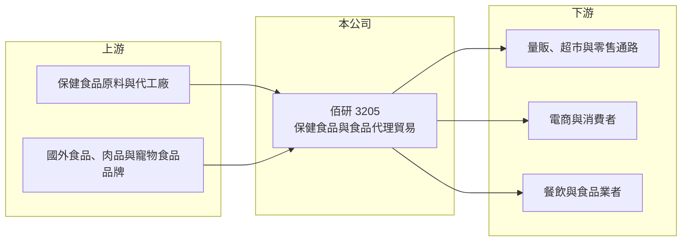

# 3205 佰研

> 上櫃｜[[產業索引-生技醫療業|生技醫療業]]｜上市（櫃）日期 2005/09/12

# 第一章：企業模式與商業藍圖

> [!info] 撰寫說明
> 精簡版，由 Claude 依公開資料整理，架構比照 [[2330台積電]] 的四章研究，資料截至 2026-10-08。來源：Goodinfo 年度經營績效頁（2020 至 2025 年）、櫃買中心開放資料（基本資料、2026 年第二季資產負債與綜合損益）、nStock 公司介紹與營收資料；各產品營收比重未查得。公開資料有限。#待校對

佰研生化科技（股票代號：3205，以下簡稱佰研）是一家以保健食品與食品貿易為主的小型公司。它的財報呈現出「毛利率低、長期虧損」的特徵，本篇的重點是說明這種商業模式的結構限制。

- **核心業務：** 佰研 1998 年在台南成立，前身為天騵生化科技，2009 年更名為佰研生化科技，2005 年上櫃，董事長為楊清宗（櫃買中心開放資料、nStock）。登記的營業項目包括中西藥與保健食品的研發與銷售、肉品與天然有機食品的代理、日用品與寵物食品的代理，以及生物技術研發與畜禽養殖（nStock 公司介紹）。
- **營收結構：** 各產品線的營收比重本次未查得。從毛利率長期只有 15% 至 20%、2026 年上半年更只有 6.7% 來看（Goodinfo、櫃買中心開放資料），營收中應有相當比重屬於代理與貿易性質的商品，而不是高毛利的自有品牌保健食品（推估）。
- **營運據點：** 公司登記地址在台南市東區，規模小，2026 年第二季底總資產約 11.4 億元，其中流動資產約 8.8 億元（櫃買中心開放資料）。
- **長期方向：** 2026 年 1 至 7 月累計營收約 3.67 億元，年增約 46.5%（nStock），營收有明顯回升，但毛利率同步下滑，顯示成長主要來自低毛利的貿易品項（推估）。公司要擺脫虧損，關鍵是提高自有品牌或高附加價值產品的比重，而不只是擴大貿易量。

# 第二章：護城河深度與競爭優勢

在競爭激烈的保健食品與食品通路市場，佰研目前看不出明顯的護城河，這也是它長期虧損的根本原因。

- **競爭優勢：** 佰研具備保健食品研發、代理通路與上櫃公司的資金取得能力，能同時經營多種商品。但代理與貿易業務的差異化低，供應商與客戶都可以輕易更換合作對象，難以形成持續的定價能力。
- **主要對手：** 保健食品方面，對手包括 [[1707葡萄王]]、[[4128中天]] 等有自有品牌與生產能力的業者，以及大量電商與直銷品牌；食品與寵物食品代理方面，則要面對大型進口商與通路商的規模優勢。
- **觀察重點：** 第一，毛利率能否回到 15% 以上並持續提升；第二，營業費用是否隨營收成長而被攤薄，讓營業利益轉正；第三，公司是否提出聚焦特定產品線的明確策略，而不是多項業務同時經營。

# 第三章：財務體質與盈利規模

資料日期：2026-10-08，表格是撰寫當時的快照；最新月營收、毛利率、累計 EPS 由自動排程寫在本筆記的屬性欄位（月營收、毛利率、累計EPS 等）。#待校對

佰研的六年財務數字呈現一致的模式：營收逐年縮小、毛利率偏低、本業持續虧損，但虧損幅度在 2025 年後收斂。

| 年度 | 營收（新台幣） | [[毛利率]] | [[營業利益率]] | EPS（元） | [[ROE]] |
|---|---|---|---|---|---|
| 2020 | 5.58 億 | 19.7% | -12.9% | -2.27 | -11.8% |
| 2021 | 5.88 億 | 17.1% | -15.3% | -2.66 | -15.6% |
| 2022 | 5.29 億 | 15.6% | -15.5% | -2.28 | -15.5% |
| 2023 | 4.40 億 | 16.2% | -14.6% | -1.69 | -11.6% |
| 2024 | 4.68 億 | 17.3% | -13.2% | -1.49 | -10.5% |
| 2025 | 3.46 億 | 16.7% | -16.9% | -0.92 | -6.81% |
| 2026 上半年 | 3.35 億 | 6.7% | -1.4% | 0.02 | 未查得 |

- **營收規模：** 2020 至 2025 年營收由 5.58 億元降到 3.46 億元，年複合成長率約 -9.1%（推算）。2026 年上半年營收 3.35 億元，已接近 2025 年全年，但毛利率只有 6.7%（櫃買中心開放資料）。
- **獲利：** 六年營業利益率都在 -13% 至 -17% 之間，2021 至 2025 年平均 ROE 約 -12.0%（推算）。2026 年上半年營業虧損大幅縮小到約 476 萬元、EPS 0.02 元，是否能延續仍待觀察。
- **財務特色：** 2026 年第二季底權益約 10.0 億元、負債只有約 1.3 億元，保留盈餘為負約 0.48 億元（櫃買中心開放資料）。公司幾乎沒有借款，帳上流動資產充足，因此雖然長期虧損，短期財務壓力不大；近五年沒有配發股利（nStock）。

**[[ROIC]] 與 [[WACC]]：**
- ROIC（推算）：2025 年營業利益約 3.46 億元 × -16.9% ≈ -0.58 億元；投入資本以股東權益 10.03 億元、有息負債推估為零計算，ROIC 約 -5.8%（推算）。ROIC 為負，代表本業持續消耗股東資本。
- WACC（推算）：無風險利率 1.75%、市場風險溢酬 6%，β 取小型食品與保健股常見值 1.0（假設），股東權益成本約 7.75%；因幾乎無負債，WACC 約 7.75%（推算）。
- 結論：ROIC 長期低於 WACC 且為負，佰研多年來未創造經濟價值。若 2026 年的營收回升能伴隨毛利改善，才有機會縮小這個差距。

# 第四章：總體風險與地緣政治

佰研的風險主要來自商業模式本身的低毛利，以及小公司在通路競爭中的弱勢。

- **產業週期：** 保健食品與食品消費受景氣與消費信心影響，景氣轉弱時消費者會先縮減保健品支出。貿易型業務還受到進口商品價格與國際運費波動的影響。
- **營運風險：** 毛利率過低時，任何營業費用的增加都會直接造成虧損。長期虧損會侵蝕股東權益，若無法扭轉，公司可能需要調整業務組合或處分資產。
- **其他風險：** 食品與保健品受食品安全法規與廣告宣稱規範管理；肉品與寵物食品代理則面臨進口檢疫、匯率與動物疫病等風險。

# 專有名詞解析

## 金融

- **[[ROIC]]**：投入資本報酬率，稅後營業利益除以股東權益與有息負債的合計，衡量本業對所有資金提供者的報酬。
- **[[WACC]]**：加權平均資金成本，依股東權益與負債的比重加權計算的資金成本，ROIC 高於它才代表創造價值。

## 產業

- **[[保健食品]]**：以補充營養或維持健康為訴求的食品，在台灣若要標示特定功效，需取得健康食品認證。
- **[[代理商]]**：取得國外或其他品牌的授權，在特定地區負責進口與銷售的公司，獲利來自買賣價差。

# 核心供應鏈

- 上游：保健食品原料商與代工廠、國外食品與寵物食品品牌商。
- 下游／客戶：零售與量販通路、電商平台、餐飲與食品業者（推估）。
- 同業：[[1707葡萄王]]、[[4128中天]] 等保健食品業者，以及各類食品進口代理商。

## 最新新聞
<!-- news:start -->
<!-- news:end -->

## 相關連結
- [公開資訊觀測站](https://mopsov.twse.com.tw/mops/web/t05st03?step=1&firstin=1&co_id=3205)
- [Goodinfo](https://goodinfo.tw/tw/StockDetail.asp?STOCK_ID=3205)
- [Yahoo 股市](https://tw.stock.yahoo.com/quote/3205)
- [鉅亨網新聞](https://www.cnyes.com/twstock/3205/news)
