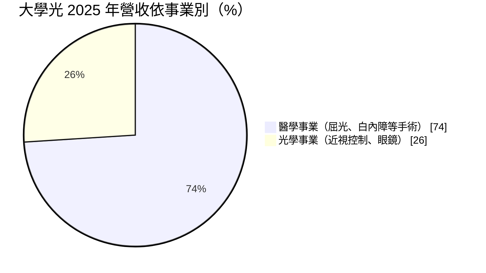
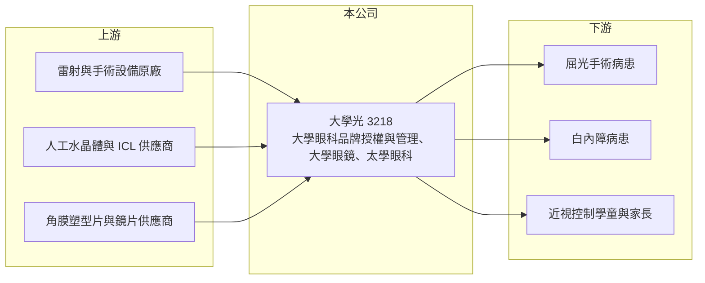

# 3218 大學光

> 上櫃｜[[產業索引-生技醫療業|生技醫療業]]｜上市（櫃）日期 2004/11/29

# 第一章：企業模式與商業藍圖

> [!info] 撰寫說明
> 精簡版，由 Claude 依公開資料整理，架構比照 [[2330台積電]] 的四章研究，資料截至 2026-10-08。來源：Goodinfo 年度經營績效頁（2020 至 2025 年）、櫃買中心開放資料（基本資料、2026 年第二季資產負債與綜合損益、本益比殖利率）、富果研究 2026 年 3 月大學光法說會整理。#待校對

大學光學科技（股票代號：3218，以下簡稱大學光）是台灣連鎖眼科醫療的代表企業。它的特殊之處在於：在法規不允許企業直接開設診所的台灣，它用「品牌授權加管理顧問」的方式，建立起跨縣市的眼科醫療網絡。

- **核心業務：** 大學光 1994 年成立、2004 年上櫃（櫃買中心開放資料）。在台灣，公司以品牌授權與管理顧問的 B2B 模式與「大學眼科」診所合作，同時直營「大學眼鏡」門市（B2C）；在中國大陸，則以醫院合作共建與自有營運的「太學眼科」診所與醫院經營（富果研究整理）。這種模式讓大學光可以分享診所的營收成長，同時把醫療專業交給合作醫師。
- **營收結構：** 2025 年合併營收 42.04 億元，其中醫學事業 31.12 億元（約 74%）、光學事業 10.92 億元（約 26%）；依地區，台灣 37.19 億元（88%）、中國大陸 4.85 億元（12%）。醫學事業包括[[屈光手術]]與[[白內障]]手術，光學事業則以學童[[近視控制]]產品為主力，占台灣光學收入的比重由 2020 年的 36% 升到 2025 年的 53%（富果研究整理）。
- **營運據點：** 台灣的合作診所分布於各縣市，2026 年初新增雲林斗六與基隆兩個合作據點，並計畫擴大升級 6 至 7 個既有據點；中國大陸方面，2024 年關閉兩個受醫保政策影響的據點，蘇州「江蘇太學眼科醫院」最快 2026 年第四季營運，定位為外資獨資的三級眼科專科醫院（富果研究整理）。
- **長期方向：** 大學光的長期成長來自兩個人口趨勢：一是學童近視盛行率高，近視控制需求持續；二是台灣在 2025 年進入超高齡社會，白內障手術與高階人工水晶體的需求增加。2025 年飛秒雷射白內障手術占比 53%（2020 年為 19%），高階功能性人工水晶體使用率 78%（2020 年為 61%），顯示病患願意為較好的醫療品質自費升級。

# 第二章：護城河深度與競爭優勢

大學光的護城河來自品牌、醫師網絡與自費醫療的規模經濟，在台灣眼科市場具有領先地位。

- **競爭優勢：** 眼科手術以自費項目為主，病患選擇診所時重視品牌與醫師口碑，大學眼科累積的品牌信任度不容易被複製。在屈光手術領域，大學光的 [[SMILE]] 微創近視雷射市占率維持超過 50%（富果研究整理），規模讓它能分攤昂貴雷射設備的成本，並取得較好的採購條件。2025 年 7 月引進 [[ICL]] 植入式隱形眼鏡，補足高度近視族群的產品線。
- **主要對手：** 台灣眼科市場相當分散，對手主要是各大醫院眼科部門與地區性的獨立眼科診所；近視控制產品方面，則與眼鏡連鎖通路及隱形眼鏡業者如 [[6782視陽]] 競爭。中國市場則要面對當地大型連鎖眼科集團與公立醫院。
- **觀察重點：** 第一，屈光手術需求在 2025 年衰退約 18%（市場衰退 20% 至 30%），需求能否回穩；第二，近視控制與白內障高階手術能否持續提高客單價；第三，蘇州醫院開業後能否讓中國事業由虧轉盈。

# 第三章：財務體質與盈利規模

資料日期：2026-10-08，表格是撰寫當時的快照；最新月營收、毛利率、累計 EPS 由自動排程寫在本筆記的屬性欄位（月營收、毛利率、累計EPS 等）。#待校對

大學光是台股中少見的高毛利、高 ROE 醫療服務股。以下用六年數字檢驗它的獲利品質。

| 年度 | 營收（新台幣） | [[毛利率]] | [[營業利益率]] | EPS（元） | [[ROE]] |
|---|---|---|---|---|---|
| 2020 | 20.5 億 | 61.7% | 29.1% | 6.35 | 25.9% |
| 2021 | 26.3 億 | 62.2% | 29.2% | 7.82 | 28.0% |
| 2022 | 34.9 億 | 61.2% | 30.9% | 10.64 | 33.7% |
| 2023 | 40.8 億 | 60.0% | 32.1% | 12.34 | 34.5% |
| 2024 | 42.3 億 | 59.9% | 33.1% | 12.57 | 29.6% |
| 2025 | 42.0 億 | 59.1% | 32.8% | 12.31 | 26.6% |
| 2026 上半年 | 22.16 億 | 57.6% | 30.8% | 5.99 | 未查得 |

- **營收規模：** 2020 至 2025 年營收由 20.5 億元成長到 42.0 億元，年複合成長率約 15.4%（推算），但 2024 至 2025 年已進入持平。下一階段的成長需要依靠新據點、中國醫院與高階手術比重提升。
- **獲利：** 毛利率長期約 60%、營業利益率 29% 至 33%，2021 至 2025 年平均 ROE 約 30.5%（推算）。高利潤率來自自費醫療的定價能力與設備使用率，屬於結構性的優勢。
- **財務特色：** 2026 年第二季底權益約 39.0 億元、總負債約 25.0 億元，非流動資產約 45.0 億元（櫃買中心開放資料），反映診所設備與租賃資產。2025 年度現金股利 7.75 元，約為 EPS 的 63%（推算），在高配息的同時仍保留資金擴點。

**[[ROIC]] 與 [[WACC]]：**
- ROIC（推算）：2025 年營業利益約 42.0 億元 × 32.8% ≈ 13.8 億元，稅後約 11.0 億元；投入資本以權益 39.0 億元加上推估的有息負債與租賃負債約 12 億元（開放資料未拆分，假設），合計約 51 億元，ROIC 約 21.6%（推算）。
- WACC（推算）：無風險利率 1.75%、市場風險溢酬 6%，β 取醫療服務股常見值 0.8（假設），股東權益成本約 6.6%；負債成本 2.5%、稅後 2.0%，負債占比約 24%，WACC 約 5.5%（推算）。
- 結論：ROIC 比 WACC 高出約 16 個百分點，大學光長期為股東創造顯著的經濟價值。即使營收成長放緩，只要維持現有利潤率，價值創造仍會持續。

# 第四章：總體風險與地緣政治

大學光的風險集中在人才、法規與中國市場三個面向。

- **產業週期：** 屈光手術屬於可延後的自費消費，景氣與消費信心轉弱時需求會下降，2025 年市場衰退 20% 至 30% 就是例子。人口結構變化也有兩面：少子化會減少未來的近視手術族群，高齡化則增加白內障需求。
- **營運風險：** 診所的核心是醫師，合作醫師的流動或自行開業，會直接影響據點營收。品牌授權與管理顧問模式也受醫療法規約束，法規若改變對醫療機構與企業合作的規範，可能影響營運模式。醫療糾紛則會衝擊品牌信任度。
- **其他風險：** 中國大陸受醫保控費政策、當地競爭與兩岸關係影響，2024 年已因醫保政策關閉兩個據點。蘇州醫院的投資規模較大，若開業後營運不如預期，將拖累整體獲利。

# 專有名詞解析

## 應用

- **[[屈光手術]]**：以雷射或植入鏡片改變眼睛屈光度、矯正近視等問題的手術，例如 LASIK、SMILE、ICL。
- **[[SMILE]]**：全飛秒微創近視雷射手術，切口小、恢復快，是目前主流的近視雷射術式之一。
- **[[ICL]]**：植入式隱形眼鏡，將鏡片植入眼內矯正高度近視，適用於不適合雷射的族群。
- **[[白內障]]**：眼睛水晶體混濁導致視力模糊的疾病，治療方式為以人工水晶體置換，與老化高度相關。
- **[[近視控制]]**：以角膜塑型片、周邊離焦鏡片等方法減緩學童近視加深的速度。

## 金融

- **[[ROIC]]**：投入資本報酬率，稅後營業利益除以股東權益與有息負債的合計，衡量本業對所有資金提供者的報酬。

# 核心供應鏈

- 上游：飛秒雷射與眼科手術設備原廠、人工水晶體與 ICL 供應商、角膜塑型片與周邊離焦鏡片供應商。
- 下游／客戶：近視雷射與 ICL 病患、白內障手術病患、學童近視控制客戶。
- 同業：醫院眼科部門、獨立眼科診所、眼鏡連鎖通路、隱形眼鏡業者如 [[6782視陽]]。

## 最新新聞
<!-- news:start -->
<!-- news:end -->

## 相關連結
- [公開資訊觀測站](https://mopsov.twse.com.tw/mops/web/t05st03?step=1&firstin=1&co_id=3218)
- [Goodinfo](https://goodinfo.tw/tw/StockDetail.asp?STOCK_ID=3218)
- [Yahoo 股市](https://tw.stock.yahoo.com/quote/3218)
- [鉅亨網新聞](https://www.cnyes.com/twstock/3218/news)
