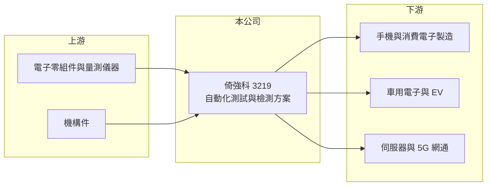

# 3219 倚強科

> 上櫃｜[[產業索引-其他電子業|其他電子業]]｜上市（櫃）日期 2004/03/19

# 第一章：企業模式與商業藍圖

> [!info] 撰寫說明
> 精簡版，由 Claude 依公開資料整理，架構比照 [[2330台積電]]，資料截至 2026-10-07。來源：工商時報（2026 年 8 月）、nstock.tw 倚強科公司概況、winvest.tw 營收快訊。公開資料有限，產品細項與營收比重未查得。#待校對

倚強科提供電子產品的自動化測試與檢測解決方案，毛利率高於一般設備廠。

- **核心業務：** 從事自動化測試與檢測設備、相關軟體服務與產品設計，應用涵蓋行動裝置、[[車用電子]]、伺服器與 5G 毫米波產品。
- **營收結構：** 本次未查得產品別比重；工商時報報導指出成長動能來自消費電子、[[EV]] 與 [[AI伺服器]] 市場的測試需求。
- **營運據點：** 1992 年在台北成立，2004 年上櫃，在台灣、新加坡、印度、越南、香港與中國設有據點，貼近客戶的海外生產基地。
- **長期方向：** 持續投入研發，透過全球據點擴大國際客戶合作，跟隨電子供應鏈移往印度與東南亞。

# 第二章：護城河深度與競爭優勢

倚強科的優勢在於測試方案的客製化與跨國服務能力。

- **競爭優勢：** 2026 年第二季毛利率 72.42%，遠高於一般設備業，反映產品含有較高的軟體與設計附加價值（推估）；多國據點能跟隨客戶移轉產線。
- **主要對手：** 國內外自動化測試設備與測試治具廠商，具體對手名單未查得。
- **觀察重點：** AI 伺服器與車用測試需求能否延續、印度與越南據點的接單狀況，以及高毛利率能否維持。

# 第三章：財務體質與盈利規模

資料日期：2026-10-07，表格是撰寫當時的快照；最新月營收、毛利率、累計 EPS 由自動排程寫在本筆記的屬性欄位（月營收、毛利率、累計EPS 等）。#待校對

倚強科 2026 年上半年獲利創同期新高。

- **營收規模：** 2025 年全年營收 17.03 億元；2026 年上半年 11.35 億元、年增 38.74%，1 至 8 月累計 16.27 億元、年增 32.2%，8 月營收 2.47 億元、年增 19.73%。
- **獲利：** 2026 年第二季 EPS 2.18 元、[[毛利率]] 72.42%、[[營業利益率]] 31.23%；上半年 EPS 2.66 元、毛利率 69.18%、營益率 22.99%。
- **財務特色：** 營收季節性明顯，第二季營收比第一季增加 63%，營業利益增加 433%，顯示[[營運槓桿]]大；近五年平均現金股利 1.1 元。

# 第四章：總體風險與地緣政治

倚強科的風險在於客戶產品週期與單季接單波動。

- **產業週期：** 測試設備需求跟隨手機、車用與伺服器新品推出時程，客戶新品延後或銷售不佳時訂單會減少。
- **營運風險：** 費用相對固定，營收淡季時獲利下滑幅度大；客戶集中度可能偏高（推估）。
- **其他風險：** 中國與印度等海外據點受當地法規與地緣政治影響；外幣計價營收有匯率風險。

# 專有名詞解析

## 應用

- **[[車用電子]]**：汽車中的電子控制、感測、娛樂與電源系統，可靠度要求高於消費電子。
- **[[EV]]**：電動車，以電池與馬達取代內燃機驅動的車輛。
- **[[AI伺服器]]**：搭載 GPU 或 AI 加速晶片、用於訓練與推論的高效能伺服器。

## 金融

- **[[營運槓桿]]**：固定成本占比高時，營收小幅變動會帶來獲利大幅變動的現象。

# 核心供應鏈

- 上游：電子零組件、量測儀器與機構件供應商（推估）
- 下游／客戶：行動裝置、車用、伺服器與網通產品製造商，客戶名稱未揭露
- 同業：自動化測試設備廠，具體名單未查得

## 最新新聞
<!-- news:start（自動產生，請勿手動編輯此範圍） -->
- 2026-10-07 📰 媒體 19:50｜營收速報 - 倚強科(3219)9月營收2.48億元年增率高達151.15％｜[鉅亨網](https://news.cnyes.com/news/id/6623952)

完整紀錄：[[3219倚強科 新聞]]
<!-- news:end -->

## 相關連結
- [公開資訊觀測站](https://mopsov.twse.com.tw/mops/web/t05st03?step=1&firstin=1&co_id=3219)
- [Goodinfo](https://goodinfo.tw/tw/StockDetail.asp?STOCK_ID=3219)
- [Yahoo 股市](https://tw.stock.yahoo.com/quote/3219)
- [鉅亨網新聞](https://www.cnyes.com/twstock/3219/news)
