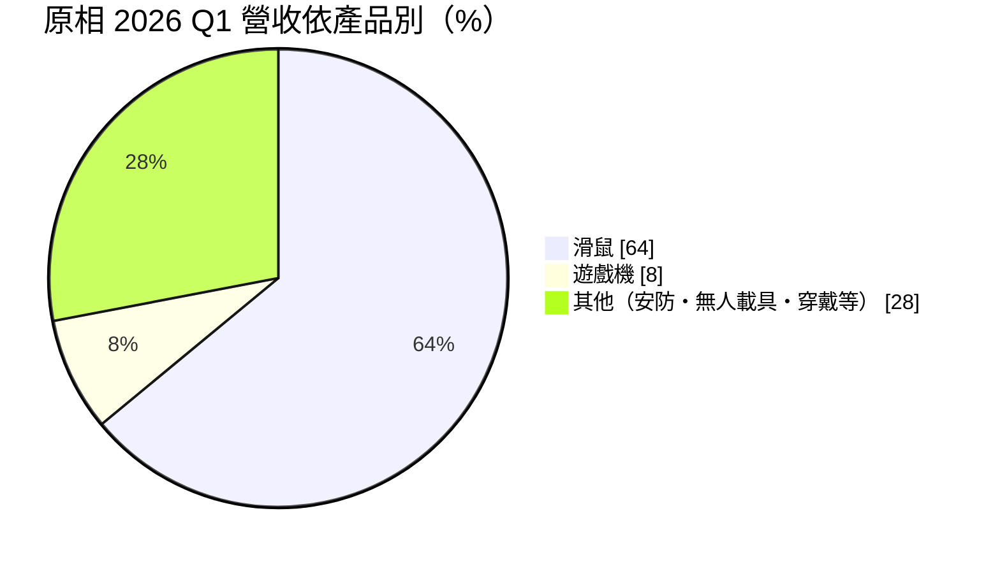
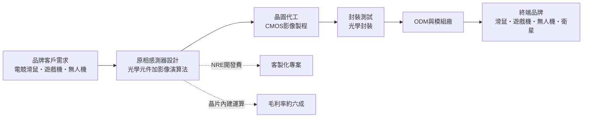
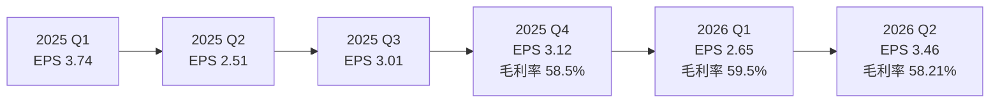
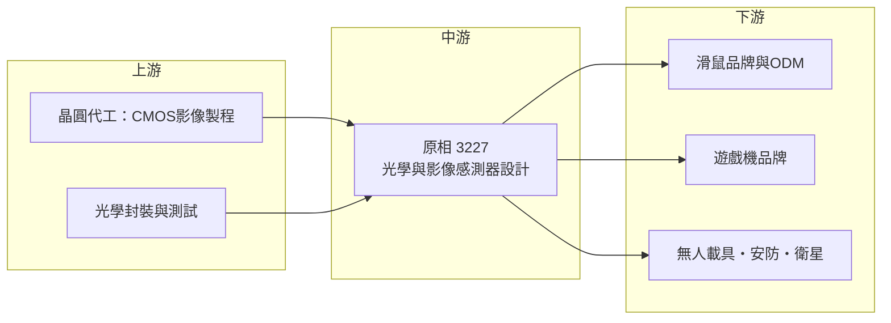

# 3227 原相

> 上櫃｜[[產業索引-半導體業|半導體業]]｜上市（櫃）日期 2006/05/04

# 第一章：企業模式與商業藍圖

> [!info] 撰寫說明
> 本文由 Claude 依公開資料整理，架構比照 [[2330台積電]] 的四章研究，資料截至 2026-10-07。財務數字來源：富果研究 2026 年 2 月與 5 月法說會整理、優分析 2026 年 8 月法說報導、永豐金證券 2025 年法說報導、Winvest 營收快訊、Yahoo 股市 EPS 頁、富邦證券基本資料頁；產業描述為整理性內容，尚未逐條比對原始文件。#待校對

在評估單一個股的長期投資價值時，首要步驟是拆解企業的底層獲利邏輯。本章針對原相科技（股票代號：3227，以下簡稱原相）的商業模式進行定性分析，說明一家以光學滑鼠感測器起家的 IC 設計公司，如何維持接近六成的毛利率，並把感測技術延伸到遊戲機、無人載具與太空應用。

## 一、核心定位：光學感測利基市場的全球領導者

原相成立於 1998 年 7 月，是 [[Fabless]] IC 設計公司，2025 年營收中 [[CMOS影像感測器]]相關元件占約 98%。不同於手機鏡頭用的高畫素影像感測器，原相做的是「看懂動作」的感測器：解析度不高，但要能高速追蹤位移、手勢與距離，並在晶片內完成運算。

原相的定位可以用三句話概括：

* **光學滑鼠感測器龍頭：** 全球多數光學滑鼠內的位移感測器來自原相，尤其是電競滑鼠，產品世代更新快、單價與毛利都高。
* **遊戲機動作感測：** 長期供應遊戲機控制器內的光學與動作感測元件，營收隨主機世代起伏。
* **新應用的平台型技術：** 把同一套低功耗光學感測與影像運算能力，延伸到無人載具的[[光流感測器]]、熱影像、穿戴裝置與衛星用感測器。

這種「市場不大但占有率高」的定位，讓原相 2025 年營收 91.27 億元創新高，毛利率仍達 60.6%。

## 二、終端應用／產品板塊：滑鼠為主、新應用快速成長

* **滑鼠（約六成多）：** 2025 年第四季 63%、2026 年第一季 64%。電競滑鼠需求強勁，2026 年第二季比重提升；一般辦公滑鼠則受 PC 與筆電市場疲弱影響。
* **遊戲機（7% 至 8%）：** 2025 年第四季降至 7%，反映主要遊戲機客戶的主機週期調整；2026 年第二季因客戶新機備貨回升，第三季預期較第二季下滑。
* **其他（約三成）：** 包括 CMOS 影像感測器、藍牙射頻、光學追蹤感測（OTS）、健康照護感測，以及安防與無人載具感測器。依 2026 年 8 月法說，無人載具相關營收占比已超過 10%，自 2025 年第四季以來單季都維持一成以上，是成長最明顯的應用。

## 三、資本轉化邏輯（營運模式）：高毛利的設計加演算法模式

* **硬體加演算法：** 原相的感測器在晶片內直接完成影像處理與位移計算，客戶不需要另外寫複雜演算法，這是能維持高單價的原因。
* **NRE 收入：** 部分客製化專案先收取開發費用（[[NRE]]），2026 年第一季法說提到 NRE 收入高於預期，帶動當季營收。
* **輕資產與高配息：** 晶圓與封測委外，主要成本是研發人力，獲利大部分可以發放現金股利，公司維持約 80% 的現金股利發放率。

## 四、企業長期藍圖：從滑鼠走向邊緣 AI 感測

* **[[FIR]] 熱影像感測器：** 低解析度產品已量產，高解析度版本開發中，可用於安防、智慧家居與人體偵測。
* **[[TDI]] 感測器：** 已小量出貨衛星客戶，用於衛星對地觀測的推掃式成像，屬於「太空規」感測器。
* **AI 感測器：** 結合感測與 [[Edge AI]] 運算，讓感測器本身就能辨識動作或物體，減少主處理器負擔。
* **製程升級：** 推動 12 吋晶圓與更先進製程，以降低成本並提高晶片整合度。

# 第二章：護城河深度與競爭優勢

在長期價值投資中，「護城河」指企業抵禦競爭、維持超額利潤的保護機制。本章分析原相的護城河構成、主要競爭對手，以及它在滑鼠以外市場能否複製成功。

## 一、護城河的核心組成要素

* **1. 市占率帶來的規模與口碑：** 在光學滑鼠感測器市場，原相長期是最主要供應商，電競滑鼠品牌在規格表上直接標示感測器型號，形成類似「Intel Inside」的品牌效果。
* **2. 光學感測加演算法的整合能力：** 位移追蹤的精準度取決於光學設計、像素架構與演算法的整體調校，新進者很難只靠價格取代。
* **3. 長期客戶關係：** 遊戲機與電競周邊客戶與原相合作多個世代，新產品開發時原相往往很早就參與規格討論。

整體而言，原相在滑鼠感測器擁有「寬護城河」，在其他應用則仍屬「窄護城河」，需要證明能在新市場建立同樣地位。

## 二、全球主要競爭對手格局

| 對手 | 定位 | 對原相的威脅 |
|---|---|---|
| [[SONY索尼]] | 全球影像感測器龍頭，手機與車用 CIS 為主 | 在高解析影像與部分動作感測應用重疊 |
| 意法半導體（STMicroelectronics） | 飛時測距（ToF）與動作感測器 | 在距離與手勢感測競爭 |
| 豪威（OmniVision）、格科微 | 中國背景影像感測器廠 | 以價格切入低階影像與感測市場 |
| 中國滑鼠感測器設計公司 | 低價滑鼠感測器 | 侵蝕一般辦公滑鼠市場 |

註：滑鼠感測器以外的市占數字未查得，上表依產品線整理。

## 三、優勢轉化：守得住、守不住與觀察重點

* **守得住：** 電競滑鼠與遊戲機感測器。這些客戶重視性能與穩定，價格不是首要考量。
* **守不住：** 低階辦公滑鼠與一般影像感測。中國同業以價格搶市，這部分營收也受 PC 市場疲弱拖累。
* **觀察重點：** 無人載具感測器能否在占比一成以上持續成長、TDI 衛星感測器能否從小量出貨進入規模化，以及 FIR 熱影像與 AI 感測器能否成為新的營收支柱。若新應用占比持續提高，原相才能降低對滑鼠與單一遊戲機客戶的依賴。

# 第三章：財務體質與盈利規模

資料日期：2026-10-07。數字取自富果研究法說會整理、優分析、Winvest 營收快訊、Yahoo 股市 EPS 頁與富邦證券基本資料頁，表格是撰寫當時的快照；最新月營收、毛利率、累計 EPS 由自動排程寫在本筆記的屬性欄位（月營收、毛利率、累計EPS 等）。#待校對

財務報表是檢驗護城河是否真實存在的最終標準。本章用三率、ROE、現金流與資本報酬，檢視原相的獲利品質。

## 一、獲利能力的基石：三率

| 項目 | 2025 全年 | 2025 Q4 | 2026 Q1 | 2026 Q2 |
|---|---|---|---|---|
| 營收（新台幣） | 91.27 億 | 22.86 億 | 22.1 億 | 約 25.4 億（推算） |
| [[毛利率]] | 60.6% | 58.5% | 59.5% | 58.21% |
| [[營業利益率]] | 20.7% | 17.1% | 17.3% | 18.96% |
| EPS（元） | 12.38 | 3.12 | 2.65 | 3.46 |

註：2026 年第二季營收以每股營收 16.71 元乘以股本 15.19 億元推算。2026 年 1 至 8 月累計營收 64.56 億元，8 月單月 8.16 億元、年增 10.13%。

* **[[毛利率]]：** 長期維持在 58% 至 61% 之間，是台灣 IC 設計公司中相當高的水準。2025 年因產品組合變化略降；2026 年第三季法說提到晶圓產能偏緊、封裝原物料與貴金屬漲價，公司正與客戶溝通反映成本。
* **[[營業利益率]]：** 2025 年 20.7%，營業淨利年減 23.8%，主因研發投入增加與匯率因素；2026 年第二季回升至約 19%。
* **業外收益：** 2026 年第二季稅前淨利率 23.37%，高於營業利益率，代表利息收入等業外收益貢獻明顯，原相持有大量現金。

## 二、[[ROE]]：資本效率

2026 年第二季單季 ROE 3.81%，年化約 15%；每股淨值約 99.53 元。原相的淨利率高，但帳上現金多，股東權益龐大，使 ROE 被稀釋。以 2025 年 EPS 12.38 元對應每股淨值約百元計算，全年 ROE 約一成出頭（推估）。

## 三、資本支出與自由現金流

* **[[CapEx]]：** Fabless 模式下資本支出主要是研發設備與測試設備，金額相對營收很小（具體數字未查得）。
* **[[自由現金流]]：** 營業現金流大部分可轉為自由現金流，是典型的現金牛型 IC 設計公司。
* **股利政策：** 現金股利發放率維持約 80%，富邦證券資料顯示近一次現金股利 10.01 元。

## 四、[[ROIC]] 與 [[WACC]]：價值創造利差

扣除帳上大量現金後，原相實際投入營運的資本很少，營業利益率約兩成，推估本業 ROIC 遠高於 WACC，長期持續創造價值。限制在於現金部位拉低整體 ROE，以及滑鼠市場本身成長有限，新應用能否以同樣高的報酬率擴大規模，是價值能否持續成長的關鍵。

# 第四章：總體風險與地緣政治

任何企業都無法脫離宏觀環境獨立存在。本章分析原相未來必須面對的地緣政治、產業週期與營運風險。

## 一、地緣政治

* **終端組裝集中中國：** 滑鼠與遊戲機周邊大量在中國組裝，美中關稅可能使客戶調整生產地點，造成訂單時間差。
* **無人載具的敏感性：** 無人機與無人載具涉及軍民兩用，各國出口管制與採購政策（例如排除中國製無人機）可能改變需求結構，對台灣供應商可能是機會也可能是限制。
* **台灣晶圓產能集中：** 晶圓與封測主要在台灣（推估），與其他台灣 IC 設計公司面臨相同的兩岸風險。

## 二、產業週期與市場結構

* **遊戲機世代週期：** 遊戲機營收隨主機推出與生命週期起伏，2025 年第四季占比降到 7%，新主機備貨期又會回升。
* **PC 與周邊需求：** 一般滑鼠跟著 PC 出貨量波動，電競滑鼠相對穩定但也受消費景氣影響。
* **[[長鞭效應]]：** 周邊品牌在旺季前備貨、淡季去化庫存，感測器作為上游零件波動更大。

## 三、營運環境的隱性風險

* **匯率：** 以美元計價，新台幣升值會壓低台幣營收與獲利，2025 年法說即提到匯率升值壓力。
* **成本上漲：** 晶圓產能偏緊、封裝原物料與貴金屬漲價，若無法完全轉嫁，毛利率可能下滑。
* **客戶集中：** 滑鼠與遊戲機各有少數大客戶，單一客戶策略變動影響大。

## 四、科技或法規演進

* **輸入裝置演進：** 觸控板、手勢與眼動追蹤若在部分場景取代滑鼠，長期需求可能受影響。
* **AI 運算移到感測端：** 邊緣 AI 感測器需要更先進製程與演算法能力，原相須與大型晶片商競爭。
* **太空與無人載具法規：** 衛星與無人機感測器需符合各國航太與出口規範，認證成本較高。

# 專有名詞解析

## 半導體

- **[[CMOS影像感測器]]**：以 CMOS 製程製作、把光訊號轉成電訊號的晶片，用於相機、滑鼠與各類光學感測。
- **[[FIR]]**：遠紅外線熱影像感測，偵測物體散發的熱輻射成像，不需光源即可辨識人體與溫度。
- **[[TDI]]**：時間延遲積分感測器，沿移動方向多次累積同一目標的光訊號，用於衛星推掃成像與工業檢測。
- **[[Edge AI]]**：在終端裝置或感測器上直接執行 AI 推論，不必把資料傳到雲端。
- **[[Fabless]]**：只做 IC 設計、晶圓製造全部委外的半導體公司經營模式。

## 應用

- **[[光學滑鼠感測器]]**：以微型相機高速拍攝桌面紋理並計算位移的感測器，是光學滑鼠的核心元件。
- **[[光流感測器]]**：偵測影像中物體移動方向與速度的感測器，無人機用來在無 GPS 時維持定位。

## 金融

- **[[NRE]]**：一次性工程開發費，客戶為客製化晶片或專案先支付的設計費用。
- **[[毛利率]]**：毛利除以營收，反映產品定價能力與成本控制。
- **[[營業利益率]]**：營業利益除以營收，扣除研發、銷售與管理費用後的本業獲利能力。
- **[[ROE]]**：股東權益報酬率，稅後淨利除以股東權益，衡量公司運用股東資金的效率。
- **[[自由現金流]]**：營業活動現金流減去資本支出，代表企業可自由用於配息、還債或併購的現金。
- **[[長鞭效應]]**：終端需求的小幅變動，沿供應鏈往上游傳遞時被逐級放大，造成上游庫存與訂單劇烈波動。

# 核心供應鏈

## 1. 上游：晶圓代工與封裝測試
- 晶圓代工（推估）：[[2303聯電]]、[[2330台積電]]
- 光學感測器封裝與測試（供應商未查得）

## 2. 中游：原相本身
- 光學滑鼠感測器、遊戲機動作感測、CMOS 影像感測器
- 新產品：FIR 熱影像、TDI 衛星感測器、AI 感測器、藍牙射頻

## 3. 下游：主要應用客戶
- 電競與辦公滑鼠品牌及代工廠（具體客戶名單未查得）
- 遊戲機品牌客戶
- 無人載具、安防與衛星客戶

## 4. 同業
- [[SONY索尼]]、意法半導體、豪威

延伸閱讀：[[台積電供應鏈]]

## 最新新聞
<!-- news:start -->
<!-- news:end -->

## 相關連結
- [公開資訊觀測站](https://mopsov.twse.com.tw/mops/web/t05st03?step=1&firstin=1&co_id=3227)
- [Goodinfo](https://goodinfo.tw/tw/StockDetail.asp?STOCK_ID=3227)
- [Yahoo 股市](https://tw.stock.yahoo.com/quote/3227)
- [鉅亨網新聞](https://www.cnyes.com/twstock/3227/news)
