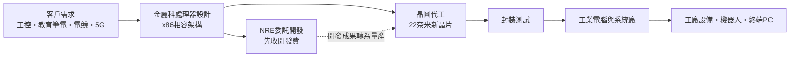
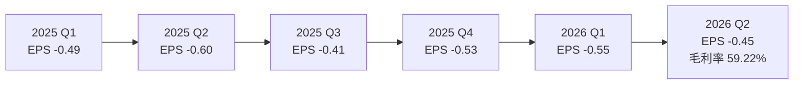
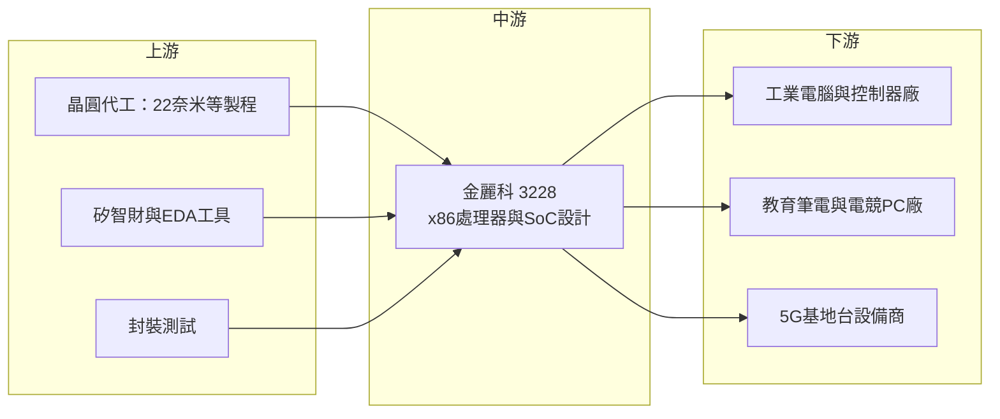

# 3228 金麗科

> 上櫃｜[[產業索引-半導體業|半導體業]]｜上市（櫃）日期 2005/03/02

# 第一章：企業模式與商業藍圖

> [!info] 撰寫說明
> 本文由 Claude 依公開資料整理，架構比照 [[2330台積電]] 的四章研究，資料截至 2026-10-07。財務數字來源：富果研究 2025 年 12 月法說會整理、nstock 公司資料頁、富邦證券基本資料頁、Yahoo 股市 EPS 頁；產業描述為整理性內容，尚未逐條比對原始文件。#待校對

在評估單一個股的長期投資價值時，首要步驟是拆解企業的底層獲利邏輯。本章針對金麗科技（股票代號：3228，以下簡稱金麗科）的商業模式進行定性分析。金麗科是台灣少數自行設計 [[x86]] 架構處理器的公司，營收規模小、長期虧損，但手上握有工業控制市場長達數十年的處理器產品線，並正在嘗試以 22 奈米新晶片跨入 AI PC 與伺服器市場。

## 一、核心定位：工業控制用 x86 處理器的利基設計公司

金麗科成立於 1997 年 8 月，是 [[Fabless]] IC 設計公司，股本約 7.19 億元。公司登記的產品涵蓋 16 位元與 32 位元微控制器、32 位元與 64 位元微處理器、工業自動化系統單晶片（[[SoC]]），以及伺服器與雲端儲存晶片；依富邦證券資料，2025 年營收全數歸類為[[MCU]]晶片。

金麗科最大的特色是 x86 架構。全球個人電腦與伺服器處理器幾乎由 [[INTC英特爾]] 與 [[AMD超微]] 兩家壟斷，金麗科則專注在大廠不重視的工業控制市場：

* **低功耗、長供貨：** 工業控制器、伺服馬達編碼器、[[PLC]]、[[CNC]] 與工業機器人需要能跑舊有 x86 軟體、又要長期穩定供貨的處理器。大廠產品幾年就停產，金麗科的產品可以供應 5 至 20 年。
* **軟體相容性：** 許多工廠的控制軟體是在 x86 平台開發的，若換成 ARM 架構需要重寫程式，因此客戶願意持續使用相容 x86 的小型處理器。

依法說會說明，部分工業電腦客戶擔憂英特爾工業級處理器的供貨穩定性，轉而尋求金麗科這類替代來源。

## 二、終端應用／產品板塊：工業控制為本、NRE 專案為主要收入

公司未公布各產品營收比重，因此不繪製圓餅圖。依 2025 年 12 月法說會，業務可分為三塊：

* **既有 32 位元 x86 處理器：** 應用於伺服馬達編碼器、PLC、CNC 與工業機器人，是目前產品營收的主要來源，訂單可持續 5 至 20 年。
* **NRE 委託設計專案：** 公司表示 2026 年主要營收將來自 [[NRE]] 專案，包括教育筆電、電競 PC 等客戶的開發案，以及預計量產的 5G 基地台客戶。
* **新世代 64 位元處理器：** 22 奈米製程的 64 位元四核心 CPU，原規劃 2026 年第二季[[Tape-out]]、第三季送樣，2026 年第四季起開始有少量 IC 營收。

## 三、資本轉化邏輯（營運模式）：小營收、高毛利、研發先行

* **高毛利、低營收：** 2026 年第二季毛利率 59.22%，法說會提到毛利率約 62%，但 2025 全年營收只有 3.09 億元，不足以支撐研發與管理費用，2026 年第二季營業利益率為 -33.11%。
* **研發先行：** 首顆 22 奈米晶片開發成本約 200 萬至 300 萬美元，對資本額 7 億元的公司是相當大的負擔。2025 年 7 月完成超過 1.6 億元的私募，用於支應新晶片開發。
* **NRE 轉量產：** 先以委託開發費維持營運，再把開發成果轉為量產晶片營收，是小型處理器公司常見的路徑，但從 NRE 到量產通常需要一至兩年。

## 四、企業長期藍圖：從工控處理器走向 AI PC 與伺服器

* **製程藍圖：** 以 22 奈米建立技術基礎（含 [[PDK]]），再轉往 12 奈米與 6 奈米，規劃 8 核心以及 16 至 128 核心的高階產品。
* **目標市場：** 瞄準 [[AI PC]]、工作站與[[AI伺服器]]市場，並提到 2028 年奧林匹克電競項目的相關專案。
* **務實評估：** 上述高階產品屬於長期規劃，與英特爾、超微的產品差距很大，能否實現取決於資金、人才與 x86 授權等條件，現階段應視為選擇權性質的題材，而非確定的成長。

# 第二章：護城河深度與競爭優勢

在長期價值投資中，「護城河」指企業抵禦競爭、維持超額利潤的保護機制。本章分析金麗科的護城河構成、主要競爭對手，以及它在兩大巨頭之間能守住的空間。

## 一、護城河的核心組成要素

* **1. x86 相容處理器的稀缺性：** 能設計並合法銷售 x86 相容處理器的公司全球極少，這是金麗科最特殊的資產。工業客戶若需要 x86 軟體相容又不想依賴英特爾，可選擇的供應商很少。
* **2. 長期供貨承諾：** 工控客戶的產品壽命長達 10 至 20 年，金麗科願意長期維持舊產品供貨，這是大廠不願做的事，形成客戶黏著。
* **3. 設計導入的轉換成本：** 處理器一旦被設計進 PLC 或伺服驅動器，換掉處理器等於重新開發整個控制器，客戶轉換成本高。

不過這條護城河「窄而淺」：市場規模小，公司長期虧損，代表這些優勢尚未轉化為足夠的經濟規模。

## 二、全球主要競爭對手格局

| 對手 | 定位 | 對金麗科的威脅 |
|---|---|---|
| [[INTC英特爾]] | x86 處理器龍頭，提供工業與嵌入式產品線 | 效能與生態系遠勝，客戶首選 |
| [[AMD超微]] | x86 第二大廠，嵌入式 Ryzen 與 EPYC 產品 | 中高階工控與邊緣運算市場 |
| 兆芯等中國 x86 廠 | 中國政策支持的 x86 相容處理器 | 在中國工控與國產化市場競爭 |
| [[ARM安謀]] 架構 MCU 與處理器廠 | 低功耗、生態系龐大 | 新設計的工控產品逐漸改用 ARM，長期蠶食 x86 需求 |

## 三、優勢轉化：守得住、守不住與觀察重點

* **守得住：** 既有工控客戶的長期訂單。舊設計持續出貨，提供穩定但規模有限的營收。
* **守不住：** 新設計案的架構選擇。越來越多工業控制器改用 ARM 或 [[RISC-V]]，x86 在新設計的比重可能下降。
* **觀察重點：** 22 奈米 64 位元晶片是否如期送樣與量產、NRE 專案能否轉成量產訂單、5G 基地台客戶是否進入量產。若 2027 年仍無法縮小虧損，公司可能需要再次募資。

# 第三章：財務體質與盈利規模

資料日期：2026-10-07。數字取自 nstock、富邦證券基本資料頁、Yahoo 股市 EPS 頁與富果研究法說會整理，表格是撰寫當時的快照；最新月營收、毛利率、累計 EPS 由自動排程寫在本筆記的屬性欄位（月營收、毛利率、累計EPS 等）。#待校對

財務報表是檢驗護城河是否真實存在的最終標準。本章用三率、ROE、現金流與資本報酬，檢視金麗科的獲利狀況。

## 一、獲利能力的基石：三率

| 項目 | 2024 全年 | 2025 全年 | 2026 Q1 | 2026 Q2 |
|---|---|---|---|---|
| 營收（新台幣） | 未查得 | 3.09 億 | 未查得 | 未查得 |
| [[毛利率]] | 未查得 | 未查得 | 未查得 | 59.22% |
| [[營業利益率]] | 未查得 | 未查得 | 未查得 | -33.11% |
| EPS（元） | -0.34（四季加總） | -2.03 | -0.55 | -0.45 |

註：2026 年 1 至 9 月累計營收 2.65 億元，年增 12.41%；9 月營收 0.31 億元，為六年同期新高。

* **[[毛利率]]：** 約六成，處理器與 NRE 收入本身毛利高，問題不在毛利率而在營收規模。
* **[[營業利益率]]：** 2026 年第二季 -33.11%，研發費用遠高於毛利。自 2024 年第三季以來每季都虧損，只有 2024 年上半年短暫獲利。
* **趨勢：** 2026 年營收年增約一成，虧損略有收斂，但新晶片開發費用仍高，短期內轉虧為盈的可能性有限（推估）。

## 二、[[ROE]]：資本效率

2026 年第二季單季 ROE -4.89%，每股淨值 9.46 元，已低於面額 10 元。連年虧損持續侵蝕股東權益，這是評估金麗科時最重要的財務警訊。

## 三、資本支出與自由現金流

* **[[CapEx]]：** Fabless 模式本身資本支出不大，但新晶片的光罩與 [[IP]] 授權費用屬於重大的一次性投入，首顆 22 奈米晶片約需 200 萬至 300 萬美元。
* **[[自由現金流]]：** 營運虧損下，自由現金流推估為負，營運資金依賴募資補充。2025 年 7 月私募超過 1.6 億元。
* **股利：** 近五年平均現金股利約 0.02 元，2025 年度未配息。

## 四、[[ROIC]] 與 [[WACC]]：價值創造利差

金麗科長期營業虧損，ROIC 為負，遠低於 WACC，處於價值毀損狀態。投資金麗科的邏輯不是現有獲利，而是押注新世代處理器能否打開更大的市場；這屬於高風險、結果分布極不對稱的投資，需要追蹤每一個開發里程碑。

# 第四章：總體風險與地緣政治

任何企業都無法脫離宏觀環境獨立存在。本章分析金麗科未來必須面對的地緣政治、產業週期與營運風險。

## 一、地緣政治

* **處理器自主化：** 各國推動關鍵晶片自主，可能讓非美系 x86 供應商在部分市場找到機會，但中國本土 x86 廠商在中國市場有政策優勢。
* **出口管制：** 高效能處理器若被列入出口管制，金麗科規劃的高核心數產品可能受限出貨對象。
* **台灣代工集中：** 晶圓代工與封測集中在台灣（推估），面臨兩岸風險。

## 二、產業週期與市場結構

* **工控景氣：** 工業自動化設備對景氣敏感，2023 至 2024 年全球工控庫存調整，對小型供應商衝擊較大。
* **PC 與電競市場：** 教育筆電與電競 PC 的 NRE 專案能否量產，取決於終端市場需求與客戶的產品決策。
* **市場結構：** x86 市場由兩大廠主導，小廠只能在利基市場生存，價格與規格主導權有限。

## 三、營運環境的隱性風險

* **資金：** 長期虧損與高額開發費用，可能需要持續私募或增資，稀釋既有股東。
* **開發延遲：** 22 奈米晶片若延後送樣或出現設計錯誤需重新投片，會進一步消耗資金。
* **人才：** 處理器設計需要稀有的 CPU 架構人才，與大型 IC 設計公司競爭不易。
* **授權與智慧財產：** x86 架構相關專利與授權條件是否支持其高階產品規劃，公開資料未查得細節，屬於需要追蹤的不確定性。

## 四、科技或法規演進

* **架構轉移：** ARM 與 RISC-V 在嵌入式與邊緣運算快速普及，長期可能壓縮 x86 在工控的市場。
* **AI 運算需求：** AI PC 與 AI 伺服器需要整合 NPU 與高頻寬記憶體，技術門檻遠高於傳統工控處理器，金麗科須在有限資源下追趕。
* **製程成本：** 6 奈米與 12 奈米的光罩與開發成本以千萬美元計，遠超過目前的營收規模。

# 專有名詞解析

## 半導體

- **[[x86]]**：英特爾開發、超微共同主導的處理器指令集架構，個人電腦與伺服器的主流架構。
- **[[SoC]]**：系統單晶片，把處理器、記憶體控制與周邊介面整合在一顆晶片上。
- **[[MCU]]**：微控制器，把處理器、記憶體與周邊介面整合在一顆晶片，用於家電、工控與車用的控制。
- **[[Tape-out]]**：晶片設計完成、把光罩資料交給晶圓廠開始製造的里程碑，俗稱下線。
- **[[PDK]]**：製程設計套件，晶圓廠提供給設計公司的元件模型與設計規則，是在特定製程上設計晶片的基礎。
- **[[RISC-V]]**：開放原始碼的處理器指令集架構，不需支付授權費，在嵌入式與 AI 加速器快速普及。
- **[[Fabless]]**：只做 IC 設計、晶圓製造全部委外的半導體公司經營模式。

## 應用

- **[[AI PC]]**：內建 NPU 等 AI 加速單元、可在本機執行 AI 模型的個人電腦。
- **[[AI伺服器]]**：搭載 GPU 或 AI 加速器、用於訓練與推論 AI 模型的伺服器。

## 金融

- **[[NRE]]**：一次性工程開發費，客戶為客製化晶片或專案先支付的設計費用。
- **[[ROE]]**：股東權益報酬率，稅後淨利除以股東權益，衡量公司運用股東資金的效率。
- **[[自由現金流]]**：營業活動現金流減去資本支出，代表企業可自由用於配息、還債或併購的現金。

## 產業

- **[[PLC]]**：可程式邏輯控制器，工廠自動化中控制機械動作的工業電腦。
- **[[CNC]]**：電腦數值控制工具機，以程式控制刀具路徑進行精密加工。

# 核心供應鏈

## 1. 上游：晶圓代工、矽智財與封測
- 晶圓代工（推估，實際代工廠未查得）：[[2330台積電]]、[[2303聯電]]
- EDA 工具：[[SNPS新思科技]]、[[CDNS益華電腦]]（推估）

## 2. 中游：金麗科本身
- 32 位元 x86 工控處理器、64 位元 22 奈米四核心 CPU（開發中）
- NRE 委託設計服務

## 3. 下游：主要客戶類型
- 工業電腦與自動化設備廠：伺服馬達編碼器、PLC、CNC、工業機器人
- 教育筆電、電競 PC 品牌與代工廠
- 5G 基地台設備客戶

## 4. 同業與競爭者
- [[INTC英特爾]]、[[AMD超微]]、兆芯

## 最新新聞
<!-- news:start -->
<!-- news:end -->

## 相關連結
- [公開資訊觀測站](https://mopsov.twse.com.tw/mops/web/t05st03?step=1&firstin=1&co_id=3228)
- [Goodinfo](https://goodinfo.tw/tw/StockDetail.asp?STOCK_ID=3228)
- [Yahoo 股市](https://tw.stock.yahoo.com/quote/3228)
- [鉅亨網新聞](https://www.cnyes.com/twstock/3228/news)
