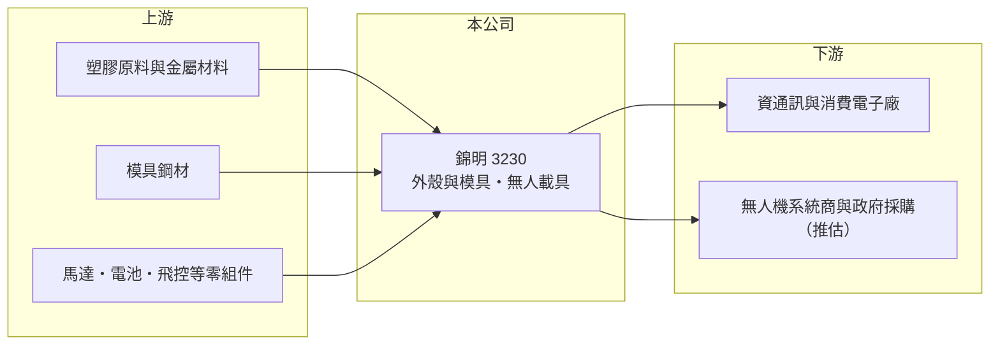

# 3230 錦明

> 上櫃｜[[產業索引-光電業|光電業]]｜上市（櫃）日期 2006/09/25

# 第一章：企業模式與商業藍圖

> [!info] 撰寫說明
> 精簡版，由 Claude 依公開資料整理，架構比照 [[2330台積電]]，資料截至 2026-10-07。來源：nstock.tw 錦明公司概況、winvest.tw 營收快訊。公開資料有限，營收比重未查到。#待校對

錦明是電子產品外殼與模具廠，近年把業務延伸到[[無人機]]等無人載具，目前仍處於虧損。

- **核心業務：** 錦明 2006 年上櫃，業務為資訊、通訊與消費性電子產品的內構件、外殼與顯示器零件製造，以及[[精密模具]]開發製造，並新增無人載具及其零組件的研發、製造與銷售。
- **營收結構：** 本次未查到外殼、模具與無人載具各自的營收比重。
- **營運據點：** 生產與營運據點本次未查到，本文不推測。
- **長期方向：** 以既有的模具與機構件能力切入無人載具，是公司轉型的主軸，但目前營收規模仍小。

# 第二章：護城河深度與競爭優勢

錦明的本業是競爭激烈的機構件代工，新業務的護城河仍待建立。

- **競爭優勢：** 模具開發與塑膠、機構件量產經驗，可轉用在無人載具的機身與零組件；台灣製造背景有機會切入[[非紅供應鏈]]需求（推估）。
- **主要對手：** 機構件有兩岸眾多外殼與模具廠；無人載具可對照 [[8033雷虎]] 等國內業者。
- **觀察重點：** 無人載具何時形成穩定營收，以及毛利率能否從個位數回升。

# 第三章：財務體質與盈利規模

資料日期：2026-10-07，以下數字是撰寫當時的快照；最新月營收、毛利率、累計 EPS 由自動排程寫在本筆記的屬性欄位（月營收、毛利率、累計EPS 等）。#待校對

錦明營收小幅成長，但第二季虧損擴大。

- **營收規模：** 2025 年全年營收 4.04 億元；2026 年 1 至 8 月累計 2.88 億元、年增 6.23%，7 月營收 4,163.5 萬元、年增 25.44%。
- **獲利：** 2026 年第二季 EPS -0.58 元，[[毛利率]] 3.84%，[[營業利益率]] -45.16%，淨利率 -48.11%。
- **財務特色：** 資本額約 8.60 億元；2025 年配發現金股利 0.35 元，近五年平均現金股利 0.07 元。

# 第四章：總體風險與地緣政治

錦明的風險在於本業毛利偏低、新業務尚未貢獻獲利。

- **產業週期：** 外殼與模具需求跟著消費電子新機推出節奏起伏。
- **營運風險：** 營收規模小，研發與轉型費用使營業虧損擴大；若無人載具推進不如預期，虧損可能延續。
- **其他風險：** 無人機屬國防與政策題材，受政府採購與出口法規影響大；塑膠原料價格與匯率波動。

# 專有名詞解析

## 應用

- **[[無人機]]**：不需駕駛員搭乘的飛行載具，應用於空拍、巡檢、農業與國防。

## 產業

- **[[精密模具]]**：用來沖壓或射出成型零件的高精度模具，品質決定量產零件的尺寸精度與良率。
- **[[非紅供應鏈]]**：排除中國製零組件的供應鏈，常見於國防、無人機與政府採購規範。

# 核心供應鏈

- 上游：塑膠原料與金屬材料、模具鋼材、無人載具零組件供應商
- 下游／客戶：資通訊與消費電子廠、無人機系統商與政府採購（推估）
- 同業：[[8033雷虎]]

## 最新新聞
<!-- news:start（自動產生，請勿手動編輯此範圍） -->
- 2026-10-08 🏛️ 重訊 17:34｜本公司配合法務部調查局執行搜索調查事宜｜[觀測站](https://mops.twse.com.tw/mops/#/web/t05st01)

完整紀錄：[[3230錦明 新聞]]
<!-- news:end -->

## 相關連結
- [公開資訊觀測站](https://mopsov.twse.com.tw/mops/web/t05st03?step=1&firstin=1&co_id=3230)
- [Goodinfo](https://goodinfo.tw/tw/StockDetail.asp?STOCK_ID=3230)
- [Yahoo 股市](https://tw.stock.yahoo.com/quote/3230)
- [鉅亨網新聞](https://www.cnyes.com/twstock/3230/news)
