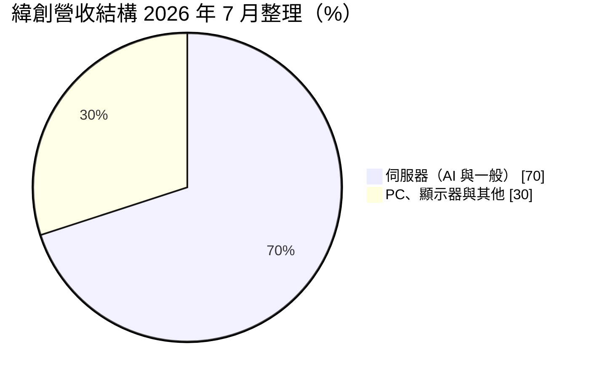
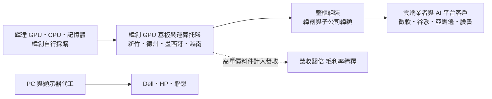
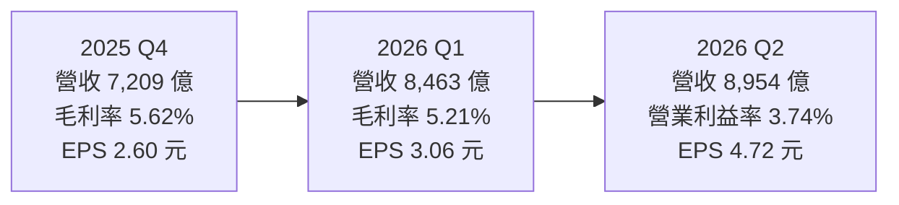
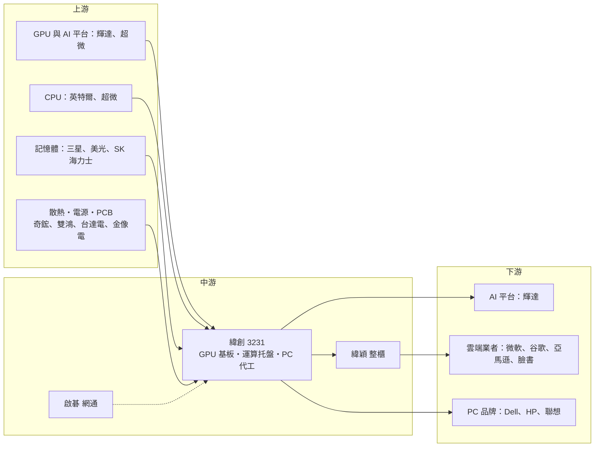

# 3231 緯創

> 上市｜[[產業索引-電腦及週邊設備業|電腦及週邊設備業]]｜上市（櫃）日期 2003/08/19

# 第一章：企業模式與商業藍圖

> [!info] 撰寫說明
> 本文由 Claude 依公開資料整理，架構比照 [[2330台積電]] 的四章研究，資料截至 2026-10-07。財務數字來源：緯創 2025 年財報與 2026 年第二季法說會報導（優分析、聯合新聞網、Quartr 法說摘要、DIGITIMES、科技新報、財報狗）；產業描述為整理性內容，尚未逐條比對原始文件。#待校對

在評估單一個股的長期投資價值時，首要步驟是拆解企業的底層獲利邏輯。本章針對緯創資通（股票代號：3231，以下簡稱緯創）的商業模式進行定性分析，說明它如何從低毛利的 PC 代工廠轉型為 AI 伺服器的核心製造夥伴，以及這個轉型為什麼讓營收翻倍、毛利率卻往下走。

## 一、核心定位：從筆電代工轉型為 AI 伺服器主力組裝廠

緯創於 2001 年由宏碁集團的製造與研發部門分割獨立而成，是台灣「電子五哥」之一。早年以筆記型電腦、桌上型電腦、顯示器與手機代工為主，客戶包括 Dell、HP、聯想等品牌，也曾替蘋果組裝 iPhone，後於 2020 年前後將印度與中國的 iPhone 產線出售，退出手機組裝。

緯創目前的身分已經從「PC 的 [[ODM]]」轉為「AI 伺服器供應鏈的核心組裝商」。緯創與 [[NVDA輝達]] 的合作長達近十年，從獨立顯示卡製造一路做到 AI 伺服器的 [[GPU 基板]]與[[運算托盤]]（compute tray），是輝達 Blackwell 平台的重要製造夥伴。這個定位有兩個商業意義：

* **卡位在高門檻環節：** GPU 基板與運算托盤是 AI 伺服器中技術要求最高、[[良率]]壓力最大的組裝段，能在新平台初期量產的廠商不多。
* **集團分工：** 緯創另持有伺服器子公司 [[6669緯穎]] 與網通天線廠 [[6285啟碁]] 的股權，形成「緯創做 GPU 板與運算模組、緯穎做雲端資料中心整櫃」的分工。

## 二、終端應用板塊：伺服器占七成

依科技新報 2026 年 7 月的整理，伺服器業務約占緯創營收七成：

* **AI 與一般伺服器：** 包含輝達 HGX 與 GB 系列的 GPU 基板與運算托盤、雲端業者（[[CSP]]）的一般伺服器，以及部分整櫃組裝。
* **個人電腦與顯示器：** 筆電、桌機、顯示器仍是穩定的營收基礎，但成長性有限。
* **其他：** 工業電腦（IPC）、[[IoT]]、低軌衛星相關產品，以及集團內的網通事業。

## 三、資本轉化邏輯：買賣模式下的高周轉

* **[[買賣模式]]：** 緯創的 AI 伺服器多由緯創自行採購 GPU、CPU、記憶體等高單價零組件，再完成系統整合出貨。這讓營收規模急速膨脹，但毛利率被高單價料件稀釋。2025 年營收約 2.19 兆元、年增 108%，但毛利率由 2024 年的約 8.0% 降至 6.13%，正是這個模式的結果。
* **全球產能布局：** 緯創在台灣、中國、越南、馬來西亞、墨西哥、巴西、菲律賓、捷克都有生產據點：
  * **台灣：** 新竹廠區產能接近滿載，2026 年 8 月董事會通過新竹廠 105 億元、高雄廠 85 億元的投資，高雄新廠預計 2027 年第一季投產。
  * **美國德州：** D1 AI 智慧工廠面積約 32.4 萬平方英尺，投資約 7.61 億美元，已量產輝達 GB300 機櫃，並為下一代 Vera Rubin 平台預留產線；D2 廠面積約為 D1 的兩倍，預計 2027 年前投產，兩座廠合計約 109 萬平方英尺。
  * **越南：** 由 PC 與顯示器延伸到一般伺服器，並取得 37 公頃土地興建第二座廠。
  * **墨西哥與馬來西亞：** 墨西哥負責一般伺服器與組裝，2026 年初通過約 3,290 萬美元投資；馬來西亞生產工業電腦。

## 四、企業長期藍圖：跟緊平台世代、美國在地化與 AI 服務

* **緊跟輝達平台世代：** 從 Hopper、Blackwell 到 Rubin，守住 GPU 基板與運算托盤的高占有率。
* **美國在地製造：** 配合美國關稅與在地製造要求，把高階 AI 伺服器產能移到德州。
* **從製造延伸到服務：** 擴大台灣自有 AI 算力中心（2026 年 8 月通過約 39.67 億元投資）與[[主權 AI]] 服務。
* **籌資：** 規劃發行不超過 2.5 億股全球存託憑證（[[GDR]]）籌措擴產資金。

# 第二章：護城河深度與競爭優勢

在長期價值投資中，「護城河」指企業抵禦競爭、維持超額利潤的保護機制。組裝代工本質上是低毛利、高周轉的生意，本章分析緯創的護城河構成、全球主要競爭對手，以及它在 AI 伺服器分工中能守住哪些位置。

## 一、護城河的核心組成要素

緯創的護城河屬於「窄護城河」，主要由四個要素組成：

* **1. 與輝達的長期綁定：** 緯創是輝達 GPU 基板與運算托盤的主要製造商之一，參與平台早期設計與驗證。AI 伺服器世代更替快，能在新平台初期就量產的廠商不多，這是緯創接單的關鍵門檻。
* **2. 規模與供應鏈議價：** 2025 年營收逾 2 兆元，採購規模大，能取得 GPU、記憶體等關鍵料件的配額與帳期。
* **3. 多國生產據點：** 美國、墨西哥、越南、台灣同時擁有產能，能配合客戶分散供應鏈與規避關稅。
* **4. 集團分工：** 與子公司緯穎形成上下游互補，可同時服務輝達與雲端業者自建機櫃需求。

## 二、全球主要競爭對手格局

| 對手 | 定位 | 對緯創的威脅 |
|---|---|---|
| [[2317鴻海]] | 全球最大電子代工廠，輝達 GB 系列整櫃市占最高 | 也有德州與墨西哥產能，是最直接的對手 |
| [[2382廣達]] | 透過雲達科技直接服務美系雲端業者 | 在 AI 整櫃與 CSP 伺服器正面競爭 |
| [[2356英業達]]、[[4938和碩]] | 電子五哥同業 | 近年積極擴大伺服器業務 |
| [[6669緯穎]] | 緯創子公司 | 在雲端機櫃市場與鴻海、廣達同場競爭 |
| 美超微、Dell、HPE | 美國品牌伺服器廠 | 部分向 ODM 下單，部分直接爭取企業客戶 |

## 三、優勢轉化：哪些守得住、哪些守不住

* **守得住：** GPU 基板與運算托盤屬於高階零組件，良率要求高、驗證時間長，緯創在此領域的經驗與占有率具延續性。
* **守不住：** 整櫃組裝的價格競爭激烈，且輝達與 CSP 會刻意分散供應商，任何一家都難以獨占。買賣模式也讓毛利率長期被壓在 5% 至 6% 區間。
* **觀察重點：** 德州 D1、D2 廠的爬坡速度與良率；Vera Rubin 平台的訂單分配；毛利率能否隨產品組合改善而回升；GDR 增資後的每股獲利稀釋程度。

# 第三章：財務體質與盈利規模

資料日期：2026-10-07。數字取自公司財報與法說會的財經媒體整理（優分析、聯合新聞網、Quartr），表格是撰寫當時的快照；最新月營收、毛利率、累計 EPS 由自動排程寫在本筆記的屬性欄位（月營收、毛利率、累計EPS 等）。#待校對

財務報表是檢驗護城河是否真實存在的最終標準。本章用三率、ROE、現金流與資本報酬，檢視緯創轉型為 AI 伺服器組裝廠後的獲利品質。

## 一、獲利能力的基石：三率

| 項目 | 2025 全年 | 2025 Q4 | 2026 Q1 | 2026 Q2 |
|---|---|---|---|---|
| 營收（新台幣） | 約 2.19 兆 | 7,209.4 億 | 8,463 億 | 8,954.4 億 |
| [[毛利率]] | 6.13% | 5.62% | 5.21% | 5.56% |
| [[營業利益率]] | 3.59% | 3.53% | 3.44% | 3.74% |
| 稅後淨利 | 274.1 億 | 81.7 億 | 96.3 億 | 148.3 億 |
| EPS（元） | 9.04 | 2.60 | 3.06 | 4.72 |

* **規模效益：** 2026 年上半年營收 1.74 兆元、年增 94%，EPS 7.78 元，已接近 2025 全年的八成六。第二季營業利益率回升至 3.74%，年增 1.78 個百分點，顯示規模效益開始抵銷買賣模式對毛利率的稀釋。
* **毛利率不是重點：** 在買賣模式下，毛利率會因料件轉手而偏低，觀察緯創更應看營業利益金額與營業利益率的變化。

## 二、ROE：資本效率

代工業毛利率低，緯創的股東報酬主要靠「高周轉」而非「高利潤率」。營收翻倍、營業利益從 2024 年約 274 億元增至 2025 年約 786 億元，推估 [[ROE]] 已明顯高於轉型前的水準（確切數值未查得）。需要留意的是，AI 伺服器的料件庫存與應收帳款金額龐大，[[營運資金]]需求會隨營收同步放大。

## 三、資本支出、自由現金流與股利

* **[[CapEx]]：** 董事長表示 2026 年資本支出創新高，且 2027 年將再增加，主要投入德州、新竹、高雄、越南新廠。2026 年 8 月單次董事會即通過約 174.8 億元的台灣、美國與越南投資案。
* **現金部位：** 期末現金及約當現金約 1,231.6 億元（Quartr 法說摘要），較前一年約 830.8 億元增加。
* **[[自由現金流]]：** 擴產與營運資金需求並行，自由現金流可能受到壓縮（推估）；公司規劃發行 GDR 籌資，代表未來股本可能增加。
* **股利：** 2025 年度配發現金股利 5.5 元，配發率約六成，以董事會公告時收盤價 132.5 元計算，殖利率約 4.15%。

## 四、[[ROIC]] 與 [[WACC]]：價值創造利差

組裝廠的 ROIC 取決於營業利益率乘以資本周轉率。緯創營業利益率雖只有 3% 多，但營收翻倍帶來的周轉率提升，推估讓 ROIC 在 2025 至 2026 年明顯高於 WACC（具體數值未查得）。風險在於德州等新廠的資本投入與高額存貨會增加投入資本，若營收成長放緩，ROIC 會較快回落。

# 第四章：總體風險與地緣政治

任何企業都無法脫離宏觀環境獨立存在。本章分析緯創未來必須面對的地緣政治、AI 資本支出週期、營運與技術風險。

## 一、地緣政治風險

* **美國關稅與在地製造：** 美國對進口伺服器與電子產品的關稅政策反覆，緯創以德州廠、墨西哥廠對沖，但美國廠的人力與營運成本遠高於亞洲，初期可能壓低獲利率。
* **中國產能：** 緯創仍在中國保有 PC 與部分零組件產能，美中科技管制升高時可能需要再調整。
* **出口管制：** 高階 AI 晶片的出口限制，會影響輝達對特定地區的出貨，間接影響緯創的訂單結構。

## 二、產業週期與市場結構風險

* **AI 資本支出週期：** 營收高度依賴大型雲端業者與輝達平台，若 CSP 放緩 AI 資本支出，緯創的營收波動會非常大，[[長鞭效應]]會讓組裝廠的訂單變化大於終端需求。
* **客戶集中：** 伺服器約占營收七成，且集中在少數客戶，議價能力偏弱。
* **PC 需求：** 筆電與桌機市場成熟，換機潮強弱影響非伺服器業務。

## 三、營運環境的隱性風險

* **平台轉換：** 從 GB300 轉向 Vera Rubin 時，若良率或零組件供應不順，可能出現出貨遞延。
* **營運資金與庫存：** 買賣模式下 GPU 等料件庫存金額龐大，價格或需求反轉時有存貨跌價風險。
* **股本稀釋：** 發行最多 2.5 億股 GDR 會稀釋 EPS。
* **匯率：** 營收以美元計價，新台幣升值會影響帳面毛利率與匯兌損益。

## 四、科技演進風險

[[液冷]]、高功率供電與[[機櫃級整合]]的技術門檻快速提高，若緯創在液冷與整櫃整合上落後鴻海、廣達，可能只能分到附加價值較低的板卡段。此外，CSP 自研 [[ASIC]] 晶片若擴大，訂單會往擅長 CSP 客製機櫃的業者（如緯穎、廣達）集中。

# 專有名詞解析

## 半導體

- **[[ASIC]]**：特殊應用積體電路，為特定用途客製的晶片，雲端業者自研的 AI 加速器多屬此類。
- **[[良率]]**：合格產品占總產出的比例，新平台量產初期良率是出貨節奏的關鍵。

## 應用

- **[[CSP]]**：雲端服務供應商，如微軟、谷歌、亞馬遜、臉書，是 AI 伺服器最大的買家。
- **[[主權 AI]]**：各國政府為確保資料與運算自主而自建的 AI 算力與模型。
- **[[IoT]]**：物聯網，讓各種裝置連網並交換資料的應用。

## 金融

- **[[GDR]]**：全球存託憑證，台灣企業在海外發行、代表本國股票的憑證，用於向國際投資人籌資。
- **[[營運資金]]**：流動資產減流動負債，主要是存貨與應收帳款，AI 伺服器料件昂貴使需求大增。
- **[[自由現金流]]**：營業活動現金流減去資本支出，代表企業可自由用於配息、還債或併購的現金。
- **[[長鞭效應]]**：終端需求的小幅變動，沿供應鏈往上游傳遞時被逐級放大，造成上游庫存與訂單劇烈波動。

## 產業

- **[[ODM]]**：原廠委託設計製造，代工廠同時負責產品設計與生產，再以客戶品牌出貨。
- **[[GPU 基板]]**：承載多顆 GPU 與高速互連線路的主機板，是 AI 伺服器中技術門檻最高的組裝段之一。
- **[[運算托盤]]**：AI 整櫃中裝載 GPU 與 CPU 的抽屜式運算模組，英文為 compute tray。
- **[[買賣模式]]**：代工廠自行採購關鍵料件再組裝出貨，料件金額計入營收，營收放大但毛利率被稀釋。
- **[[機櫃級整合]]**：把伺服器、交換器、電源與散熱整合成整座機櫃出貨，客戶到貨即可上線。
- **[[液冷]]**：以液體帶走晶片熱量的散熱方式，高功率 AI 機櫃已從氣冷轉向液冷。

# 核心供應鏈

## 1. 上游：關鍵晶片與零組件
- GPU 與 AI 平台：[[NVDA輝達]]、[[AMD超微]]
- CPU：[[INTC英特爾]]、[[AMD超微]]
- 記憶體：[[005930三星電子]]、美光、SK 海力士
- 散熱：[[3017奇鋐]]、[[3324雙鴻]]
- 電源：[[2308台達電]]、[[2301光寶科]]
- PCB 與 CCL：[[2368金像電]]、[[2383台光電]]

## 2. 中游：緯創集團
- 雲端資料中心整櫃：[[6669緯穎]]
- 網通與天線：[[6285啟碁]]

## 3. 下游：主要客戶
- AI 伺服器平台：[[NVDA輝達]]
- 雲端業者：[[MSFT微軟]]、[[GOOGL谷歌]]、[[AMZN亞馬遜]]、[[META臉書]]
- PC 品牌：Dell、HP、聯想

## 4. 同業
- [[2317鴻海]]、[[2382廣達]]、[[2356英業達]]、[[4938和碩]]

## 最新新聞
<!-- news:start（自動產生，請勿手動編輯此範圍） -->
- 2026-10-06 🏛️ 重訊 16:12｜公告本公司註銷收回之限制員工權利新股 辦理減資變更登記完成｜[觀測站](https://mops.twse.com.tw/mops/#/web/t05st01)

完整紀錄：[[3231緯創 新聞]]
<!-- news:end -->

## 相關連結
- [公開資訊觀測站](https://mopsov.twse.com.tw/mops/web/t05st03?step=1&firstin=1&co_id=3231)
- [Goodinfo](https://goodinfo.tw/tw/StockDetail.asp?STOCK_ID=3231)
- [Yahoo 股市](https://tw.stock.yahoo.com/quote/3231)
- [鉅亨網新聞](https://www.cnyes.com/twstock/3231/news)
