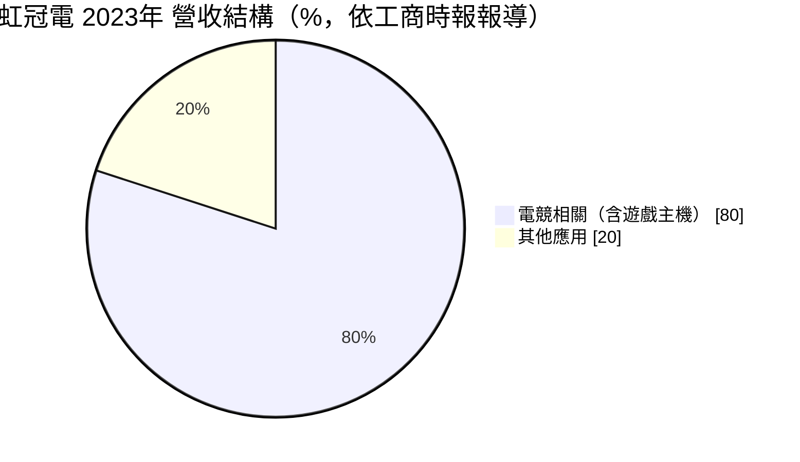
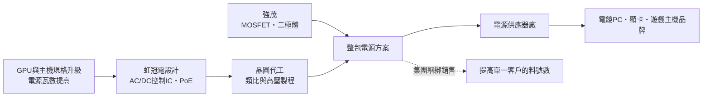
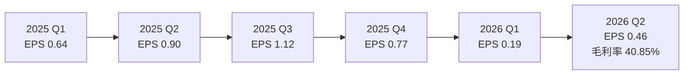
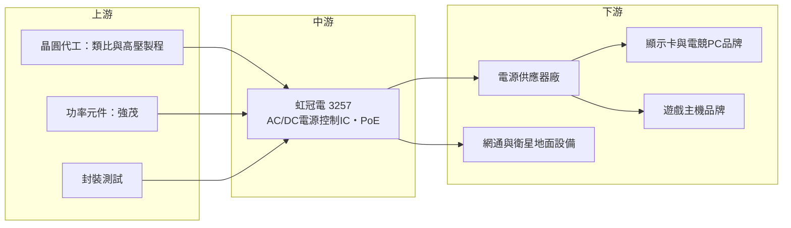

# 3257 虹冠電

> 上市｜[[產業索引-半導體業|半導體業]]｜上市（櫃）日期 2011/03/21

# 第一章：企業模式與商業藍圖

> [!info] 撰寫說明
> 本文由 Claude 依公開資料整理，架構比照 [[2330台積電]] 的四章研究，資料截至 2026-10-07。財務數字來源：工商時報 2023 年 7 月與 2026 年 1 月報導、Winvest 營收快訊、nstock 公司資料頁、Yahoo 股市 EPS 頁；產業描述為整理性內容，尚未逐條比對原始文件。#待校對

在評估單一個股的長期投資價值時，首要步驟是拆解企業的底層獲利邏輯。本章針對虹冠電子（股票代號：3257，以下簡稱虹冠電）的商業模式進行定性分析，說明一家電源管理 IC 設計公司，如何靠電競電源與遊戲主機的高瓦數需求成長，又為何在 2026 年面臨營收大幅回落。

## 一、核心定位：AC/DC 電源控制 IC 與功率元件的整合供應商

虹冠電成立於 1998 年 12 月，2011 年上市，資本額約 7.98 億元，是功率半導體廠 [[2481強茂]] 集團的一員。公司產品包括功率積體電路（Power IC）、電源模組、場效電晶體（[[MOSFET]]）與快速回復二極體，核心是 AC/DC 電源控制 IC，也就是把插座的交流電轉成電子產品需要的直流電時，負責控制轉換過程的晶片。

虹冠電的定位有兩個特點：

* **專攻高瓦數電源：** 電競電腦的顯示卡與遊戲主機耗電大，電源供應器需要穩定輸出數百瓦到上千瓦，對控制 IC 的效率與保護功能要求高，這是虹冠電的主要市場。
* **IC 加功率元件的整包方案：** 依工商時報報導，虹冠電與母公司強茂合作，把電源控制 IC 與強茂的 MOSFET、[[PFC]] 二極體等功率元件綁在一起銷售，客戶可以一次取得電源設計所需的主要半導體。2026 年 1 月報導也指出，強茂以「系統級整合」策略，聯合虹冠電與興茂科技分進合擊 IC 領域。

## 二、終端應用／產品板塊：電競電源為核心

公司近期未公布最新的應用別營收比重。依工商時報 2023 年 7 月報導，當時電競相關產品占營收八成以上，其中遊戲主機占近兩成：

* **電競 PC 電源：** 顯示卡功率持續提高，電源供應器規格升級，帶動高瓦數 AC/DC 控制 IC 需求。2026 年 1 月報導指出，虹冠電受惠於大型 GPU 廠商對高瓦數電源 IC 的需求增加。
* **遊戲主機電源：** 主機內建電源或外接變壓器的控制 IC，需求跟隨主機出貨週期。
* **USB PD 快充：** 手機與筆電的快充電源方案，屬於競爭較激烈的市場。
* **新產品 PoE：** 開發乙太網路供電（[[PoE]]）的供電端（PSE）方案，報導提到有機會打入兩大低軌衛星系統的地面設備市場。

## 三、資本轉化邏輯（營運模式）：集團綜效下的輕資產設計

* **輕資產：** 虹冠電以 IC 設計為主，晶圓委外代工；功率元件則可由母公司強茂提供，不需自建產能。
* **綑綁銷售的經濟性：** 一套電源除了控制 IC，還需要多顆 MOSFET 與二極體。集團一起提案，能增加每一台電源的半導體含量，也提高客戶的轉換成本。
* **營收集中：** 高度依賴電競與主機市場，產品週期一旦轉弱，營收會快速下滑，2026 年 1 至 9 月累計營收 4.85 億元、年減 40.42% 就是例子。

## 四、企業長期藍圖：從電競電源走向通訊與衛星供電

* **PoE 供電端方案：** 網通設備、監視器與衛星地面終端需要以網路線同時傳輸資料與電力，PoE PSE 控制 IC 是新的成長方向。
* **與強茂的系統整合：** 強茂集團把功率元件、電源 IC 與模組整合，目標是提供更完整的電源方案，虹冠電在其中負責類比與電源管理 IC。
* **高瓦數電源持續升級：** 若 AI PC 與高階顯示卡功耗持續提高，高瓦數 AC/DC 控制 IC 的需求仍有結構性支撐（推估）。

# 第二章：護城河深度與競爭優勢

在長期價值投資中，「護城河」指企業抵禦競爭、維持超額利潤的保護機制。本章分析虹冠電的護城河構成、主要競爭對手，以及它在電源 IC 市場的競爭位置。

## 一、護城河的核心組成要素

* **1. 高瓦數電源的設計經驗：** 電競電源要同時滿足高效率、低噪音與完整保護，控制 IC 的參數需要與電源廠反覆調校。虹冠電在這個利基市場累積多年經驗，毛利率曾達 48.85%（2023 年第二季）。
* **2. 集團整包方案：** 與強茂綑綁銷售 IC 與功率元件，是單純 IC 設計公司較難提供的服務。
* **3. 認證與設計導入：** 電源供應器須通過安規與能效認證，一旦某顆控制 IC 被設計進某款電源，在該產品生命週期內通常不會更換。

整體而言屬於「窄護城河」：有利基與集團優勢，但產品本身並非無可替代。

## 二、全球主要競爭對手格局

| 對手 | 定位 | 對虹冠電的威脅 |
|---|---|---|
| 安森美（onsemi）、英飛凌（Infineon） | 國際功率半導體大廠，AC/DC 控制 IC 與功率元件齊全 | 品牌與產品線完整，可整包供應大型電源廠 |
| Power Integrations | 高整合度 AC/DC 轉換 IC 龍頭 | 在快充與中低瓦數電源市占高 |
| [[6719力智]]、[[6435大中]] 等台灣電源 IC 設計公司 | 台灣類比與電源 IC | 在 PC 與周邊電源 IC 競爭 |
| 中國電源 IC 設計公司 | 以低價搶快充與一般電源市場 | 壓低標準品報價 |

註：上表依產品線推估，各家在電競電源控制 IC 的市占未查得。

## 三、優勢轉化：守得住、守不住與觀察重點

* **守得住：** 電競與高瓦數電源控制 IC。這類產品需要的是可靠度與設計支援，價格不是唯一考量。
* **守不住：** USB PD 快充等標準化產品，中國競爭者多、價格壓力大。
* **觀察重點：** 2026 年營收年減四成的需求缺口何時止跌、PoE 產品能否在衛星地面設備與網通市場放量，以及與強茂合作能否把客戶群擴大到電競以外的工業、伺服器電源。

# 第三章：財務體質與盈利規模

資料日期：2026-10-07。數字取自 Winvest 營收快訊、nstock、Yahoo 股市 EPS 頁與工商時報，表格是撰寫當時的快照；最新月營收、毛利率、累計 EPS 由自動排程寫在本筆記的屬性欄位（月營收、毛利率、累計EPS 等）。#待校對

財務報表是檢驗護城河是否真實存在的最終標準。本章用三率、ROE、現金流與資本報酬，檢視虹冠電的獲利品質。

## 一、獲利能力的基石：三率

| 項目 | 2024 全年 | 2025 全年 | 2026 Q1 | 2026 Q2 |
|---|---|---|---|---|
| 營收（新台幣） | 約 8.2 億（推算） | 10.55 億 | 未查得 | 未查得 |
| [[毛利率]] | 未查得 | 未查得 | 未查得 | 40.85% |
| [[營業利益率]] | 未查得 | 未查得 | 未查得 | 7.1% |
| EPS（元） | 2.45（四季加總） | 3.42 | 0.19 | 0.46 |

註：2024 年營收依 2025 年營收 10.55 億元、年增 29% 推算。2026 年第二季毛利率、營益率取自 nstock 最新一季資料，期間標示為「2026 Q1 至 Q2」，可能為第二季單季，待校對。2026 年 1 至 9 月累計營收 4.85 億元、年減 40.42%。

* **[[毛利率]]：** 2023 年第二季 48.85%，公司當時預期維持 45% 以上；2026 年最新一季 40.85%，營收大幅下滑使毛利率也跟著回落。
* **[[營業利益率]]：** 最新一季僅 7.1%，營收衰退四成後，研發與管理費用的比重明顯升高，營運槓桿反向作用。
* **[[淨利率]]與業外：** 最新一季淨利率 21.15%，遠高於營業利益率，代表業外收益（推估為投資收益或利息收入）占獲利的比重很高，評估本業時應以營業利益為準。

## 二、[[ROE]]：資本效率

2025 年 EPS 3.42 元，是近年高點；2026 年上半年累計 EPS 0.65 元，年減約七成。ROE 推估由 2025 年的兩位數降到 2026 年的個位數（具體數字未查得）。虹冠電的 ROE 高度受電競週期影響，並非穩定的高報酬企業。

## 三、資本支出與自由現金流

* **[[CapEx]]：** IC 設計公司資本支出很小，主要為研發設備。
* **[[自由現金流]]：** 營業現金流在營收衰退期會下降，但輕資產模式下仍推估為正。
* **股利：** 2025 年配發現金股利 2.8 元，近五年平均現金股利約 2.76 元。2026 年獲利大減，下一次配息金額可能明顯縮水（推估）。

## 四、[[ROIC]] 與 [[WACC]]：價值創造利差

2025 年電競需求旺盛時，虹冠電的投入資本報酬率推估明顯高於資金成本；2026 年營業利益率降到個位數，利差大幅縮小。這顯示虹冠電的價值創造高度週期化，投資判斷需配合電競與顯示卡產品週期。

# 第四章：總體風險與地緣政治

任何企業都無法脫離宏觀環境獨立存在。本章分析虹冠電未來必須面對的地緣政治、產業週期與營運風險。

## 一、地緣政治

* **電源供應器生產在中國：** 電競電源與主機電源多在中國與東南亞組裝，美中關稅可能使電源廠調整生產地，影響拉貨節奏。
* **GPU 出口管制：** 高階顯示卡受美國對中國出口管制影響，中國市場的高階電競電源需求可能受限。
* **台灣代工集中：** 晶圓代工與封測主要在台灣（推估），面臨兩岸風險。

## 二、產業週期與市場結構

* **電競與顯示卡世代週期：** 新世代顯示卡上市時，電源供應器跟著升級，帶動控制 IC 需求；新品效應過後需求回落。2025 年 EPS 創高、2026 年營收年減四成，推估與此週期有關（具體原因未查得）。
* **遊戲主機週期：** 主機推出初期備貨量大，後期需求下降。
* **[[長鞭效應]]：** 電源廠在旺季前大量備貨，淡季去化庫存，上游 IC 的訂單波動被放大。

## 三、營運環境的隱性風險

* **客戶與應用集中：** 營收高度集中在電競相關市場，缺乏其他應用分散風險。
* **集團依賴：** 銷售策略與強茂綁在一起，若集團策略調整，可能影響虹冠電的產品方向。
* **匯率：** 以美元計價為主，新台幣升值會壓縮毛利。

## 四、科技或法規演進

* **第三代半導體：** 電源轉換逐步導入[[氮化鎵]]與碳化矽功率元件，控制 IC 需配合新元件的高頻特性重新設計，若跟不上，市占可能流失。
* **能效法規：** 各國對電源供應器的能效標準持續提高，例如 80 PLUS 與歐盟待機功耗規範，產品需持續升級。
* **數位電源：** 高瓦數電源逐漸採用數位控制，傳統類比控制 IC 的角色可能被取代。

# 專有名詞解析

## 半導體

- **[[AC DC]]**：把交流電轉換成直流電的電源轉換，電子產品插電使用時都需要這個過程。
- **[[MOSFET]]**：金屬氧化物半導體場效電晶體，電源轉換中最常用的功率開關元件。
- **[[PFC]]**：功率因數修正，讓電源從電網取電時更有效率，高瓦數電源依法規通常必須具備。
- **[[功率半導體]]**：負責電力轉換與控制的半導體元件，例如 MOSFET、二極體、IGBT。
- **[[氮化鎵]]**：寬能隙半導體材料，切換速度快、損耗低，用於快充與高效率電源。

## 金融

- **[[毛利率]]**：毛利除以營收，反映產品定價能力與成本控制。
- **[[營業利益率]]**：營業利益除以營收，扣除研發、銷售與管理費用後的本業獲利能力。
- **[[淨利率]]**：稅後淨利除以營收，包含業外收支後的最終獲利能力。
- **[[長鞭效應]]**：終端需求的小幅變動，沿供應鏈往上游傳遞時被逐級放大，造成上游庫存與訂單劇烈波動。

## 產業

- **[[PoE]]**：乙太網路供電，用一條網路線同時傳輸資料與電力，常見於監視器、無線基地台。
- **[[USB PD]]**：USB 電力傳輸協定，讓手機與筆電可以透過 USB-C 線快速充電。
- **[[電源供應器]]**：把市電轉為電腦各元件所需直流電的設備，電競 PC 通常需要高瓦數規格。

# 核心供應鏈

## 1. 上游：晶圓代工、功率元件與封測
- 母公司與功率元件夥伴：[[2481強茂]]
- 晶圓代工（推估，實際代工廠未查得）：[[5347世界先進]]、[[2303聯電]]

## 2. 中游：虹冠電本身
- AC/DC 電源控制 IC、電源模組、MOSFET、快速回復二極體、PoE PSE 方案

## 3. 下游：電源與終端品牌
- 電源供應器廠：[[2308台達電]]、[[2301光寶科]]、[[3015全漢]]（推估，實際客戶未公開）
- 顯示卡與電競 PC：[[NVDA輝達]] 顯示卡生態系（間接）
- 遊戲主機品牌（間接）

## 4. 同業
- 安森美、英飛凌、Power Integrations、[[6719力智]]

## 最新新聞
<!-- news:start -->
<!-- news:end -->

## 相關連結
- [公開資訊觀測站](https://mopsov.twse.com.tw/mops/web/t05st03?step=1&firstin=1&co_id=3257)
- [Goodinfo](https://goodinfo.tw/tw/StockDetail.asp?STOCK_ID=3257)
- [Yahoo 股市](https://tw.stock.yahoo.com/quote/3257)
- [鉅亨網新聞](https://www.cnyes.com/twstock/3257/news)
