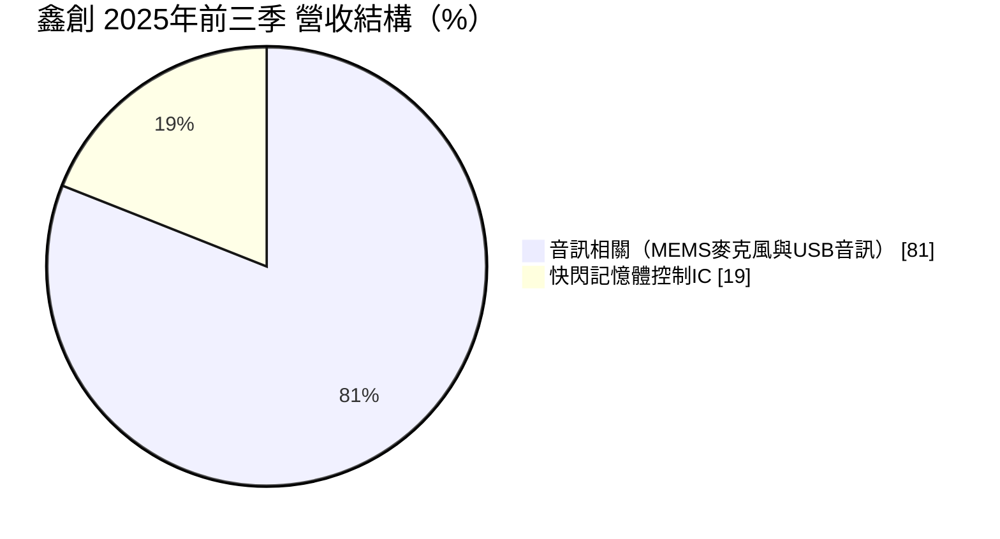
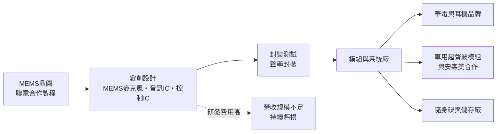
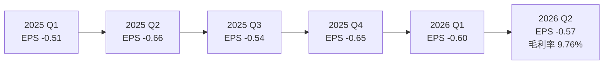
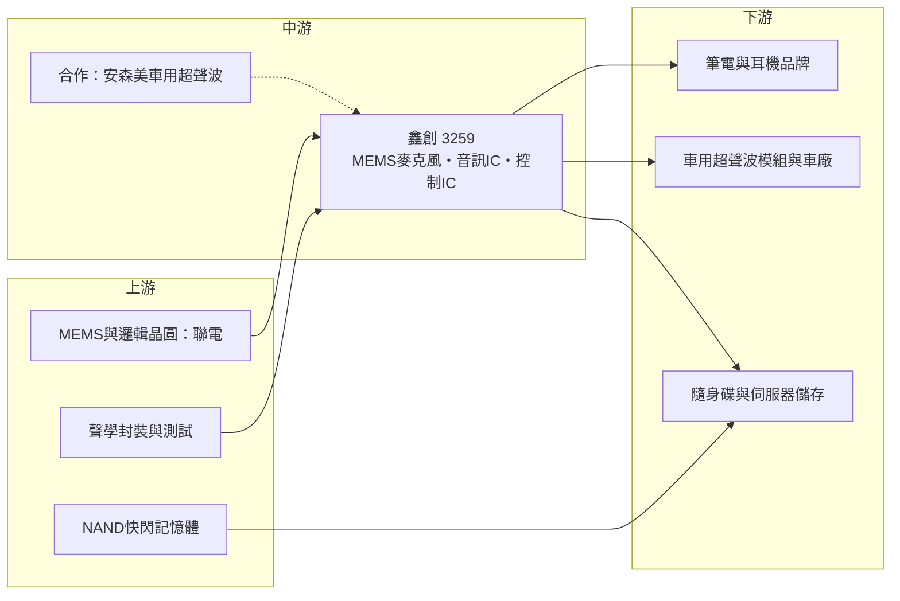

# 3259 鑫創

> 上櫃｜[[產業索引-半導體業|半導體業]]｜上市（櫃）日期 2007/12/24

# 第一章：企業模式與商業藍圖

> [!info] 撰寫說明
> 本文由 Claude 依公開資料整理，架構比照 [[2330台積電]] 的四章研究，資料截至 2026-10-07。財務數字來源：富果研究 2025 年 12 月法說會整理、工商時報 2026 年 5 月報導、nstock 公司資料頁、Winvest 營收快訊、Yahoo 股市 EPS 頁；產業描述為整理性內容，尚未逐條比對原始文件。注意：鑫創科技（3259）與鑫創電子（6680）是不同公司。#待校對

在評估單一個股的長期投資價值時，首要步驟是拆解企業的底層獲利邏輯。本章針對鑫創科技（股票代號：3259，以下簡稱鑫創）的商業模式進行定性分析。鑫創是規模很小、連年虧損的 IC 設計公司，但擁有台灣少見的自主 [[MEMS麥克風]]設計能力，正嘗試把聲學感測從消費電子延伸到車用超聲波與 AI 應用。

## 一、核心定位：台灣唯一自主研發的獨立 Fabless MEMS 麥克風供應商

鑫創成立於 1998 年 11 月，2007 年 12 月在櫃買中心掛牌，股本約 7.29 億元。依工商時報 2026 年 5 月報導，鑫創與 [[2303聯電]] 合作多年，是台灣唯一具備完整自研能力的獨立 [[Fabless]] MEMS 麥克風供應商。

公司有三條產品線：

* **MEMS 麥克風：** 以半導體微機電製程做成的微型麥克風，用在筆電、耳機、智慧裝置與車用感測。鑫創擁有超過 100 項全球專利，強調感度一致性控制在正負 1 dB 以內，這對多顆麥克風組成陣列做語音辨識或超聲波測距很重要。
* **USB 音訊 IC：** 耕耘超過 16 年，支援 24-bit 高解析音訊，用於 USB 耳機、音效卡等周邊。
* **快閃記憶體控制 IC：** USB 3.2 隨身碟控制器，以及企業級磁碟陣列相關產品。

## 二、終端應用／產品板塊：音訊為主、記憶體控制為輔

依 2025 年 12 月法說會，2025 年前三季營收結構如下：

* **音訊相關（81%）：** MEMS 麥克風與 USB 音訊 IC，應用於筆電、耳機、電子煙等消費性產品。法說會提到聯想（Lenovo）的筆電驗證正在進行中。
* **快閃記憶體控制 IC（19%）：** USB 3.2 控制器，2026 年展示支援雙頭隨身碟與 [[QLC]] 記憶體的 [[LDPC]] 控制器，以及 PCIe Gen4 x8 [[HBA]] 卡。
* **新應用：** 與安森美合作的車用 [[ADAS]] 超聲波感測模組，一台車配置 6 個模組、共需 12 顆 MEMS 麥克風，預計 2027 年量產。

## 三、資本轉化邏輯（營運模式）：小規模的 Fabless 感測器公司

* **輕資產但規模不足：** 鑫創不擁有晶圓廠，MEMS 製程與聯電合作。2025 年營收只有 2.82 億元，研發與管理費用無法被攤提，營業利益長期為負。
* **資產瘦身：** 存貨由 2022 年的 3.9 億元降到 2025 年第三季的 1.62 億元，代表公司在去化舊庫存。2025 年第三季底帳上現金約 4,200 萬元、定存 3 億元，總資產 6.65 億元。
* **以合作換市場：** 車用超聲波由安森美主導方案、鑫創提供麥克風；AI 聲學應用則與技術夥伴把訊號轉成 4D 點雲資訊。這種模式可降低單打獨鬥的成本，但也代表鑫創在價值鏈中的議價能力有限。

## 四、企業長期藍圖：從消費性音訊走向超聲波與 AI 聲學感測

* **車用超聲波感測：** 傳統倒車雷達用壓電式超聲波元件，接收靈敏度與角度有限。鑫創的多 MEMS 麥克風接收模組具備 IP69K 等級防高壓水柱設計，已完成自動倒車停車方案的實地驗證，若 2027 年如期量產，是公司首度大規模切入車用。
* **全頻段聲學 AI：** 法說會把應用分為次聲波（健康監測）、聲波（語音辨識）與超聲波（工業監測），以高一致性麥克風作為 AI 感測的前端。
* **儲存產品升級：** 企業級 HBA 卡與 QLC 隨身碟控制器，嘗試從低價隨身碟市場走向較高附加價值的伺服器擴充。
* **2026 年目標：** 公司設定改善毛利率、提升營收與控制費用三項目標。

# 第二章：護城河深度與競爭優勢

在長期價值投資中，「護城河」指企業抵禦競爭、維持超額利潤的保護機制。本章分析鑫創的技術優勢、主要競爭對手，以及小公司在大廠主導市場中的生存空間。

## 一、護城河的核心組成要素

* **1. MEMS 麥克風專利與一致性：** 超過 100 項全球專利，以及正負 1 dB 的感度一致性，是多麥克風陣列與超聲波測距的關鍵條件。
* **2. 台灣在地的獨立供應來源：** 作為台灣唯一具自研能力的獨立 Fabless MEMS 麥克風供應商，對希望分散供應鏈的客戶有一定吸引力。
* **3. 車用合作夥伴：** 與安森美的合作若進入量產，車用驗證會成為新的進入門檻。

但鑫創目前的護城河「尚未形成」：技術有特色，卻沒有轉化為獲利，連年虧損顯示定價能力與規模都不足。

## 二、全球主要競爭對手格局

| 對手 | 定位 | 對鑫創的威脅 |
|---|---|---|
| Knowles、英飛凌 | 全球 MEMS 麥克風與 MEMS 晶片龍頭 | 規模與客戶基礎遠大，主導高階手機與耳機市場 |
| 歌爾、瑞聲 | 中國聲學元件大廠 | 以垂直整合與價格搶佔消費電子市場 |
| [[8299群聯]]、慧榮 | 快閃記憶體控制 IC 大廠 | 在控制 IC 市場規模與技術領先 |
| [[6237驊訊]]、[[2379瑞昱]] | USB 音訊 IC | 在 USB 音訊市場價格競爭 |

## 三、優勢轉化：守得住、守不住與觀察重點

* **守得住：** 需要高一致性的特殊應用，例如多麥克風陣列、超聲波接收與工業聲學監測，這些市場規模小但大廠不一定重視。
* **守不住：** 一般消費性 MEMS 麥克風與 USB 隨身碟控制器，價格由大廠與中國廠主導。
* **觀察重點：** 車用超聲波 2027 年量產進度、筆電客戶驗證結果，以及毛利率能否從 2026 年第二季的個位數回到合理水準。

# 第三章：財務體質與盈利規模

資料日期：2026-10-07。數字取自 nstock、Yahoo 股市 EPS 頁、Winvest 營收快訊與富果研究法說會整理，表格是撰寫當時的快照；最新月營收、毛利率、累計 EPS 由自動排程寫在本筆記的屬性欄位（月營收、毛利率、累計EPS 等）。#待校對

財務報表是檢驗護城河是否真實存在的最終標準。本章用三率、ROE、現金流與資本報酬，檢視鑫創的財務體質。

## 一、獲利能力的基石：三率

| 項目 | 2024 全年 | 2025 全年 | 2026 Q1 | 2026 Q2 |
|---|---|---|---|---|
| 營收（新台幣） | 未查得（低於 2.5 億） | 2.82 億 | 未查得 | 約 0.59 億（月營收加總） |
| [[毛利率]] | 未查得 | 未查得 | 未查得 | 9.76% |
| [[營業利益率]] | 未查得 | 未查得 | 未查得 | -66.58% |
| EPS（元） | -3.18（四季加總） | -2.36 | -0.60 | -0.57 |

註：2026 年第二季營收為 4 至 6 月月營收 1,954.9 萬、2,364.5 萬、1,624.7 萬元加總。2026 年 1 至 8 月累計營收 1.43 億元，年減 4.64%。

* **[[毛利率]]：** 2026 年第二季只有 9.76%，對 IC 設計公司而言非常低，推估與存貨跌價損失或低價出清有關（原因未查得）。
* **[[營業利益率]]：** -66.58%，營收規模太小，研發費用遠超過毛利。
* **虧損趨勢：** 2024 年單季虧損在 0.59 至 1.11 元之間，2025 年收斂到 0.51 至 0.66 元，2026 年上半年約 0.6 元，虧損幅度縮小但尚未看到轉盈。

## 二、[[ROE]]：資本效率

連年虧損下 ROE 為負。以 2025 年每股虧損 2.36 元相對每股淨值估算，ROE 約為負兩成以上（推估，淨值未查得）。股東權益持續被侵蝕，是評估鑫創的首要風險。

## 三、資本支出與自由現金流

* **[[CapEx]]：** Fabless 模式下資本支出很小。
* **[[自由現金流]]：** 營業虧損使營業現金流推估為負，但存貨大幅去化釋出了部分現金。2025 年第三季底現金加定存約 3.4 億元，以目前每季約 4,000 萬元的淨損估算，資金可支撐約兩年（推估）。
* **股利：** 近五年未配發股利。

## 四、[[ROIC]] 與 [[WACC]]：價值創造利差

ROIC 為負，遠低於 WACC，屬於價值毀損階段。鑫創的投資價值取決於車用超聲波與 AI 聲學新應用能否在資金耗盡前帶來足夠營收，結果不確定性很高。

# 第四章：總體風險與地緣政治

任何企業都無法脫離宏觀環境獨立存在。本章分析鑫創未來必須面對的地緣政治、產業週期與營運風險。

## 一、地緣政治

* **中國聲學供應鏈：** MEMS 麥克風的主要對手與模組組裝集中在中國，若國際品牌推動「非中國供應鏈」，台灣獨立供應商可能受惠；反之中國客戶可能優先採用本土廠。
* **車用供應鏈在地化：** 車用感測器的供應鏈正在重組，台灣廠商需要與國際 Tier 1 合作才能進入。
* **台灣產能集中：** MEMS 晶圓與封測集中在台灣（推估），面臨兩岸風險。

## 二、產業週期與市場結構

* **消費電子週期：** 筆電、耳機與隨身碟需求起伏大，[[長鞭效應]]會放大上游晶片的訂單波動。
* **快閃記憶體價格：** 隨身碟控制 IC 的需求受 NAND 快閃記憶體價格影響，記憶體漲價時隨身碟出貨可能下降。
* **大廠主導的市場結構：** MEMS 麥克風市場由少數大廠主導，小廠議價能力有限。

## 三、營運環境的隱性風險

* **資金與持續經營：** 連年虧損，若新產品量產延後，可能需要增資或再進行組織調整。
* **客戶驗證期長：** 筆電與車用驗證動輒一至兩年，驗證失敗或延後會直接影響營收規劃。
* **人才流失：** 虧損期間留住關鍵研發人才不易。

## 四、科技或法規演進

* **車用超聲波技術路線：** 倒車與停車輔助也可能被攝影機、雷達或光達方案取代，MEMS 超聲波方案能否成為主流仍待觀察。
* **AI 語音與聲學：** AI 裝置需要多麥克風陣列，對麥克風一致性要求提高，是鑫創的機會，但也吸引大廠投入。
* **車用法規：** 車用元件須通過 AEC-Q 等可靠度驗證與功能安全標準，認證成本高。

# 專有名詞解析

## 半導體

- **[[MEMS]]**：微機電系統，用半導體製程製作的微型機械結構，例如麥克風、加速度計與陀螺儀。
- **[[MEMS麥克風]]**：以 MEMS 製程製成的微型麥克風，體積小、一致性高，廣泛用於手機、筆電與耳機。
- **[[LDPC]]**：低密度奇偶檢查碼，快閃記憶體控制器用來更正資料錯誤的演算法，QLC 記憶體特別需要。
- **[[QLC]]**：每個記憶單元儲存 4 位元的 NAND 快閃記憶體，容量高、成本低但耐用度較差。
- **[[Fabless]]**：只做 IC 設計、晶圓製造全部委外的半導體公司經營模式。

## 應用

- **[[ADAS]]**：先進駕駛輔助系統，例如自動停車、車道維持與碰撞預警。

## 金融

- **[[毛利率]]**：毛利除以營收，反映產品定價能力與成本控制。
- **[[營業利益率]]**：營業利益除以營收，扣除研發、銷售與管理費用後的本業獲利能力。
- **[[長鞭效應]]**：終端需求的小幅變動，沿供應鏈往上游傳遞時被逐級放大，造成上游庫存與訂單劇烈波動。

## 產業

- **[[超聲波感測]]**：發射並接收人耳聽不到的高頻聲波來測量距離，常見於汽車倒車雷達。
- **[[點雲]]**：以大量三維座標點描述環境形狀的資料格式，常用於自駕車與機器人感知。
- **[[HBA]]**：主機匯流排轉接卡，讓伺服器連接大量硬碟或固態硬碟的擴充卡。

# 核心供應鏈

## 1. 上游：晶圓代工與封裝
- MEMS 與 IC 晶圓代工：[[2303聯電]]
- 聲學封裝與測試（供應商未查得）

## 2. 中游：鑫創本身與合作夥伴
- MEMS 麥克風、USB 音訊 IC、USB 3.2 快閃控制器、PCIe HBA 卡
- 車用超聲波合作：安森美（onsemi）

## 3. 下游：主要客戶與應用
- 筆電品牌：聯想（驗證中）
- 電子煙等消費性產品
- 車用自動停車與倒車輔助（預計 2027 年量產）

## 4. 同業
- Knowles、英飛凌、歌爾、瑞聲
- 控制 IC：[[8299群聯]]

## 最新新聞
<!-- news:start -->
<!-- news:end -->

## 相關連結
- [公開資訊觀測站](https://mopsov.twse.com.tw/mops/web/t05st03?step=1&firstin=1&co_id=3259)
- [Goodinfo](https://goodinfo.tw/tw/StockDetail.asp?STOCK_ID=3259)
- [Yahoo 股市](https://tw.stock.yahoo.com/quote/3259)
- [鉅亨網新聞](https://www.cnyes.com/twstock/3259/news)
