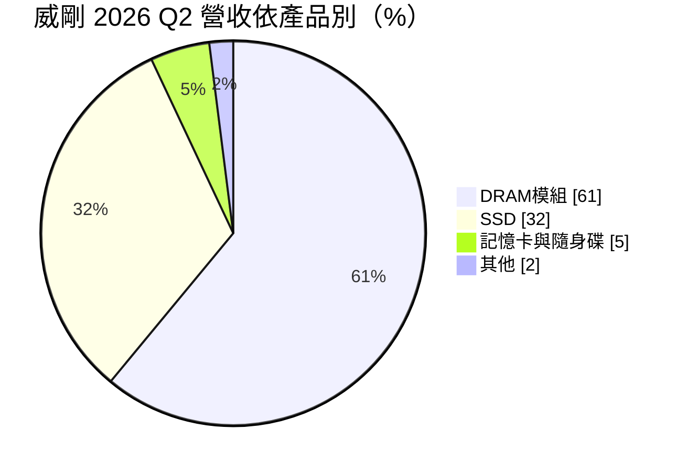
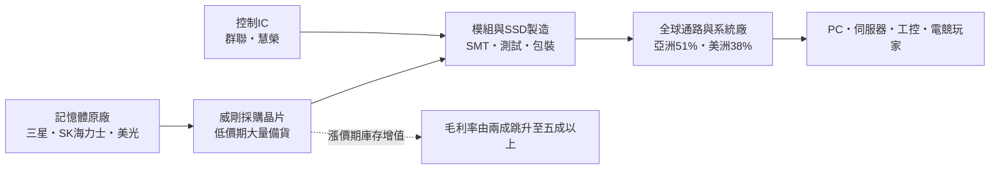
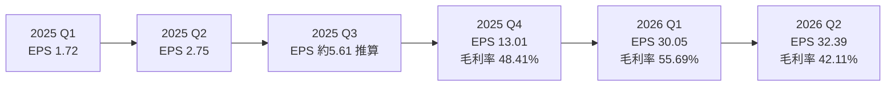
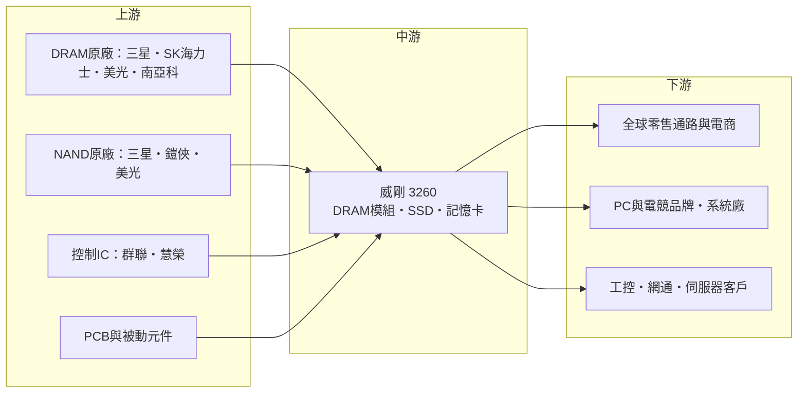

# 3260 威剛

> 上櫃｜[[產業索引-半導體業|半導體業]]｜上市（櫃）日期 2004/10/08

# 第一章：企業模式與商業藍圖

> [!info] 撰寫說明
> 本文由 Claude 依公開資料整理，架構比照 [[2330台積電]] 的四章研究，資料截至 2026-10-07。財務數字來源：富果研究 2026 年 5 月與 8 月法說會整理、優分析 2026 年 8 月報導、聯合新聞網 2026 年 3 月財報報導、科技新報 2025 年報導、nstock 公司資料頁、Weblio 公司沿革；產業描述為整理性內容，尚未逐條比對原始文件。#待校對

在評估單一個股的長期投資價值時，首要步驟是拆解企業的底層獲利邏輯。本章針對威剛科技（股票代號：3260，以下簡稱威剛）的商業模式進行定性分析，說明一家記憶體模組廠如何在 2025 至 2026 年的記憶體超級漲價週期中，把單季 EPS 從個位數推升到 30 元以上，以及這種獲利模式的本質與風險。

## 一、核心定位：以庫存操作為核心的記憶體模組品牌

威剛成立於 2001 年 5 月，由董事長陳立白創辦，2004 年 10 月在櫃買中心掛牌，資本額約 33.38 億元。威剛本身不生產記憶體晶片，而是向三星、SK 海力士、美光等原廠採購 [[DRAM]] 與 [[NAND Flash]] 晶片，搭配控制 IC 與電路板，製成記憶體模組、固態硬碟（[[SSD]]）、記憶卡與隨身碟，以 ADATA 與電競品牌 XPG 銷售。

模組廠的商業本質可以拆成兩部分：

* **加工與通路：** 把晶片做成標準規格的模組，透過全球通路、系統廠與工控客戶銷售，這部分的附加價值與毛利率有限。
* **庫存與價格判斷：** 記憶體晶片價格波動劇烈，模組廠在低價時大量備貨、漲價時出售，庫存的價差往往才是獲利的主要來源。威剛董事長陳立白以敢於重押庫存著稱，這使威剛的獲利對記憶體價格高度敏感。

除記憶體本業外，威剛的登記營業項目還包括生技產品銷售、電動三輪車租賃與銷售、場地租賃與文創餐飲等多角化業務，但營收主體仍是記憶體。

## 二、終端應用／產品板塊：DRAM 模組為主、SSD 為輔

* **DRAM 模組（約六至七成）：** 2026 年第一季占 68%、第二季 61%。包括桌機與筆電記憶體、電競記憶體、伺服器與工控記憶體模組。
* **SSD（約兩成半至三成）：** 2026 年第二季提升到 32%，NAND Flash 漲價使 SSD 營收比重上升，公司也積極拓展企業級儲存產品。
* **記憶卡、隨身碟與外接硬碟（約一成以下）：** 屬於消費性零售產品。
* **地區分布：** 2026 年第一季亞洲占 51%、美洲 38%、歐洲與其他地區 11%。
* **客戶類型：** 涵蓋傳統 PC、智慧型手機、工控、網通與伺服器，並在 AI 帶動下拓展企業儲存與新的雲端服務客戶。

## 三、資本轉化邏輯（營運模式）：低買高賣的庫存槓桿

* **庫存即槓桿：** 2026 年第一季底存貨 364 億元，4 月底超過 400 億元，第二季法說時庫存 494 億元，DRAM 庫存週轉約 3 個月、NAND 約 5 個月。公司明言維持高檔庫存、沒有調降計畫，押注漲價延續到 2027 年。
* **毛利率的來源：** 2025 年全年毛利率 27.81%，2026 年第一季 55.69%。毛利率大幅攀升主要來自低價庫存在漲價期出售的價差，而不是加工附加價值提高。
* **營運資金需求大：** 庫存大幅增加需要龐大資金，威剛 2026 年發行可轉換公司債，並實施庫藏股與半年配息，資本運用相當積極。

## 四、企業長期藍圖：從價差獲利走向企業級儲存

* **拓展企業與雲端客戶：** 法說會表示會優先服務既有 OEM 夥伴，同時培養新的雲端服務客戶，搶攻 AI 帶動的企業級 SSD 與伺服器記憶體需求。
* **品牌經營：** XPG 電競品牌提供較高單價與品牌溢價，降低對純模組價差的依賴。
* **股東回饋：** 2025 年度配發現金股利 17 元，2026 年起首度採半年配息，上半年配發 18 元，並推出庫藏股計畫。
* **景氣判斷：** 公司預期 2026 年第三季營收優於第二季，DRAM 約漲 20% 至 30%、NAND Flash 約漲 35% 至 40%，並認為 2027 年 DRAM 全年缺貨、比 2026 年更吃緊。

# 第二章：護城河深度與競爭優勢

在長期價值投資中，「護城河」指企業抵禦競爭、維持超額利潤的保護機制。本章分析威剛的競爭優勢、主要競爭對手，以及模組廠在記憶體週期中的真實議價能力。

## 一、護城河的核心組成要素

記憶體模組業的護城河普遍很淺，威剛的優勢主要在以下三點：

* **1. 原廠採購關係與規模：** 能否在缺貨時取得晶片配額，是模組廠的生命線。威剛是全球前幾大記憶體模組品牌之一（推估），長期與原廠維持採購關係，缺貨時較小型模組廠更容易拿到貨。
* **2. 全球通路與品牌：** ADATA 與 XPG 品牌在零售與電競市場有知名度，美洲營收占近四成，通路廣度是新進者難以短期建立的。
* **3. 庫存決策與資金能力：** 敢在低點重押庫存並承擔跌價風險，需要決策魄力與財務能力。這是威剛在漲價週期大幅超越同業的原因，但也是雙面刃。

整體而言，威剛屬於「無明顯護城河、但具週期操作能力」的企業，超額利潤主要來自景氣循環而非結構性優勢。

## 二、全球主要競爭對手格局

| 對手 | 定位 | 對威剛的威脅 |
|---|---|---|
| 金士頓（Kingston） | 全球最大記憶體模組廠，未上市 | 規模、原廠關係與通路皆領先 |
| [[2451創見]] | 台灣模組廠，工控與消費性產品 | 在工控與零售市場競爭 |
| [[4967十銓]]、[[8271宇瞻]] | 台灣電競與工控模組品牌 | 在電競記憶體與工控產品競爭 |
| [[5289宜鼎]] | 工控記憶體與儲存龍頭 | 在工控與企業儲存的高毛利市場競爭 |
| 原廠自有品牌：[[005930三星電子]]、美光 Crucial | 原廠直接經營零售品牌 | 缺貨時原廠優先供應自家品牌 |

## 三、優勢轉化：守得住、守不住與觀察重點

* **守得住：** 漲價週期中的庫存價差。只要記憶體價格持續上漲、威剛手中仍有低成本庫存，毛利率就能維持高檔。
* **守不住：** 跌價週期。一旦記憶體價格反轉，高價庫存會造成跌價損失，模組廠的毛利率可能快速回到個位數甚至虧損，歷史上多次出現。
* **觀察重點：** 原廠合約價走勢、威剛庫存金額與週轉天數、企業級 SSD 與伺服器記憶體營收占比，以及 2027 年原廠擴產速度。庫存在 494 億元的高檔，是未來最需要追蹤的數字。

# 第三章：財務體質與盈利規模

資料日期：2026-10-07。數字取自富果研究法說會整理、優分析、聯合新聞網、科技新報與 nstock，表格是撰寫當時的快照；最新月營收、毛利率、累計 EPS 由自動排程寫在本筆記的屬性欄位（月營收、毛利率、累計EPS 等）。#待校對

財務報表是檢驗護城河是否真實存在的最終標準。本章用三率、ROE、現金流與資本報酬，檢視威剛在記憶體超級週期中的獲利品質。

## 一、獲利能力的基石：三率

| 項目 | 2025 全年 | 2025 Q4 | 2026 Q1 | 2026 Q2 |
|---|---|---|---|---|
| 營收（新台幣） | 530.87 億 | 158.45 億 | 261 億 | 381.43 億 |
| [[毛利率]] | 27.81% | 48.41% | 55.69% | 42.11% |
| [[營業利益率]] | 17.26% | 35.36% | 47.05% | 33.47% |
| EPS（元） | 23.18 | 13.01 | 30.05 | 32.39 |

註：2026 年上半年營收 642.4 億元、EPS 62.46 元；7 月營收 183.8 億元。2025 年前三季 EPS 10.08 元，其中第一季 1.72 元、第二季 2.75 元。

* **[[毛利率]]：** 2026 年第一季 55.69% 是極端值，反映低價庫存在價格暴漲時出售。第二季降到 42.11%，代表較高成本的庫存開始進入銷貨成本，價差收斂；但營收季增 46%，使獲利仍創新高。
* **[[營業利益率]]：** 費用結構相對固定，營收暴增讓營業利益率在 2026 年第一季達 47%。
* **獲利品質：** 這段獲利屬於週期性高峰，與 2025 年第一季 EPS 僅 1.72 元相比，可見威剛的獲利波動幅度極大。評估時不宜直接以高峰 EPS 推算長期價值。

## 二、[[ROE]]：資本效率

2026 年第二季單季 ROE 30.06%、ROA 10.46%，年化後的 ROE 超過一倍（推估）。這是記憶體漲價、庫存增值與營收暴增共同造成的週期高峰；在價格平穩或下跌期間，模組廠 ROE 通常只有個位數甚至為負。

## 三、資本支出與自由現金流

* **[[CapEx]]：** 模組廠的資本支出主要是 SMT 產線與測試設備，金額相對營收很小。
* **[[自由現金流]]：** 威剛的現金流主要被存貨吸收，庫存由第一季底 364 億元增加到 494 億元，營業現金流可能遠低於淨利（推估）。2026 年發行可轉換公司債，部分用途推估為支應庫存。
* **股利：** 2025 年度配發 17 元，2026 年上半年配發 18 元，並實施庫藏股計畫。

## 四、[[ROIC]] 與 [[WACC]]：價值創造利差

在漲價週期，威剛投入的資本主要是庫存，而庫存本身正在增值，因此 ROIC 遠高於 WACC。但這種利差高度依賴價格方向：一旦價格反轉，同樣的高庫存會轉為跌價損失，ROIC 可能迅速低於 WACC。以完整週期平均來看，模組廠的長期價值創造能力遠低於高峰時的數字（推估）。

# 第四章：總體風險與地緣政治

任何企業都無法脫離宏觀環境獨立存在。本章分析威剛未來必須面對的地緣政治、產業週期與營運風險。

## 一、地緣政治

* **美中科技戰：** 美國對中國記憶體廠的出口管制，以及中國記憶體廠擴產，都會改變全球記憶體供需。中國長鑫、長江存儲若大幅擴產，可能提前結束缺貨。
* **關稅：** 美洲占營收近四成，美國對電子產品與記憶體模組的關稅政策會影響售價與需求。
* **原廠產能分布：** 記憶體晶片產能集中在韓國、台灣、美國與中國，任一地區的地緣衝突都可能造成供應中斷與價格暴漲暴跌。

## 二、產業週期與市場結構

* **記憶體週期：** 記憶體是典型的寡占週期產業，價格由三星、SK 海力士、美光等原廠的產能與庫存決定。AI 伺服器帶動 [[HBM]] 與高容量記憶體需求，原廠產能轉往 HBM，使一般 DRAM 供給緊縮，是本輪漲價的主因。
* **[[長鞭效應]]：** 缺貨期間客戶重複下單、通路囤貨，需求被高估；一旦價格反轉，囤貨會同時釋出，跌價速度往往很快。
* **原廠擴產：** 原廠高獲利後會擴產，新產能通常在一到兩年後開出，可能在 2027 年後改變供需。

## 三、營運環境的隱性風險

* **庫存跌價風險：** 494 億元的庫存相當於公司資本額的十多倍，價格若下跌一成，就可能產生數十億元的跌價損失（推估）。
* **資金與負債：** 高庫存需要大量營運資金，可轉債與借款增加，利率與還款壓力上升。
* **多角化業務：** 生技、電動三輪車與文創餐飲等非核心業務，可能分散管理資源。

## 四、科技或法規演進

* **記憶體規格轉換：** DDR5、LPDDR、CXL 記憶體擴充與企業級 PCIe SSD 的規格快速演進，模組廠需要持續投入驗證。
* **原廠直接銷售：** AI 伺服器客戶多直接向原廠採購記憶體，模組廠在高階伺服器市場的參與空間有限。
* **環保與產品法規：** 各國電子產品回收與能效規範，增加產品合規成本。

# 專有名詞解析

## 半導體

- **[[DRAM]]**：動態隨機存取記憶體，電腦與伺服器的主記憶體，斷電後資料會消失，價格週期波動大。
- **[[NAND Flash]]**：斷電後仍能保存資料的快閃記憶體，是 SSD、記憶卡與隨身碟的主要元件。
- **[[HBM]]**：高頻寬記憶體，把多層 DRAM 垂直堆疊並與 GPU 封裝在一起，用於 AI 加速器。
- **[[DDR5]]**：第五代雙倍資料率記憶體標準，頻寬與容量高於 DDR4，是新一代 PC 與伺服器的主流規格。
- **[[CXL]]**：Compute Express Link，以 PCIe 為基礎的高速互連標準，可讓伺服器擴充與共享記憶體。

## 金融

- **[[存貨週轉天數]]**：存貨平均多少天能賣完，數字越大代表庫存越多、跌價風險越高。
- **[[毛利率]]**：毛利除以營收，反映產品定價能力與成本控制。
- **[[ROE]]**：股東權益報酬率，稅後淨利除以股東權益，衡量公司運用股東資金的效率。
- **[[自由現金流]]**：營業活動現金流減去資本支出，代表企業可自由用於配息、還債或併購的現金。
- **[[長鞭效應]]**：終端需求的小幅變動，沿供應鏈往上游傳遞時被逐級放大，造成上游庫存與訂單劇烈波動。

## 產業

- **[[SSD]]**：固態硬碟，以 NAND Flash 儲存資料，速度遠快於傳統硬碟。
- **[[記憶體模組]]**：把多顆 DRAM 晶片焊在電路板上做成標準規格的記憶體條，插在主機板上使用。
- **[[合約價]]**：記憶體原廠與大型客戶議定的批量價格，通常按月或按季調整，是記憶體景氣的重要指標。
- **[[SMT]]**：表面黏著技術，把電子元件自動焊接到電路板上的生產製程。

# 核心供應鏈

## 1. 上游：記憶體晶片原廠與零組件
- DRAM：[[005930三星電子]]、SK 海力士、美光、[[2408南亞科]]
- NAND Flash：[[005930三星電子]]、鎧俠、美光
- 控制 IC：[[8299群聯]]、慧榮

## 2. 中游：威剛本身
- DRAM 模組（ADATA、XPG 電競品牌）、SSD、記憶卡、隨身碟、外接硬碟

## 3. 下游：通路與客戶
- 全球零售通路與電商平台（亞洲 51%、美洲 38%、歐洲與其他 11%）
- PC、手機、工控、網通與伺服器客戶，以及新的雲端服務客戶

## 4. 同業
- 金士頓、[[2451創見]]、[[4967十銓]]、[[8271宇瞻]]、[[5289宜鼎]]

## 最新新聞
<!-- news:start（自動產生，請勿手動編輯此範圍） -->
- 2026-10-06 📰 媒體 17:50｜營收速報 - 威剛(3260)9月營收157.30億元年增率高達199.95％｜[鉅亨網](https://news.cnyes.com/news/id/6622823)

完整紀錄：[[3260威剛 新聞]]
<!-- news:end -->

## 相關連結
- [公開資訊觀測站](https://mopsov.twse.com.tw/mops/web/t05st03?step=1&firstin=1&co_id=3260)
- [Goodinfo](https://goodinfo.tw/tw/StockDetail.asp?STOCK_ID=3260)
- [Yahoo 股市](https://tw.stock.yahoo.com/quote/3260)
- [鉅亨網新聞](https://www.cnyes.com/twstock/3260/news)
