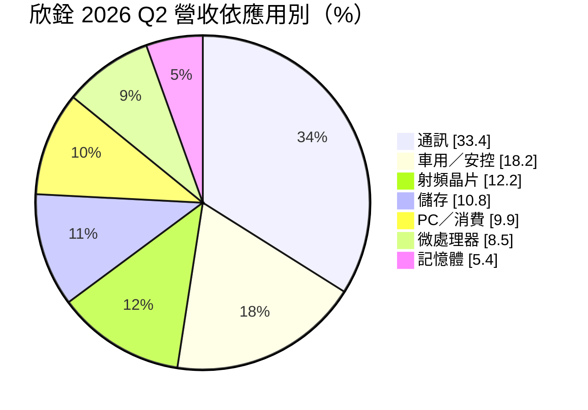
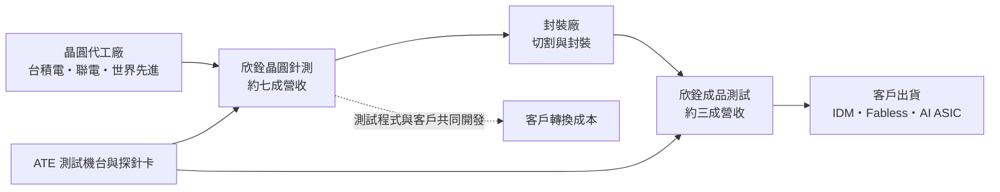
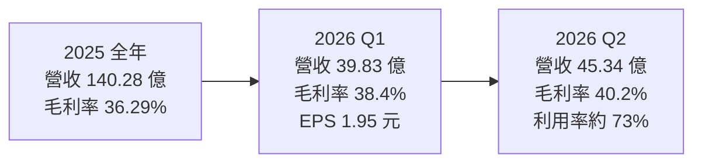
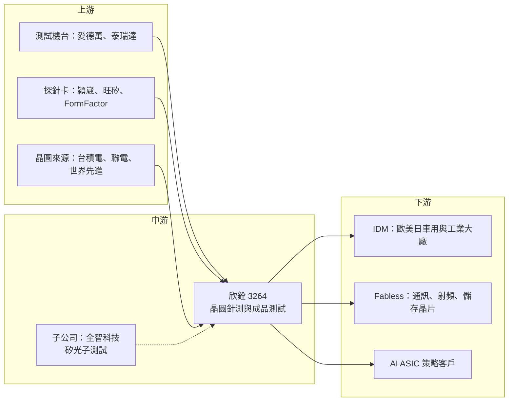

# 3264 欣銓

> 上櫃｜[[產業索引-半導體業|半導體業]]｜上市（櫃）日期 2005/01/05

# 第一章：企業模式與商業藍圖

> [!info] 撰寫說明
> 本文由 Claude 依公開資料整理，架構比照 [[2330台積電]] 的四章研究，資料截至 2026-10-07。財務數字來源：工商時報（2026 年 5 月法說會報導）、旺得富／中時（2025 年財報報導）、優分析（2026 年 7 月、9 月）、經濟日報（2026 年 8 月）、nStock 月營收資料；產業描述為整理性內容，尚未逐條比對原始文件。#待校對

在評估單一個股的長期投資價值時，首要步驟是拆解企業的底層獲利邏輯。本章針對欣銓科技（股票代號：3264，以下簡稱欣銓）的商業模式進行定性分析，說明一家以車用與通訊測試見長的專業測試廠，為何在 2026 年大舉投資 AI 晶片與矽光子測試，以及這個轉向背後的資本邏輯。

## 一、核心定位：以晶圓針測為主的專業測試廠

欣銓是台灣上櫃的專業半導體測試服務公司，總部位於新竹。和日月光、矽品這類「封裝加測試」的一條龍業者不同，欣銓的核心是「測試」本身，尤其是晶圓在切割封裝之前的[[晶圓針測]]。2026 年第一季，晶圓針測占營收 70.3%，成品測試（[[Final Test]]）占 29.0%，其他 0.7%。

晶圓針測的工作，是在晶圓廠完成製造後，用[[探針卡]]逐顆量測晶片的電性與功能，篩出不良品，避免把壞的晶粒送去封裝浪費成本。這一段需要大量昂貴的測試機台（[[ATE]]）、探針卡與針測機，也需要和客戶共同開發測試程式，因此是資本密集、同時也講究工程能力的服務業。

欣銓的客戶組成跟多數台灣測試廠不同，[[IDM]] 占比相當高。2026 年第一季客戶別為：[[Fabless]] 56.1%、IDM 42.7%、晶圓代工 1.1%、其他 0.1%。IDM 客戶多為歐美日的車用、工業與微控制器大廠，這類客戶把部分測試外包給欣銓，看重的是長期合作的品質紀錄與多地產能。個別客戶名單公司並未在本次查得的資料中公開，市場一般認為以歐系車用與通訊晶片廠為主（推估）。

## 二、終端應用板塊：通訊與車用雙支柱

2026 年第二季的營收結構依應用別如下：

* **通訊：** 手機、網通與連網晶片的測試，是欣銓最大的應用板塊。
* **車用／安控：** 車用 [[MCU]]、感測與安控晶片，需要高低溫等嚴格的[[車規驗證]]測試，是欣銓品質形象的來源。
* **射頻晶片：** 手機與無線通訊的射頻前端晶片，測試需要專門的射頻機台與治具。
* **儲存、微處理器與記憶體：** 儲存控制晶片、處理器與記憶體相關測試，合計約四分之一。

通訊與車用合計超過五成，是欣銓營運的兩根支柱；AI 相關的 [[ASIC]] 與[[矽光子]]測試則是 2026 年起新增的成長引擎。

## 三、資本轉化邏輯：機台折舊與產能利用率

* **營運據點：** 欣銓在台灣新竹、龍潭設有主要測試廠，海外則有新加坡與中國南京據點，可以就近服務當地 IDM 與晶圓廠客戶。
* **龍潭新廠：** 鎖定高階 AI ASIC 測試，2026 年 7 月正式量產，相關高階機台接近滿載。公司已發包擴建 6 層樓（最終規劃可達 7 層）的無塵室，預計 2027 年陸續完工。
* **全智科技（持股 100%）：** 專注電子 IC、光子 IC（PIC）與光電整合測試，湖口新廠面積超過 3,500 坪，2026 年第三季投產，主攻矽光子與共同封裝光學（[[CPO]]）測試，規劃 2027 年接近滿載。
* **瑞峰半導體（持股約 25%）：** 切入先進異質整合封裝，補足自身以測試為主的業務範圍。
* **利用率槓桿：** 測試機台買進後以折舊攤提，[[產能利用率]]越高，每台機台分攤的固定成本越低。2026 年第二季整體利用率約 73%，高階 AI ASIC 機台接近滿載。

## 四、企業長期藍圖：從成熟應用走向 AI 測試

過去欣銓的形象是「穩健但成長不快」的測試廠，營收隨車用、通訊景氣起伏，資本支出相對保守。2026 年起，公司因與策略客戶確定 AI ASIC 測試合作，資本支出轉為積極，上半年資本支出達 70 億元，接近全年營收的一半。

這個轉向的邏輯是：AI 晶片體積大、電晶體多、單價高，測試時間長且測試機台更昂貴，測試服務的價值占比明顯提高。再加上矽光子與 CPO 需要光電混合測試，技術門檻高、能做的廠商少。欣銓希望藉由龍潭廠與全智科技，把業務從成熟的車用與通訊測試，延伸到 AI 資料中心的高階測試，提升整體毛利率與成長性。

# 第二章：護城河深度與競爭優勢

在長期價值投資中，「護城河」指企業抵禦競爭、維持超額利潤的保護機制。本章分析欣銓的護城河構成、國內外主要競爭對手，以及這些優勢在 AI 測試的擴產競賽中能守住多少。

## 一、欣銓護城河的核心組成要素

欣銓的護城河屬於「窄到中等」，來源主要有以下幾點：

* **1. 測試程式與客戶綁定：** 每顆晶片的測試程式都需要和客戶共同開發、驗證，車用晶片更要符合嚴格的品質標準（零缺陷要求）。一旦在欣銓完成驗證，客戶轉換測試廠需要重新開發程式、重新驗證，時間與風險成本都不低。
* **2. IDM 客戶的長期信任：** IDM 外包測試通常是長期合約，看重的是供應穩定與品質紀錄。欣銓 IDM 占比四成以上，代表它在歐美日大廠的供應鏈中已有穩固位置。
* **3. 晶圓針測的專業化：** 晶圓針測需要搭配探針卡、溫控（車用需要高低溫測試）與大量機台調校經驗，欣銓長期專注這一段，規模在台灣專業測試廠中名列前茅。
* **4. 多地據點：** 台灣、新加坡、中國都有產能，能配合客戶的供應鏈分散需求。

## 二、全球主要競爭對手格局

| 對手 | 定位 | 對欣銓的威脅 |
|---|---|---|
| [[2449京元電子]] | 台灣最大專業測試廠，AI GPU 測試曝光高 | 在高階 AI 測試起步較早、規模較大 |
| [[6257矽格]] | 專業測試廠，客戶以 IC 設計公司為主 | 在通訊與消費性晶片測試重疊 |
| [[3711日月光投控]] | 全球最大封測集團，封裝加測試一條龍 | 對需要打包服務的客戶有吸引力 |
| [[AMKR艾克爾]] | 美系封測大廠 | 在歐美客戶間競爭 |
| IDM 自有測試產能 | 客戶自家工廠 | 客戶可選擇把測試收回自製 |

## 三、優勢轉化：哪些市場守得住、哪些守不住

* **守得住：** 車用與工業晶片的晶圓針測，驗證週期長、品質要求高，欣銓的歷史紀錄與 IDM 關係不容易被取代。2025 年毛利率回升到 36.3%，2026 年第二季更突破 40%，顯示高附加價值測試的比重正在提高。
* **守不住：** 一般消費性晶片的測試價格競爭激烈，同業之間差異化有限；在 AI GPU 測試這塊，京元電子起步較早、規模較大。
* **觀察重點：** 龍潭廠 AI ASIC 測試的放量速度與客戶集中度、全智科技矽光子測試能否在 2027 年接近滿載，以及大舉擴產後整體產能利用率能否維持在 70% 以上。這三點決定欣銓能否從「穩健型測試廠」轉型為「AI 測試成長股」。

# 第三章：財務體質與盈利規模

資料日期：2026-10-07。數字取自工商時報、旺得富／中時、優分析、經濟日報等財經媒體整理與 nStock 月營收資料，表格是撰寫當時的快照；最新月營收、毛利率、累計 EPS 由自動排程寫在本筆記的屬性欄位（月營收、毛利率、累計EPS 等）。#待校對

財務報表是檢驗護城河是否真實存在的最終標準。本章用三率、ROE、資本支出與資本報酬，檢視欣銓在產品組合升級與大舉擴產之間的獲利品質。

## 一、獲利能力的基石：三率

| 項目 | 2025 全年 | 2026 Q1 | 2026 Q2 |
|---|---|---|---|
| 營收（新台幣） | 140.28 億 | 39.83 億 | 45.34 億 |
| [[毛利率]] | 36.29% | 38.4% | 40.2% |
| [[營業利益率]] | 25.41% | 27.5% | 未查得 |
| EPS（元） | 5.99 | 1.95 | 2.36 至 2.44 |

* **[[毛利率]]：** 2025 年營收年增 7.1%，但毛利率提升 8.2 個百分點、營業利益率提升 7.4 個百分點，獲利成長遠快於營收，反映產品組合改善與產能利用率回升。2025 年第四季 EPS 1.79 元。
* **2026 年第二季：** EPS 不同媒體報導分別為 2.44 元與 2.36 元，差異推估來自股本計算基礎不同，以公開資訊觀測站財報為準。第二季稅後淨利 11.6 億元，年增 105.2%。
* **月營收：** 2026 年月營收逐月走高，8 月約 17.94 億元創新高，1 至 8 月累計 120.78 億元，年增 33.9%。

## 二、[[ROE]]：資本效率

測試業的獲利高度取決於產能利用率：機台折舊是固定成本，利用率每提升幾個百分點，就會明顯推升毛利率。欣銓 2025 年起毛利率與營業利益率同步大幅改善，即是此一槓桿效果。ROE 的確切數字本次未查得，但以 2025 年 EPS 約 6 元、獲利創三年新高來看，資本效率較前兩年改善（推估）。

## 三、資本支出與自由現金流

* **[[CapEx]]：** 2026 年上半年資本支出達 70 億元，主要投入龍潭廠 AI ASIC 測試機台與無塵室擴建，以及全智科技湖口新廠。
* **[[自由現金流]]：** 依 2026 年 9 月報導，上半年自由現金流約為負 44.7 億元，負債比約 53%、流動比率約 88%。大舉擴產讓財務結構轉緊，需留意後續籌資方式與折舊攀升對毛利率的影響。
* **股利政策：** 欣銓 2025 年度配發現金股利 4.2 元，配發率約 70%。過去公司以穩定配息見長，但 2026 年資本支出大幅增加、自由現金流轉負，未來配息率是否維持七成，需觀察擴產回收的速度。

## 四、[[ROIC]] 與 [[WACC]]：價值創造利差

企業創造價值的條件是投入資本報酬率高於資金成本。欣銓過去以穩健資本支出維持正利差；2026 年資本支出接近營收一半，投入資本大幅增加，短期 ROIC 可能因新產能尚未滿載而下滑（推估，具體數值未查得）。若龍潭廠 AI ASIC 測試與全智科技矽光子測試在 2027 年達到高利用率，新增資本的報酬可望高於過去的車用與通訊測試；反之，借款增加推升資金成本，利差可能被壓縮。

# 第四章：總體風險與地緣政治

任何企業都無法脫離宏觀環境獨立存在。本章分析欣銓未來必須面對的地緣政治、產業週期、營運與技術風險。

## 一、地緣政治風險

* **中國據點：** 欣銓在南京設有據點，服務中國本地客戶，但也面臨美中科技管制與中國本土測試廠以低價競爭的雙重壓力。
* **美國關稅與在地化要求：** 測試服務本身不直接出口實體商品，但客戶晶片最終銷往美國時，可能受到半導體關稅與原產地規範影響，間接影響訂單分配。
* **台灣集中風險：** 龍潭廠與全智科技新廠都在台灣，AI 測試產能高度集中在台灣，面臨與其他台灣半導體業者相同的兩岸風險。

## 二、產業週期與市場結構風險

* **車用與通訊景氣：** 車用／安控與通訊合計占營收五成以上，車用晶片庫存調整（如 2024 年的情況）會直接壓低產能利用率，這是典型的[[長鞭效應]]。
* **AI 客戶集中：** 龍潭廠的成長主要依賴少數策略客戶的 AI ASIC 專案，若客戶專案延後、轉單或自行設廠測試，新產能利用率可能不如預期。
* **同業擴產：** 京元電子等同業同樣積極擴充 AI 測試產能，未來可能出現價格競爭。

## 三、營運環境的隱性風險

* **折舊壓力：** 上半年資本支出 70 億元，加上龍潭廠擴建無塵室 2027 年陸續完工，未來幾年折舊費用將明顯上升。若營收成長跟不上，毛利率可能回落。
* **財務結構：** 自由現金流為負、流動比率低於 100%，代表短期資金需求需仰賴借款或其他籌資，利率上升時財務成本增加。
* **機台供應：** 高階 ATE 測試機台主要由愛德萬、泰瑞達等少數國外廠商供應，交期延誤會影響擴產時程。

## 四、科技演進風險

AI 晶片與矽光子的測試方法仍在快速演進，例如晶片尺寸越來越大、功耗越來越高，測試時的散熱與探針接觸技術都需要持續投入。CPO 的光電整合測試尚無統一標準，若主流規格與欣銓、全智科技押注的方向不同，前期投資可能難以回收。

# 專有名詞解析

## 半導體

- **[[晶圓針測]]**：晶圓切割封裝前，用探針卡逐顆量測晶粒電性與功能，篩除不良品的測試程序，又稱 CP 或 Wafer Sort。
- **[[Final Test]]**：成品測試，晶片封裝完成後的最終功能與可靠度測試，確認出貨品質。
- **[[探針卡]]**：晶圓針測時與晶粒接點接觸的介面零件，上面有大量細微探針，需依每顆晶片客製。
- **[[ATE]]**：自動測試設備，對晶片輸入訊號並判讀結果的高價測試機台，主要供應商為愛德萬與泰瑞達。
- **[[ASIC]]**：特定應用積體電路，為單一客戶或用途客製設計的晶片，例如雲端業者自研的 AI 加速器。
- **[[矽光子]]**：在矽晶片上製作光學元件，以光取代電傳輸資料，可降低 AI 資料中心的傳輸耗電。
- **[[CPO]]**：共同封裝光學，把光收發元件與交換器或運算晶片封裝在一起，縮短電訊號路徑、降低功耗。
- **[[IDM]]**：整合元件製造廠，自行設計、製造並銷售晶片的公司，例如英特爾、英飛凌。
- **[[Fabless]]**：無晶圓廠的 IC 設計公司，只設計晶片、製造委外，例如聯發科、輝達。

## 應用

- **[[MCU]]**：微控制器，整合處理器、記憶體與周邊介面的小型晶片，廣泛用於車用、家電與工業控制。
- **[[車規驗證]]**：車用晶片須通過 AEC-Q100 等可靠度測試與車廠認證，流程常需 2 至 3 年，因此轉換成本高。

## 金融

- **[[產能利用率]]**：實際使用產能占總產能的比例，測試廠的毛利率高度取決於此數字。
- **[[自由現金流]]**：營業活動現金流減去資本支出，代表企業可自由用於配息、還債或併購的現金。
- **[[長鞭效應]]**：終端需求的小幅變動，沿供應鏈往上游傳遞時被逐級放大，造成上游庫存與訂單劇烈波動。

# 核心供應鏈

## 1. 上游：測試設備與耗材
- 測試機台（ATE）：愛德萬（Advantest）、泰瑞達（Teradyne）
- 探針卡：[[6515穎崴]]、[[6223旺矽]]、FormFactor
- 針測機與分類機：[[8035東京威力科創]]、[[6640均華]]

## 2. 上游晶圓來源：晶圓代工
- [[2330台積電]]、[[2303聯電]]、[[5347世界先進]]

## 3. 中游：欣銓本身與轉投資
- 矽光子與光電整合測試子公司：全智科技（持股 100%）
- 異質整合封裝轉投資：瑞峰半導體（約 25%）

## 4. 下游：主要客戶類型
- IDM：歐美日車用、工業與微控制器大廠
- Fabless：通訊、射頻、儲存控制晶片設計公司
- AI ASIC：策略合作客戶（名單未公開）

## 5. 同業
- [[2449京元電子]]、[[6257矽格]]、[[3711日月光投控]]、[[AMKR艾克爾]]

延伸閱讀：[[台積電供應鏈]]

## 供應鏈關係
- 供應給 [[2454聯發科]]：車用晶片與微控制器測試（聯發科供應鏈 › 中游：專業封裝與最終測試廠 (OSAT)）

## 最新新聞
<!-- news:start（自動產生，請勿手動編輯此範圍） -->
- 2026-10-08 📰 媒體 07:57｜《業績-半導體》欣銓9月營收為17.76億元，年增46.93%｜[富聯網](https://news.google.com/rss/articles/CBMiiAFBVV95cUxNcFFhQXBEeEs5NG9mZENuLVQ5N3hJSXR5eHphZWJNNzZWMDJ1c0xPNmpKWWcwaS1UN29Id0FkbEpjbjVyU05VMUZrYlJ0NzNyOF9Dano3QzBTSDNRd20wSFpndGFpcFNFUkZzLXRaS3lVcFlENGJuS3RuaGE2NS01Z25oRXlhd0xE?oc=5)
- 2026-10-08 📰 媒體 07:06｜營收：欣銓(3264)9月營收17億7577萬元，月增率-1.04%，年增率46.93%｜[富聯網](https://news.google.com/rss/articles/CBMiiAFBVV95cUxQTFAwc0JCUjVuNlVZWXJpSkItVllHMHE2VFhZMkVQVXFEd3JsdEdaRmRWQkd0dmhHclFQNmY1RkVLX3psUEhMajR1SEVzX1B6VkJiLXFGZUgxZV85VnpwZmZSSVNBRlQyTmppLUN6UzN1Qzc0NXdYbTFrMzVUSGtROXMya0d5Y1Ba?oc=5)
- 2026-10-07 📰 媒體 19:50｜營收速報 - 欣銓(3264)9月營收17.76億元年增率高達46.93％｜[鉅亨網](https://news.cnyes.com/news/id/6623953)
- 2026-10-07 📰 媒體 14:30｜新倉安可、閎暉 續抱康和證、新代、欣銓 宏齊賺7萬 康和證賺2.25萬｜[台灣好新聞](https://news.google.com/rss/articles/CBMiogNBVV95cUxNcFFiMnVsTlowZFlubVNSaHA5akl2MzJDU3hsRmd0aC05Rl94Y042dHZMMUF4bGNmZjhmLXJKSG1ORTdfMUFxLVY4ek81WW5Ma01GNWxWT1RLaGVqZGVIY0lsSDh6Q3hhS1I4UlR0ZDVnNkxCVU9ETEJ2d1ZmanhSTS1OX2tGMmMtRVkxWVZINy1RMWpXN2draU5qc3Z4UmdKNmYyS1JmMDBYVUoxMmthUFQzUnJMS0hHNV9aRnRFTllFQU5BN1hDMnFPSURzLS1ERUxEb18zUEFjWmVNd05yQlE0NmYxM0FobEZ1b0JYUEptMEFxM094QXQ5dHdkZC00bzFtcmlLbVF4d29SVzZrc1RwTzJ6STFJb0FqWjdVSnFpMlFqemhPUFBRU0tsdm4ybVh5WDUzaHl4Ql9MQ3dDTnBGcWY3M05TeDk3UDVjYnQwWlRGb2V6SDBHVjBpQUxaYmw0RmZUSm0wc0tLTTh3eS1nSGdsT0pLeHdNSGJkQlFNM05kb2RydXF1eVp6REVSQmtpSU83U1ZqcmJkVi16Ykt3?oc=5)
- 2026-10-06 📰 媒體 10:35｜聯電重摔5.6％他們害的！981A、403A...3檔主動式日砍29億元 日月光、欣銓、台表科、奇鋐...瑤池金母最新調倉清單1次看｜[旺得富理財網](https://news.google.com/rss/articles/CBMiakFVX3lxTE1MVVh1UnJDNVl0VmdLX28wUVdFdTlOcEUxYzRxMGRZS0ljRUUtRG1aMjAwZEp2VzV1Mzd3dGFxM0dUVWdaSGI1d3BNOFU4R0JSOFR5QjdyeUM1aFJqelBoUlNJVkNZbGVSZVE?oc=5)

完整紀錄：[[3264欣銓 新聞]]
<!-- news:end -->

## 相關連結
- [公開資訊觀測站](https://mopsov.twse.com.tw/mops/web/t05st03?step=1&firstin=1&co_id=3264)
- [Goodinfo](https://goodinfo.tw/tw/StockDetail.asp?STOCK_ID=3264)
- [Yahoo 股市](https://tw.stock.yahoo.com/quote/3264)
- [鉅亨網新聞](https://www.cnyes.com/twstock/3264/news)
