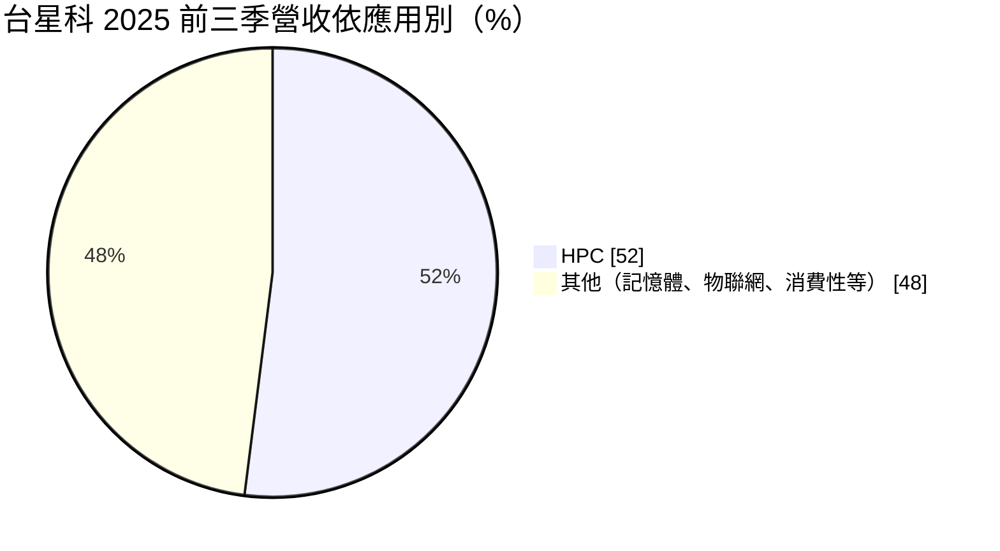
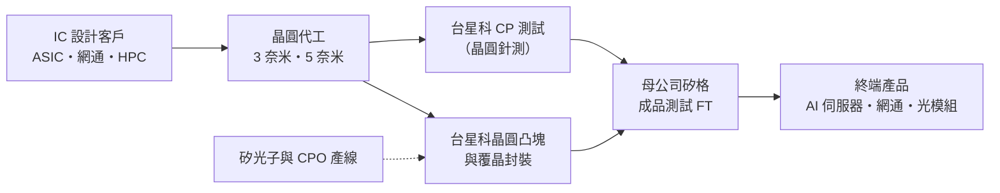
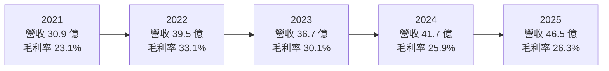
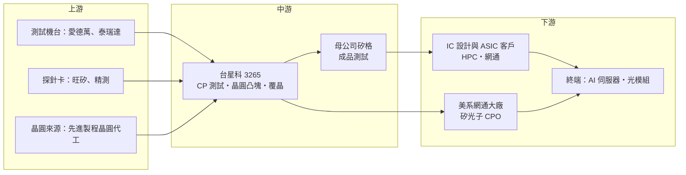

# 3265 台星科

> 上櫃｜[[產業索引-半導體業|半導體業]]｜上市（櫃）日期 2005/08/02

# 第一章：企業模式與商業藍圖

> [!info] 撰寫說明
> 本文由 Claude 依公開資料整理，架構比照 [[2330台積電]] 的四章研究，資料截至 2026-10-08。財務數字來源：Goodinfo 年度獲利指標、資產負債結構與股利政策頁、聚財網季度損益表、nstock 公司資料頁、富果研究 2025 年 11 月法說會整理、優分析、經濟日報、工商時報、財報狗；產業描述為整理性內容，尚未逐條比對原始文件。#待校對

在評估單一個股的長期投資價值時，首要步驟是拆解企業的底層獲利邏輯。本章針對台星科（股票代號：3265）的商業模式進行定性分析，說明它在半導體後段供應鏈中扮演什麼角色、為什麼它的命運與晶圓代工的先進製程綁在一起，以及它長期的成長要靠哪些業務推動。

## 一、核心定位：先進製程晶圓的「前段測試＋凸塊封裝」專業廠

台星科成立於 2000 年，2005 年掛牌，主要業務是晶圓測試、晶圓凸塊（[[Bumping]]）與覆晶、晶圓級封裝服務。公司的身世很能說明它的定位：它原本由新加坡封測大廠星科金朋（STATS ChipPAC）持股約 52%，2015 年星科金朋被出售給中國江蘇長電時，台星科因台灣對半導體資產轉讓給中資的限制，沒有一起轉手，後來在 2017 年由台灣測試廠 [[6257矽格]] 以每股約 23 元買下 52% 股權，成為矽格集團的一員。這段歷史讓台星科留在台灣的半導體生態系，也讓它和矽格形成上下游互補的分工。

在集團分工上，矽格以成品測試（[[FT]]）為主，台星科則專注在晶圓出廠後、切割之前的工序，包括晶圓針測（[[CP測試]]）以及在晶圓上長出凸塊、再做[[覆晶封裝]]。這個位置緊貼晶圓代工廠，晶圓代工推進到哪個製程節點，台星科就必須跟到哪個節點。依 2025 年 11 月法說會，公司已量產 3 奈米與 5 奈米的晶圓凸塊與覆晶封裝，2 奈米則進入客戶認證。越先進的製程，客戶越重視良率與交期的穩定，越不願意頻繁更換後段夥伴，這是台星科能跟上 AI 浪潮的根本原因。

另一個值得注意的特性是，台星科承接晶圓代工大廠外溢的 CP 測試委外訂單。晶圓代工廠在產能吃緊時，會把部分測試工作交給外部專業廠，這類訂單的毛利率通常高於台星科的平均水準，也讓它與晶圓代工龍頭的關係更緊密。

## 二、終端應用／產品板塊：HPC 已成主力

台星科沒有公開完整的產品別比重，但 2025 年 11 月法說會揭露了應用結構的關鍵轉變：2025 年前三季，[[HPC]]（高效能運算）應用占營收 52%，比 2024 年同期的 40% 提高 12 個百分點，記憶體與 [[IoT]] 的比重相對下降。

HPC 板塊包含 AI 伺服器、資料中心與網通設備所用的高階晶片，例如雲端業者自研的 ASIC 與高速網通晶片。這些晶片多採用最先進的製程，需要凸塊與 CP 測試，是台星科成長最快、毛利最好的業務。其他板塊則包括記憶體、物聯網與消費性晶片的測試與封裝，技術成熟、競爭者多，價格壓力較大，屬於提供基本稼動率的業務。

在新業務方面，台星科自 2024 年起小量生產[[矽光子]] IC 的封裝，主要客戶為美系網通大廠，並與客戶合作開發共同封裝光學（[[CPO]]）的相關製程。這條線對應 AI 資料中心從 400G、800G 走向 1.6T 光通訊的長期升級。

客戶結構方面，依優分析整理的年報資料，前四大客戶合計約占 66% 營收，其中代號 B 客戶的比重由 2024 年的約 17% 升到約 25%，成為第一大客戶。這代表客戶結構正在向少數 AI、HPC 大客戶集中，好處是訂單品質提升，風險則是對單一客戶的依賴加深。

## 三、資本轉化邏輯（營運模式）：資本密集的機台時間生意

測試與凸塊業務的本質，是把昂貴的測試機台與製程設備的「使用時間」賣給客戶。營收隨機台稼動率而起伏，最主要的成本是設備折舊，因此這是一門典型的資本密集、[[營運槓桿]]高的生意：稼動率高的時候，多出來的營收大部分直接變成利潤；稼動率低的時候，折舊照樣要攤提，毛利率會明顯下滑。台星科過去五年的毛利率在 23% 到 33% 之間擺盪，正是這種特性的反映。

為了承接先進製程與 AI 訂單，台星科在 2025 年進入明顯的擴產期。依法說會資料，2025 年前三季資本支出約 22.9 億元，其中約 16 億元用於購置廠房，第四季再規劃約 9.3 億元，用於晶圓級封裝與測試產能；依優分析報導，公司購入矽格聯測科技約 13,836 坪的廠房。此外，公司自主研發 Multi-Bin 分類機，用來降低測試成本並提高產能彈性，這是中型封測廠常見的「以自研設備提升效率」的做法。

## 四、企業長期藍圖：跟著製程節點與光通訊升級走

台星科的長期藍圖可以歸納為三個方向。第一是跟上每一個新的製程節點：3、5 奈米已量產，2 奈米在認證中，未來還有 A16 等更先進的節點，每一代都需要新的凸塊與測試能力，能否持續取得認證，決定它能否留在高階客戶的供應鏈裡。

第二是光通訊與 CPO。AI 資料中心內部的資料傳輸量快速增加，傳統的電訊號傳輸在耗電與距離上遇到瓶頸，產業正逐步導入矽光子與 CPO。台星科提早布局矽光子封裝，並建置新產線，目標是在這個新市場成形時取得先發位置。

第三是集團綜效。台星科與矽格的「CP 測試＋凸塊封裝＋成品測試」組合，讓客戶可以在同一集團內完成大部分後段流程，這種一站式服務在客戶追求供應鏈簡化時會越來越有價值。

# 第二章：護城河深度與競爭優勢

「護城河」指企業抵禦競爭、維持超額利潤的保護機制。本章分析台星科在封測產業中的護城河組成、主要競爭對手，以及它的優勢能否擋住大型封測廠與晶圓代工廠自身的擴產。

## 一、台星科護城河的核心組成要素

台星科的規模遠小於日月光、艾克爾等大廠，它的護城河屬於「窄而專」的類型，主要由三個要素組成。

第一是先進節點的驗證門檻。3 奈米、5 奈米的凸塊與 CP 測試需要長時間的製程驗證與客戶認證，認證過程中客戶要投入工程人力與試產成本。一旦通過，客戶在同一世代產品中很少更換供應商，因為換廠意味著重新驗證、承擔良率風險。這是台星科近年 HPC 比重快速提升的根本原因。

第二是集團的一條龍服務。與母公司矽格形成完整的後段服務鏈，客戶可以減少物流、管理與溝通成本，矽格也能把既有客戶的前段需求導向台星科，等於共享客戶資源。

第三是利基技術的提早布局。矽光子封裝已經量產，並與美系網通客戶合作 CPO。新技術的市場一開始規模不大，大型封測廠不一定優先投入，中型廠反而有機會先卡位，若市場成長起來，先累積的經驗會轉化為門檻。

## 二、全球主要競爭對手格局

| 對手 | 定位 | 對台星科的威脅 |
|---|---|---|
| [[3711日月光投控]] | 全球最大封測集團，凸塊、覆晶、先進封裝與測試全包 | 規模與客戶關係最強，可整包接單 |
| [[2449京元電子]] | 台灣最大專業測試廠，CP 與 FT 都做 | 在 AI 晶片測試直接競爭 |
| [[AMKR艾克爾]] | 美商封測大廠，有美國與東南亞產能 | 國際客戶的另一選擇，美國在地化有優勢 |
| [[6239力成]]、[[2441超豐]] | 記憶體與一般邏輯封測 | 在記憶體、成熟產品測試競爭 |
| [[6147頎邦]]、[[8150南茂]] | 凸塊與驅動 IC 封測 | 凸塊產能的同業 |
| [[2330台積電]] | 自建先進封裝與部分測試產能 | 晶圓代工廠內化後段，壓縮委外空間 |

## 三、優勢轉化：守得住／守不住／觀察重點

台星科守得住的，是已完成驗證的先進節點凸塊與 CP 測試訂單，以及晶圓代工大廠外溢的委外測試。這些訂單看重交期、良率與工程配合度，價格敏感度較低，而且會隨著 AI 晶片的世代更替持續產生新需求。

守不住的，是記憶體、物聯網與消費性產品的測試與封裝。這些產品同質性高，大廠與中國同業都能做，價格由市場決定。HPC 比重上升，一方面代表產品組合改善，另一方面也說明舊業務在相對萎縮。

長期觀察重點有三個：一是 2 奈米及之後節點能否順利通過認證；二是 CPO 與矽光子市場能否真正放量，以及台星科能否在大廠進入前站穩位置；三是客戶集中度。前四大客戶已占約三分之二營收，若任何一家大客戶轉單或改由晶圓代工廠內部處理，影響都會很明顯。

# 第三章：財務體質與盈利規模

資料日期：2026-10-08。數字取自 Goodinfo 年度財務資料、聚財網季度損益表與富果研究法說會整理，表格是撰寫當時的快照；最新月營收、毛利率、累計 EPS 由自動排程寫在本筆記的屬性欄位（月營收、毛利率、累計EPS 等）。#待校對

財務報表是檢驗護城河是否真實存在的最終標準。本章用五年的三率、ROE、現金流與資本報酬，檢視台星科的長期獲利品質。

## 一、獲利能力的基石：三率

| 年度 | 營收（新台幣） | [[毛利率]] | [[營業利益率]] | EPS（元） | [[ROE]] |
|---|---|---|---|---|---|
| 2021 | 30.9 億 | 23.1% | 15.6% | 2.89 | 8.2% |
| 2022 | 39.5 億 | 33.1% | 26.8% | 6.73 | 17.1% |
| 2023 | 36.7 億 | 30.1% | 23.2% | 6.16 | 14.2% |
| 2024 | 41.7 億 | 25.9% | 19.3% | 6.23 | 13.7% |
| 2025 | 46.5 億 | 26.3% | 19.8% | 5.48 | 11.7% |

從五年數字可以看出台星科的兩個特性。第一，營收長期成長，2021 到 2025 年的營收年複合成長率約 10.8%（推算），成長來源是 HPC 與先進製程訂單。第二，毛利率隨稼動率與折舊循環擺盪：2022 年產能吃緊、稼動率高，毛利率衝到 33.1%；之後新產能陸續加入、折舊增加，毛利率回落到 26% 左右。這說明營收成長不一定等於獲利率提升，擴產期的折舊會先壓低毛利率，等新產能填滿後才會回升。

[[淨利率]]方面，台星科的營收以美元計價為主，新台幣大幅升值時會產生匯兌損失。2025 年第二季新台幣急升，該季獲利大減，經濟日報報導單季獲利年減 57%，是匯率影響業外損益的典型案例。評估本業時應以營業利益為主。

## 二、[[ROE]]：資本效率

台星科近五年平均 ROE 約 13.0%（推算，依 Goodinfo 年度 ROE 平均），在封測業屬於中上水準。ROE 的高點在 2022 年的 17.1%，之後逐年下滑到 2025 年的 11.7%，主因是淨值持續累積、擴產期的折舊增加，而獲利沒有同步成長。台星科長期維持低負債，ROE 主要由營業利益率驅動，而不是靠財務槓桿放大，這代表報酬品質相對扎實。

## 三、資本支出與自由現金流

2025 年是台星科明顯的投資年。前三季資本支出約 22.9 億元，加上第四季規劃的約 9.3 億元，全年合計約 32 億元，接近當年營收的七成。依法說會資料，2025 年前三季營業現金流約 8.86 億元，[[自由現金流]]為負 4.35 億元，主因是一次性購置廠房。過去在非擴產年度，台星科的營業現金流足以支應設備投資並配發高比例股利；大規模購置廠房屬於結構性的投入，需要觀察新產能在 2026 至 2027 年能否填滿，讓自由現金流轉正。

股利方面，依 Goodinfo，2021 至 2025 年度的現金股利分別為 2.3、5.0、4.8、4.6、4.1 元，2025 年度以 EPS 5.48 元計算配息率約 75%（推算）。在擴產期仍維持七成以上的配息，顯示公司重視股東回饋，但若資本支出持續擴大，配息率可能需要下修。

## 四、[[ROIC]] 與 [[WACC]]：價值創造利差

**ROIC 推算：** 以 2025 年為例，營業利益約 9.21 億元（46.5 億 × 19.8%），扣除 20% 稅率後的稅後營業利益約 7.37 億元。投入資本方面，股東權益約 63.6 億元（每股淨值 46.69 元 × 約 1.363 億股），有息負債以 Goodinfo 資產結構中長期負債占總資產 14.5% 估算約 13.3 億元（總資產約 91.9 億元），投入資本合計約 76.9 億元，ROIC 約 9.6%（推算）。同樣方法推算 2024 年約 10.0%、2022 年約 14.5%。

**WACC 推算：** 股東權益成本用 CAPM 估計，假設台灣 10 年期公債殖利率 1.75%、市場風險溢酬 6%、β 取封測同業常見值 1.2，得到股東權益成本約 8.95%。負債成本假設 2.5%，稅後約 2.0%。資本結構以權益約 83%、負債約 17% 計算，WACC 約 7.8%（推算）。

**結論：** 台星科的 ROIC 約 9.6% 至 10%，高於約 7.8% 的 WACC，利差約 2 個百分點，代表公司仍在創造經濟價值，但利差已比 2022 年的高峰縮小許多。未來利差能否擴大，取決於 2025 年大舉投入的廠房與設備能否帶來足夠的高毛利訂單；若新產能長期閒置，ROIC 會被拉低到接近資金成本。

# 第四章：總體風險與地緣政治

任何企業都無法脫離宏觀環境獨立存在。本章分析台星科長期必須面對的地緣政治、產業週期、營運與技術風險。

## 一、地緣政治

台星科的產能主要在台灣，和其他台灣半導體廠一樣面臨兩岸風險。國際客戶若要求「台灣加一」的後段產能，台星科的規模較小，難以像日月光、艾克爾一樣在海外設廠分散風險，這在地緣政治升溫時可能成為接單劣勢。

美國推動晶片在地製造，未來若要求先進封裝與測試也必須在美國完成，對以台灣為主要基地的中型封測廠較不利。不過，台灣在先進製程的領先地位短期內難以被取代，只要先進晶圓主要在台灣生產，緊鄰晶圓廠的凸塊與 CP 測試仍有地理上的效率優勢。

## 二、產業週期與市場結構

封測業處於半導體供應鏈的後段，客戶的庫存調整會被[[長鞭效應]]放大，反映在測試與凸塊訂單上。台星科 HPC 已占營收過半，AI 伺服器的資本支出若在某個階段放緩，稼動率會首當其衝。匯率也是長期因素，營收以美元計價為主，新台幣升值時，以台幣計算的營收與毛利都會被壓縮，並產生帳上的匯兌損失。

## 三、營運環境的隱性風險

客戶集中是最需要留意的風險。前四大客戶約占三分之二營收，第一大客戶約占四分之一，大客戶的產品世代交替或轉單，都可能造成營收明顯波動。其次是折舊壓力，2025 年的大筆投資會在未來數年轉為折舊，若新業務延後量產，毛利率會被壓縮。最後，矽格持股過半，集團內的訂單分配與關係人交易，也是少數股東需要關注的治理議題。

## 四、科技演進

最大的長期技術風險是晶圓代工廠內化後段製程。[[2330台積電]] 持續擴充[[先進封裝]]與部分測試產能，若更多後段流程在晶圓廠內部完成，委外的空間會縮小。另一個風險是新技術路線的不確定，CPO 與矽光子的技術標準仍在演進，若主流方案改變或量產時程延後，台星科前期投入的產線可能無法如期回收。

# 專有名詞解析

## 半導體

- **[[Bumping]]**：晶圓凸塊，在晶圓上長出微小的金屬凸點，讓晶片能以覆晶方式直接焊接到載板上。
- **[[覆晶封裝]]**：把晶片翻面、以凸塊直接連接載板的封裝方式，比傳統打線封裝的訊號路徑短、效能較好。
- **[[CP測試]]**：晶圓針測，在晶圓切割前用探針逐顆測試晶粒功能，先篩掉壞品，避免浪費後續封裝成本。
- **[[FT]]**：成品測試，晶片封裝完成後的最終功能與可靠度測試，母公司矽格以此為主要業務。
- **[[CPO]]**：共同封裝光學，把光學收發元件和交換器晶片封裝在一起，縮短電訊號路徑、降低 AI 資料中心耗電。
- **[[矽光子]]**：在矽晶片上製作光學元件，以光取代電傳輸資料，可降低 AI 資料中心的傳輸耗電。
- **[[先進封裝]]**：把多顆晶片以中介層、混合鍵合等方式高密度整合的封裝技術，例如 CoWoS、SoIC。

## 應用

- **[[HPC]]**：高效能運算，泛指 AI 伺服器、資料中心與超級電腦所用的高階運算晶片。
- **[[IoT]]**：物聯網，讓家電、感測器等裝置連網互通的應用，晶片多屬成熟製程。

## 金融

- **[[自由現金流]]**：營業活動現金流減去資本支出，代表企業可自由用於配息、還債或併購的現金。
- **[[ROIC]]**：投入資本報酬率，稅後營業利益除以股東權益加有息負債，衡量本業運用資本的效率。
- **[[WACC]]**：加權平均資金成本，股東與債權人要求報酬的加權平均，ROIC 高於它才代表創造價值。

## 產業

- **[[營運槓桿]]**：固定成本占比高的公司，營收小幅變動就會造成利潤大幅變動，封測與晶圓廠都屬此類。
- **[[長鞭效應]]**：終端需求的小幅變動，沿供應鏈往上游傳遞時被逐級放大，造成上游庫存與訂單劇烈波動。

# 核心供應鏈

## 1. 上游：設備、耗材與晶圓來源
- 測試設備：愛德萬（Advantest）、泰瑞達（Teradyne）
- 探針卡：[[6223旺矽]]、[[6510精測]]
- 晶圓來源（先進製程）：[[2330台積電]]

## 2. 中游：台星科與集團夥伴
- 母公司、成品測試：[[6257矽格]]
- 同業：[[3711日月光投控]]、[[2449京元電子]]、[[AMKR艾克爾]]、[[6147頎邦]]、[[6239力成]]

## 3. 下游：主要客戶類型
- AI、HPC 與網通晶片設計公司（前四大客戶約占 66%，公司未公開名稱）
- 矽光子與 CPO：美系網通大廠（公司未公開名稱）

## 4. 終端應用
- AI 伺服器與資料中心：[[NVDA輝達]] 相關平台
- 800G／1.6T 光通訊模組

延伸閱讀：[[台積電供應鏈]]

## 最新新聞
<!-- news:start（自動產生，請勿手動編輯此範圍） -->
- 2026-10-07 📰 媒體 12:00｜台星科(3265) 資本支出飆至134億！N2完成認證、AI測試擴產，2027年迎來收成！｜[鉅亨網](https://news.cnyes.com/news/id/6623542)

完整紀錄：[[3265台星科 新聞]]
<!-- news:end -->

## 相關連結
- [公開資訊觀測站](https://mopsov.twse.com.tw/mops/web/t05st03?step=1&firstin=1&co_id=3265)
- [Goodinfo](https://goodinfo.tw/tw/StockDetail.asp?STOCK_ID=3265)
- [Yahoo 股市](https://tw.stock.yahoo.com/quote/3265)
- [鉅亨網新聞](https://www.cnyes.com/twstock/3265/news)
