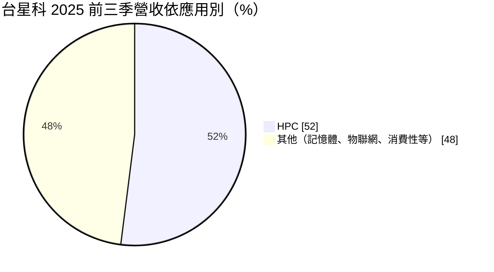
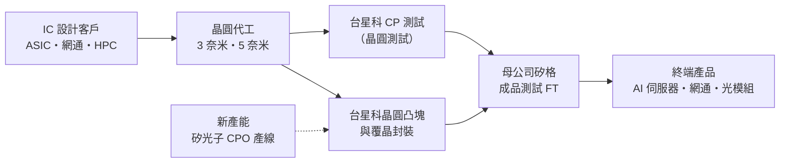
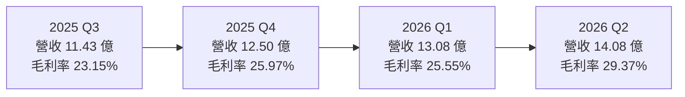
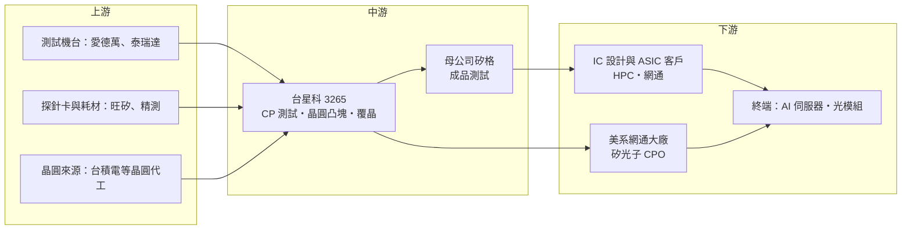

# 3265 台星科

> 上櫃｜[[產業索引-半導體業|半導體業]]｜上市（櫃）日期 2005/08/02

# 第一章：企業模式與商業藍圖

> [!info] 撰寫說明
> 本文由 Claude 依公開資料整理，架構比照 [[2330台積電]] 的四章研究，資料截至 2026-10-07。財務數字來源：聚財網（stock.wearn.com）季度損益表、nstock 公司資料頁、富果研究 2025 年 11 月法說會整理、優分析、經濟日報、工商時報、財報狗；產業描述為整理性內容，尚未逐條比對原始文件。#待校對

在評估單一個股的長期投資價值時，首要步驟是拆解企業的底層獲利邏輯。本章針對台星科（股票代號：3265）的商業模式進行定性分析，說明它在半導體後段供應鏈中扮演什麼角色、為何近年能搭上 AI 與 [[HPC]] 的需求，以及它的成長要靠哪些新業務推動。

## 一、核心定位：先進製程晶圓的「前段測試＋凸塊封裝」專業廠

台星科成立於 2000 年，2005 年掛牌，主要業務是積體電路測試、晶圓凸塊（[[Bumping]]）與晶圓級封裝服務。公司原本由新加坡星科金朋（STATS ChipPAC）持股 52%，2015 年星科金朋被出售給中國江蘇長電時，台星科因台灣法規限制未一併轉讓；2017 年由 [[6257矽格]] 以每股約 23 元買下 52% 股權，成為矽格集團成員。依 nstock 資料，目前矽格持股約 51.9%。

在集團分工上，矽格以成品測試（[[FT]]，後段）為主，台星科則專注在前段的晶圓測試（[[CP測試]]）與凸塊、覆晶封裝。兩者互補，矽格可以把既有客戶的前段測試與封裝需求導向台星科。這個定位帶來兩個商業意義：

* **貼近晶圓代工的先進製程：** 凸塊與 CP 測試緊接在晶圓出廠之後，台星科已量產 3 奈米與 5 奈米的晶圓凸塊與[[覆晶封裝]]，2 奈米進入客戶認證，預計 2026 年導入。越先進的製程，客戶越不願意頻繁更換後段夥伴。
* **承接代工大廠外溢的測試訂單：** 依優分析整理，台星科承接晶圓代工大廠釋出的 CP 測試委外訂單，這類訂單的毛利率明顯高於公司平均。

## 二、終端應用板塊：HPC 已過半

台星科沒有公開完整的產品別比重，但 2025 年 11 月法說會揭露了應用別結構的關鍵變化：2025 年前三季 HPC 應用占營收 52%，較 2024 年同期的 40% 提升 12 個百分點，記憶體與 [[IoT]] 的相對比重下降。

* **HPC：** 包含 AI 伺服器、資料中心與網通設備用的高階晶片，主要需求來自先進製程的 ASIC 與網通晶片。這是台星科成長最快、毛利最好的板塊。
* **矽光子與光通訊：** 2024 年小量生產矽光子 IC 封裝，2025 年送樣，客戶以美系網通大廠為主，對應 800G 與 1.6T 光通訊升級。
* **其他：** 記憶體、物聯網、消費性晶片的測試與封裝，屬於成熟、競爭較激烈的業務。

客戶集中度方面，依優分析整理的年報資料，前四大客戶合計約占 66% 營收，其中代號 B 客戶由 2024 年的 17.13% 升到 24.82%，成為第一大客戶，代號 E 客戶占 17.72% 退居第二，顯示客戶結構正轉向 AI 與 HPC 高階訂單。

## 三、資本轉化邏輯（營運模式）：資本密集的設備租時生意

* **收入來自機台時間與良率：** 測試與凸塊業務的本質是「把昂貴的測試機台與製程設備租給客戶使用」，收入隨機台稼動率而變動，折舊是最主要的成本。稼動率提升時，營業利益率擴張很快。
* **大量資本支出換取先進節點門票：** 2025 年前三季資本支出 22.9 億元，其中約 16 億元用於購置廠房，第四季再投入約 9.3 億元（晶圓級封裝 0.9 億元、測試產能 8.4 億元）。依優分析報導，台星科購入矽格聯測科技約 13,836 坪的廠房，用來承接外溢訂單。
* **自研設備：** 公司自主研發 Multi-Bin 分類機，可降低測試成本並提高產能彈性。

## 四、企業長期藍圖：2 奈米、CPO 與矽光子

* **跟上製程節點：** 3、5 奈米已量產，2 奈米在認證中。能否在 2026 至 2027 年取得 2 奈米凸塊與測試訂單，是維持高階客戶的關鍵。
* **[[CPO]] 與[[矽光子]]：** 新產能設備已陸續進駐，目標 2026 年完成產線建置與認證，CPO 產品預計 2026 年下半年起量產。這對應輝達下一代平台導入矽光子與共同封裝光學的趨勢。
* **持續擴充測試產能：** 工商時報 2026 年 4 月報導，第一季資本支出預算已用掉大部分，公司將檢討上調全年資本支出，以支應 HPC、AI 伺服器與矽光子需求。

# 第二章：護城河深度與競爭優勢

「護城河」指企業抵禦競爭、維持超額利潤的保護機制。本章分析台星科在封測產業中的護城河組成、主要競爭對手，以及它的優勢能否擋住大型封測廠與晶圓代工廠自身的擴產。

## 一、台星科護城河的核心組成要素

台星科規模遠小於日月光等大廠，護城河屬於「窄而專」的類型，主要由三個要素組成：

* **1. 先進節點的驗證門檻：** 3 奈米、5 奈米凸塊與 CP 測試需要長時間的製程驗證與客戶認證，一旦通過，客戶在同一世代產品中很少更換供應商。這是台星科近年 HPC 比重快速提升的根本原因。
* **2. 集團綜效與一條龍服務：** 與母公司矽格形成「CP 測試＋凸塊封裝＋成品測試」的完整後段服務，客戶可以在同一集團內完成大部分後段流程，減少物流與管理成本。
* **3. 利基技術布局：** 矽光子封裝已小量量產，並與美系網通客戶合作 CPO。這類新技術市場還小，大廠不一定優先投入，給了中型廠卡位機會。

## 二、全球主要競爭對手格局

| 對手 | 定位 | 對台星科的威脅 |
|---|---|---|
| [[3711日月光投控]] | 全球最大封測集團，凸塊、覆晶、先進封裝與測試全包 | 規模與客戶關係最強，可整包接單 |
| [[2449京元電子]] | 台灣最大專業測試廠，CP 與 FT 都做 | 在 AI 晶片測試直接競爭 |
| [[AMKR艾克爾]] | 美商封測大廠，有美國與東南亞產能 | 國際客戶的另一選擇 |
| [[6239力成]]、[[2441超豐]] | 記憶體與一般邏輯封測 | 在記憶體、成熟產品測試競爭 |
| [[6147頎邦]]、[[8150南茂]] | 凸塊與驅動 IC 封測 | 凸塊產能的同業 |
| [[2330台積電]] | 自建先進封裝與部分測試產能 | 晶圓代工廠內化後段，壓縮委外空間 |

## 三、優勢轉化：守得住／守不住／觀察重點

* **守得住：** 已完成驗證的 3、5 奈米凸塊與 CP 測試訂單，以及晶圓代工大廠外溢的委外測試。這些訂單看重交期與良率，價格敏感度較低。
* **守不住：** 記憶體、物聯網與消費性產品的測試與封裝，這些產品同質性高，大廠和中國同業都能做，價格壓力大。HPC 比重上升，同時也代表這些舊業務正在相對萎縮。
* **觀察重點：** 2 奈米能否如期在 2026 年導入；CPO 新產線能否在 2026 年下半年如期量產；前兩大客戶的集中度是否持續升高（前四大已約 66%），若單一客戶轉單，影響會很明顯。

# 第三章：財務體質與盈利規模

資料日期：2026-10-07。數字取自聚財網季度損益表、nstock 公司資料頁與富果研究法說會整理，表格是撰寫當時的快照；最新月營收、毛利率、累計 EPS 由自動排程寫在本筆記的屬性欄位（月營收、毛利率、累計EPS 等）。#待校對

財務報表是檢驗護城河是否真實存在的最終標準。本章用三率、ROE、現金流與資本報酬，檢視台星科在 AI 需求帶動下的獲利品質。

## 一、獲利能力的基石：三率

| 期間 | 營收（新台幣） | [[毛利率]] | [[營業利益率]] | EPS（元） |
|---|---|---|---|---|
| 2025 全年 | 46.48 億 | 約 26.3%（依季度推算） | 約 19.8%（依季度推算） | 5.48 |
| 2025 Q1 | 10.84 億 | 28.75% | 21.81% | 1.54 |
| 2025 Q2 | 11.71 億 | 27.38% | 21.39% | 0.66 |
| 2025 Q3 | 11.43 億 | 23.15% | 16.84% | 1.53 |
| 2025 Q4 | 12.50 億 | 25.97% | 19.26% | 1.75 |
| 2026 Q1 | 13.08 億 | 25.55% | 19.64% | 1.76 |
| 2026 Q2 | 14.08 億 | 29.37% | 24.01% | 2.09 |

* **[[毛利率]]：** 封測業的毛利率由稼動率與產品組合決定。2026 年第二季毛利率 29.37%，是近八季最高，反映 HPC 與 CP 測試等高毛利訂單比重提升。2025 年第三季的 23.15% 則是低點，當時新產能折舊開始認列、稼動率尚未跟上。
* **[[營業利益率]]：** 費用相對固定，營收成長時營業利益率擴張比毛利率快，2026 年第二季達 24.01%。
* **[[淨利率]]與匯率：** 2025 年第二季稅後淨利率只有 7.69%、EPS 0.66 元，主因新台幣大幅升值造成匯損（經濟日報稱該季獲利大減 57%）。台星科營收以美元計價為主，匯率波動會直接影響業外損益。
* **營收動能：** 2026 年 1 至 9 月累計營收 39.38 億元，年增 15.93%；9 月營收 4 億元，年增 11.47%。上半年累計 EPS 3.85 元。

## 二、[[ROE]]：資本效率

依 nstock 資料，2026 年第二季單季 ROE 為 4.62%、ROA 為 2.79%，換算年化約 18%（推估）。台星科資本額約 13.63 億元，規模不大，ROE 主要由稼動率決定。2025 年前三季 EPS 3.73 元低於前一年同期的 4.68 元，ROE 下滑；2026 年營收與毛利率同步回升，資本效率改善。

## 三、資本支出與自由現金流

* **[[CapEx]]：** 2025 年前三季資本支出 22.9 億元（約 16 億元購置廠房），第四季預計再投入 9.3 億元，全年合計約 32 億元，接近當年營收的七成，屬於明顯的擴產期。2026 年第一季預算已大致用罄，公司表示會檢討上調。
* **[[自由現金流]]：** 2025 年前三季營業現金流 8.86 億元、自由現金流為負 4.35 億元，EBITDA 為 11.64 億元。大筆購置廠房使自由現金流轉負，需觀察新產能填滿後現金流能否轉正。
* **股利：** 2025 年度現金股利 4.6 元，以 EPS 5.48 元計算配發率約 84%；近五年平均現金股利約 4.16 元。在擴產期仍維持高配發，代表公司財務體質尚可，但也要留意資本支出若持續擴大，配息率可能下修。

## 四、[[ROIC]] 與 [[WACC]]：價值創造利差

封測業的 ROIC 高度取決於「新產能能多快填滿」。台星科 2025 年大量購置廠房，投入資本大幅增加，短期 ROIC 被稀釋（推估，具體數值未查得）。若 2 奈米與 CPO 新業務在 2026 年下半年至 2027 年順利放量，新增資本能帶來高於資金成本的報酬，利差才會重新擴大。反之若稼動率不足，廠房折舊會拖累報酬率。

# 第四章：總體風險與地緣政治

任何企業都無法脫離宏觀環境獨立存在。本章分析台星科必須面對的地緣政治、產業週期、營運與技術風險。

## 一、地緣政治風險

* **產能集中在台灣：** 台星科的產能主要在台灣，與其他台灣半導體廠一樣面臨兩岸風險。國際客戶若要求「台灣加一」的後段產能，台星科規模較小，難以像大廠一樣在海外設廠分散。
* **美國關稅與在地製造：** 美國推動晶片在地化，若先進封裝與測試需在美國完成，對以台灣為主要基地的中型封測廠較不利。
* **歷史上的股權限制：** 2015 年的案例顯示，台灣法規會限制半導體資產轉讓給中國企業，這反而讓台星科留在台灣集團體系內。

## 二、產業週期與市場結構

* **AI 需求的集中與波動：** HPC 已占營收過半，AI 伺服器的資本支出若放緩，會直接影響稼動率。
* **[[長鞭效應]]：** 封測位於晶圓製造之後，客戶的庫存調整會放大反映在測試與凸塊訂單上。
* **匯率：** 2025 年第二季的匯損案例說明，新台幣升值會明顯侵蝕獲利。

## 三、營運環境的隱性風險

* **客戶集中：** 前四大客戶約占 66%，第一大客戶約占 25%，訂單轉移或客戶產品世代交替都會造成營收波動。
* **折舊壓力：** 大筆廠房與設備投資在未來數年轉為折舊，若新業務延後量產，毛利率會被壓縮。
* **母公司關係：** 矽格持股過半，集團內訂單分配與關係人交易需留意少數股東權益。

## 四、科技演進風險

* **晶圓廠內化後段：** [[2330台積電]] 持續擴充[[先進封裝]]與部分測試產能，若更多後段流程在晶圓廠內完成，委外的空間會縮小。
* **新技術路線不確定：** CPO 與矽光子的技術標準仍在演進，若主流方案改變或量產時程延後，台星科前期投入的新產線可能無法如期回收。
* **製程節點競賽：** 每一個新世代（2 奈米、A16 等）都需要新的凸塊與測試能力，若某一世代認證失敗，可能失去關鍵客戶。

# 專有名詞解析

## 半導體

- **[[Bumping]]**：晶圓凸塊，在晶圓上長出微小的金屬凸點，讓晶片能以覆晶方式直接焊接到載板上。
- **[[覆晶封裝]]**：把晶片翻面、以凸塊直接連接載板的封裝方式，比傳統打線封裝的訊號路徑短、效能較好。
- **[[CP測試]]**：晶圓針測，在晶圓切割前用探針逐顆測試晶粒功能，先篩掉壞品，避免浪費後續封裝成本。
- **[[FT]]**：成品測試，晶片封裝完成後的最終功能與可靠度測試，母公司矽格以此為主要業務。
- **[[CPO]]**：共同封裝光學，把光學收發元件和交換器晶片封裝在一起，縮短電訊號路徑、降低 AI 資料中心耗電。
- **[[矽光子]]**：在矽晶片上製作光學元件，以光取代電傳輸資料，可降低 AI 資料中心的傳輸耗電。
- **[[先進封裝]]**：把多顆晶片以中介層、混合鍵合等方式高密度整合的封裝技術，例如 CoWoS、SoIC。

## 應用

- **[[HPC]]**：高效能運算，泛指 AI 伺服器、資料中心與超級電腦所用的高階運算晶片。
- **[[IoT]]**：物聯網，讓家電、感測器等裝置連網互通的應用，晶片多屬成熟製程。

## 金融

- **[[CapEx]]**：資本支出，企業購置廠房與設備的支出，封測業屬資本密集產業。
- **[[自由現金流]]**：營業活動現金流減去資本支出，代表企業可自由用於配息、還債或併購的現金。
- **[[ROE]]**：股東權益報酬率，稅後淨利除以股東權益，衡量公司運用股東資金的獲利能力。

## 產業

- **[[長鞭效應]]**：終端需求的小幅變動，沿供應鏈往上游傳遞時被逐級放大，造成上游庫存與訂單劇烈波動。

# 核心供應鏈

## 1. 上游：設備、耗材與晶圓來源
- 測試設備：愛德萬（Advantest）、泰瑞達（Teradyne）
- 探針卡：[[6223旺矽]]、[[6510精測]]
- 晶圓來源（先進製程）：[[2330台積電]]

## 2. 中游：台星科與集團夥伴
- 母公司、成品測試：[[6257矽格]]
- 同業：[[3711日月光投控]]、[[2449京元電子]]、[[AMKR艾克爾]]、[[6147頎邦]]、[[6239力成]]

## 3. 下游：主要客戶類型
- AI、HPC 與網通晶片設計公司（前四大客戶約占 66%，公司未公開名稱）
- 矽光子與 CPO：美系網通大廠（公司未公開名稱）

## 4. 終端應用
- AI 伺服器與資料中心：[[NVDA輝達]] 相關平台
- 800G／1.6T 光通訊模組

延伸閱讀：[[台積電供應鏈]]

## 最新新聞
<!-- news:start（自動產生，請勿手動編輯此範圍） -->
- 2026-10-07 📰 媒體 12:00｜台星科(3265) 資本支出飆至134億！N2完成認證、AI測試擴產，2027年迎來收成！｜[鉅亨網](https://news.cnyes.com/news/id/6623542)

完整紀錄：[[3265台星科 新聞]]
<!-- news:end -->

## 相關連結
- [公開資訊觀測站](https://mopsov.twse.com.tw/mops/web/t05st03?step=1&firstin=1&co_id=3265)
- [Goodinfo](https://goodinfo.tw/tw/StockDetail.asp?STOCK_ID=3265)
- [Yahoo 股市](https://tw.stock.yahoo.com/quote/3265)
- [鉅亨網新聞](https://www.cnyes.com/twstock/3265/news)
