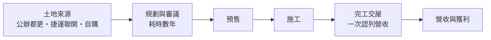
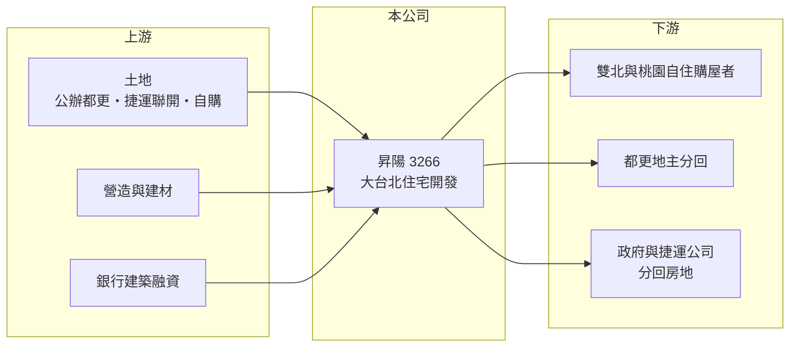

# 3266 昇陽

> 上市｜[[產業索引-建材營造業|建材營造業]]｜上市（櫃）日期 2014/12/24

# 第一章：企業模式與商業藍圖

> [!info] 撰寫說明
> 本文由 Claude 依公開資料整理，架構比照 [[2330台積電]] 的四章研究，資料截至 2026-10-08。財務數字來源：Goodinfo 年度經營績效頁、窮人股（poorstock）法說會與財報整理頁；產業描述為整理性內容，尚未逐條比對原始文件。#待校對

在評估單一個股的長期投資價值時，首要步驟是拆解企業的底層獲利邏輯。本章說明昇陽建設（股票代號：3266，以下簡稱昇陽）如何以大台北為重心，透過[[都更]]與[[捷運聯開]]等公私合作案累積長期案源。

## 一、核心定位：大台北精緻住宅開發商

昇陽成立於 1993 年，2014 年上市，實收資本額約 35.2 億元，董事長為麥寬成。公司的策略主軸是「以大台北地區為重心、精緻好宅」，推案範圍涵蓋台北市、新北市與桃園市，代表案包括「昇陽麗鉑」「昇陽承光」「昇陽國際 ONE 360」等。

昇陽的特色是大量參與公私合作開發：施工中的有重慶北路案、三峽捷運聯開案、士東路案與永吉路案，規劃中的有板橋公館段案、中山民安公辦都更案與光明戲院案（總銷約 96 億元）。在雙北建地稀缺的環境下，都更與捷運聯開是少數能穩定取得大面積基地的管道。

## 二、資本轉化邏輯：長週期案源

公私合作案的好處是土地取得成本相對可控、案源規模大；代價是審議與施工期很長，多筆大型預售案預計在 2027 至 2033 年間陸續完工。這代表昇陽的營收在未來幾年可能維持低檔，等大案完工後才集中認列。

## 三、長期方向

昇陽的長期價值取決於大型儲備案能否如期完工交屋。多個完工案取得智慧建築與綠建築標章，顯示公司以產品品質作為差異化。經營層持續累積都更與聯開案源，屬於「先布局、後收成」的經營風格。

# 第二章：護城河深度與競爭優勢

「護城河」指企業抵禦競爭、維持超額利潤的保護機制。本章分析昇陽在大台北住宅市場的優勢與限制。

## 一、相對優勢

昇陽的優勢在於公私合作案的經驗與案源。公辦都更與捷運聯開需要與政府、捷運公司及大量地主協調，流程複雜，有實績的建商較容易再取得同類案件。其次是大台北區位，雙北人口與就業集中，長期自住需求穩定。

## 二、主要競爭對手

| 對手 | 定位 | 對昇陽的威脅 |
|---|---|---|
| [[2520冠德]] | 雙北住宅與捷運聯開 | 爭取同類公私合作案 |
| [[2548華固]] | 雙北高端住宅與都更 | 在精華區住宅競爭 |
| [[5534長虹]] | 雙北中高價住宅 | 爭取換屋客群 |

## 三、守得住／守不住／觀察重點

守得住的是已取得的長期案源；守不住的是時程與財務壓力，案件越多、完工越晚，資本占用越久。長期觀察重點是儲備案的完工時程、銷售率，以及負債比與利息保障倍數是否回到健康水準。

# 第三章：財務體質與盈利規模

資料日期：2026-10-08。數字取自 Goodinfo 年度經營績效與窮人股整理頁，表格是撰寫當時的快照；最新月營收、毛利率、累計 EPS 由自動排程寫在本筆記的屬性欄位（月營收、毛利率、累計EPS 等）。#待校對

財務報表是檢驗護城河是否真實存在的最終標準。本章用五年的三率、ROE 與資本報酬檢視昇陽的獲利品質。

## 一、多年度經營績效

| 年度 | 營收（新台幣） | [[毛利率]] | [[營業利益率]] | EPS（元） | [[ROE]] |
|---|---|---|---|---|---|
| 2021 | 10.2 億 | 23.6% | 2.64% | 0.25 | 0.73% |
| 2022 | 29.1 億 | 19.6% | 6.40% | 0.57 | 2.75% |
| 2023 | 42.4 億 | 29.2% | 17.6% | 1.94 | 10.9% |
| 2024 | 46.8 億 | 31.4% | 19.7% | 1.93 | 11.0% |
| 2025 | 14.3 億 | 32.2% | 12.8% | 0.58 | 3.25% |

2021 至 2025 年平均 ROE 約 5.7%（推算），營收年複合成長率約 8.8%（推算），但 2023 至 2024 年是交屋高峰，2025 年營收即回落到 14.3 億元。毛利率近三年穩定在 29% 至 32%，代表產品定價能力不差，主要問題在營收規模不連續。股利方面，2024 年度每股 0.75 元、2025 年度 0.5 元，Goodinfo 統計歷年平均現金股利約 0.45 元。

## 二、營建業指標

規劃中與施工中的大型案包括永吉路案（約 70 億元）與光明戲院案（約 96 億元）等，多數預計 2027 年以後完工。財務指標方面，負債比由 2024 年的 48.6% 升至 2026 年第二季的 61.1%，利息保障倍數由 9.63 倍降到 0.86 倍，顯示在建案增加、交屋減少的階段，財務壓力明顯上升。

## 三、[[ROIC]] 與 [[WACC]]：價值創造利差

**ROIC 推算：** 2025 年營業利益約 1.8 億元（14.3 億 × 12.8%），稅後約 1.5 億元。股東權益約 63.5 億元（每股淨值 18.04 元 × 約 3.52 億股），依 ROA 推算負債約 62 億元，假設其中四分之三為有息負債約 47 億元（推估），投入資本約 110 億元，ROIC 約 1.3%（推算）；以 2021 至 2025 年平均營業利益約 4.1 億元計算，ROIC 約 3%（推算）。

**WACC 推算：** 台灣 10 年期公債 1.75%、市場風險溢酬 6%、β 取營建同業常見值 0.9，股東權益成本約 7.2%；負債成本 3%、稅後 2.4%；權益占投入資本約 57%，WACC 約 5.1%（推算）。

**結論：** 過去五年昇陽 ROIC 平均低於 WACC，代表資本長期壓在尚未完工的案子上，還沒有轉化成足夠的報酬。若 2027 年後大型案如期交屋並維持 30% 左右毛利率，ROIC 有機會回到資金成本之上。

# 第四章：總體風險與地緣政治

任何企業都無法脫離宏觀環境獨立存在。本章分析昇陽長期必須面對的風險。

## 一、房市週期與政策

央行[[信用管制]]、限貸與豪宅稅等政策直接影響雙北中高價住宅的買氣。房地產景氣循環長，昇陽大量案件集中在 2027 至 2033 年完工，交屋時若剛好遇到景氣低點，去化與獲利都會受影響。

## 二、財務壓力

在建案多、交屋少的階段，負債比上升、利息保障倍數跌破 1 倍，代表本業獲利暫時不足以支應利息。若利率上升或建案延期，財務壓力會進一步擴大。

## 三、工期與營建成本

缺工、產能排擠、土方問題與建材上漲都可能拉長工期、推高成本。公辦都更與捷運聯開涉及政府程序，時程變數也比一般自地自建案大。

# 專有名詞解析

## 金融

- **[[信用管制]]**：央行限制購屋與建商貸款成數的政策，會影響房市成交與建商資金。
- **[[ROIC]]**：投入資本報酬率，稅後營業利益除以股東權益加有息負債，衡量本業運用資本的效率。
- **[[WACC]]**：加權平均資金成本，股東與債權人要求報酬率的加權平均，是 ROIC 要超越的門檻。

## 產業

- **[[都更]]**：都市更新，由地主與建商合作把老舊建物改建，地主依權利價值分回房地或收益。
- **[[捷運聯開]]**：捷運聯合開發，由政府提供捷運站周邊土地與建商合作開發，雙方分配完成後的房地。
- **[[建案交屋]]**：建商在房屋完工並交付買方時才認列營收，因此營建公司的營收常集中在交屋年度。

# 核心供應鏈

## 1. 上游：土地、營造與資金
- 土地：台北市與新北市公辦都更、捷運聯開、自購土地
- 建材：[[1101台泥]]、[[2002中鋼]] 等；營造廠
- 資金：銀行建築融資

## 2. 中游：昇陽與同業
- 同業：[[2520冠德]]、[[2548華固]]、[[5534長虹]]

## 3. 下游：客戶
- 雙北與桃園自住購屋者、都更地主、政府聯開單位

## 最新新聞
<!-- news:start -->
<!-- news:end -->

## 相關連結
- [公開資訊觀測站](https://mopsov.twse.com.tw/mops/web/t05st03?step=1&firstin=1&co_id=3266)
- [Goodinfo](https://goodinfo.tw/tw/StockDetail.asp?STOCK_ID=3266)
- [Yahoo 股市](https://tw.stock.yahoo.com/quote/3266)
- [鉅亨網新聞](https://www.cnyes.com/twstock/3266/news)
