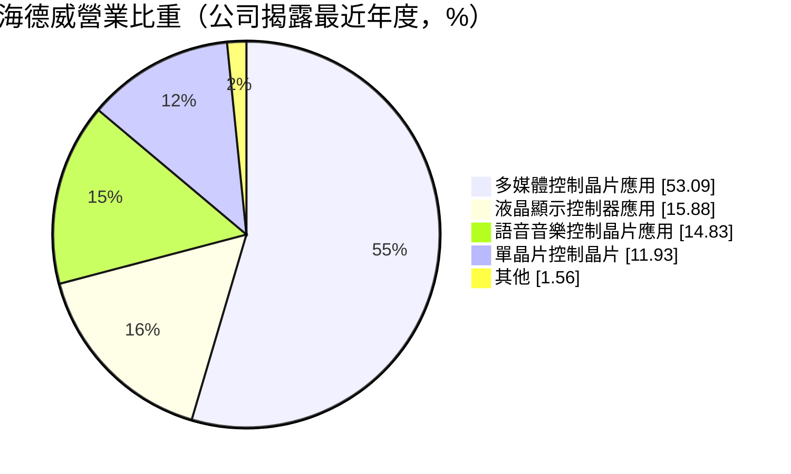
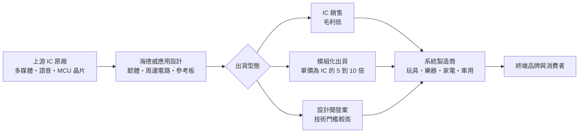
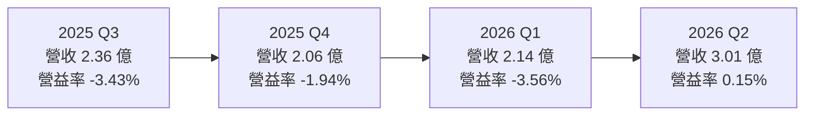
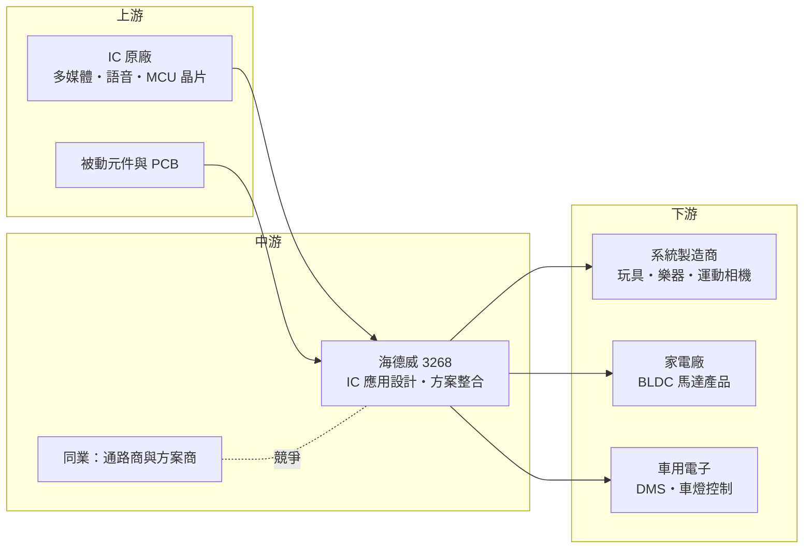

# 3268 海德威

> 上櫃｜[[產業索引-半導體業|半導體業]]｜上市（櫃）日期 2005/01/27

# 第一章：企業模式與商業藍圖

> [!info] 撰寫說明
> 本文由 Claude 依公開資料整理，架構比照 [[2330台積電]] 的四章研究，資料截至 2026-10-07。財務數字來源：聚財網（stock.wearn.com）季度損益表、nstock 公司資料頁、富果研究與 poorstock 的 2025 年 11 月法說會整理、旺得富與鉅亨公司基本資料頁；產業描述為整理性內容，尚未逐條比對原始文件。#待校對

在評估單一個股的長期投資價值時，首要步驟是拆解企業的底層獲利邏輯。本章針對海德威電子（股票代號：3268，以下簡稱海德威）的商業模式進行定性分析，說明它在 IC 原廠與系統製造商之間扮演什麼角色、為何毛利率長期偏低，以及它想靠哪些新產品走出虧損。

## 一、核心定位：介於 IC 設計公司與系統廠之間的「應用方案商」

海德威成立於 1991 年，總部位於台中市西屯區，2005 年 1 月上櫃，資本額約 3.47 億元，屬於規模很小的電子公司。公司自我定位為「消費性、多媒體、微控制器 IC 應用設計、方案整合與銷售」，外銷比重高達 97.30%。

這類公司在產業裡常被稱為[[方案商]]：上游向 IC 設計公司取得晶片，海德威再替晶片寫應用程式、設計周邊電路與參考板，把「一顆 IC」變成「一套可直接量產的解決方案」，賣給玩具、樂器、家電與消費性電子的系統製造商。這種定位有兩個商業意義：

* **門檻在應用設計，而非晶片本身：** 海德威不自己設計晶片、也不需要晶圓廠，價值來自軟體與系統整合能力。客戶多是缺乏研發人力的中小型系統廠，方案商替它們縮短開發時間。
* **毛利結構接近通路商：** 由於大部分營收來自 IC 轉售，毛利率長期只有 5% 至 7%，獲利空間很薄，費用稍高就會虧損。

## 二、產品板塊：多媒體控制晶片為主

依旺得富公司資料頁揭露的營業比重（公司揭露的最近年度數據，期間未標明）：

* **多媒體控制晶片應用：** 數位影像、運動相機、空拍機、行車記錄器、智能機器人、學習玩具、兒童智慧手錶等產品的主控方案，是最大的營收來源。
* **液晶顯示控制器應用：** 小尺寸 LCD 與 LED 顯示控制方案。
* **語音音樂控制晶片應用：** 從玩具琴到 88 鍵專業演奏琴、電子吹管、電子吉他等樂器，以及語音玩具。
* **單晶片控制（[[MCU]]）：** 直流無刷馬達（[[BLDC]]）控制、家電控制、觸控、無線充電與遙控。

## 三、資本轉化邏輯（營運模式）：輕資產、薄利、靠周轉

* **輕資產：** 海德威沒有晶圓廠與大型產線，主要資產是研發人力、存貨與應收帳款，資本支出很低。
* **獲利靠周轉與費用控制：** 毛利率約 6%，營業費用率只要略高於毛利率就會出現營業虧損。2024 至 2025 年多數季度營業利益率為負，正是這個結構的結果。
* **美元計價：** 外銷比重 97% 以上，進貨與銷貨大多以美元計價，新台幣升值時帳上美元資產會產生匯兌損失。

## 四、企業長期藍圖：從賣 IC 轉向賣模組與設計案

2025 年 11 月法說會提出三項轉型方向：

* **提高設計開發案比重：** 從單純轉售 IC，改為承接需要客製開發的專案，提高技術門檻與議價能力。
* **模組化出貨：** 把 IC 與周邊電路做成模組出貨，模組單價約為 IC 的 5 至 10 倍，可放大營收與毛利金額。
* **轉向利基市場：** 車用與工業控制。公司表示 2026 年是多項新產品量產的關鍵年，包括：直流無刷馬達產品（烘手機、油煙機、空氣清淨機）、車用產品（駕駛者行為偵測、車燈控制，已陸續出貨）、高階樂器（電子吹管、電吉他）與互動遊戲手柄。歐盟自 2026 年起要求新車強制安裝駕駛者監控系統（[[DMS]]），被公司視為車用產品的市場機會。

# 第二章：護城河深度與競爭優勢

「護城河」指企業抵禦競爭、維持超額利潤的保護機制。本章分析海德威的競爭優勢來源、主要對手，以及它在低毛利的方案商產業中能守住什麼。

## 一、海德威護城河的核心組成要素

坦白說，海德威的護城河很淺。長期 5% 至 7% 的毛利率說明它的定價能力有限，競爭優勢主要來自以下幾點：

* **1. 長年累積的應用設計資料庫：** 成立超過 30 年，在語音音樂、玩具、樂器、顯示控制等領域累積大量參考設計，可以快速替客戶完成新產品開發。
* **2. 客戶的開發依賴：** 中小型系統廠通常沒有完整的韌體團隊，一旦採用海德威的方案量產，後續改版與維修也傾向找原方案商，有一定黏著度。
* **3. 樂器類的利基經驗：** 從玩具琴到 88 鍵專業演奏琴、電子吹管都有方案，這類產品音色與手感調校需要經驗，競爭者相對較少。

## 二、全球主要競爭對手格局

| 對手類型 | 代表 | 對海德威的威脅 |
|---|---|---|
| 消費性 IC 設計公司直接服務客戶 | [[2401凌陽]]、[[5471松翰]]、[[4952凌通]] | 原廠若自行提供完整方案，方案商的價值被壓縮 |
| 中國本土 IC 設計與方案商 | 深圳一帶的眾多方案公司（未逐一查證） | 價格低、反應快，搶同一批中國系統廠 |
| 台灣電子通路商 | [[3036文曄]]、[[3702大聯大]] | 規模大、資金充裕，也提供技術支援 |
| MCU 原廠 | [[4919新唐]]、國際 MCU 大廠 | 在馬達控制、家電 MCU 直接競爭 |

## 三、優勢轉化：守得住／守不住／觀察重點

* **守得住：** 需要大量調校經驗的樂器方案，以及已導入量產、客戶不願更換的舊專案。
* **守不住：** 一般消費性多媒體與語音 IC 的轉售業務，同質性高，價格完全由市場決定。2023 至 2025 年毛利率由 6.55%、6.42% 降到前三季 5.94%，顯示競爭持續壓縮利潤。
* **觀察重點：** 模組化與設計開發案的營收占比能否明顯提升；車用 DMS 與車燈控制能否形成穩定訂單；BLDC 家電方案能否放量。這三項決定海德威能否從「薄利轉售」走向「有附加價值的方案」。

# 第三章：財務體質與盈利規模

資料日期：2026-10-07。數字取自聚財網季度損益表、nstock 公司資料頁與法說會整理，表格是撰寫當時的快照；最新月營收、毛利率、累計 EPS 由自動排程寫在本筆記的屬性欄位（月營收、毛利率、累計EPS 等）。#待校對

財務報表是檢驗護城河是否真實存在的最終標準。本章用三率、ROE、現金流與資本報酬，檢視海德威的獲利品質與財務體質。

## 一、獲利能力的基石：三率

| 期間 | 營收（新台幣） | [[毛利率]] | [[營業利益率]] | EPS（元） |
|---|---|---|---|---|
| 2025 全年 | 9.24 億 | 約 6.3%（依季度推算） | 約 -2.4%（依季度推算） | -1.33 |
| 2025 Q1 | 1.90 億 | 7.42% | -3.49% | -0.06 |
| 2025 Q2 | 2.91 億 | 5.41% | -1.11% | -1.30 |
| 2025 Q3 | 2.36 億 | 5.39% | -3.43% | -0.03 |
| 2025 Q4 | 2.06 億 | 7.59% | -1.94% | 0.06 |
| 2026 Q1 | 2.14 億 | 6.27% | -3.56% | -0.09 |
| 2026 Q2 | 3.01 億 | 7.26% | 0.15% | -0.03 |

* **[[毛利率]]：** 長年在 5% 至 8% 之間，屬於通路型毛利結構。2026 年第二季 7.26%，略高於 2025 年同期的 5.41%。
* **[[營業利益率]]：** 2024 年以來多數季度為負，2026 年第二季在營收衝上 3 億元後才轉為小幅正值 0.15%，顯示損益兩平點大約落在單季營收 3 億元附近（推估）。
* **[[淨利率]]與匯損：** 2025 年第二季稅後淨利率 -15.54%、EPS -1.30 元，主要是新台幣從約 32 元升到 29 元，造成約 2,900 萬元的匯兌評價損失，占全年虧損的大部分。
* **營收動能：** 2026 年 1 至 8 月累計營收 6.8 億元，年增 5.96%，8 月營收 0.83 億元，年增 9.18%。營收有季節性，第二、三季通常較高，對應年底消費旺季的備貨。

## 二、[[ROE]]：資本效率

2025 年 EPS -1.33 元，ROE 為負；2026 年上半年累計 EPS -0.12 元，仍未轉正。在毛利率只有 6% 左右的結構下，ROE 要轉正需要營收規模擴大與費用控制同時發生。近五年平均現金股利約 0.26 元，2025 年度未配發股利。

## 三、資本支出與自由現金流

* **[[CapEx]]：** 輕資產模式，資本支出很低（具體金額未查得）。
* **流動性：** 依 poorstock 法說會整理，現金及流動性資產由 2024 年 9 月的約 2.57 億元降到 2025 年 9 月的約 0.94 億元，主因 2025 年初償還約 1.64 億元公司債；流動比率由 234% 降至 141%，速動比率由 228% 降至 132%。比率仍高於 100%，短期償債尚無立即壓力，但現金緩衝已明顯變薄。
* **[[營運資金]]：** 方案商的現金主要卡在存貨與應收帳款，營收成長時反而需要更多資金墊付，這是規模小的方案商擴張時的限制。

## 四、[[ROIC]] 與 [[WACC]]：價值創造利差

在連續虧損的情況下，海德威的 ROIC 明顯低於任何合理的資金成本，目前並未創造經濟價值（推估）。若轉型成功，模組化出貨提高毛利金額、設計開發案提高毛利率，ROIC 才有機會轉正。2026 年下半年新產品的量產進度，是判斷利差能否改善的關鍵。

# 第四章：總體風險與地緣政治

任何企業都無法脫離宏觀環境獨立存在。本章分析海德威必須面對的地緣政治、產業週期、營運與技術風險。

## 一、地緣政治風險

* **高度依賴外銷：** 外銷比重 97% 以上，客戶多為海外系統製造商（推估以中國大陸為主，公司未公開地區比重）。中美貿易衝突與關稅若使玩具、消費性電子的生產地外移，海德威需要跟著客戶轉移服務據點。
* **供應鏈在地化：** 中國推動晶片國產化，中國系統廠可能優先採用本土 IC 與方案商，壓縮台灣方案商的空間。

## 二、產業週期與市場結構

* **消費性電子需求：** 玩具、樂器、運動相機都屬非必需消費品，景氣轉弱時需求先受衝擊。
* **[[長鞭效應]]：** 系統廠的庫存調整會放大反映在方案商的訂單上，營收波動大。
* **匯率：** 2025 年第二季的匯損案例顯示，新台幣升值對這家公司的獲利衝擊遠大於本業。

## 三、營運環境的隱性風險

* **財務緩衝變薄：** 償還公司債後現金明顯減少，若虧損持續，可能需要增資或借款。
* **上游原廠策略改變：** 方案商依賴 IC 原廠的產品與授權，原廠若改變通路政策或自行直接服務大客戶，營收來源可能流失。
* **規模小：** 資本額約 3.47 億元，研發與業務人力有限，同時推動多條新產品線，執行風險較高。

## 四、科技或法規演進

* **法規帶來機會：** 歐盟自 2026 年起要求新車配備駕駛者監控系統，車用電子方案若能取得車廠或一階供應商認證，會是較穩定的收入來源。但[[車規驗證]]週期長，短期貢獻有限。
* **技術整合趨勢：** 消費性電子越來越多採用整合度高的單晶片方案，或改用 AI 語音、手機 App 控制，傳統語音、顯示控制方案的需求可能逐步萎縮。

# 專有名詞解析

## 半導體

- **[[MCU]]**：微控制器，把處理器、記憶體與輸入輸出介面整合在一顆晶片，用於家電、玩具與工業控制。

## 應用

- **[[DMS]]**：駕駛者監控系統，以攝影機偵測駕駛是否分心或疲勞，歐盟自 2026 年起要求新車強制配備。
- **[[車規驗證]]**：車用晶片與模組須通過 AEC-Q100 等可靠度測試與車廠認證，流程常需 2 至 3 年，因此轉換成本高。

## 金融

- **[[毛利率]]**：營業毛利除以營收，反映產品本身的獲利空間，方案商與通路商通常偏低。
- **[[營業利益率]]**：營業利益除以營收，扣除研發、銷售與管理費用後的本業獲利能力。
- **[[營運資金]]**：流動資產減流動負債，方案商的資金大多卡在存貨與應收帳款。
- **[[ROIC]]**：投入資本報酬率，衡量公司投入的股權與債權資本能產生多少營業報酬。

## 產業

- **[[方案商]]**：向 IC 原廠取得晶片，再加上韌體與周邊電路設計，提供系統廠可直接量產的整套解決方案的公司。
- **[[模組化出貨]]**：把 IC 與周邊零件、電路板組成功能模組後出貨，單價與附加價值都高於單賣 IC。
- **[[BLDC]]**：直流無刷馬達，以電子換向取代碳刷，效率高、壽命長、噪音低，需要 MCU 進行精確控制。
- **[[長鞭效應]]**：終端需求的小幅變動，沿供應鏈往上游傳遞時被逐級放大，造成上游庫存與訂單劇烈波動。

# 核心供應鏈

## 1. 上游：IC 原廠
- 多媒體、語音與 MCU 晶片原廠（公司未公開主要供應商名稱，未查得）
- 同類消費性 IC 設計公司：[[2401凌陽]]、[[4952凌通]]、[[5471松翰]]

## 2. 中游：方案與通路同業
- MCU 原廠：[[4919新唐]]
- 電子通路：[[3036文曄]]、[[3702大聯大]]

## 3. 下游：系統製造商
- 玩具、樂器、運動相機、空拍機、行車記錄器、兒童智慧手錶製造商（多在海外，公司未公開名稱）
- 家電：烘手機、油煙機、空氣清淨機
- 車用：駕駛者行為偵測、車燈控制模組

## 最新新聞
<!-- news:start -->
<!-- news:end -->

## 相關連結
- [公開資訊觀測站](https://mopsov.twse.com.tw/mops/web/t05st03?step=1&firstin=1&co_id=3268)
- [Goodinfo](https://goodinfo.tw/tw/StockDetail.asp?STOCK_ID=3268)
- [Yahoo 股市](https://tw.stock.yahoo.com/quote/3268)
- [鉅亨網新聞](https://www.cnyes.com/twstock/3268/news)
