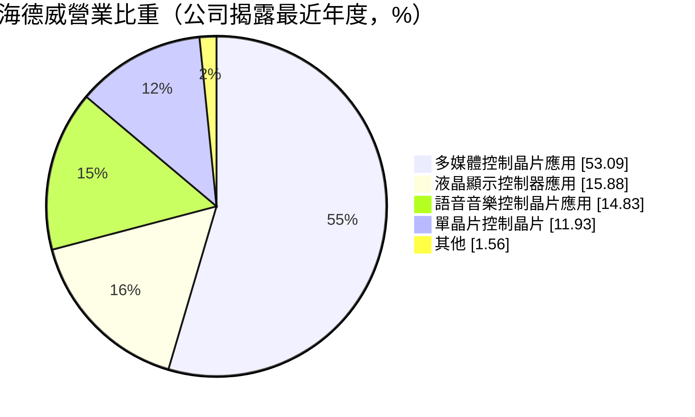
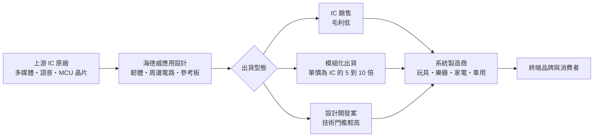
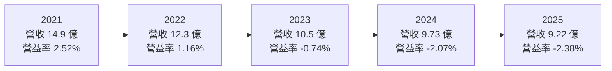
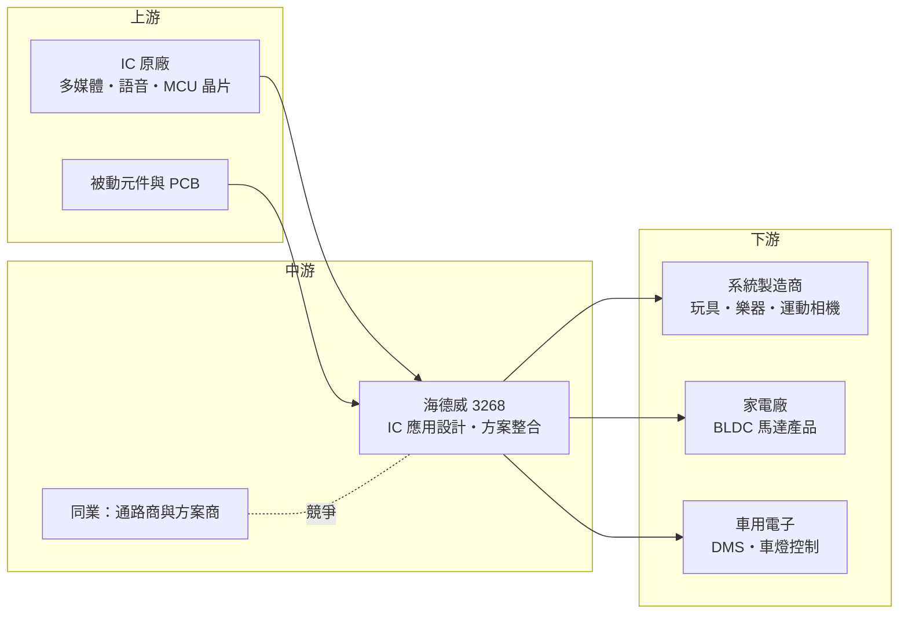

# 3268 海德威

> 上櫃｜[[產業索引-半導體業|半導體業]]｜上市（櫃）日期 2005/01/27

# 第一章：企業模式與商業藍圖

> [!info] 撰寫說明
> 本文由 Claude 依公開資料整理，架構比照 [[2330台積電]] 的四章研究，資料截至 2026-10-08。財務數字來源：Goodinfo 年度獲利指標、資產負債結構與股利政策頁、聚財網季度損益表、nstock 公司資料頁、富果研究與 poorstock 的 2025 年 11 月法說會整理、旺得富與鉅亨公司基本資料頁；產業描述為整理性內容，尚未逐條比對原始文件。#待校對

在評估單一個股的長期投資價值時，首要步驟是拆解企業的底層獲利邏輯。本章針對海德威電子（股票代號：3268，以下簡稱海德威）的商業模式進行定性分析，說明它在 IC 原廠與系統製造商之間扮演什麼角色、為什麼這種角色的毛利率長期偏低，以及它想靠哪些轉型方向改變獲利結構。

## 一、核心定位：介於 IC 設計公司與系統廠之間的「應用方案商」

海德威成立於 1991 年，總部位於台中市西屯區，2005 年 1 月上櫃，資本額約 3.47 億元，是規模很小的電子公司。公司登記的主要業務是「消費性、多媒體、微控制器 IC 應用設計、方案整合與銷售」，外銷比重高達約 97%，客戶幾乎都在海外。

這類公司在產業裡常被稱為[[方案商]]。上游的 IC 設計公司專心做晶片，下游的系統製造商（例如玩具廠、樂器廠、小家電廠）多半是中小企業，缺乏寫韌體、設計周邊電路的研發人力。方案商站在兩者之間：向 IC 原廠取得晶片，替晶片寫好應用程式、設計參考電路板，把「一顆 IC」變成「一套可以直接量產的解決方案」，再賣給系統廠。系統廠因此能用很短的時間推出新產品，方案商則從晶片銷售中賺取價差與設計服務的價值。

這種定位決定了海德威的兩個基本特性。第一，它的價值來自應用設計與系統整合能力，而不是晶片本身，所以不需要晶圓廠或大型產線，屬於輕資產模式。第二，由於大部分營收仍來自 IC 轉售，毛利結構接近電子通路商，過去五年毛利率只有 6% 至 8%，獲利空間很薄，營業費用稍微偏高就會出現虧損。

## 二、產品板塊：多媒體控制晶片為主

依旺得富公司資料頁揭露的營業比重（公司揭露的最近年度數據，期間未標明），海德威的產品結構如下：

多媒體控制晶片應用是最大的板塊，涵蓋數位影像、運動相機、空拍機、行車記錄器、智能機器人、學習玩具與兒童智慧手錶等產品的主控方案。這些產品生命週期短、款式變化快，正好需要方案商協助系統廠快速開發。

液晶顯示控制器應用與語音音樂控制晶片應用是另外兩個主要板塊。後者的特色是樂器方案，從玩具琴到 88 鍵專業演奏琴、電子吹管、電子吉他都有，樂器的音色與觸感調校需要長期累積的經驗，是海德威相對有特色的領域。單晶片控制（[[MCU]]）則用於直流無刷馬達（[[BLDC]]）控制、家電控制、觸控、無線充電與遙控。

## 三、資本轉化邏輯（營運模式）：輕資產、薄利、靠周轉

海德威的資本主要投在研發人力、存貨與應收帳款，而不是廠房設備。這種模式的好處是資本支出低、不必承擔折舊壓力；壞處是獲利完全取決於「毛利能不能覆蓋費用」。以約 6% 的毛利率來說，只要營業費用率略高於 6%，就會出現營業虧損。2023 年以來營收逐年下滑，從 2021 年的 14.9 億元降到 2025 年的約 9.2 億元，費用卻難以同比例縮減，營業利益率因此連續三年為負。

另一個結構性特性是匯率。外銷比重超過 97%，進貨與銷貨大多以美元計價，公司帳上持有美元資產，新台幣升值時會產生匯兌評價損失。2025 年新台幣從約 32 元升到 29 元，造成約 2,900 萬元的匯兌損失，對一家年營收不到 10 億元的公司來說是很大的衝擊。

## 四、企業長期藍圖：從賣 IC 轉向賣模組與設計案

面對毛利過薄的結構問題，海德威在 2025 年 11 月法說會提出三個轉型方向。第一是提高設計開發案的比重，從單純轉售 IC 改為承接需要客製開發的專案，提高技術門檻與議價能力。第二是模組化出貨，把 IC 和周邊電路做成功能模組出貨，模組單價約為 IC 的 5 至 10 倍，可以放大營收與毛利金額。第三是轉向車用與工業控制等利基市場，這些市場的產品週期較長、價格較穩定。

公司表示 2026 年是多項新產品量產的關鍵年，新產品包括直流無刷馬達應用（烘手機、油煙機、空氣清淨機）、車用產品（駕駛者行為偵測、車燈控制）、高階樂器與互動遊戲手柄。歐盟自 2026 年起要求新車配備駕駛者監控系統（[[DMS]]），被公司視為車用產品的長期市場機會。這些方向若能成功，海德威的角色會從「低毛利的晶片轉售者」逐步變成「有自有設計價值的模組供應商」，這是判斷它長期價值的關鍵。

# 第二章：護城河深度與競爭優勢

「護城河」指企業抵禦競爭、維持超額利潤的保護機制。本章分析海德威的競爭優勢來源、主要對手，以及它在低毛利的方案商產業中能守住什麼。

## 一、海德威護城河的核心組成要素

坦白說，海德威的護城河很淺。過去五年毛利率維持在 6% 至 8%，說明它的定價能力有限，競爭優勢主要來自以下三點。

第一是長年累積的應用設計資料庫。公司成立超過 30 年，在語音音樂、玩具、樂器、顯示控制等領域累積了大量參考設計，可以快速替客戶完成新產品開發。對沒有研發團隊的中小型系統廠而言，開發速度就是商機。

第二是客戶的開發依賴。系統廠一旦採用海德威的方案量產，後續改版、除錯與維修通常也會找原方案商，因為換方案等於重新開發。這種黏著度雖然不像晶圓代工那麼強，但能讓既有客戶持續下單。

第三是樂器類的利基經驗。電子樂器的音色、觸鍵手感需要大量調校，競爭者相對較少，是海德威少數具備差異化的領域。

## 二、全球主要競爭對手格局

| 對手類型 | 代表 | 對海德威的威脅 |
|---|---|---|
| 消費性 IC 設計公司直接服務客戶 | [[2401凌陽]]、[[5471松翰]]、[[4952凌通]] | 原廠若自行提供完整方案，方案商的價值被壓縮 |
| 中國本土 IC 設計與方案商 | 深圳一帶的眾多方案公司 | 價格低、反應快，搶同一批中國系統廠 |
| 台灣電子通路商 | [[3036文曄]]、[[3702大聯大]] | 規模大、資金充裕，也提供技術支援 |
| MCU 原廠 | [[4919新唐]]、國際 MCU 大廠 | 在馬達控制、家電 MCU 直接競爭 |

## 三、優勢轉化：守得住／守不住／觀察重點

海德威守得住的，是需要大量調校經驗的樂器方案，以及已經導入量產、客戶不願更換的舊專案。這些業務的規模不大，但能提供穩定的基本營收。

守不住的，是一般消費性多媒體與語音 IC 的轉售業務。這類產品同質性高，價格完全由市場決定，中國本土方案商的成本與反應速度都具優勢。2023 至 2025 年營收持續下滑、毛利率由 6.55% 降到 6.3%，顯示競爭仍在壓縮利潤空間。

長期觀察重點在於轉型成效：模組化出貨與設計開發案的營收占比能否明顯提升，車用 DMS 與車燈控制能否形成穩定訂單，BLDC 家電方案能否放量。這三項決定海德威能否從「薄利轉售」走向「有附加價值的方案」。

# 第三章：財務體質與盈利規模

資料日期：2026-10-08。數字取自 Goodinfo 年度財務資料、聚財網季度損益表與法說會整理，表格是撰寫當時的快照；最新月營收、毛利率、累計 EPS 由自動排程寫在本筆記的屬性欄位（月營收、毛利率、累計EPS 等）。#待校對

財務報表是檢驗護城河是否真實存在的最終標準。本章用五年的三率、ROE、現金流與資本報酬，檢視海德威的獲利品質與財務體質。

## 一、獲利能力的基石：三率

| 年度 | 營收（新台幣） | [[毛利率]] | [[營業利益率]] | EPS（元） | [[ROE]] |
|---|---|---|---|---|---|
| 2021 | 14.9 億 | 7.76% | 2.52% | 0.95 | 7.05% |
| 2022 | 12.3 億 | 8.03% | 1.16% | 1.53 | 10.7% |
| 2023 | 10.5 億 | 6.55% | -0.74% | -0.20 | -1.3% |
| 2024 | 9.73 億 | 6.42% | -2.07% | 0.26 | 1.7% |
| 2025 | 9.22 億 | 6.30% | -2.38% | -1.33 | -9.2% |

五年數字呈現一個清楚的趨勢：營收逐年下滑，2021 到 2025 年的年複合成長率約 -11.3%（推算），毛利率從約 8% 降到約 6%，營業利益率從小幅獲利轉為連續三年虧損。這說明海德威的問題不是短期景氣，而是傳統 IC 轉售業務在結構上失去競爭力。2022 年 EPS 1.53 元高於營業利益所能支撐的水準，推估有業外收益挹注（細節未查得）。

[[淨利率]]的波動主要來自匯率。2025 年新台幣大幅升值，約 2,900 萬元的匯兌損失使全年 EPS 降到 -1.33 元，是五年來最差的一年。對外銷比重近乎百分之百的公司而言，匯率是無法忽視的長期變數。

## 二、[[ROE]]：資本效率

近五年平均 ROE 約 1.8%（推算），遠低於一般投資人要求的報酬率。ROE 唯一較好的年份是 2022 年的 10.7%，但那一年的本業營業利益率只有 1.16%，報酬主要來自業外。每股淨值從 2024 年的 15.61 元降到 2025 年的 13.4 元，代表虧損已開始侵蝕股東權益。

## 三、資本支出與自由現金流

海德威屬輕資產模式，資本支出很低（具體金額未查得），現金主要卡在存貨與應收帳款。依 poorstock 法說會整理，現金及流動性資產由 2024 年 9 月的約 2.57 億元降到 2025 年 9 月的約 0.94 億元，主因是 2025 年初償還約 1.64 億元公司債；流動比率由 234% 降到 141%。比率仍高於 100%，短期償債沒有立即壓力，但現金緩衝已明顯變薄。方案商的特性是營收成長時反而要墊付更多存貨與應收帳款，這會限制轉型期的擴張能力。

股利方面，依 Goodinfo，2021 與 2022 年度分別配發現金股利 0.6 元與 0.7 元，2023 至 2025 年度都未配息，股利穩定度低，與獲利能力一致。

## 四、[[ROIC]] 與 [[WACC]]：價值創造利差

**ROIC 推算：** 2025 年營業利益約 -0.22 億元（9.22 億 × -2.38%），營業虧損不計稅。投入資本方面，股東權益約 4.65 億元（每股淨值 13.4 元 × 約 0.347 億股），長期負債以 Goodinfo 資產結構中占總資產 4.76% 估算約 0.45 億元，投入資本約 5.1 億元，ROIC 約 -4.3%（推算）。以同樣方法回推 2021 年，稅後營業利益約 0.30 億元，股東權益約 4.57 億元，ROIC 約 6.6%（推算）。

**WACC 推算：** 股東權益成本用 CAPM 估計，假設台灣 10 年期公債殖利率 1.75%、市場風險溢酬 6%、β 取小型電子通路與 IC 設計同業常見值 1.0，股東權益成本約 7.75%。公司有部分短期借款與公司債（2025 年已償還大部分公司債），負債比重不高，WACC 約 7% 至 7.5%（推算）。

**結論：** 海德威的 ROIC 在 2021 年約 6.6%，已略低於 WACC；2023 年以後轉為負值，明顯低於資金成本，代表公司近年在毀損經濟價值。要扭轉這個局面，必須同時提高毛利率（模組化與設計案）並擴大營收規模，否則再好的轉型故事也難以轉化為股東報酬。

# 第四章：總體風險與地緣政治

任何企業都無法脫離宏觀環境獨立存在。本章分析海德威長期必須面對的地緣政治、產業週期、營運與技術風險。

## 一、地緣政治

海德威的外銷比重超過 97%，客戶多為海外系統製造商，推估以中國大陸為主（公司未公開地區比重）。美中貿易衝突與關稅若使玩具、消費性電子的生產基地從中國移往東南亞，海德威需要跟著客戶轉移服務據點，對人力有限的小公司是不小的負擔。另外，中國推動晶片國產化，中國系統廠可能優先採用本土 IC 與本土方案商，長期壓縮台灣方案商的生存空間。

## 二、產業週期與市場結構

玩具、樂器、運動相機都屬於非必需消費品，景氣轉弱時需求最先受衝擊，系統廠的庫存調整又會透過[[長鞭效應]]放大反映在方案商的訂單上。匯率則是長期的結構性變數，2025 年的經驗說明新台幣升值對這家公司的衝擊可能超過本業的全年獲利。

## 三、營運環境的隱性風險

財務緩衝變薄是首要風險。償還公司債後現金明顯減少，若虧損持續，公司可能需要增資或借款，稀釋既有股東權益。其次是上游原廠的通路策略，方案商依賴 IC 原廠的產品與授權，原廠若改為直接服務大客戶，營收來源可能流失。最後，公司規模小、研發與業務人力有限，同時推動多條新產品線，執行風險較高。

## 四、科技或法規演進

法規帶來機會也帶來門檻。歐盟要求新車配備駕駛者監控系統，車用電子方案若能取得車廠或一階供應商認證，會是較穩定的收入來源，但[[車規驗證]]週期長、成本高，短期貢獻有限。技術面上，消費性電子越來越多採用整合度高的單晶片方案，或改用 AI 語音與手機 App 控制，傳統語音、顯示控制方案的需求可能逐步萎縮，海德威必須持續把能力移往新的應用。

# 專有名詞解析

## 半導體

- **[[MCU]]**：微控制器，把處理器、記憶體與輸入輸出介面整合在一顆晶片，用於家電、玩具與工業控制。

## 應用

- **[[DMS]]**：駕駛者監控系統，以攝影機偵測駕駛是否分心或疲勞，歐盟自 2026 年起要求新車強制配備。
- **[[車規驗證]]**：車用晶片與模組須通過 AEC-Q100 等可靠度測試與車廠認證，流程常需 2 至 3 年，因此轉換成本高。

## 金融

- **[[毛利率]]**：營業毛利除以營收，反映產品本身的獲利空間，方案商與通路商通常偏低。
- **[[營業利益率]]**：營業利益除以營收，扣除研發、銷售與管理費用後的本業獲利能力。
- **[[ROIC]]**：投入資本報酬率，稅後營業利益除以股東權益加有息負債，衡量本業運用資本的效率。
- **[[WACC]]**：加權平均資金成本，股東與債權人要求報酬的加權平均，ROIC 高於它才代表創造價值。

## 產業

- **[[方案商]]**：向 IC 原廠取得晶片，再加上韌體與周邊電路設計，提供系統廠可直接量產的整套解決方案的公司。
- **[[模組化出貨]]**：把 IC 與周邊零件、電路板組成功能模組後出貨，單價與附加價值都高於單賣 IC。
- **[[BLDC]]**：直流無刷馬達，以電子換向取代碳刷，效率高、壽命長、噪音低，需要 MCU 進行精確控制。
- **[[長鞭效應]]**：終端需求的小幅變動，沿供應鏈往上游傳遞時被逐級放大，造成上游庫存與訂單劇烈波動。

# 核心供應鏈

## 1. 上游：IC 原廠
- 多媒體、語音與 MCU 晶片原廠（公司未公開主要供應商名稱，未查得）
- 同類消費性 IC 設計公司：[[2401凌陽]]、[[4952凌通]]、[[5471松翰]]

## 2. 中游：方案與通路同業
- MCU 原廠：[[4919新唐]]
- 電子通路：[[3036文曄]]、[[3702大聯大]]

## 3. 下游：系統製造商
- 玩具、樂器、運動相機、空拍機、行車記錄器、兒童智慧手錶製造商（多在海外，公司未公開名稱）
- 家電：烘手機、油煙機、空氣清淨機
- 車用：駕駛者行為偵測、車燈控制模組

## 最新新聞
<!-- news:start -->
<!-- news:end -->

## 相關連結
- [公開資訊觀測站](https://mopsov.twse.com.tw/mops/web/t05st03?step=1&firstin=1&co_id=3268)
- [Goodinfo](https://goodinfo.tw/tw/StockDetail.asp?STOCK_ID=3268)
- [Yahoo 股市](https://tw.stock.yahoo.com/quote/3268)
- [鉅亨網新聞](https://www.cnyes.com/twstock/3268/news)
