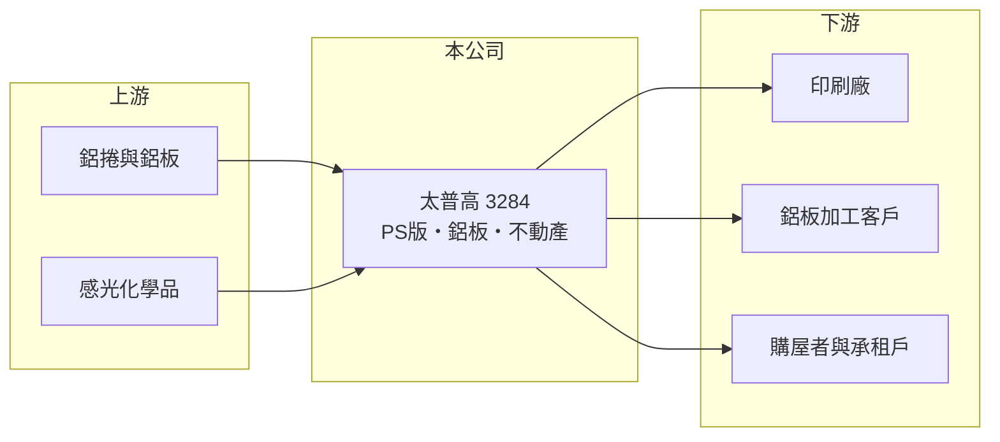

# 3284 太普高

> 上櫃｜[[產業索引-其他業|其他業]]｜上市（櫃）日期 2005/03/22

# 第一章：企業模式與商業藍圖

> [!info] 撰寫說明
> 精簡版，由 Claude 依公開資料整理，架構比照 [[2330台積電]]，資料截至 2026-10-07。來源：nStock 太普高公司簡介、winvest 營收快訊。公開資料有限。#待校對

太普高以印刷用預塗感光版為本業，另經營鋁板批發與不動產相關業務。

- **核心業務：** 製造印刷用[[PS版]]（預塗式平版），並批發鋁板素材，另有不動產代銷、住宅大樓開發與租賃業務。
- **營收結構：** 本次未查到各業務營收比重，推估仍以印刷版材與鋁板為主。
- **營運據點：** 總部與工廠位於高雄市大社區（大社工業區）。
- **長期方向：** 傳統印刷需求長期下滑，公司透過不動產業務分散營收來源（推估）。

# 第二章：護城河深度與競爭優勢

太普高在利基型印刷版材市場經營，但產業需求成熟。

- **競爭優勢：** 長期經營 PS 版製造，具備鋁板塗佈與感光製程經驗（推估）。
- **主要對手：** 國際印刷版材大廠如富士軟片、柯達、愛克發，以及中國版材廠（推估）。
- **觀察重點：** 2026 年第二季[[淨利率]]高於[[營業利益率]]，需觀察[[業外收益]]與不動產收入的持續性。

# 第三章：財務體質與盈利規模

資料日期：2026-10-07，以下數字是撰寫當時的快照；最新月營收、毛利率、累計 EPS 由自動排程寫在本筆記的屬性欄位（月營收、毛利率、累計EPS 等）。#待校對

太普高營收平穩，本業利潤偏薄，獲利有部分來自業外。

- **營收規模：** 2025 年全年營收 8.69 億元；2026 年 1 至 8 月累計 5.46 億元，年減 2.67%，8 月營收 6,003.2 萬元，年減 3.89%。
- **獲利：** 2025 年全年 EPS 2.31 元；2026 年第二季 EPS 0.22 元，季減 56%，[[毛利率]] 15.72%、[[營業利益率]] 1.76%、[[淨利率]] 11.78%。
- **財務特色：** 營業利益率低、淨利率高，獲利結構仰賴業外或非本業收入。

# 第四章：總體風險與地緣政治

太普高的風險在於本業需求萎縮與原料價格波動。

- **產業週期：** 數位化使傳統印刷需求長期下滑，PS 版市場規模縮小。
- **營運風險：** 鋁價波動直接影響版材成本，毛利率僅約 15%，轉嫁能力有限。
- **其他風險：** 不動產業務受房市景氣與法規影響，收入認列可能不連續。

# 專有名詞解析

## 金融

- **[[業外收益]]**：本業以外的收入，例如投資、租金或處分資產利益，持續性通常較低。
- **[[營業利益率]]**：營業利益除以營收，反映本業扣除營業費用後的獲利能力。
- **[[淨利率]]**：稅後淨利除以營收，包含業外損益與稅負後的最終獲利能力。

## 產業

- **[[PS版]]**：預塗感光平版，在鋁板上塗佈感光層，曝光顯影後用於平版印刷。

# 核心供應鏈

- 上游：鋁捲與鋁板供應商、感光塗料與化學品廠（推估）
- 下游／客戶：印刷廠、鋁板加工客戶、不動產買方與承租戶（推估）
- 同業：富士軟片、柯達、愛克發等印刷版材廠（推估）

## 最新新聞
<!-- news:start（自動產生，請勿手動編輯此範圍） -->
- 2026-10-05 🏛️ 重訊 16:42｜代子公司普興股份有限公司公告向關係人取得使用權資產｜[觀測站](https://mops.twse.com.tw/mops/#/web/t05st01)

完整紀錄：[[3284太普高 新聞]]
<!-- news:end -->

## 相關連結
- [公開資訊觀測站](https://mopsov.twse.com.tw/mops/web/t05st03?step=1&firstin=1&co_id=3284)
- [Goodinfo](https://goodinfo.tw/tw/StockDetail.asp?STOCK_ID=3284)
- [Yahoo 股市](https://tw.stock.yahoo.com/quote/3284)
- [鉅亨網新聞](https://www.cnyes.com/twstock/3284/news)
