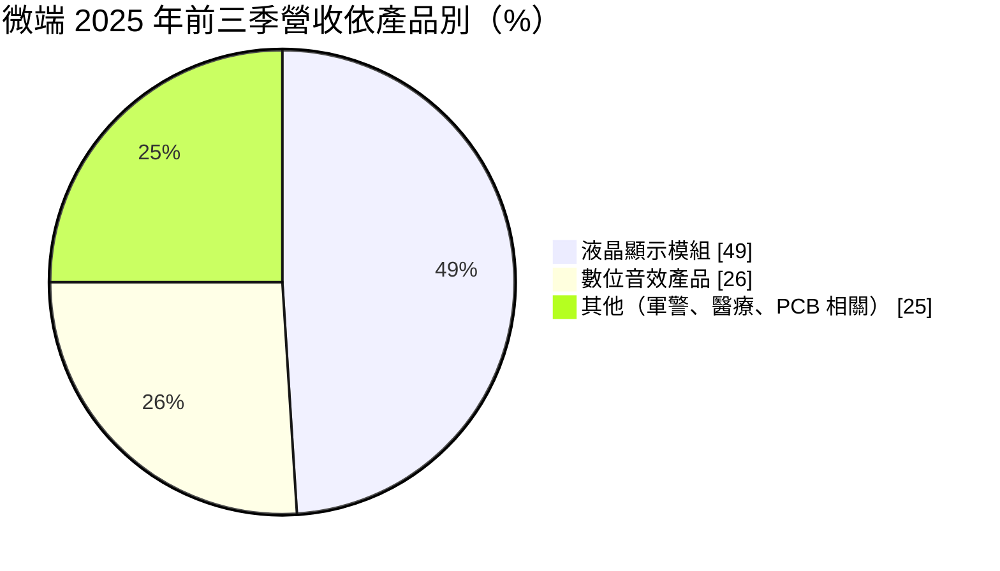
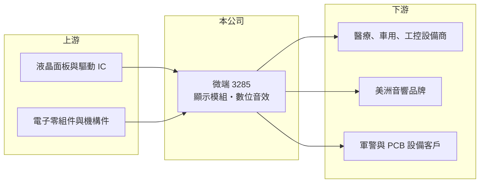

# 3285 微端

> 上櫃｜[[產業索引-其他電子業|其他電子業]]｜上市（櫃）日期 2012/07/23

# 第一章：企業模式與商業藍圖

> [!info] 撰寫說明
> 精簡版，由 Claude 依公開資料整理，架構比照 [[2330台積電]]，資料截至 2026-10-07。來源：富果研究微端 2025 年 11 月法說會整理、winvest.tw 營收快訊。#待校對

微端以液晶顯示模組與數位音效產品為主，主要市場在美洲。

- **核心業務：** 生產工業與醫療用液晶顯示模組（[[LCM]]），以及效果器、混音器、監聽喇叭等數位音效產品。
- **營收結構：** 依 2025 年前三季資料，液晶顯示模組占 49%、數位音效產品占 26%、其他（軍警設備、醫療零組件、PCB 相關）占 25%；銷售地區美洲占 81%、台灣 11%、亞洲及歐洲 9%。
- **營運據點：** 生產基地在台灣汐止與中國東莞。
- **長期方向：** 聚焦 [[PCB]] 零組件、醫療器材與軍警設備三個新領域，並於 2025 年 9 月成立子公司布局雲端與軟體業務。

# 第二章：護城河深度與競爭優勢

微端走少量多樣的利基應用，而非大量消費性產品。

- **競爭優勢：** 顯示模組用於醫療、汽車與工控設備，客製化程度高、驗證期長，客戶不易更換；音效產品與美洲品牌客戶關係長期穩定（推估）。
- **主要對手：** 工控顯示模組同業與中國顯示模組廠，具體對手名單未查得。
- **觀察重點：** 醫療產品與 PCB 鑽孔設備相關營收的成長，以及新事業能否帶動[[毛利率]]提升。

# 第三章：財務體質與盈利規模

資料日期：2026-10-07，表格是撰寫當時的快照；最新月營收、毛利率、累計 EPS 由自動排程寫在本筆記的屬性欄位（月營收、毛利率、累計EPS 等）。#待校對

微端 2026 年營收大幅成長，獲利明顯改善。

- **營收規模：** 2026 年 1 至 8 月累計 7.49 億元、年增 74.48%；5 月營收 1.41 億元、年增 216.75%，8 月 8,570 萬元、年增 23.18%。
- **獲利：** 2026 年第二季 EPS 0.65 元，上半年累計 0.91 元；2025 年全年 EPS 0.70 元，2025 年第三季曾轉虧為盈。
- **財務特色：** 股本 4.27 億元，屬小型股；營收受單一大訂單影響大，月營收波動明顯。

# 第四章：總體風險與地緣政治

微端的風險集中在美洲市場與訂單波動。

- **產業週期：** 音效產品屬消費性需求，景氣轉弱時訂單減少；工控與醫療需求相對穩定。
- **營運風險：** 美洲營收占八成以上，客戶與市場集中；新事業初期可能拖累獲利。
- **其他風險：** 美國關稅政策影響東莞廠出貨成本；美元匯率與面板報價波動。

# 專有名詞解析

## 應用

- **[[LCM]]**：液晶顯示模組，把液晶面板、背光、驅動 IC 與電路板組成可直接裝入產品的顯示零件。

## 金融

- **[[毛利率]]**：營業毛利占營收的比例，反映產品定價能力與成本結構。

## 產業

- **[[PCB]]**：印刷電路板，用來承載與連接電子零件的基板。

# 核心供應鏈

- 上游：液晶面板、驅動 IC 與電子零組件供應商（推估）
- 下游／客戶：醫療、汽車、工控設備商與美洲音響品牌，客戶名稱未揭露
- 同業：工控顯示模組與音響設備代工廠，具體名單未查得

## 最新新聞
<!-- news:start -->
<!-- news:end -->

## 相關連結
- [公開資訊觀測站](https://mopsov.twse.com.tw/mops/web/t05st03?step=1&firstin=1&co_id=3285)
- [Goodinfo](https://goodinfo.tw/tw/StockDetail.asp?STOCK_ID=3285)
- [Yahoo 股市](https://tw.stock.yahoo.com/quote/3285)
- [鉅亨網新聞](https://www.cnyes.com/twstock/3285/news)
