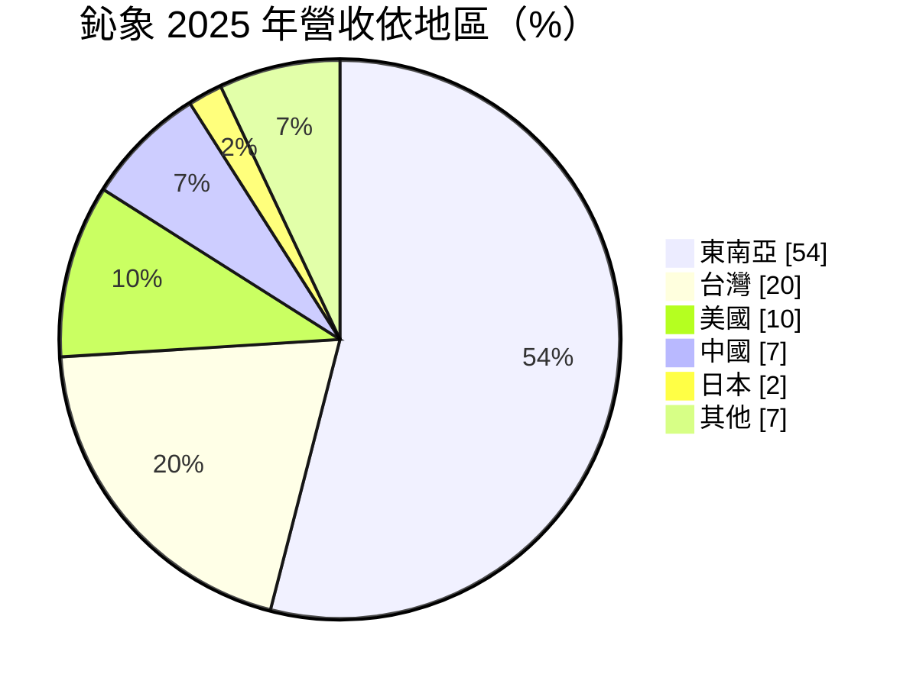
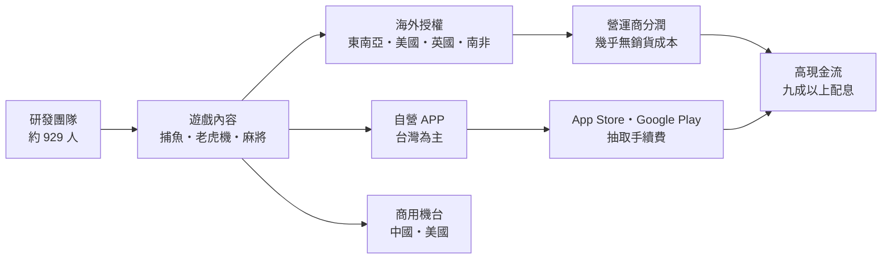
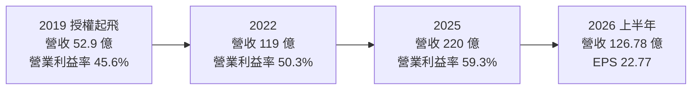
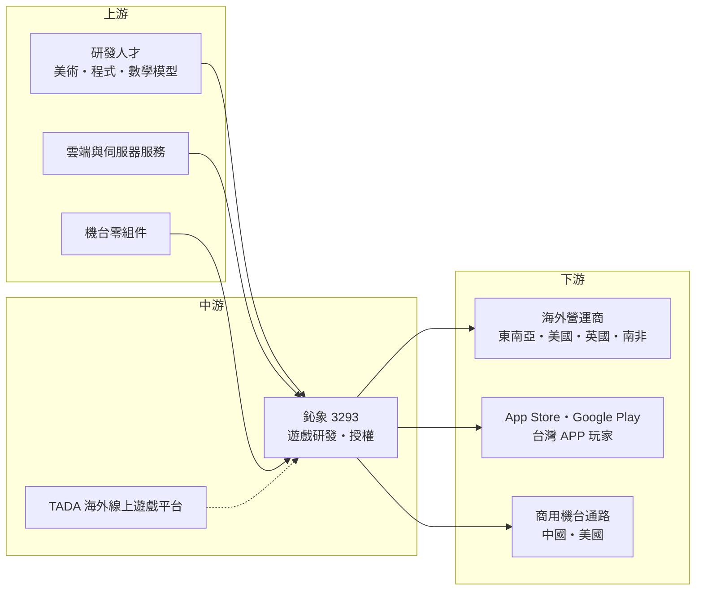

# 3293 鈊象

> 上櫃｜[[產業索引-文化創意業|文化創意業]]｜上市（櫃）日期 2006/07/12

# 第一章：企業模式與商業藍圖

> [!info] 撰寫說明
> 本文由 Claude 依公開資料整理，架構比照 [[2330台積電]] 的四章研究，資料截至 2026-10-08。財務數字來源：Goodinfo 年度經營績效頁、工商時報 2026 年 3 月報導（兩篇）、Allen's Cashflow 公司分析、櫃買中心開放資料（2026 年第二季綜合損益與資產負債、基本資料、本益比殖利率）；產業描述為整理性內容，尚未逐條比對原始文件。#待校對

在評估單一個股的長期投資價值時，首要步驟是拆解企業的底層獲利邏輯。本章針對鈊象電子（股票代號：3293，以下簡稱鈊象，英文 IGS）的商業模式進行定性分析，說明一家從大型遊戲機台起家的台灣公司，如何轉型為以海外[[遊戲授權]]為主、毛利率接近百分之百的軟體公司，以及這種模式的優勢與脆弱之處。

## 一、核心定位：以博弈類與休閒類遊戲為核心的研發與授權商

鈊象成立於 1989 年，2006 年在櫃買中心上櫃，總部位於新北市五股，董事長為李柯柱。早期以商用大型遊戲機台聞名，之後跨入線上遊戲與手機 APP，目前的主要收入是把自家研發的遊戲內容授權給海外營運商與平台。依 Allen's Cashflow 整理的資料，鈊象員工約 1,136 人，其中研發人員約 929 人，研發占比超過八成，是一家典型的內容研發公司。

鈊象的產品以[[博弈類遊戲]]為主，包括捕魚機、老虎機（Slot）、麻將與撲克等玩法，代表作有《明星三缺一》、《金猴爺》、《金好運》、《滿貫大亨》與《海王寶藏》。這類遊戲的特色是規則簡單、玩家黏著度高、生命週期長，一款成功的遊戲可以營運十年以上，持續帶來收入。

## 二、終端應用與產品板塊

依工商時報 2026 年 3 月報導，2025 年鈊象的業務比重約為遊戲授權 72%、網路遊戲 26%、商用遊戲機 2%（另一篇報導寫授權比重 68%，口徑可能不同）。地區別營收如下：

* **遊戲授權：** 最大也是成長最快的業務。鈊象把遊戲內容授權給海外營運商，或透過海外 TADA 線上遊戲平台提供服務，依營運商的收入抽取授權金或分潤。授權業務幾乎沒有銷貨成本，是公司毛利率接近 98% 的主因。東南亞是最大市場，占營收 54%。
* **網路遊戲（APP）：** 以台灣市場為主的手機遊戲，例如《明星三缺一》與《金猴爺》，玩家透過 Apple App Store 與 Google Play 儲值購買虛擬點數。這部分收入穩定，但須支付平台手續費。
* **商用遊戲機：** 鈊象的起家事業，聚焦中國與美國的大型機台，占營收僅約 2%，但累積的機台設計與[[數學模型]]經驗，是後來線上博弈遊戲的基礎。
* **美國與新市場：** 美國占營收約 10%，受惠於[[Sweepstakes]]（抽獎式社交遊戲）模式擴張，已推展到原有三州以外；2025 年第二季取得英國線上[[博弈執照]]，2026 年 3 月宣布在南非取得博弈執照並上線遊戲，公司表示非洲市場 2026 年就會貢獻營收。

## 三、資本轉化邏輯：研發一次、授權多地

鈊象的商業模式是典型的軟體與內容經濟：遊戲開發的主要成本是研發人員薪資，一旦遊戲完成，多授權一個地區、多一位玩家的邊際成本幾乎為零。這帶來三個長期特徵：

* **極高的毛利率與營業利益率：** Goodinfo 資料顯示，毛利率由 2016 年的 80.5% 升到 2025 年的 97.6%，營業利益率由 29.2% 升到 59.3%。授權比重越高，毛利率越接近百分之百。
* **[[營業槓桿]]：** 研發與管理費用相對固定，營收成長時大部分增量直接轉為利潤。2025 年營收年增 19%，稅後淨利年增 19.7%，首度突破百億元。
* **輕資產與高配息：** 公司幾乎不需要廠房或大型設備，依櫃買中心資料，2026 年第二季底非流動負債僅約 0.84 億元、流動資產約 281 億元，因此可以把九成以上的盈餘發給股東。

## 四、企業長期藍圖：海外授權與新市場擴張

鈊象的長期策略集中在三點：第一，以海外授權為成長主力，深耕東南亞並擴大美國 Sweepstakes 市場；第二，透過取得各國博弈執照進入受監管的線上博弈市場，例如英國與南非，並以南非為起點拓展非洲；第三，導入 AI 提升遊戲開發效率。公司表示中長期維持雙位數成長的趨勢。這個藍圖的邏輯是把同一套遊戲內容複製到更多合法市場，讓研發投入的回收倍數持續提高；但每進入一個新市場，都要面對當地的法規、執照與合作夥伴風險。

# 第二章：護城河深度與競爭優勢

在長期價值投資中，「護城河」指企業抵禦競爭、維持超額利潤的保護機制。本章分析鈊象在博弈與休閒遊戲市場的護城河，以及這些優勢在法規與玩家喜好變化下能守住多少。

## 一、鈊象護城河的核心組成要素

* **1. 遊戲數學模型與內容庫：** 博弈類遊戲的核心是「數學模型」，也就是控制中獎機率、獎金分布與玩家節奏的設計。鈊象從大型機台時代累積三十多年的模型經驗，並擁有大量經過市場驗證的遊戲。營運商選擇授權內容時，看重的是遊戲能否長期留住玩家，有成功紀錄的內容商具有明顯優勢。
* **2. 授權網路與營運商關係：** 在東南亞與美國，鈊象已與當地營運商建立長期分潤關係。營運商一旦把鈊象的遊戲放進平台並累積玩家，更換內容的成本與風險都很高，這構成一種轉換成本。
* **3. 執照與合規能力：** 進入受監管的博弈市場需要取得執照、通過遊戲公平性與技術稽核，英國與南非執照就是例子。執照門檻讓中小型開發商難以跟進，鈊象的合規經驗也能複製到更多市場。
* **4. 研發規模：** 超過九百位研發人員，讓鈊象能同時開發多款遊戲、快速推出新玩法，並依各地市場在地化。

整體而言，鈊象的護城河屬於「中等寬度」：內容與營運商關係有黏性，但遊戲產業的玩家喜好變化快，任何單一遊戲都可能退燒，護城河必須靠持續推出新內容來維持。

## 二、全球主要競爭對手格局

| 對手 | 定位 | 對鈊象的威脅 |
|---|---|---|
| Aristocrat、Light & Wonder 等國際博弈內容商 | 全球博弈機台與線上博弈內容大廠 | 在歐美受監管市場的品牌與規模優勢明顯 |
| Playtika 等[[社交博弈]]公司 | 社交博弈 APP 大廠 | 在社交博弈與 Sweepstakes 市場爭奪玩家 |
| 東南亞在地與中國開發商 | 低成本開發捕魚、老虎機類遊戲 | 以低價內容與營運商合作，壓縮授權費 |
| [[6180橘子]] | 台灣遊戲營運與平台 | 在台灣 APP 市場爭奪玩家時間與儲值 |
| [[5478智冠]] | 台灣遊戲代理與支付 | 在台灣遊戲與點數支付市場競爭 |

## 三、優勢轉化：哪些市場守得住、哪些守不住

* **守得住：** 東南亞授權與台灣的經典 APP。這些市場鈊象經營多年，玩家與營運商關係穩固，2025 年東南亞仍持續成長、占營收過半。
* **守不住：** 法規變動與單一遊戲的生命週期。東南亞部分市場對線上博弈的法律地位模糊，政策一變，營運商與授權收入可能瞬間受影響；美國 Sweepstakes 也面臨部分州立法限制的風險。新遊戲若不受歡迎，研發成本無法回收。
* **觀察重點：** 第一，東南亞以外的營收比重能否提高，分散單一區域的法規風險；第二，英國、南非等受監管市場的實際營收貢獻；第三，研發人員規模與費用率是否維持穩定，以確保新遊戲推出節奏。

# 第三章：財務體質與盈利規模

資料日期：2026-10-08。數字取自 Goodinfo 年度經營績效、工商時報報導與櫃買中心開放資料，表格是撰寫當時的快照；最新月營收、毛利率、累計 EPS 由自動排程寫在本筆記的屬性欄位（月營收、毛利率、累計EPS 等）。#待校對

財務報表是檢驗護城河是否真實存在的最終標準。本章用十年來的三率、ROE 與資本報酬，檢視鈊象的獲利品質。

## 一、獲利能力的基石：三率

| 年度 | 營收（新台幣） | [[毛利率]] | [[營業利益率]] | EPS（元） | [[ROE]] |
|---|---|---|---|---|---|
| 2016 | 33.2 億 | 80.5% | 29.2% | 12.78 | 28.9% |
| 2019 | 52.9 億 | 92.6% | 45.6% | 28.08 | 45.1% |
| 2020 | 84.3 億 | 95.9% | 50.3% | 48.38 | 58.5% |
| 2021 | 113 億 | 95.9% | 51.5% | 67.21 | 60.6% |
| 2022 | 119 億 | 96.0% | 50.3% | 38.88 | 55.8% |
| 2023 | 142 億 | 96.1% | 53.1% | 45.61 | 56.2% |
| 2024 | 185 億 | 96.5% | 55.8% | 32.14 | 63.4% |
| 2025 | 220 億 | 97.6% | 59.3% | 38.51 | 61.2% |
| 2026 上半年 | 126.78 億 | 97.82% | 59.05% | 22.77 | 不適用（半年） |

鈊象的十年數字幾乎是一條向上的直線：營收由 2016 年的 33.2 億元成長到 2025 年的 220 億元，增加約 6.6 倍；營業利益率由 29% 升到 59%。2020 至 2025 年營收年複合成長率約 21.1%（推算），2021 至 2025 年五年平均 ROE 約 59.4%（推算），在台股中屬於極少數。

需要特別注意 EPS 欄位：鈊象在 2022 年與 2024 年前後應有辦理[[盈餘轉增資]]（配發股票股利，依每股淨值變化推估），股數增加使 EPS 與每股淨值下降，例如每股淨值由 2021 年的 127.17 元降到 2022 年的 75.66 元。因此 EPS 在年度之間不能直接比較，評估成長應以營收、淨利與營業利益為準。以淨利計算，2022 年約 54.8 億元、2025 年約 108.5 億元，三年接近翻倍。

## 二、[[ROE]]：資本效率

鈊象的 ROE 長期在 55% 至 63% 之間，原因是高利潤率加上高配息：公司每年把九成以上盈餘發給股東，股東權益不會因保留盈餘而膨脹。依櫃買中心資料，2026 年第二季底總資產 336.2 億元、負債 185.0 億元、權益 151.2 億元。負債比約 55% 看似不低，但幾乎全部是流動負債，主要為應付股利、應付費用與預收款項等經營性負債，非流動負債僅約 0.84 億元，沒有實質的銀行借款壓力（推估，依負債結構判斷）。

## 三、資本支出、自由現金流與股利

* **資本支出：** 金額未查得。公司以研發人員為主要資產，資本支出主要是辦公空間與資訊設備，相對營收很小（推估）。
* **[[自由現金流]]：** 逐年數字未查得。由於幾乎沒有銷貨成本與重大資本支出，營業現金流接近淨利，自由現金流長期為正，這是公司能維持九成以上配發率的基礎（推估）。
* **股利：** 2025 年度擬配發現金股利 36 元，配發率約 93.48%（工商時報報導）。Goodinfo 統計歷年加權平均現金股利約 28.24 元。過去也曾搭配股票股利，使股本由早期約 10 億元增加到目前約 28.2 億元（櫃買中心資料）。

## 四、[[ROIC]] 與 [[WACC]]：價值創造利差

**ROIC 推算：** 2025 年營業利益約 130.5 億元（營收 220 億元 × 營業利益率 59.3%），以 20% 稅率計算稅後營業利益約 104.4 億元。2025 年底股東權益以每股淨值 67.62 元乘以約 2.818 億股，約 190.6 億元；2024 年底以每股淨值 58.13 元計算約 163.8 億元，平均約 177 億元。公司幾乎沒有有息負債，投入資本約等於股東權益，ROIC 約 59%（推算）。若扣除帳上大量現金與金融資產，實際營運所需的資本更少，ROIC 會更高。

**WACC 推算：** 假設台灣 10 年期公債殖利率 1.75%、市場風險溢酬 6%、β 取遊戲股常見值 0.9（假設），股東權益成本約 7.15%。由於沒有有息負債，WACC 約等於股東權益成本，約 7.2%（推算）。考量博弈法規風險，投資人可能要求更高的風險溢酬。

**結論：** 鈊象的 ROIC 約 59%，比約 7% 的資金成本高出 50 個百分點以上，是台股中價值創造利差最大的公司之一。這種利差來自「研發一次、授權多地」的軟體經濟與博弈內容的長期黏性。但利差的穩定性取決於法規：若主要市場的線上博弈政策轉向，營收可能快速下滑，因此對鈊象而言，地區分散與執照取得比單年 EPS 更重要。

# 第四章：總體風險與地緣政治

任何企業都無法脫離宏觀環境獨立存在。本章分析鈊象長期必須面對的地緣政治、法規、產業週期與營運風險。

## 一、地緣政治與法規風險

鈊象最大的風險是法規。東南亞占營收過半，但多數東南亞國家對線上博弈的法律地位不同，有些國家禁止、有些灰色地帶、有些發照管理。若某個主要市場加強取締，或支付管道被切斷，營運商收入與鈊象的授權分潤都會受到衝擊。中國占營收約 7%，中國對遊戲版號、博弈與跨境支付的管制政策變動頻繁。美國 Sweepstakes 模式雖然在多州合法運作，但各州立法可能改變，這是美國業務的不確定因素。公司透過取得英國、南非等受監管市場的執照分散風險，但這些市場的競爭也更激烈。

## 二、產業週期與市場結構

博弈與休閒遊戲的需求相對穩定，受景氣影響小於一般消費品，因為單次消費金額低、玩家習慣性強。但遊戲產業的結構正在集中化：大型平台與國際博弈集團透過併購擴大內容庫，中小型內容商的議價力可能下降。另一方面，新市場的開放會帶來成長機會，例如部分新興市場的線上博弈正逐步走向發照管理，南非就是鈊象已進入的例子。

## 三、營運環境的隱性風險

* **單一區域與客戶集中：** 東南亞占營收 54%，授權收入可能集中在少數營運商，客戶資訊未公開（未查得）。
* **營運商信用與付款：** 授權收入依賴營運商回報與付款，若營運商財務出狀況或遭當地取締，應收款項可能無法收回。
* **平台抽成：** 自營 APP 須支付 Apple 與 Google 平台手續費，平台政策變化會影響淨收入。
* **人才：** 研發人員是公司的核心資產，薪資上升與人才競爭會推高費用。
* **聲譽：** 博弈類產品容易引發社會觀感與成癮爭議，可能影響主管機關與合作夥伴的態度。

## 四、科技或法規演進

AI 可以大幅提升美術、程式與測試的效率，鈊象已導入 AI 協助開發，這可能降低新遊戲的開發成本，但也降低同業的進入門檻，讓更多小型開發商推出類似遊戲。各國對網路賭博、遊戲內抽獎與虛擬貨幣的立法也在演進，歐洲與部分亞洲國家對抽獎機制的規範趨嚴，未來可能影響遊戲設計。對鈊象而言，能否持續合規並快速適應各地法規，是維持長期授權收入的關鍵。

# 專有名詞解析

## 金融

- **[[營業槓桿]]**：固定費用占比高的企業，營收增加時利潤以更快速度成長，營收下滑時也會放大衰退。
- **[[自由現金流]]**：營業活動現金流減去資本支出，代表企業可自由用於配息、還債或併購的現金。
- **[[ROIC]]**：投入資本報酬率，稅後營業利益除以股東權益加有息負債，衡量本業運用資本的效率。
- **[[WACC]]**：加權平均資金成本，股東與債權人要求報酬的加權平均，ROIC 高於它才代表創造價值。

## 產業

- **[[博弈類遊戲]]**：以機率決定輸贏的遊戲類型，如老虎機、捕魚機、麻將與撲克，依各國法規分為真錢博弈與社交博弈。
- **[[社交博弈]]**：玩家以虛擬點數遊玩博弈玩法、不能兌換真錢的遊戲，通常不受博弈執照規範。
- **[[Sweepstakes]]**：美國的抽獎式社交遊戲模式，玩家可免費取得抽獎點數並兌換獎品，在多數州以促銷抽獎的法律架構合法經營。
- **[[遊戲授權]]**：遊戲開發商把遊戲內容授權給其他營運商或平台使用，收取授權金或依營收分潤。
- **[[數學模型]]**：博弈遊戲中控制中獎機率、賠率與獎金分布的設計，決定遊戲的公平性與玩家黏著度。
- **[[博弈執照]]**：各國主管機關核發、允許業者合法提供真錢博弈服務的許可，取得前須通過公平性與技術稽核。
- **[[盈餘轉增資]]**：公司把盈餘轉為股本並配發股票給股東，股數增加會使每股盈餘與每股淨值下降。

# 核心供應鏈

## 1. 上游：人才與基礎設施
- 研發人才：美術、程式與遊戲數學模型團隊
- 雲端與伺服器服務：供應商名單未查得
- 商用機台零組件：供應商名單未查得

## 2. 中游：鈊象與同業
- 自營平台：TADA 海外線上遊戲平台
- 台灣同業：[[6180橘子]]、[[5478智冠]]
- 國際同業：Aristocrat、Light & Wonder、Playtika

## 3. 下游：通路與客戶
- 海外授權營運商：東南亞、美國 Sweepstakes、英國、南非當地代理商（名稱未揭露）
- APP 平台：[[AAPL蘋果]] App Store、[[GOOGL谷歌]] Google Play
- 商用機台通路：中國與美國

## 最新新聞
<!-- news:start（自動產生，請勿手動編輯此範圍） -->
- 2026-10-07 🏛️ 重訊 19:20｜本公司網路資安事件補充說明｜[觀測站](https://mops.twse.com.tw/mops/#/web/t05st01)

完整紀錄：[[3293鈊象 新聞]]
<!-- news:end -->

## 相關連結
- [公開資訊觀測站](https://mopsov.twse.com.tw/mops/web/t05st03?step=1&firstin=1&co_id=3293)
- [Goodinfo](https://goodinfo.tw/tw/StockDetail.asp?STOCK_ID=3293)
- [Yahoo 股市](https://tw.stock.yahoo.com/quote/3293)
- [鉅亨網新聞](https://www.cnyes.com/twstock/3293/news)
