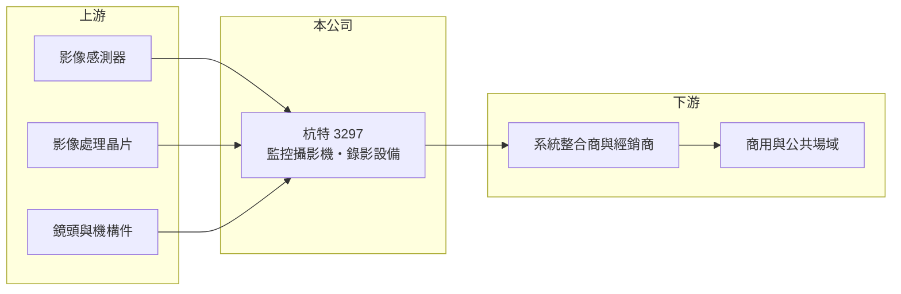

# 3297 杭特

> 上櫃｜[[產業索引-光電業|光電業]]｜上市（櫃）日期 2005/06/07

# 第一章：企業模式與商業藍圖

> [!info] 撰寫說明
> 精簡版，由 Claude 依公開資料整理，架構比照 [[2330台積電]]，資料截至 2026-10-07。來源：nstock.tw 杭特公司概況、winvest.tw 營收快訊。公開資料有限，營收比重未查到。#待校對

杭特是小型安全監控設備商，2026 年營收成長，但第二季獲利主要來自非本業。

- **核心業務：** 杭特電子 2005 年上櫃，業務為安全監控用攝影機、數位錄放影機（[[DVR]]）及相關附屬設備的設計、生產與買賣。
- **營收結構：** 本次未查到攝影機與錄影設備各自的營收比重，也未查到內外銷比例。
- **營運據點：** 生產與營運據點本次未查到，本文不推測。
- **長期方向：** 監控設備從類比錄影轉向網路化與 AI 分析，杭特需要跟上 [[IP攝影機]]與影像分析的產品升級。

# 第二章：護城河深度與競爭優勢

杭特規模小，在價格競爭激烈的監控市場中護城河有限。

- **競爭優勢：** 具自有設計與生產能力，可承接客製化或特定場域的監控需求；台灣製造背景有機會受惠[[非紅供應鏈]]採購（推估）。
- **主要對手：** 國內有 [[3356奇偶]]、3454晶睿、[[3128昇銳]]，國際上則有海康威視、大華等中國大廠。
- **觀察重點：** 營業利益能否轉正，而不是依賴非本業收益撐起 EPS。

# 第三章：財務體質與盈利規模

資料日期：2026-10-07，以下數字是撰寫當時的快照；最新月營收、毛利率、累計 EPS 由自動排程寫在本筆記的屬性欄位（月營收、毛利率、累計EPS 等）。#待校對

杭特營收年增兩成，毛利率不低，但本業仍小幅虧損。

- **營收規模：** 2025 年全年營收 2.02 億元；2026 年 1 至 8 月累計 1.67 億元、年增 20.61%，8 月營收 2,547.6 萬元、年增 10.48%，6 月年增 41.41%。
- **獲利：** 2026 年第二季 EPS 0.74 元，[[毛利率]] 36.41%，[[營業利益率]] -2.3%，淨利率 40.57%；營業虧損但淨利為正，獲利來自[[業外收益]]，推估不具持續性。
- **財務特色：** 資本額約 3.60 億元，近五年沒有配息紀錄。

# 第四章：總體風險與地緣政治

杭特的風險在於規模小與本業獲利能力不足。

- **產業週期：** 監控設備需求跟著政府標案、商用建案與企業資本支出起伏。
- **營運風險：** 營收規模小，費用攤提困難；非本業收益消失後，EPS 可能回到虧損。
- **其他風險：** 影像晶片與感測器仰賴外購，零件價格與匯率波動會影響毛利。

# 專有名詞解析

## 應用

- **[[DVR]]**：數位錄影主機，把類比監控攝影機的訊號數位化後錄製儲存的設備。
- **[[IP攝影機]]**：透過網路傳輸影像的監控攝影機，可直接接上網路交換器，不必經過類比線路與錄影主機。

## 金融

- **[[業外收益]]**：本業以外的收益，例如投資、處分資產或匯兌利益，通常不具持續性。

## 產業

- **[[非紅供應鏈]]**：排除中國製零組件的供應鏈，常見於國防、無人機與政府採購規範。

# 核心供應鏈

- 上游：影像感測器（如 [[SONY索尼]]）、影像處理晶片、鏡頭與機構件供應商
- 下游／客戶：系統整合商與經銷商、商用與公共場域（推估）
- 同業：[[3356奇偶]]、3454晶睿、[[3128昇銳]]、海康威視、大華

## 最新新聞
<!-- news:start -->
<!-- news:end -->

## 相關連結
- [公開資訊觀測站](https://mopsov.twse.com.tw/mops/web/t05st03?step=1&firstin=1&co_id=3297)
- [Goodinfo](https://goodinfo.tw/tw/StockDetail.asp?STOCK_ID=3297)
- [Yahoo 股市](https://tw.stock.yahoo.com/quote/3297)
- [鉅亨網新聞](https://www.cnyes.com/twstock/3297/news)
