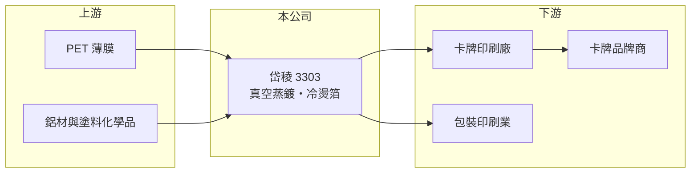

# 3303 岱稜

> 上櫃｜[[產業索引-其他電子業|其他電子業]]｜上市（櫃）日期 2007/05/28

# 第一章：企業模式與商業藍圖

> [!info] 撰寫說明
> 精簡版，由 Claude 依公開資料整理，架構比照 [[2330台積電]]，資料截至 2026-10-07。來源：優分析岱稜 2025 年報與 2026 年上半年財報報導（2026 年 2 月、8 月）。#待校對

岱稜是真空蒸鍍薄膜廠，近年靠收藏卡牌用的冷燙箔帶動獲利創新高。

- **核心業務：** 以真空蒸鍍、[[精密塗布]]與化學配方技術，生產[[燙金膜]]與冷燙系列產品，其中雷射冷燙箔是單價較高的主力。
- **營收結構：** 本次未查得產品別比重；報導指出主要成長來自精品收藏卡與[[集換式卡牌]]（運動球員卡、寶可夢卡牌），其餘用於民生工業包裝。
- **營運據點：** 2025 年第三季完成中國無錫廠股權處分；歐洲有波蘭子公司逐步貢獻營收，越南新廠預計 2027 年第二季量產。
- **長期方向：** 提高北美市場滲透率、以高單價冷燙產品優化產品組合，並透過越南與波蘭據點分散生產。

# 第二章：護城河深度與競爭優勢

岱稜的優勢在於蒸鍍與配方技術，以及在北美卡牌市場的切入。

- **競爭優勢：** 收藏卡牌對色彩與防偽效果要求高，雷射冷燙箔需要蒸鍍、塗布與配方整合，岱稜 2025 年毛利率 37.53%，高於一般包裝材料廠。
- **主要對手：** 德國 Kurz 等國際燙金箔大廠，以及中國燙印材料廠（推估，未查得公司自述對手）。
- **觀察重點：** 北美卡牌熱潮能否延續、越南廠量產進度，以及毛利率能否維持在 35% 以上。

# 第三章：財務體質與盈利規模

資料日期：2026-10-07，表格是撰寫當時的快照；最新月營收、毛利率、累計 EPS 由自動排程寫在本筆記的屬性欄位（月營收、毛利率、累計EPS 等）。#待校對

岱稜 2025 年與 2026 年上半年獲利都創新高。

- **營收規模：** 2025 年營收 30.07 億元、年增 0.49%；2026 年上半年 17.54 億元、年增 16.8%，第二季 9.79 億元創單季新高。
- **獲利：** 2025 年 EPS 4.57 元、[[毛利率]] 37.53%；2026 年上半年 EPS 2.4 元、毛利率 36.72%，第二季 EPS 1.48 元、毛利率 38.65%。
- **財務特色：** 2025 年獲利含處分無錫廠股權的[[業外收益]]；2025 年度配息 3 元，公司長期維持七至九成的股利發放率。

# 第四章：總體風險與地緣政治

岱稜的風險在於收藏卡牌需求的持續性與海外擴廠。

- **產業週期：** 收藏卡牌屬於流行性消費，熱潮退燒時高單價冷燙箔需求可能下滑；民生包裝則隨消費景氣變動。
- **營運風險：** 越南新廠與波蘭子公司初期的折舊與費用，可能壓抑毛利率；2026 年上半年毛利率已比去年同期減少 4.34 個百分點。
- **其他風險：** 塑膠薄膜與化學原料價格波動、美元匯率，以及美國關稅政策對北美出貨的影響。

# 專有名詞解析

## 應用

- **[[集換式卡牌]]**：可收藏、交換並用於對戰的卡牌，例如寶可夢卡與運動球員卡，稀有卡常以特殊燙印加工。

## 金融

- **[[業外收益]]**：本業以外的收入，例如投資收益、處分資產利益與匯兌收益，通常不具持續性。

## 產業

- **[[燙金膜]]**：以加熱加壓把金屬或全像圖層轉印到紙張、塑膠表面的薄膜材料，用於包裝與印刷裝飾。
- **[[精密塗布]]**：在薄膜基材上均勻塗上功能性塗層的製程，應用於光學膜、離型膜與燙印材料。

# 核心供應鏈

- 上游：PET 薄膜、鋁材與塗料化學品供應商（推估）
- 下游／客戶：北美卡牌印刷廠與包裝印刷業者，客戶名稱未揭露
- 同業：德國 Kurz 等燙印材料廠（推估）

## 最新新聞
<!-- news:start（自動產生，請勿手動編輯此範圍） -->
- 2026-10-06 🏛️ 重訊 13:43｜公告本公司董事會決議買回庫藏股｜[觀測站](https://mops.twse.com.tw/mops/#/web/t05st01)

完整紀錄：[[3303岱稜 新聞]]
<!-- news:end -->

## 相關連結
- [公開資訊觀測站](https://mopsov.twse.com.tw/mops/web/t05st03?step=1&firstin=1&co_id=3303)
- [Goodinfo](https://goodinfo.tw/tw/StockDetail.asp?STOCK_ID=3303)
- [Yahoo 股市](https://tw.stock.yahoo.com/quote/3303)
- [鉅亨網新聞](https://www.cnyes.com/twstock/3303/news)
