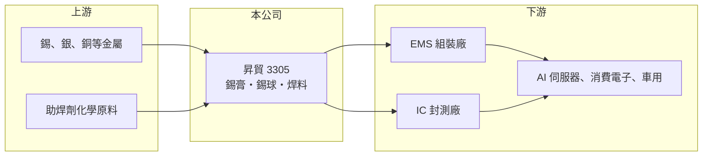

# 3305 昇貿

> 上市｜[[產業索引-其他電子業|其他電子業]]｜上市（櫃）日期 2008/07/10

# 第一章：企業模式與商業藍圖

> [!info] 撰寫說明
> 精簡版，由 Claude 依公開資料整理，架構比照 [[2330台積電]]，資料截至 2026-10-07。來源：富果研究昇貿 2026 年 5 月法說會整理、優分析報導。#待校對

昇貿是全球前三大焊錫材料廠，產品從電子組裝錫膏延伸到半導體封裝錫球。

- **核心業務：** 電子組裝用[[錫膏]]、錫棒、錫絲與助焊劑，以及半導體封裝用的精密[[錫球]]、植球助焊膏與[[覆晶封裝]]錫膏。
- **營收結構：** 本次未查得產品別比重；客戶以全球頂尖 [[EMS]] 廠為主，前段客戶占比超過九成，2025 年併購大瑞科技後，[[BGA]] 錫球等封裝材料比重提高。
- **營運據點：** 全球 8 座工廠、10 個以上服務據點，越南新廠預計 2026 年上半年量產。
- **長期方向：** 聚焦 AI/HPC 應用、先進半導體封裝材料與環保產品，並開發[[熱介面材料]]、低溫焊錫與回收再生焊錫。

# 第二章：護城河深度與競爭優勢

昇貿的優勢是全球據點與 EMS 客戶基礎，加上封裝材料的延伸。

- **競爭優勢：** 錫膏須通過客戶產線驗證，配方一旦導入不易更換；全球多廠可就近供應 EMS 客戶的中國、東南亞與其他產線。
- **主要對手：** 日本千住金屬、美國 Indium 與 Alpha 等國際焊料大廠（推估，未查得公司自述對手）。
- **觀察重點：** AI 伺服器用高毛利錫膏的出貨、大瑞科技整合效益，以及越南廠量產後的東南亞接單。

# 第三章：財務體質與盈利規模

資料日期：2026-10-07，表格是撰寫當時的快照；最新月營收、毛利率、累計 EPS 由自動排程寫在本筆記的屬性欄位（月營收、毛利率、累計EPS 等）。#待校對

昇貿 2026 年第一季毛利率明顯改善，獲利大幅成長。

- **營收規模：** 2025 年營收 106.21 億元；2026 年第一季 37.64 億元。
- **獲利：** 2025 年 EPS 3.16 元、[[毛利率]] 13.3%；2026 年第一季 EPS 1.73 元、毛利率 18.3%。
- **財務特色：** 營收大部分是錫金屬成本的轉嫁，因此毛利率偏低；錫價上漲會推高營收，但不一定等比例增加毛利。

# 第四章：總體風險與地緣政治

昇貿的風險主要來自錫價與電子產品景氣。

- **產業週期：** 錫膏需求隨 EMS 組裝量變動，消費電子景氣下滑時出貨減少；AI 伺服器需求是目前主要支撐。
- **營運風險：** 錫價劇烈波動時，報價調整落後可能造成存貨損益；併購與新廠整合也有執行風險。
- **其他風險：** 錫礦供應集中在少數國家，地緣政治可能影響原料取得；匯率與環保法規（無鉛、無鹵）亦會影響成本。

# 專有名詞解析

## 半導體

- **[[錫球]]**：IC 封裝底部用來與電路板連接的微小錫珠，用於 BGA 與覆晶封裝。
- **[[覆晶封裝]]**：把晶片翻面，以凸塊直接接合到基板的封裝方式，訊號路徑短，適合高速與高腳數晶片。
- **[[BGA]]**：球柵陣列封裝，在封裝底部以陣列排列的錫球連接電路板，可容納大量接腳。

## 產業

- **[[錫膏]]**：由錫合金粉末與助焊劑調成的膏狀焊料，SMT 製程印在電路板上，再經回焊把元件焊上。
- **[[EMS]]**：電子製造服務，替品牌客戶代工電路板組裝、測試與整機組裝。
- **[[熱介面材料]]**：填在晶片與散熱器之間的導熱材料，用來降低接觸熱阻，AI 晶片散熱需求大。

# 核心供應鏈

- 上游：錫、銀、銅等金屬與助焊劑化學原料供應商
- 下游／客戶：全球 EMS 廠如 [[2317鴻海]]、[[4938和碩]]（推估，未查證為實際客戶）與 IC 封測廠
- 同業：日本千住金屬、Indium、Alpha（推估）

## 最新新聞
<!-- news:start（自動產生，請勿手動編輯此範圍） -->
- 2026-10-07 📰 媒體 18:53｜營收速報 - 昇貿(3305)9月營收14.29億元年增率高達46.33％｜[鉅亨網](https://news.cnyes.com/news/id/6623862)

完整紀錄：[[3305昇貿 新聞]]
<!-- news:end -->

## 相關連結
- [公開資訊觀測站](https://mopsov.twse.com.tw/mops/web/t05st03?step=1&firstin=1&co_id=3305)
- [Goodinfo](https://goodinfo.tw/tw/StockDetail.asp?STOCK_ID=3305)
- [Yahoo 股市](https://tw.stock.yahoo.com/quote/3305)
- [鉅亨網新聞](https://www.cnyes.com/twstock/3305/news)
