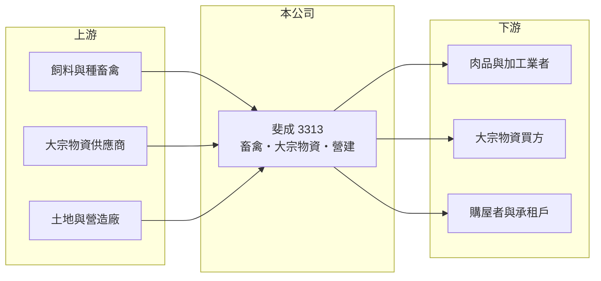

# 3313 斐成

> 上櫃｜[[產業索引-其他業|其他業]]｜上市（櫃）日期 2006/05/29

# 第一章：企業模式與商業藍圖

> [!info] 撰寫說明
> 精簡版，由 Claude 依公開資料整理，架構比照 [[2330台積電]]，資料截至 2026-10-07。來源：nStock 斐成公司簡介、winvest 營收快訊。公開資料有限。#待校對

斐成原本是電子電機零件廠，2018 年下半年轉型，目前營收規模很小且波動大。

- **核心業務：** 經營家畜禽飼養、[[大宗物資]]買賣，以及住宅與大樓開發租售。
- **營收結構：** 本次未查到各業務營收比重；2026 年 5、6 月營收分別為 783.8 萬元與 590.6 萬元，其他月份多在百萬元以下，推估有個別案件集中認列。
- **營運據點：** 公司登記地址位於台南市安平區。
- **長期方向：** 轉型後的業務尚未形成穩定營收，本次未查到具體發展計畫。

# 第二章：護城河深度與競爭優勢

斐成的業務分散且規模小，目前看不出明顯護城河。

- **競爭優勢：** 本次未查到明確的技術、規模或通路優勢。
- **主要對手：** 營建業有眾多中小型建商，大宗物資與畜禽業亦屬競爭激烈的市場。
- **觀察重點：** 營收能否擺脫單月劇烈波動，形成穩定的經常性收入。

# 第三章：財務體質與盈利規模

資料日期：2026-10-07，以下數字是撰寫當時的快照；最新月營收、毛利率、累計 EPS 由自動排程寫在本筆記的屬性欄位（月營收、毛利率、累計EPS 等）。#待校對

斐成營收雖較 2025 年成長，但規模極小，仍處於虧損。

- **營收規模：** 2025 年全年營收 0.11 億元；2026 年 1 至 8 月累計 0.21 億元，8 月營收 114.5 萬元。
- **獲利：** 2025 年全年 EPS -0.35 元；2026 年上半年累計 EPS -0.04 元，第二季[[毛利率]] 47.93%。
- **財務特色：** 資本額 22.11 億元，相對營收規模很大；近五年無配息。

# 第四章：總體風險與地緣政治

斐成的主要風險是營收不穩定與轉型成效不明。

- **產業週期：** 國內建案多在交屋時一次認列營收，不採[[完工比例法]]，加上大宗物資價格波動，營收難以預測。
- **營運風險：** 營收規模不足以支應營運成本，長期虧損會侵蝕淨值。
- **其他風險：** 畜禽飼養受疫病與飼料價格影響；營建業受房市政策與信用管制影響。

# 專有名詞解析

## 金融

- **[[毛利率]]**：毛利除以營收，反映產品或服務本身的獲利能力。

## 產業

- **[[大宗物資]]**：以大量標準化方式交易的原物料，例如金屬、穀物與能源，價格隨國際行情波動。
- **[[完工比例法]]**：依工程完成進度認列營收的方法；國內建案銷售多在交屋時一次認列，與此不同。

# 核心供應鏈

- 上游：飼料與種畜禽供應商、大宗物資供應商、土地與營造廠（推估）
- 下游／客戶：肉品業者、大宗物資買方、購屋者（推估）
- 同業：[[2542興富發]]、2723鼎固-KY、[[2515中工]]等營建業者（依 nStock 同產業分類）

## 最新新聞
<!-- news:start -->
<!-- news:end -->

## 相關連結
- [公開資訊觀測站](https://mopsov.twse.com.tw/mops/web/t05st03?step=1&firstin=1&co_id=3313)
- [Goodinfo](https://goodinfo.tw/tw/StockDetail.asp?STOCK_ID=3313)
- [Yahoo 股市](https://tw.stock.yahoo.com/quote/3313)
- [鉅亨網新聞](https://www.cnyes.com/twstock/3313/news)
