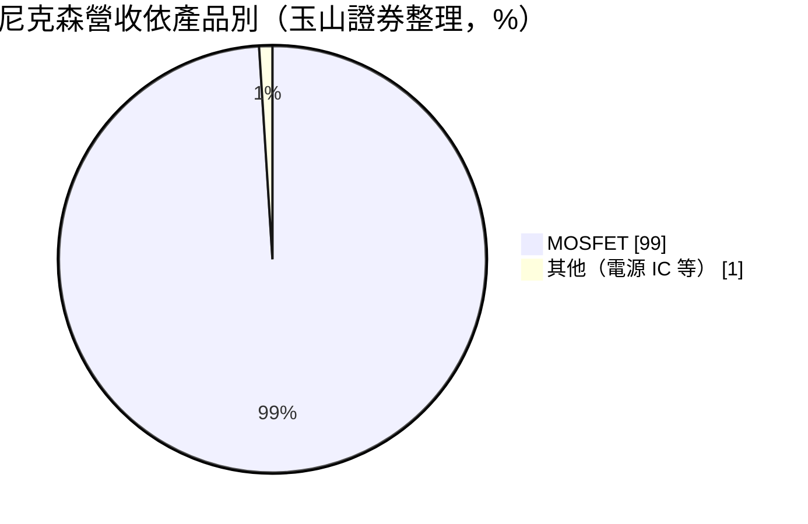
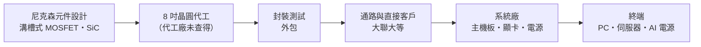
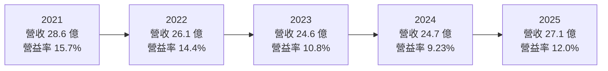
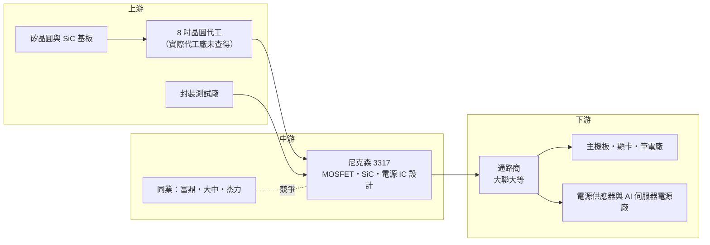

# 3317 尼克森

> 上櫃｜[[產業索引-半導體業|半導體業]]｜上市（櫃）日期 2007/08/09

# 第一章：企業模式與商業藍圖

> [!info] 撰寫說明
> 本文由 Claude 依公開資料整理，架構比照 [[2330台積電]] 的四章研究，資料截至 2026-10-08。財務數字來源：Goodinfo 年度獲利指標、資產負債結構與股利政策頁、聚財網季度損益表、nstock 公司資料頁、Yahoo 股市公司基本資料、玉山證券與理財周刊 MOSFET 產業文章、工商時報、大聯大產品線頁面；產業描述為整理性內容，尚未逐條比對原始文件。#待校對

在評估單一個股的長期投資價值時，首要步驟是拆解企業的底層獲利邏輯。本章針對尼克森微電子（股票代號：3317，以下簡稱尼克森）的商業模式進行定性分析，說明它在功率半導體產業中的位置、為什麼 MOSFET 是一門景氣循環明顯的生意，以及它如何試圖從傳統 PC 用元件跨入 AI 伺服器電源。

## 一、核心定位：專注中低壓功率 MOSFET 的 Fabless 設計公司

尼克森成立於 1998 年，總部位於新北市汐止區，2007 年 8 月上櫃，資本額約 9 億元，董事長兼總經理為楊惠強。公司登記業務是類比 IC 的研發、設計與銷售，但實際營收幾乎全部來自功率元件：依玉山證券整理，[[MOSFET]] 約占營收 99%，是台股中 MOSFET 純度最高的公司之一。

MOSFET 是電子產品中負責「開關電流」的基本元件，每一台電腦、伺服器、電源供應器都需要大量使用。尼克森採 [[Fabless]] 模式，自己設計元件結構與規格，晶圓製造與封裝交給外部代工廠。產品除了功率 MOSFET，還包括線性穩壓 IC、切換式穩壓 IC、脈衝控制 IC，以及 BJT、[[IGBT]]、LED 驅動 IC 等。

這個定位有兩個長期意義。第一，MOSFET 是規格標準化的元件，同一顆料號可以賣給許多不同客戶，量大但單價低，競爭以成本、交期與品質穩定度為主，很難靠技術拉開巨大差距。第二，尼克森長期主攻主機板、顯示卡、筆電與電源供應器所用的中低壓 MOSFET。這個市場的特性是國際 [[IDM]] 大廠（例如英飛凌、安森美）通常優先把產能留給利潤更高的中高壓與車用產品，中低壓市場因此留給台灣與中國的設計公司競爭。2021 年國際大廠產能轉向，中低壓 MOSFET 缺貨漲價，台灣設計公司普遍賺進歷史高峰的獲利，這正是尼克森 2021 至 2022 年 EPS 達 5 至 7 元的背景。

## 二、終端應用／產品板塊

尼克森沒有公開應用別的營收比重。依玉山證券整理的產品結構，MOSFET 幾乎是唯一的營收來源：

依大聯大產品線頁面與財經媒體描述，產品主要用於以下幾個領域。電腦與周邊是傳統主力，主機板、顯示卡與筆記型電腦的供電電路（[[VRM]]）需要大量低壓 MOSFET，把電源轉換成 CPU、GPU 需要的低電壓大電流。電源供應器與顯示器是第二個板塊，涵蓋電源供應器、變壓器、LCD 電視與監視器的電源電路。網路通訊設備的電源模組則是第三個板塊。

新的成長方向是 [[AI伺服器]]電源。AI 伺服器的耗電量遠高於傳統伺服器，電源架構往更高電壓、更高功率發展，需要能承受高電壓、高溫的寬能隙元件。依理財周刊報導，尼克森的 [[SiC]] MOSFET 與[[功率模組]]已在 2026 年開始小量出貨 AI 伺服器電源應用，公司也在開發 [[GaN]] 產品。

## 三、資本轉化邏輯（營運模式）：設計輕資產、成本跟著晶圓走

Fabless 模式讓尼克森不必擁有晶圓廠，資本支出很低，主要資產是設計人才、存貨與應收帳款。這種模式的關鍵成本是晶圓代工價格。MOSFET 多在 8 吋晶圓廠生產，而全球 8 吋產能長期擴充有限，產能吃緊時代工廠會調漲價格，設計公司的毛利率就被壓縮；產能寬鬆時則相反。尼克森過去五年毛利率在 26% 至 31% 之間，相對穩定，說明它在成本轉嫁上有一定能力。

銷售通路方面，產品透過電子通路商（例如 [[3702大聯大]] 旗下公司）銷售給大量中小型系統廠，客戶分散，單一客戶流失的影響有限，但也代表公司對終端品牌的影響力不大。

## 四、企業長期藍圖：從 PC 元件走向 AI 電源

尼克森的長期藍圖是把產品組合從低壓、低單價的 PC 元件，往附加價值較高的伺服器與工業應用移動。具體方向有三個：SiC MOSFET 與功率模組切入 AI 伺服器電源；GaN 元件瞄準高頻、小體積的電源；提高中高壓與高功率產品的比重。這條路線的邏輯很清楚，但難度也不低，因為 SiC 與 GaN 是國際大廠重兵投入的領域，台灣中小型設計公司必須在特定應用中找到利基，才能取得穩定的份額。

# 第二章：護城河深度與競爭優勢

「護城河」指企業抵禦競爭、維持超額利潤的保護機制。本章分析尼克森在競爭激烈的 MOSFET 市場中有哪些優勢、面對哪些國內外對手，以及它的優勢能否轉化為穩定獲利。

## 一、尼克森護城河的核心組成要素

MOSFET 屬於高度標準化的元件，整個產業的護城河都不深，尼克森的競爭優勢主要來自三個方面。

第一是長年累積的客戶認證。主機板、顯示卡廠商導入一顆 MOSFET，需要經過可靠度測試與系統驗證，已導入的料號在產品生命週期內很少更換。尼克森成立近 30 年，在電腦供應鏈中累積了大量已認證料號，這構成一定的轉換成本。

第二是完整的產品線與電源設計能力。公司同時具備功率元件、類比控制 IC 與電源系統設計的能力，可以提供客戶較完整的電源方案，而不只是賣單一元件。

第三是成本與服務速度。在中低壓市場，台灣設計公司的價格比國際大廠有彈性，服務在地系統廠的速度也較快，能配合客戶的開發時程。

## 二、全球主要競爭對手格局

| 對手 | 定位 | 對尼克森的威脅 |
|---|---|---|
| 英飛凌、安森美 | 國際功率半導體 IDM 龍頭 | 技術與車規、伺服器認證領先，高階市場主導者 |
| 東芝、瑞薩等日系 IDM | 中低壓與車用 MOSFET | 品質口碑強，日系客戶偏好 |
| [[8261富鼎]] | 台灣 MOSFET 設計公司，伺服器與風扇電源 | 同一批台灣系統廠客戶 |
| [[6435大中]] | 台灣 MOSFET，PC 與伺服器、馬達、風扇並重 | 在 PC 與伺服器直接競爭 |
| [[5299杰力]] | 功率元件約八成、電源 IC 約兩成 | 在筆電與伺服器競爭 |
| 中國 MOSFET 廠（華潤微、士蘭微等） | 政策扶植、價格低 | 壓低中低壓產品的全球價格 |

## 三、優勢轉化：守得住／守不住／觀察重點

尼克森守得住的，是已在主機板、顯示卡、電源供應器長期導入的料號，以及對交期與在地服務要求高的台灣系統廠客戶。這些客戶重視供貨穩定，不會因為小幅價差就更換供應商。

守不住的，是一般消費性與低階電源用的低壓 MOSFET。這類產品的價格主要由中國廠商的擴產決定，中國功率半導體在政策扶植下持續擴產，全球中低壓產品的價格長期承壓，台灣設計公司難以靠規模取勝。

長期觀察重點有三個：SiC MOSFET 與功率模組在 AI 伺服器電源能否從小量走向量產；8 吋代工價格的長期走勢；以及營收結構中 PC 以外應用的比重能否持續提高。

# 第三章：財務體質與盈利規模

資料日期：2026-10-08。數字取自 Goodinfo 年度財務資料與聚財網季度損益表，表格是撰寫當時的快照；最新月營收、毛利率、累計 EPS 由自動排程寫在本筆記的屬性欄位（月營收、毛利率、累計EPS 等）。#待校對

財務報表是檢驗護城河是否真實存在的最終標準。本章用五年的三率、ROE、現金流與資本報酬，檢視尼克森在 MOSFET 景氣循環中的獲利品質。

## 一、獲利能力的基石：三率

| 年度 | 營收（新台幣） | [[毛利率]] | [[營業利益率]] | EPS（元） | [[ROE]] |
|---|---|---|---|---|---|
| 2021 | 28.6 億 | 29.6% | 15.7% | 5.78 | 16.3% |
| 2022 | 26.1 億 | 30.9% | 14.4% | 7.08 | 17.4% |
| 2023 | 24.6 億 | 26.1% | 10.8% | 2.95 | 7.58% |
| 2024 | 24.7 億 | 27.2% | 9.23% | 2.49 | 6.73% |
| 2025 | 27.1 億 | 27.6% | 12.0% | 1.66 | 4.75% |

五年數字呈現典型的元件景氣循環。2021 至 2022 年 MOSFET 缺貨漲價，毛利率約 30%、營業利益率約 15%；2023 至 2024 年產業庫存調整，營業利益率降到 9% 至 11%；2025 年營收回到 27.1 億元，營業利益率回升到 12%。營收的年複合成長率約 -1.3%（推算），代表過去五年規模大致持平，並未明顯成長。

值得注意的是 EPS 與淨利的落差。EPS 從 2022 年的 7.08 元降到 2025 年的 1.66 元，降幅遠大於營業利益的變化，原因有兩個。第一是股本膨脹：依 Goodinfo，2022 至 2024 年度公司連續配發股票股利 1.6 元、1.4 元、1.111 元，股本由約 6 億元擴大到約 9 億元，同樣的獲利被更多股數分攤。第二是 2025 年第四季本業獲利正常（單季營業利益率 15.6%），但出現業外或一次性損失，單季 EPS 為 -0.17 元，具體原因未查得，需查閱年報確認。投資人看尼克森時，應同時看營業利益與每股盈餘，才不會誤判本業的變化。

## 二、[[ROE]]：資本效率

近五年平均 ROE 約 10.6%（推算），但趨勢是由 2022 年的 17.4% 一路降到 2025 年的 4.75%。ROE 下滑一部分來自景氣循環，一部分來自業外損失，另一部分則是淨值累積而獲利沒有同步成長。尼克森幾乎沒有長期負債，ROE 完全由本業獲利率與資產周轉決定，沒有財務槓桿的放大效果。

## 三、資本支出與自由現金流

Fabless 模式不需建廠，資本支出低（具體金額未查得），營業現金流大致可以轉為[[自由現金流]]（推估）。主要的現金壓力來自存貨與應收帳款，MOSFET 景氣反轉時，元件價格下跌會造成存貨跌價損失，這是設計公司在循環低點最常見的獲利殺手。

股利政策方面，依 Goodinfo，2021 至 2025 年度現金股利分別為 1.2、0.4、0.4、0.4、0.5 元，2022 至 2024 年度另配發股票股利。現金股利占 EPS 的比例偏低，公司過去偏好以股票股利保留現金，但這也稀釋了每股盈餘。2025 年度改為只配現金股利 0.5 元，配息率約 30%（推算）。

## 四、[[ROIC]] 與 [[WACC]]：價值創造利差

**ROIC 推算：** 2025 年營業利益約 3.25 億元（27.1 億 × 12.0%），扣除 20% 稅率後的稅後營業利益約 2.60 億元。股東權益約 32.0 億元（每股淨值 35.54 元 × 約 0.9 億股），長期負債極少（Goodinfo 顯示長期負債約占總資產 0.24%），以股東權益作為投入資本，ROIC 約 8.1%（推算）。同樣方法推算 2021 年約 15.5%（稅後營業利益約 3.59 億元、股東權益約 23.1 億元）、2023 年約 7.4%。由於帳上現金占總資產比例很高，若扣除現金只算營運資本，實際的本業 ROIC 會更高。

**WACC 推算：** 股東權益成本用 CAPM 估計，假設台灣 10 年期公債殖利率 1.75%、市場風險溢酬 6%、β 取 MOSFET 設計同業常見值 1.1，股東權益成本約 8.35%。公司幾乎沒有有息負債，WACC 約等於股東權益成本，約 8.3%（推算）。

**結論：** 景氣高峰的 2021 至 2022 年，尼克森的 ROIC 明顯高於 WACC，創造了可觀的經濟價值；2023 年以後 ROIC 回落到 7% 至 8%，與 WACC 大致相當，價值創造利差接近零。尼克森要重新拉開利差，需要 SiC 與 AI 電源等高附加價值產品貢獻營收，否則在中低壓 MOSFET 的價格競爭下，只能賺到接近資金成本的報酬。

# 第四章：總體風險與地緣政治

任何企業都無法脫離宏觀環境獨立存在。本章分析尼克森長期必須面對的地緣政治、產業週期、營運與技術風險。

## 一、地緣政治

中國政府大力扶植功率半導體，中國 MOSFET 廠持續擴產，中低壓產品的價格競爭是長期壓力。另一方面，主機板、顯示卡、電源供應器的組裝大量在中國，若組裝基地因關稅外移到東南亞或其他地區，尼克森需要跟著客戶調整通路與技術支援。晶圓代工地點若位於中國，也可能受到美中管制或客戶「非中國製造」要求的影響（尼克森的代工地點未查得）。

## 二、產業週期與市場結構

MOSFET 是景氣循環明顯的元件，2021 年缺貨漲價、2023 年庫存調整降價，營收與毛利率隨之起伏。PC 與消費性電子需求的變動會透過[[長鞭效應]]沿供應鏈放大，反映在元件訂單上。8 吋晶圓產能的長期擴充有限，代工價格上漲時會壓縮設計公司的毛利率，這是 Fabless 功率元件公司無法完全掌控的成本變數。

## 三、營運環境的隱性風險

應用集中在 PC 是第一個隱性風險，PC 市場長期成長有限，若 AI 伺服器新品放量不如預期，營收成長動能會不足。第二是存貨跌價，景氣反轉時元件價格下滑會造成存貨損失。第三是一次性損益，2025 年第四季本業正常但稅後虧損，說明業外項目可能造成獲利大幅波動，投資人需要留意財報附註。

## 四、科技演進

最重要的長期技術變化是寬能隙材料的崛起。AI 伺服器與電動車電源越來越多採用 SiC 與 GaN，傳統矽基 MOSFET 在高功率應用的份額可能下降。電源架構也在升級，AI 機櫃電源從 12V 走向 48V 甚至更高電壓的直流供電，元件規格與認證門檻同步提高。尼克森已投入 SiC 與 GaN，但國際大廠在這些材料上的技術與產能領先，這對尼克森既是機會也是挑戰。

# 專有名詞解析

## 半導體

- **[[MOSFET]]**：金屬氧化物半導體場效電晶體，用來開關與控制電流的功率元件，廣泛用於各種電源電路。
- **[[IGBT]]**：絕緣閘雙極電晶體，適合高電壓、大電流的功率開關，常見於工業馬達、變頻器與電動車。
- **[[SiC]]**：碳化矽，屬寬能隙半導體材料，耐高壓、耐高溫，適合 AI 伺服器電源、電動車與充電樁。
- **[[GaN]]**：氮化鎵，寬能隙材料，切換速度快、體積小，常用於快充與高頻電源。
- **[[Fabless]]**：只做晶片設計、把製造外包給晶圓代工廠的商業模式。
- **[[IDM]]**：整合元件製造商，從設計、製造到封測都自己完成，如英飛凌、德州儀器。
- **[[功率模組]]**：把多顆功率元件與驅動電路封裝在一起的模組，可承受更大功率，常用於伺服器電源與工業設備。

## 應用

- **[[VRM]]**：電壓調節模組，負責把電源電壓轉換成 CPU、GPU 需要的低電壓大電流，需要大量 MOSFET。
- **[[AI伺服器]]**：搭載 GPU 或 AI 加速器的伺服器，耗電量遠高於傳統伺服器，對電源元件的需求大增。

## 金融

- **[[自由現金流]]**：營業活動現金流減去資本支出，代表企業可自由用於配息、還債或併購的現金。
- **[[ROIC]]**：投入資本報酬率，稅後營業利益除以股東權益加有息負債，衡量本業運用資本的效率。
- **[[WACC]]**：加權平均資金成本，股東與債權人要求報酬的加權平均，ROIC 高於它才代表創造價值。

## 產業

- **[[長鞭效應]]**：終端需求的小幅變動，沿供應鏈往上游傳遞時被逐級放大，造成上游庫存與訂單劇烈波動。

# 核心供應鏈

## 1. 上游：晶圓代工與材料
- MOSFET 設計公司常見的 8 吋晶圓代工夥伴：[[2342茂矽]]、[[3707漢磊]]、[[5347世界先進]]（尼克森實際代工廠未查得，僅供參考）
- SiC 基板與磊晶：[[6488環球晶]]、[[3016嘉晶]]（產業參考）

## 2. 中游：同業
- 台灣 MOSFET 設計公司：[[8261富鼎]]、[[6435大中]]、[[5299杰力]]
- 國際 IDM：英飛凌、安森美、東芝

## 3. 下游：通路與系統廠
- 電子通路：[[3702大聯大]]
- 主機板與顯示卡：[[2357華碩]]、[[2376技嘉]]、[[2377微星]]（產業參考，非公司揭露客戶）
- 電源供應器與 AI 伺服器電源：[[2308台達電]]、[[2301光寶科]]（產業參考，非公司揭露客戶）

## 最新新聞
<!-- news:start -->
<!-- news:end -->

## 相關連結
- [公開資訊觀測站](https://mopsov.twse.com.tw/mops/web/t05st03?step=1&firstin=1&co_id=3317)
- [Goodinfo](https://goodinfo.tw/tw/StockDetail.asp?STOCK_ID=3317)
- [Yahoo 股市](https://tw.stock.yahoo.com/quote/3317)
- [鉅亨網新聞](https://www.cnyes.com/twstock/3317/news)
