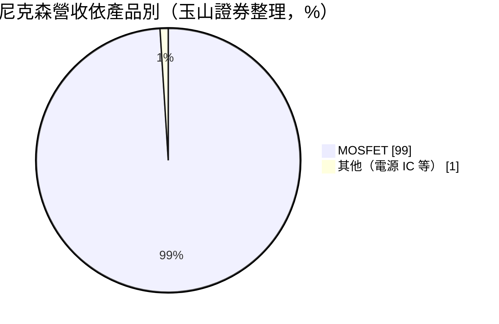
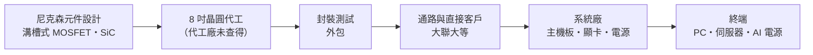
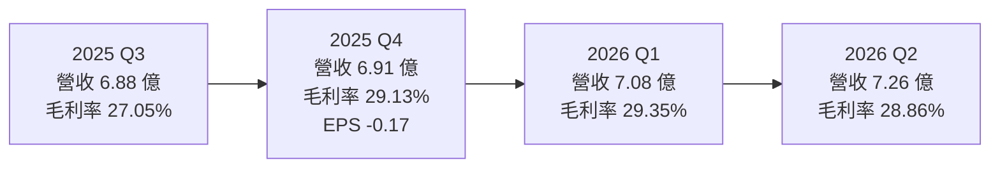
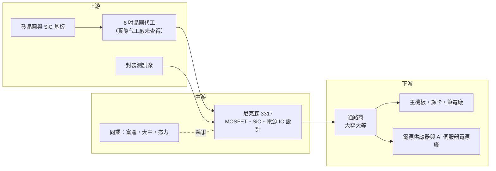

# 3317 尼克森

> 上櫃｜[[產業索引-半導體業|半導體業]]｜上市（櫃）日期 2007/08/09

# 第一章：企業模式與商業藍圖

> [!info] 撰寫說明
> 本文由 Claude 依公開資料整理，架構比照 [[2330台積電]] 的四章研究，資料截至 2026-10-07。財務數字來源：聚財網（stock.wearn.com）季度損益表、nstock 公司資料頁、科技新報財經月營收快訊、Yahoo 股市公司基本資料、玉山證券與理財周刊 MOSFET 產業文章、大聯大產品線頁面；產業描述為整理性內容，尚未逐條比對原始文件。#待校對

在評估單一個股的長期投資價值時，首要步驟是拆解企業的底層獲利邏輯。本章針對尼克森微電子（股票代號：3317，以下簡稱尼克森）的商業模式進行定性分析，說明它在功率半導體產業中的位置、營收如何組成，以及它如何試圖從傳統 PC 用元件跨入 AI 伺服器電源。

## 一、核心定位：專注中低壓功率 MOSFET 的 Fabless 設計公司

尼克森成立於 1998 年，總部位於新北市汐止區，2007 年 8 月上櫃，資本額約 9 億元，董事長兼總經理為楊惠強。公司登記業務為類比 IC 的研發、設計與銷售，但實際上營收幾乎全部來自功率元件：依玉山證券整理，[[MOSFET]] 占營收約 99%，是台股中 MOSFET 純度最高的公司之一。

尼克森屬於 [[Fabless]] 模式，自己設計元件結構與規格，晶圓製造與封裝交給外部代工廠。產品包括功率 MOSFET、線性穩壓 IC、切換式穩壓 IC、脈衝控制 IC，以及 BJT、[[IGBT]]、LED 驅動 IC 等。這個定位有兩個商業意義：

* **元件型產品、規格標準化：** MOSFET 是電子產品中用來開關電流的基本元件，同一顆規格可以賣給許多不同客戶，量大但單價低，競爭以成本、交期與品質穩定度為主。
* **中低壓為主戰場：** 尼克森長期主攻主機板、顯示卡、筆電、電源供應器所用的中低壓 MOSFET。這個市場在 2021 年因國際 [[IDM]] 大廠把產能轉往中高壓與車用，曾出現缺貨漲價，台灣設計公司因此受惠。

## 二、終端應用／產品板塊

尼克森沒有公開應用別的營收比重。依大聯大產品線頁面與財經媒體描述，產品主要用於以下領域：

* **電腦與周邊：** 主機板、顯示卡、筆記型電腦的供電電路（VRM）需要大量低壓 MOSFET，這是尼克森的傳統主力市場。
* **電源供應器與顯示器：** 電源供應器、變壓器、LCD 電視與監視器的電源電路。
* **網路通訊：** 網通設備的電源模組。
* **新應用（AI 伺服器電源）：** 依理財周刊報導，尼克森的 [[SiC]] MOSFET 與功率模組自 2026 年 3 月起小量出貨給 AI 伺服器電源應用，公司同時在開發 [[GaN]] 產品。

## 三、資本轉化邏輯（營運模式）：設計輕資產、成本跟著晶圓走

* **輕資產：** 不擁有晶圓廠，資本支出低，主要資產是設計人才、存貨與應收帳款。
* **成本受代工價格影響：** MOSFET 多在 8 吋晶圓廠生產，8 吋產能吃緊時代工廠會調漲價格，設計公司的毛利率就被壓縮；產能寬鬆時則有利成本。尼克森近八季毛利率維持在 26% 至 30% 之間，相對穩定。
* **通路銷售：** 產品透過電子通路商（例如 [[3702大聯大]] 旗下公司）銷售給大量中小型系統廠，客戶分散。

## 四、企業長期藍圖：從 PC 元件走向 AI 電源

* **SiC MOSFET 與功率模組：** 已在 2026 年 3 月小量出貨 AI 伺服器電源，若能由小量轉為量產，營運彈性大。AI 伺服器電源功率越來越高，需要能承受高電壓、高溫的寬能隙元件。
* **GaN 產品開發：** 氮化鎵元件適合高頻、小體積的電源，正在開發中。
* **提升高壓與高功率產品比重：** 從傳統低壓、低單價的 PC 元件，往附加價值較高的伺服器與工業應用移動，是提高毛利率的主要路徑。

# 第二章：護城河深度與競爭優勢

「護城河」指企業抵禦競爭、維持超額利潤的保護機制。本章分析尼克森在競爭激烈的 MOSFET 市場中有哪些優勢、面對哪些國內外對手，以及它的優勢能否轉化為穩定獲利。

## 一、尼克森護城河的核心組成要素

MOSFET 屬於高度標準化的元件，整個產業的護城河都不深，尼克森的競爭優勢主要來自：

* **1. 長年累積的客戶認證：** 主機板、顯示卡廠商導入一顆 MOSFET 需要經過可靠度測試與系統驗證，已導入的料號在產品生命週期內很少更換。尼克森成立近 30 年，在電腦供應鏈中累積大量已認證料號。
* **2. 產品線廣、交期彈性：** 同時具備功率元件、類比控制 IC 與電源系統設計能力，可提供客戶完整的電源方案。
* **3. 成本與規模：** 在中低壓市場與國際大廠相比，台灣設計公司的價格較有彈性，服務在地系統廠的速度也較快。

## 二、全球主要競爭對手格局

| 對手 | 定位 | 對尼克森的威脅 |
|---|---|---|
| 英飛凌、安森美 | 國際功率半導體 IDM 龍頭 | 技術與車規、伺服器認證領先，高階市場主導者 |
| 東芝、瑞薩等日系 IDM | 中低壓與車用 MOSFET | 品質口碑強，日系客戶偏好 |
| [[8261富鼎]] | 台灣 MOSFET 設計公司，伺服器與風扇電源 | 同一批台灣系統廠客戶 |
| [[6435大中]] | 台灣 MOSFET，PC 占 42%、伺服器馬達風扇 37% | 在 PC 與伺服器直接競爭 |
| [[5299杰力]] | 功率元件 80%、電源 IC 20% | 在筆電與伺服器競爭 |
| 中國 MOSFET 廠（華潤微、士蘭微等） | 政策扶植、價格低 | 壓低中低壓產品的全球價格 |

## 三、優勢轉化：守得住／守不住／觀察重點

* **守得住：** 已在主機板、顯示卡、電源供應器長期導入的料號，以及對交期與在地服務要求高的台灣系統廠客戶。
* **守不住：** 一般消費性與低階電源用的低壓 MOSFET，價格主要由中國廠商的擴產決定，難以拉開差距。
* **觀察重點：** SiC MOSFET 與功率模組在 AI 伺服器電源的出貨能否在 2026 年下半年至 2027 年擴大；8 吋代工價格變化對毛利率的影響；2026 年 8、9 月營收分別年減 27.6% 與 26.9%，需觀察是 PC 需求轉弱還是暫時性的庫存調整。

# 第三章：財務體質與盈利規模

資料日期：2026-10-07。數字取自聚財網季度損益表、nstock 公司資料頁與科技新報月營收快訊，表格是撰寫當時的快照；最新月營收、毛利率、累計 EPS 由自動排程寫在本筆記的屬性欄位（月營收、毛利率、累計EPS 等）。#待校對

財務報表是檢驗護城河是否真實存在的最終標準。本章用三率、ROE、現金流與資本報酬，檢視尼克森的獲利品質。

## 一、獲利能力的基石：三率

| 期間 | 營收（新台幣） | [[毛利率]] | [[營業利益率]] | EPS（元） |
|---|---|---|---|---|
| 2025 全年 | 27.06 億 | 約 27.6%（依季度推算） | 約 12.0%（依季度推算） | 1.66 |
| 2025 Q1 | 6.30 億 | 28.02% | 11.02% | 0.74 |
| 2025 Q2 | 6.98 億 | 26.31% | 10.20% | 0.60 |
| 2025 Q3 | 6.88 億 | 27.05% | 11.06% | 0.63 |
| 2025 Q4 | 6.91 億 | 29.13% | 15.60% | -0.17 |
| 2026 Q1 | 7.08 億 | 29.35% | 13.04% | 0.84 |
| 2026 Q2 | 7.26 億 | 28.86% | 12.57% | 0.72 |

* **[[毛利率]]：** 近八季維持在 26% 至 30% 之間，2025 年第四季以來穩定在 29% 上下，以元件型設計公司來說屬於中等水準。
* **[[營業利益率]]：** 約 10% 至 16%，費用控制穩定。
* **[[淨利率]]與 2025 年第四季：** 2025 年第四季營業利益率高達 15.60%，但稅後淨利率為 -2.06%、EPS -0.17 元，代表虧損來自業外或一次性項目，具體原因未查得，需查閱年報確認。這一季拖累 2025 全年 EPS 降到 1.66 元。
* **營收動能：** 2026 年上半年營收 14.34 億元、年增 8.0%，但下半年轉弱，8 月營收 1.66 億元年減 27.6%，9 月 1.76 億元年減 26.9%，1 至 9 月累計 20.11 億元，與前一年同期大致持平。

## 二、[[ROE]]：資本效率

以資本額約 9 億元、2025 年 EPS 1.66 元計算，每股淨值約落在 10 元以上（具體數字未查得），ROE 估計在個位數至低雙位數之間（推估）。尼克森屬輕資產公司，ROE 主要由營業利益率與存貨周轉決定。

## 三、資本支出與自由現金流

* **[[CapEx]]：** Fabless 模式不需建廠，資本支出低（具體金額未查得）。
* **[[自由現金流]]：** 現金主要用在存貨與應收帳款。MOSFET 景氣反轉時，存貨跌價是主要風險，需要觀察存貨周轉天數。
* **股利：** 2025 年度現金股利 0.5 元，以 EPS 1.66 元計算配發率約 30%；近五年平均現金股利約 0.58 元。

## 四、[[ROIC]] 與 [[WACC]]：價值創造利差

輕資產的設計公司在景氣正常時 ROIC 通常高於資金成本。尼克森營業利益率維持在 10% 以上，本業應仍有正的價值創造利差（推估，具體 ROIC 未查得）。未來若 SiC 與功率模組需要較多研發與存貨投入，短期 ROIC 可能被稀釋，要看 AI 電源產品放量後能否拉回。

# 第四章：總體風險與地緣政治

任何企業都無法脫離宏觀環境獨立存在。本章分析尼克森必須面對的地緣政治、產業週期、營運與技術風險。

## 一、地緣政治風險

* **中國產能擴張：** 中國政府大力扶植功率半導體，中國 MOSFET 廠持續擴產，中低壓產品的價格競爭是長期壓力。
* **關稅與供應鏈重組：** 主機板、顯示卡、電源供應器的組裝大量在中國，若組裝外移到東南亞或美國周邊，尼克森需要跟著客戶調整通路與服務。
* **晶圓代工地點：** 若代工廠位於中國，可能受到美中管制或客戶「非中國製造」要求的影響（代工地點未查得）。

## 二、產業週期與市場結構

* **MOSFET 價格循環：** MOSFET 屬景氣循環明顯的元件，2021 年缺貨漲價、2023 年庫存調整降價，營收與毛利率隨之起伏。
* **[[長鞭效應]]：** PC 與消費性電子需求變動，會沿供應鏈放大反映在元件訂單上。2026 年 8、9 月營收年減近三成，可能就是這種調整的跡象。
* **8 吋產能：** 8 吋晶圓廠長期擴產有限，代工價格上漲時會壓縮設計公司毛利率。

## 三、營運環境的隱性風險

* **客戶與應用集中在 PC：** 傳統主力市場成長有限，若 AI 伺服器新品放量不如預期，營收成長動能不足。
* **存貨跌價：** 景氣反轉時，元件價格下滑會造成存貨跌價損失。
* **一次性損益：** 2025 年第四季本業獲利正常但稅後虧損，說明業外項目可能造成獲利大幅波動。

## 四、科技或法規演進

* **寬能隙材料崛起：** AI 伺服器與電動車電源越來越多採用 SiC 與 GaN，傳統矽基 MOSFET 在高功率應用的份額可能下降。尼克森已投入 SiC 與 GaN，但國際大廠在這些材料上的技術與產能領先，台灣中小型設計公司要取得份額需要時間。
* **電源架構升級：** AI 機櫃電源從 12V 走向 48V 甚至 800V 高壓直流，元件規格與認證門檻同步提高，是機會也是挑戰。

# 專有名詞解析

## 半導體

- **[[MOSFET]]**：金屬氧化物半導體場效電晶體，用來開關與控制電流的功率元件，廣泛用於各種電源電路。
- **[[IGBT]]**：絕緣閘雙極電晶體，適合高電壓、大電流的功率開關，常見於工業馬達、變頻器與電動車。
- **[[SiC]]**：碳化矽，屬寬能隙半導體材料，耐高壓、耐高溫，適合 AI 伺服器電源、電動車與充電樁。
- **[[GaN]]**：氮化鎵，寬能隙材料，切換速度快、體積小，常用於快充與高頻電源。
- **[[Fabless]]**：只做晶片設計、把製造外包給晶圓代工廠的商業模式。
- **[[IDM]]**：整合元件製造商，從設計、製造到封測都自己完成，如英飛凌、德州儀器。
- **[[功率模組]]**：把多顆功率元件與驅動電路封裝在一起的模組，可承受更大功率，常用於伺服器電源與工業設備。

## 應用

- **[[VRM]]**：電壓調節模組，負責把電源電壓轉換成 CPU、GPU 需要的低電壓大電流，需要大量 MOSFET。
- **[[AI伺服器]]**：搭載 GPU 或 AI 加速器的伺服器，耗電量遠高於傳統伺服器，對電源元件的需求大增。

## 金融

- **[[自由現金流]]**：營業活動現金流減去資本支出，代表企業可自由用於配息、還債或併購的現金。

## 產業

- **[[長鞭效應]]**：終端需求的小幅變動，沿供應鏈往上游傳遞時被逐級放大，造成上游庫存與訂單劇烈波動。

# 核心供應鏈

## 1. 上游：晶圓代工與材料
- MOSFET 設計公司常見的 8 吋晶圓代工夥伴：[[2342茂矽]]、[[3707漢磊]]、[[5347世界先進]]（尼克森實際代工廠未查得，僅供參考）
- SiC 基板與磊晶：[[6488環球晶]]、[[3016嘉晶]]（產業參考）

## 2. 中游：同業
- 台灣 MOSFET 設計公司：[[8261富鼎]]、[[6435大中]]、[[5299杰力]]
- 國際 IDM：英飛凌、安森美、東芝

## 3. 下游：通路與系統廠
- 電子通路：[[3702大聯大]]
- 主機板與顯示卡：[[2357華碩]]、[[2376技嘉]]、[[2377微星]]（產業參考，非公司揭露客戶）
- 電源供應器與 AI 伺服器電源：[[2308台達電]]、[[2301光寶科]]（產業參考，非公司揭露客戶）

## 最新新聞
<!-- news:start -->
<!-- news:end -->

## 相關連結
- [公開資訊觀測站](https://mopsov.twse.com.tw/mops/web/t05st03?step=1&firstin=1&co_id=3317)
- [Goodinfo](https://goodinfo.tw/tw/StockDetail.asp?STOCK_ID=3317)
- [Yahoo 股市](https://tw.stock.yahoo.com/quote/3317)
- [鉅亨網新聞](https://www.cnyes.com/twstock/3317/news)
