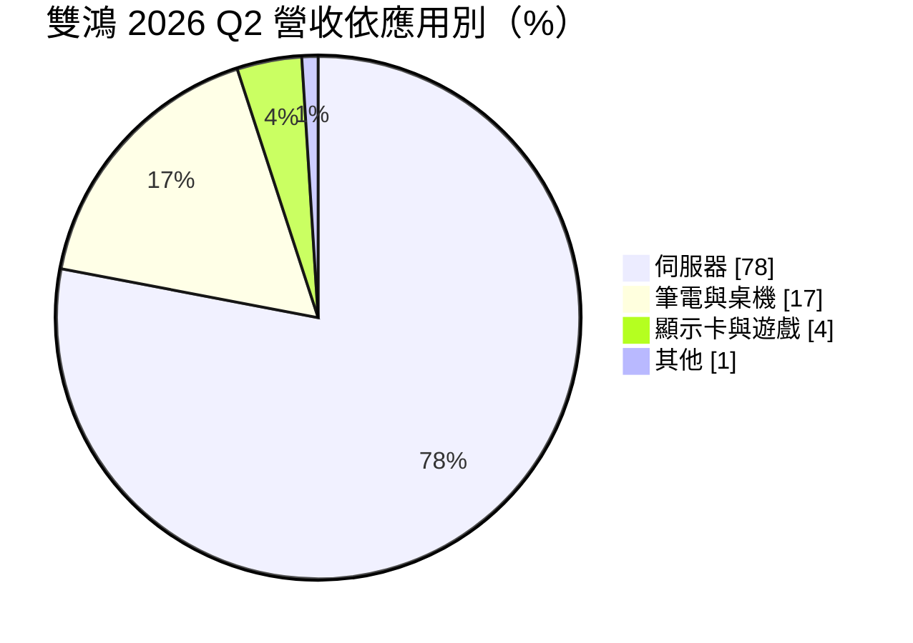
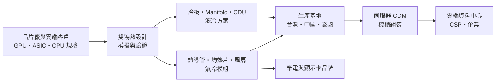
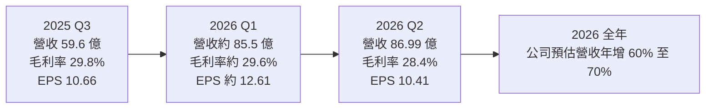
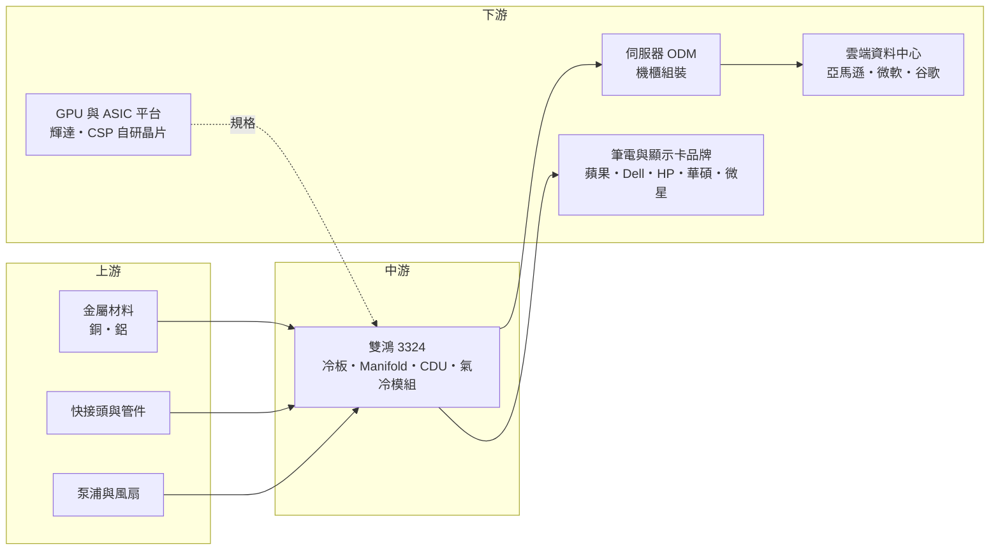

# 3324 雙鴻

> 上櫃｜[[產業索引-其他電子業|其他電子業]]｜上市（櫃）日期 2005/05/13

# 第一章：企業模式與商業藍圖

> [!info] 撰寫說明
> 本文由 Claude 依公開資料整理，架構比照 [[2330台積電]] 的四章研究，資料截至 2026-10-07。財務數字來源：凱基證券研究報告（2026 年 8 月雙鴻第二季財報評論）、旺得富／工商時報（2025 年財報與股利、2026 年 7 月營收報導）、富果研究（2025 年 11 月法說會摘要）、nstock 公司資料；產業描述為整理性內容，尚未逐條比對原始文件。#待校對

在評估單一個股的長期投資價值時，首要步驟是拆解企業的底層獲利邏輯。本章針對雙鴻科技（股票代號：3324，以下簡稱雙鴻）的商業模式進行定性分析，說明一家以筆電散熱模組起家的公司，如何在 AI 伺服器功耗暴增的浪潮中轉型為[[液冷]]散熱解決方案供應商。

## 一、核心定位：從筆電散熱走向 AI 資料中心液冷

雙鴻上櫃超過 20 年，股本約 9.31 億元，董事長林育申、總經理陳志偉。公司早期以筆電、桌機與顯示卡的[[散熱模組]]為主，客戶包括蘋果、Dell、HP、華碩、微星等品牌。

隨著[[AI伺服器]] GPU 的功耗從數百瓦增加到上千瓦，傳統風扇氣冷已經無法帶走熱量，資料中心開始大量導入液冷。雙鴻在這個轉折點建立了兩個優勢：

* **完整的液冷方案能力：** 雙鴻提供冷板（[[Cold Plate]]）、分歧管（[[Manifold]]）與冷卻液分配裝置（[[CDU]]），能以「整體解決方案」的形式交付，而不只是單一零件。
* **重回輝達合格供應商：** 依 2026 年 7 月報導，雙鴻已重回 [[NVDA輝達]] Vera Rubin 平台的合格供應商名單，並同時供應 GB300 與美系雲端服務商（[[CSP]]）的 [[ASIC]] 伺服器液冷專案。

液冷營收占比因此快速提升：2024 年約 12%，2025 年第三季 35%，2026 年上半年 55%，公司目標下半年單月占比達 70%。

## 二、終端應用／產品板塊：伺服器占近八成

2026 年第二季的產品營收結構如下：

* **伺服器：** 2025 年第三季占 60%，2026 年第二季升到 78%。包括 AI 伺服器的液冷冷板、Manifold、CDU，以及一般伺服器的氣冷散熱器。凱基證券預估 2026 年伺服器營收年增 110% 至 120%。成長來源除了 GPU 伺服器，還包括記憶體（[[DIMM]] 冷板）、CPU 與 ASIC 伺服器導入液冷。
* **筆電與桌機：** 傳統本業，2025 年第三季占 27%，2026 年第二季降到 17%，金額相對穩定但比重被伺服器稀釋。
* **顯示卡與遊戲：** 顯示卡散熱器與電競產品，比重由 11% 降到 4%。

## 三、資本轉化邏輯（營運模式）：設計導入、專案量產

* **設計導入（Design-in）：** 散熱方案必須在伺服器平台設計階段就與晶片廠、ODM 共同開發，通過驗證後才能進入量產。一旦被選定，在該平台的生命週期內訂單相對穩定。
* **毛利率隨液冷提升：** 液冷產品的技術門檻與單價都高於傳統氣冷，2025 年[[毛利率]] 27.38%、[[營業利益率]] 14%，分別比前一年提高約 1.9 個百分點。
* **產能就近客戶：** 泰國廠二期 2026 年上半年投產，搭配中國廠，水冷板月產能目標擴充到 30 萬片，DIMM 冷板月產能擴充到 3 萬片（凱基證券資料）。

## 四、企業長期藍圖：液冷滲透率提升的長線受惠者

* **液冷占比：** 2026 年液冷營收預估占全年約 60%，年增 190% 至 200%（凱基證券預估）。
* **全年成長：** 公司預估 2026 年全年營收年增 60% 至 70%；2026 年上半年營收 172.49 億元，已年增 77.31%。
* **產品延伸：** 從 GPU 冷板延伸到記憶體、CPU、ASIC 與交換器的液冷，並提供 CDU 等系統級設備，提高每台伺服器的散熱內容價值。
* **[[CapEx]]：** 凱基證券預估 2026 年資本支出約 30 億元、2027 年約 25 億元，主要用於泰國與中國擴產。

# 第二章：護城河深度與競爭優勢

在長期價值投資中，「護城河」指企業抵禦競爭、維持超額利潤的保護機制。本章分析雙鴻的護城河構成、主要競爭對手，以及這些優勢在液冷市場快速擴張中能守住多少。

## 一、雙鴻護城河的核心組成要素

雙鴻的護城河屬於「窄到中等護城河」，主要來自：

* **1. 熱設計與驗證經驗：** 液冷方案涉及流體力學、材料與防漏設計，任何漏液都可能毀掉整櫃伺服器。雙鴻累積多年散熱設計與大規模量產經驗，通過輝達與雲端客戶的驗證，是新進者短期內難以複製的門檻。
* **2. 整體解決方案：** 能同時提供冷板、Manifold 與 CDU，客戶可以減少整合不同供應商的風險。富果研究整理的法說會資料指出，雙鴻把自己定位為系統整合商，而非單純零件廠。
* **3. 平台綁定：** 一旦進入特定 GPU 平台或 CSP 專案的合格供應商名單，在該平台生命週期內換供應商的成本高。

不過，報導以「重回」輝達 Vera Rubin 合格供應商名單來描述，代表雙鴻在先前某一代平台曾不在名單內（細節未查得），顯示這種平台綁定需要每一代重新爭取。

## 二、全球主要競爭對手格局

| 對手 | 定位 | 對雙鴻的威脅 |
|---|---|---|
| [[3017奇鋐]] | 台灣最大散熱廠之一，氣冷與液冷並進 | 規模大，在 AI 伺服器散熱市占高，直接競爭冷板與機櫃散熱 |
| 酷碼（Cooler Master） | 消費性散熱品牌，切入伺服器液冷 | 在冷板與 CDU 競爭輝達訂單 |
| Vertiv 等資料中心基礎設施廠 | CDU 與機房級冷卻系統 | 在大型 CDU 與機房級系統占優勢 |
| [[2308台達電]] | 電源與散熱整合方案 | 以電源加散熱的整合方案爭取機櫃訂單 |
| [[2354鴻準]] | 鴻海集團散熱與機構件 | 散熱業務規模較小，但有集團資源，屬後進者 |

## 三、優勢轉化：哪些市場守得住、哪些守不住

* **守得住：** 已通過驗證的 GPU 與 CSP ASIC 平台冷板與 Manifold，以及記憶體 DIMM 冷板等新應用。2026 年第二季營收年增 64%，顯示接單能力。
* **守不住或面臨壓力：** 液冷市場快速擴大後，競爭者大量投入產能，價格競爭可能加劇。2026 年第二季毛利率由第一季的 29.6% 降到 28.4%，營業利益率由 17.8% 降到 16.0%。
* **觀察重點：** Vera Rubin 平台出貨後的份額、CSP ASIC 液冷專案的放量時間，以及泰國新產能的利用率。

# 第三章：財務體質與盈利規模

資料日期：2026-10-07。數字取自凱基證券研究報告、工商時報與富果研究整理的財報資料，表格是撰寫當時的快照；最新月營收、毛利率、累計 EPS 由自動排程寫在本筆記的屬性欄位（月營收、毛利率、累計EPS 等）。#待校對

財務報表是檢驗護城河是否真實存在的最終標準。本章用三率、ROE、現金流與資本報酬，檢視雙鴻在液冷轉型期的獲利品質。

## 一、獲利能力的基石：三率

| 項目 | 2025 全年 | 2025 Q3 | 2026 Q1 | 2026 Q2 |
|---|---|---|---|---|
| 營收（新台幣） | 232.76 億 | 59.6 億 | 約 85.5 億（推算） | 86.99 億 |
| [[毛利率]] | 27.38% | 29.8% | 約 29.6%（推算） | 28.4% |
| [[營業利益率]] | 14.0% | 未查得 | 約 17.8%（推算） | 16.0% |
| EPS（元） | 28.26 | 10.66 | 約 12.61（推算） | 10.41 |

2026 年第一季數字以上半年減第二季，或以第二季的季變動推算；上半年 EPS 23.02 元、營收 172.49 億元。

* **營收：** 2025 年營收 232.76 億元、年增 47.52%；2026 年上半年 172.49 億元、年增 77.31%，第二季 86.99 億元創單季新高。
* **[[毛利率]]：** 液冷占比提升帶動毛利率從 2024 年約 25.5% 升到 2025 年的 27.38%，2025 年第三季一度達 29.8%。2026 年第二季略降至 28.4%，可能與新產能爬坡、產品組合與匯率有關（推估）。
* **[[營業利益率]]：** 2025 年營業淨利 32.59 億元、年增 70.56%，營業利益率 14%；2026 年上半年提升到 16% 至 18%，顯示規模經濟效益。
* **EPS：** 2025 年稅後淨利 25.72 億元、EPS 28.26 元；2026 年上半年 EPS 23.02 元，年增 211%。第二季 EPS 季減 17.4%，與營業利益率下滑及業外變動有關。

## 二、[[ROE]]：資本效率

依 nstock 資料，雙鴻近期 ROE 約 31%，每股淨值約 142.51 元，近四季 EPS 約 43.81 元。在營收高速成長、資產周轉率提高的情況下，ROE 由過去的雙位數低段大幅提升，屬於散熱產業中的高資本效率水準。

## 三、資本支出與[[自由現金流]]

* **[[CapEx]]：** 凱基證券預估 2026 年約 30 億元、2027 年約 25 億元，相對 2025 年 25.72 億元的稅後淨利，屬於積極擴產。
* **股利：** 2025 年度每股配發現金股利 12 元，配息率約 42%；凱基證券預估 2026 年度股利約 24.02 元（券商推估）。
* **自由現金流：** 高速成長期需要大量營運資金（存貨、應收帳款）與資本支出，自由現金流可能低於淨利（推估）。配息率維持在四成多，保留盈餘支應擴產。

## 四、[[ROIC]] 與 [[WACC]]：價值創造利差

以營業利益率約 16%、ROE 約 31% 推估，雙鴻目前的 ROIC 明顯高於資金成本，處於價值創造期（推估，具體數值未查得）。關鍵在於這個利差能維持多久：液冷市場的高成長吸引大量競爭者，若毛利率回落到 20% 出頭、同時新產能利用率不足，ROIC 可能快速下滑。

# 第四章：總體風險與地緣政治

任何企業都無法脫離宏觀環境獨立存在。本章分析雙鴻未來必須面對的地緣政治、產業週期、營運與技術風險。

## 一、地緣政治風險

* **中國產能與美國關稅：** 雙鴻有部分產能在中國，美國對中國製伺服器零組件的關稅與限制，促使客戶要求轉移到中國以外，這也是泰國廠擴產的主因。
* **AI 晶片出口管制：** 美國對高階 AI 晶片出口中國的限制，影響中國市場的 AI 伺服器需求，間接影響散熱訂單。
* **東南亞營運：** 泰國擴產可降低關稅風險，但當地供應鏈配套、人力與政治穩定性都需要時間驗證。

## 二、產業週期與市場結構

* **AI 資本支出週期：** 雙鴻近八成營收來自伺服器，高度依賴雲端服務商的 AI 資本支出。若 CSP 放緩 AI 投資，訂單可能快速下滑。
* **平台世代交替：** 每一代 GPU 平台都要重新爭取供應商資格，雙鴻「重回」Vera Rubin 名單的報導，也說明供應商資格並非永久。
* **[[長鞭效應]]：** AI 伺服器供應鏈在平台轉換期容易出現提前備貨與庫存調整，散熱廠的季度營收波動會被放大。

## 三、營運環境的隱性風險

* **客戶集中：** 伺服器營收集中在少數 GPU 平台與 CSP 客戶，單一客戶的設計變更或供應商分配調整，影響很大。
* **品質責任：** 液冷系統一旦漏液，可能造成整櫃伺服器損壞，品質事故的賠償與商譽風險很高。
* **擴產執行：** 泰國與中國同時擴產，若需求不如預期，新增折舊將壓抑毛利率。
* **估值波動：** 股價約在千元上下，市場預期高，財報若不如預期，股價波動劇烈。

## 四、科技或法規演進

* **散熱技術路線：** 從單相冷板走向[[浸沒式冷卻]]或兩相冷卻時，散熱架構與供應商可能重新洗牌，雙鴻需要持續投資新技術。
* **晶片整合散熱：** 若晶片廠把散熱結構直接整合在封裝內（例如微流道冷卻），外部冷板的價值可能被壓縮。
* **資料中心能效法規：** 歐美對資料中心用電效率（[[PUE]]）的要求提高，有利於液冷滲透，對雙鴻屬正面因素。

# 專有名詞解析

## 半導體

- **[[ASIC]]**：特定應用積體電路，為特定用途客製設計的晶片，雲端業者自研的 AI 加速器多屬此類。
- **[[DIMM]]**：雙列直插式記憶體模組，伺服器使用的記憶體條，高速運作時也需要散熱。

## 應用

- **[[AI伺服器]]**：搭載 GPU 或 AI 加速器、用於訓練與推論的伺服器，功耗與散熱需求遠高於一般伺服器。

## 金融

- **[[ROE]]**：股東權益報酬率，稅後淨利除以股東權益，衡量公司用股東的錢賺錢的效率。
- **[[CapEx]]**：資本支出，企業購置廠房、設備等長期資產的支出。
- **[[長鞭效應]]**：終端需求的小幅變動，沿供應鏈往上游傳遞時被逐級放大，造成上游庫存與訂單劇烈波動。

## 產業

- **[[散熱模組]]**：由熱導管、均熱片、散熱鰭片與風扇組成，把晶片產生的熱帶走，是筆電與伺服器的必要零件。
- **[[液冷]]**：以液體流經貼在晶片上的冷板帶走熱量，散熱效率遠高於風扇氣冷，是高功耗 AI 伺服器的主流方案。
- **[[Cold Plate]]**：水冷板，直接貼合在 GPU 或 CPU 上、內部有液體流道的金屬板，是液冷系統最核心的零件。
- **[[Manifold]]**：分歧管，把冷卻液平均分配到機櫃內各台伺服器冷板的管路系統。
- **[[CDU]]**：冷卻液分配裝置，負責冷卻液的循環、熱交換與溫度控制，是液冷系統的心臟。
- **[[浸沒式冷卻]]**：把伺服器整個浸泡在不導電的冷卻液中散熱，效率更高，但系統改動大。
- **[[PUE]]**：電力使用效率，資料中心總用電除以 IT 設備用電，越接近 1 代表越節能。
- **[[CSP]]**：雲端服務供應商，例如亞馬遜、微軟、谷歌，是 AI 伺服器最大的採購者。

# 核心供應鏈

## 1. 上游：材料與零組件
- 銅、鋁金屬材料與管件、快接頭、泵浦供應商（個別名稱未查得）

## 2. 中游：雙鴻本身與同業
- 散熱同業：[[3017奇鋐]]、[[2308台達電]]、[[2354鴻準]]、酷碼

## 3. 下游：晶片平台與伺服器組裝
- GPU 平台：[[NVDA輝達]]（Vera Rubin 合格供應商）
- 伺服器 ODM：[[2317鴻海]]、[[2382廣達]]、[[6669緯穎]]（依產業常見資料，個別合作關係未逐一比對）
- 雲端服務商：[[AMZN亞馬遜]]、[[MSFT微軟]]、[[GOOGL谷歌]]（依產業常見資料）

## 4. 下游：PC 與顯示卡品牌
- [[AAPL蘋果]]、Dell、HP、[[2357華碩]]、[[2377微星]]

## 最新新聞
<!-- news:start -->
<!-- news:end -->

## 相關連結
- [公開資訊觀測站](https://mopsov.twse.com.tw/mops/web/t05st03?step=1&firstin=1&co_id=3324)
- [Goodinfo](https://goodinfo.tw/tw/StockDetail.asp?STOCK_ID=3324)
- [Yahoo 股市](https://tw.stock.yahoo.com/quote/3324)
- [鉅亨網新聞](https://www.cnyes.com/twstock/3324/news)
