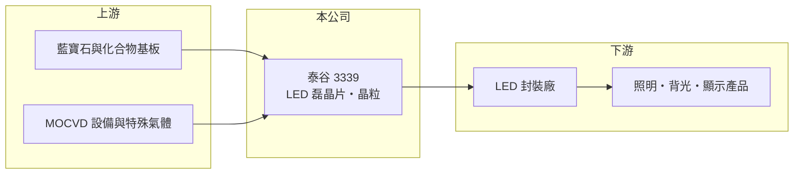

# 3339 泰谷

> 上櫃｜[[產業索引-光電業|光電業]]｜上市（櫃）日期 2006/06/27

# 第一章：企業模式與商業藍圖

> [!info] 撰寫說明
> 精簡版，由 Claude 依公開資料整理，架構比照 [[2330台積電]]，資料截至 2026-10-07。來源：nstock.tw 泰谷公司概況、winvest.tw 營收快訊。公開資料有限，營收比重未查到。#待校對

泰谷是 LED 上游的[[磊晶]]與晶粒廠，2026 年營收衰退且毛利為負。

- **核心業務：** 泰谷光電成立於 2000 年，總部位於南投縣南投市，業務為發光二極體的磊晶片與 [[LED晶粒]]製造銷售，以及電子材料銷售。
- **營收結構：** 本次未查到各產品與應用的營收比重。
- **營運據點：** 總部與廠區位於南投（推估），其他據點本次未查到。
- **長期方向：** 一般照明 LED 晶粒已高度商品化，泰谷需要轉向利基型或特殊波長產品才有機會改善獲利（推估）。

# 第二章：護城河深度與競爭優勢

泰谷在 LED 晶粒市場屬小型業者，面對中國大廠的規模與價格競爭，護城河薄弱。

- **競爭優勢：** 具備磊晶與晶粒一貫製程，可依客戶需求調整產品規格；但公開資料看不出明確的規模或技術優勢。
- **主要對手：** 國內有 [[3714富采]]，中國則有三安光電、華燦光電等大型晶粒廠。
- **觀察重點：** 毛利率何時轉正，以及是否有新產品或產能調整計畫。

# 第三章：財務體質與盈利規模

資料日期：2026-10-07，以下數字是撰寫當時的快照；最新月營收、毛利率、累計 EPS 由自動排程寫在本筆記的屬性欄位（月營收、毛利率、累計EPS 等）。#待校對

泰谷營收下滑，第二季毛利率與營業利益率都是負值。

- **營收規模：** 2026 年 1 至 8 月累計營收 5.49 億元；8 月營收 6,921.4 萬元、年減 8.83%，6 月 6,684.3 萬元、年減 37.66%。
- **獲利：** 2026 年第二季 EPS -1.83 元，[[毛利率]] -6.7%，[[營業利益率]] -64.07%，淨利率 -56.68%。
- **財務特色：** 資本額約 6.66 億元，近五年沒有配息紀錄。

# 第四章：總體風險與地緣政治

泰谷的風險在於產品商品化與持續虧損。

- **產業週期：** LED 晶粒報價長期下滑，需求跟著照明、背光與顯示產品景氣起伏。
- **營運風險：** 毛利為負代表[[產能利用率]]或售價不足以支應成本，若持續虧損，可能需要減資、增資或處分資產。
- **其他風險：** 中國晶粒廠擴產造成的價格壓力；藍寶石基板等原料價格與匯率波動。

# 專有名詞解析

## 半導體

- **[[磊晶]]**：在基板上長出一層排列整齊的晶體薄膜，是 LED 與化合物半導體元件的關鍵製程。
- **[[LED晶粒]]**：在磊晶片上切割出的發光二極體晶片，是 LED 封裝廠的主要原料。

## 金融

- **[[產能利用率]]**：實際使用產能占總產能的比例，固定成本高的製造業毛利率高度取決於此數字。

# 核心供應鏈

- 上游：藍寶石與化合物基板、MOCVD 設備與特殊氣體供應商
- 下游／客戶：LED 封裝廠（如 [[2393億光]]，推估）、照明與顯示產品廠
- 同業：[[3714富采]]、三安光電、華燦光電

## 最新新聞
<!-- news:start -->
<!-- news:end -->

## 相關連結
- [公開資訊觀測站](https://mopsov.twse.com.tw/mops/web/t05st03?step=1&firstin=1&co_id=3339)
- [Goodinfo](https://goodinfo.tw/tw/StockDetail.asp?STOCK_ID=3339)
- [Yahoo 股市](https://tw.stock.yahoo.com/quote/3339)
- [鉅亨網新聞](https://www.cnyes.com/twstock/3339/news)
