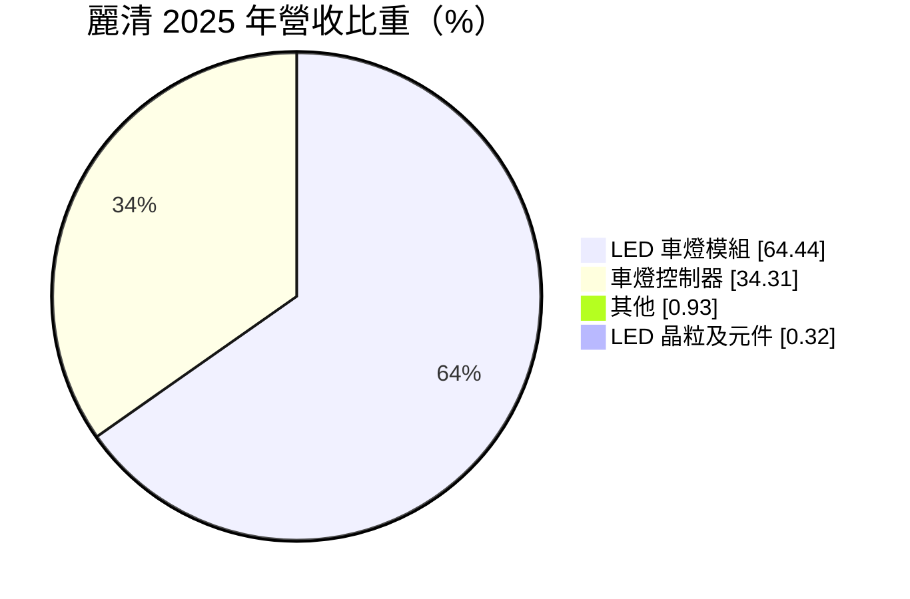
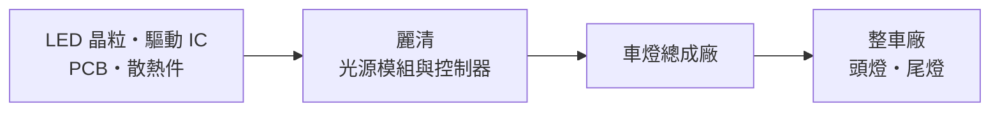
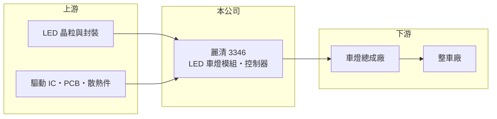

# 3346 麗清

> 上市｜[[產業索引-汽車工業|汽車工業]]｜上市（櫃）日期 2016/12/19

# 第一章：企業模式與商業藍圖

> [!info] 撰寫說明
> 本文由 Claude 依公開資料整理，架構比照 [[2330台積電]] 的四章研究，資料截至 2026-10-08。財務數字來源：Goodinfo 台灣股市資訊網年度經營績效、MoneyDJ 理財網個股基本資料（營收比重）、證交所開放資料（本筆記 _data 快照）。轉型歷程、據點與客戶類型憑既有知識整理並標「待校對」。#待校對

在評估單一個股的長期投資價值時，首要步驟是拆解企業的底層獲利邏輯。本章說明麗清科技（股票代號：3346，以下簡稱麗清）如何從 LED 元件轉型為車燈模組供應商，以及為何營收翻倍、獲利卻沒有跟上。

## 一、核心定位：車燈裡的光源模組與控制器

麗清成立於 1999 年，2016 年上市。依 MoneyDJ，2025 年營收中 LED 車燈模組占 64.44%、車燈控制器占 34.31%、其他 0.93%、LED 晶粒及元件 0.32%。公司早期以 LED 元件與消費性電子應用為主，後來轉向車用（待校對），目前幾乎是純車用照明公司。

車燈模組是把 LED 光源、散熱件與電路整合在一起，裝進頭燈、尾燈的核心零件；車燈控制器則負責驅動 LED，讓頭燈能自動調整亮度與照射範圍。麗清賣給車燈總成廠，再由車燈廠組成完整燈具交給車廠（推估）。

## 二、資本轉化邏輯

麗清的位置在車燈總成廠的上游。LED 頭燈普及後，每台車的車燈電子含量大增，這讓麗清的營收從 2019 年的 41.3 億元成長到 2024 年的 93.4 億元（Goodinfo）。但作為二階供應商，它的議價能力受到車燈廠與車廠雙重擠壓，毛利率從 16% 降到 10.5%，營收成長並沒有轉成獲利成長。

## 三、企業長期方向

車燈正從單純照明走向「智慧照明」：可以分區明暗的[[ADB 頭燈]]、可顯示圖案的像素燈、與車身融合的貫穿式燈條。這些都需要更多光源模組與控制器，是麗清的長期成長來源。公司的課題是提高控制器這類較高附加價值產品的比重，並分散客戶。

# 第二章：護城河深度與競爭優勢

在長期價值投資中，「護城河」指企業抵禦競爭、維持超額利潤的保護機制。本章分析麗清的優勢為何不足以保護利潤。

## 一、護城河的核心組成要素

* **1. 車規驗證：** 車燈模組與控制器需要通過車規可靠度測試，量產後隨車型出貨數年，提供基本的訂單能見度。
* **2. 光源與電子整合能力：** 同時做光源模組與控制器，可以提供車燈廠一站式方案，這是麗清與單純 LED 封裝廠的差別。
* **3. 護城河偏窄：** 2025 年營業利益率只有 0.27%（Goodinfo），代表上述優勢沒有轉化為定價能力，競爭與客戶議價壓力大。

## 二、主要對手

| 對手 | 定位 | 對麗清的威脅 |
|---|---|---|
| 歐司朗、日亞化等國際 LED 大廠 | 掌握車用 LED 光源 | 以品牌與技術取得高階專案 |
| 中國車燈電子廠 | 成本低、貼近中國車燈廠 | 價格競爭最激烈 |
| [[3717聯嘉投控]] | 台系車用 LED 模組 | 在車燈模組直接重疊 |
| 車燈總成廠自製 | 大型車燈廠內製模組 | 減少外購 |

## 三、守得住／守不住／觀察重點

* **守得住：** 已量產車型的出貨，以及整合光源與控制器的方案。
* **守不住：** 一般 LED 模組的價格，中國競爭者擴產後報價持續下降。
* **觀察重點：** 毛利率能否回到 14% 以上，以及控制器比重能否提高。

# 第三章：財務體質與盈利規模

資料日期：2026-10-08。數字取自 Goodinfo 年度經營績效與證交所開放資料快照，表格是撰寫當時的快照；最新月營收、毛利率、累計 EPS 由自動排程寫在本筆記的屬性欄位（月營收、毛利率、累計EPS 等）。#待校對

財務報表是檢驗護城河是否真實存在的最終標準。本章用多年度數字檢視麗清「營收成長、獲利停滯」的問題。

## 一、多年度三率與 ROE

| 年度 | 營收（新台幣） | [[毛利率]] | [[營業利益率]] | EPS（元） | [[ROE]] |
|---|---|---|---|---|---|
| 2021 | 56.6 億 | 15.3% | 1.62% | 1.03 | 4.58% |
| 2022 | 66.1 億 | 12.8% | 1.04% | 0.30 | 1.21% |
| 2023 | 84.7 億 | 14.4% | 4.18% | 2.83 | 10.3% |
| 2024 | 93.4 億 | 13.9% | 3.34% | 2.36 | 7.98% |
| 2025 | 85.4 億 | 10.5% | 0.27% | 0.11 | 0.37% |
| 2026 上半年 | 36.1 億 | 9.48% | -4.04% | -0.86 | 未查得 |

* **[[毛利率]]：** 從 2019 年的 16.2% 一路降到 2026 年上半年的 9.48%，營收規模擴大並未帶來更好的毛利。
* **[[營業利益率]]：** 只有 2023 至 2024 年超過 3%，2026 年上半年轉為 -4.04%，營業損失 1.46 億元（證交所開放資料）。2026 年 1 至 8 月營收 50.0 億元，較前一年同期 57.3 億元減少約 13%。
* **長期指標：** 2020 至 2025 年營收年複合成長率約 14%（推算，43.5 億到 85.4 億）；2021 至 2025 年平均 ROE 約 4.9%（推算）。2025 年度現金股利僅 0.11 元（證交所開放資料）。

## 二、財務結構

2026 年第二季底資產 104.7 億元、負債 68.9 億元，負債比約 66%，每股淨值 29.74 元（證交所開放資料），股價淨值比約 0.79 倍。營收擴張主要靠營運資金與負債支撐，負債比偏高。

## 三、[[ROIC]] 與 [[WACC]]

2025 年營業利益約 0.23 億元（85.4 億元 × 0.27%），稅後約 0.18 億元。投入資本以權益 35.8 億元加非流動負債 22.0 億元近似（約 57.8 億元，有息負債細項未查得），ROIC 約 0.3%（推算）；表現最好的 2023 年也只有約 4.9%（營業利益 3.54 億元、稅後 2.83 億元，以同一資本基礎推算）。WACC 以 CAPM 推估：無風險利率 1.5% 至 2%、市場風險溢酬 6%、β 未查得，取 1.1（假設），權益成本約 8.1% 至 8.6%；負債成本假設 3%、稅後 2.4%，負債約占資本四成，WACC 約 5.5% 至 6%（推算）。ROIC 長期低於 WACC，麗清的營收成長尚未為股東創造價值。

# 第四章：總體風險與地緣政治

任何企業都無法脫離宏觀環境獨立存在。本章整理麗清長期必須面對的風險。

## 一、地緣政治與政策

* **生產與客戶地區：** 生產據點與主要客戶的地理分布未查得，若集中在中國，會受中國車市價格戰與兩岸關係影響（推估）。

## 二、產業週期與市場結構

* **車市與價格戰：** 車燈模組需求與新車產量連動，車廠降價壓力會一路傳到二階供應商。
* **客戶集中：** 營收在幾年內翻倍，常意味著少數大客戶貢獻大部分成長，客戶車型銷量變化會放大影響（推估）。

## 三、營運風險

* **財務槓桿：** 負債比約 66%，獲利轉弱時償債與營運資金壓力上升。
* **存貨與應收：** 營收萎縮時，庫存與應收帳款可能需要提列損失。

## 四、技術演進

* **智慧照明：** ADB 與像素燈需要更高的光學與軟體能力，若麗清無法跟上，可能被具備晶片與軟體能力的國際廠取代。

# 專有名詞解析

## 應用

- **[[ADB 頭燈]]**：自適應遠光燈，可依前方來車自動遮蔽部分光區，讓駕駛持續使用遠光而不眩目他人。
- **[[車燈控制器]]**：驅動車燈 LED、控制亮度與照射範圍的電子模組。

## 金融

- **[[ROIC]]**：投入資本報酬率，衡量公司用股東與債權人資金創造本業稅後利潤的效率。
- **[[WACC]]**：加權平均資金成本，依股權與負債比重加權的資金成本，是 ROIC 要超過的門檻。

## 產業

- **[[一階供應商]]**：直接供貨給整車廠的零件廠，又稱 Tier 1，向下再向二階、三階供應商採購。

# 核心供應鏈

## 1. 上游：元件
- LED 晶粒與封裝、驅動 IC、印刷電路板與散熱件（供應商名稱未查得）

## 2. 中游：麗清本身
- LED 車燈模組與車燈控制器的設計與製造

## 3. 下游：客戶
- 車燈總成廠，最終供應整車廠（客戶名單未查得）

## 4. 同業
- 台股：[[3717聯嘉投控]]、[[2248華勝-KY]]
- 國際：歐司朗、日亞化

## 最新新聞
<!-- news:start -->
<!-- news:end -->

## 相關連結
- [公開資訊觀測站](https://mopsov.twse.com.tw/mops/web/t05st03?step=1&firstin=1&co_id=3346)
- [Goodinfo](https://goodinfo.tw/tw/StockDetail.asp?STOCK_ID=3346)
- [Yahoo 股市](https://tw.stock.yahoo.com/quote/3346)
- [鉅亨網新聞](https://www.cnyes.com/twstock/3346/news)
