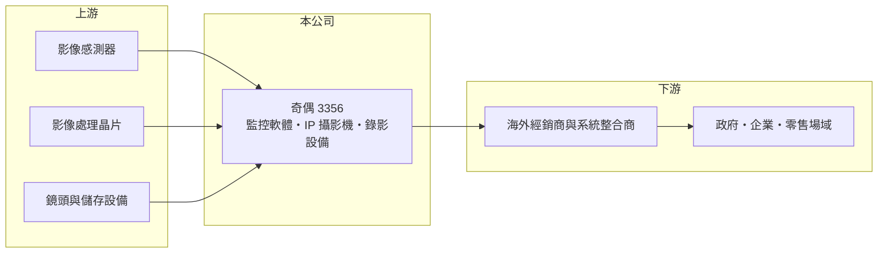

# 3356 奇偶

> 上市｜[[產業索引-光電業|光電業]]｜上市（櫃）日期 2005/03/28

# 第一章：企業模式與商業藍圖

> [!info] 撰寫說明
> 精簡版，由 Claude 依公開資料整理，架構比照 [[2330台積電]]，資料截至 2026-10-07。來源：nstock.tw 奇偶公司概況、winvest.tw 營收快訊。營收比重未查到。#待校對

奇偶是以監控軟體起家的數位監控系統商，毛利率高，配息穩定。

- **核心業務：** 奇偶科技（GeoVision）經營遠端數位監控系統的研發、銷售與售後服務，產品涵蓋影像管理軟體（[[VMS]]）、[[IP攝影機]]與錄影設備（推估）。
- **營收結構：** 本次未查到軟體、攝影機與系統各自的營收比重，也未查到地區比重。
- **營運據點：** 生產與營運據點本次未查到，本文不推測。
- **長期方向：** 監控系統朝網路化、雲端與 [[AI影像辨識]]發展，奇偶以軟體為核心，較有機會在分析功能上建立差異化。

# 第二章：護城河深度與競爭優勢

奇偶的優勢在軟硬整合的系統能力，第二季毛利率接近五成，高於一般監控硬體廠。

- **競爭優勢：** 自有監控軟體平台，客戶一旦建置系統，後續擴充多沿用同一套平台，具一定轉換成本；台灣製造背景也有機會受惠[[非紅供應鏈]]採購（推估）。
- **主要對手：** 國內有 3454晶睿、[[3128昇銳]]、[[3297杭特]]，國際上則有海康威視、大華與 Milestone 等軟體平台業者。
- **觀察重點：** 營業利益率偏低的原因，以及第二季大額非本業收益的來源與是否反映在配息上。

# 第三章：財務體質與盈利規模

資料日期：2026-10-07，以下數字是撰寫當時的快照；最新月營收、毛利率、累計 EPS 由自動排程寫在本筆記的屬性欄位（月營收、毛利率、累計EPS 等）。#待校對

奇偶營收穩定成長，第二季 EPS 大增主要來自非本業收益。

- **營收規模：** 2025 年全年營收 10.19 億元；2026 年 1 至 8 月累計 7.53 億元、年增 14.76%，6 月營收 9,543 萬元、年增 24.09%，8 月 0.88 億元、年增 20.63%。
- **獲利：** 2026 年第二季 EPS 5.58 元，[[毛利率]] 47.78%，[[營業利益率]] 2.23%，淨利率 159.27%；淨利超過營收，推估來自處分資產或投資的[[一次性收益]]。
- **財務特色：** 資本額約 8.05 億元；2025 年第四季配發現金股利 3.5 元，近五年平均現金股利 2.6 元，平均現金[[殖利率]]約 4.95%。

# 第四章：總體風險與地緣政治

奇偶的風險在於本業利潤率偏低，以及單季獲利難以延續。

- **產業週期：** 監控系統需求跟著政府標案、企業資本支出與海外經銷景氣起伏。
- **營運風險：** 研發與銷售費用高，營業利益率僅約 2%，一次性收益消失後 EPS 會大幅回落。
- **其他風險：** 海外銷售面對匯率波動；各國資安與採購法規變化可能影響產品認證與接單。

# 專有名詞解析

## 應用

- **[[VMS]]**：影像管理軟體，集中管理多台攝影機、錄影與警報事件的平台軟體。
- **[[IP攝影機]]**：透過網路傳輸影像的監控攝影機，可直接接上網路交換器，不必經過類比線路與錄影主機。
- **[[AI影像辨識]]**：用深度學習模型分析影像，自動辨識人、車、物件或異常狀況。

## 金融

- **[[一次性收益]]**：處分資產、土地或投資等不會每年重複的收益，會讓單期 EPS 偏離本業實力。
- **[[殖利率]]**：每年現金股利除以股價，用來衡量以現價買進可領回的現金報酬。

## 產業

- **[[非紅供應鏈]]**：排除中國製零組件的供應鏈，常見於國防、無人機與政府採購規範。

# 核心供應鏈

- 上游：影像感測器（如 [[SONY索尼]]）、影像處理晶片、鏡頭與儲存設備供應商
- 下游／客戶：海外經銷商與系統整合商、政府與企業場域（推估）
- 同業：3454晶睿、[[3128昇銳]]、[[3297杭特]]、海康威視、大華

## 最新新聞
<!-- news:start -->
<!-- news:end -->

## 相關連結
- [公開資訊觀測站](https://mopsov.twse.com.tw/mops/web/t05st03?step=1&firstin=1&co_id=3356)
- [Goodinfo](https://goodinfo.tw/tw/StockDetail.asp?STOCK_ID=3356)
- [Yahoo 股市](https://tw.stock.yahoo.com/quote/3356)
- [鉅亨網新聞](https://www.cnyes.com/twstock/3356/news)
