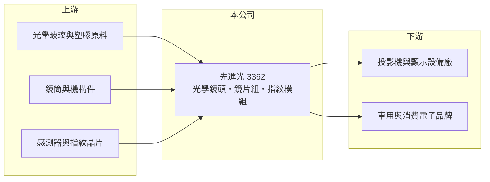

# 3362 先進光

> 上櫃｜[[產業索引-光電業|光電業]]｜上市（櫃）日期 2005/09/06

# 第一章：企業模式與商業藍圖

> [!info] 撰寫說明
> 精簡版，由 Claude 依公開資料整理，架構比照 [[2330台積電]]，資料截至 2026-10-07。來源：nstock.tw 先進光公司概況、優分析現增報導標題（搜尋結果）。營收比重未查到。#待校對

先進光是光學鏡頭廠，2026 年營收下滑並出現虧損，但市值仍明顯高於基本面。

- **核心業務：** 先進光電成立於 1986 年，業務為光學鏡頭與鏡片組合的製造買賣、[[指紋辨識]]模組，以及光學元件加工。
- **營收結構：** 本次未查到各類鏡頭與模組的營收比重；推估以投影機、車用與消費電子鏡頭為主。
- **營運據點：** 生產與營運據點本次未查到，本文不推測。
- **長期方向：** 依優分析報導，公司 2026 年初辦理[[現金增資]]募集約 4.2 億元；資金用途與新產品方向需以公司公告確認。

# 第二章：護城河深度與競爭優勢

先進光的優勢在光學設計與鏡片組裝經驗，但光學鏡頭市場由大廠主導。

- **競爭優勢：** 具備光學設計、玻璃與塑膠鏡片組裝能力，可承接客製鏡頭開發；車用鏡頭需要長期[[車規驗證]]，導入後轉換成本較高（推估）。
- **主要對手：** 國內有 [[3008大立光]]、[[3406玉晶光]]、[[3504揚明光]]，以及中國的舜宇光學等大廠。
- **觀察重點：** 毛利率能否從個位數回升，以及現增資金投入的新產品何時貢獻營收。

# 第三章：財務體質與盈利規模

資料日期：2026-10-07，以下數字是撰寫當時的快照；最新月營收、毛利率、累計 EPS 由自動排程寫在本筆記的屬性欄位（月營收、毛利率、累計EPS 等）。#待校對

先進光營收下滑，第二季毛利率僅 8%，營業虧損擴大。

- **營收規模：** 2025 年全年營收 43.17 億元；2026 年 1 至 8 月累計 27.19 億元、年減 5.3%，8 月營收 2.44 億元、月減 41.3%、年減 32.91%。
- **獲利：** 2026 年第二季 EPS -1.38 元，[[毛利率]] 8.32%，[[營業利益率]] -23.52%，淨利率 -20.83%。
- **財務特色：** 資本額約 14.74 億元，市值約 277.93 億元；2025 年未配發股利。

# 第四章：總體風險與地緣政治

先進光的風險在於虧損擴大與評價明顯領先基本面。

- **產業週期：** 鏡頭需求跟著投影機、車用與消費電子出貨起伏，新產品專案切換時營收波動大。
- **營運風險：** 毛利率偏低時固定成本難以攤提；若新產品放量不如預期，虧損可能延續，現金增資也會稀釋股本。
- **其他風險：** 股價約 188.5 元、遠高於近一年均價 129.41 元，評價波動風險高；匯率與光學玻璃原料價格影響成本。

# 專有名詞解析

## 應用

- **[[指紋辨識]]**：以光學、電容或超音波感測器讀取指紋紋路來驗證身分的技術，常見於手機、筆電與門禁。
- **[[車規驗證]]**：車用零組件須通過可靠度測試與車廠認證，流程常需 2 至 3 年，因此轉換成本高。

## 金融

- **[[現金增資]]**：公司發行新股向投資人募集現金，可充實營運資金，但會稀釋原股東的每股盈餘。

# 核心供應鏈

- 上游：光學玻璃與塑膠原料、鏡筒與機構件、感測器與指紋晶片供應商
- 下游／客戶：投影機與顯示設備廠（如 [[5371中光電]]，推估）、車用與消費電子品牌
- 同業：[[3008大立光]]、[[3406玉晶光]]、[[3504揚明光]]、舜宇光學

## 最新新聞
<!-- news:start -->
<!-- news:end -->

## 相關連結
- [公開資訊觀測站](https://mopsov.twse.com.tw/mops/web/t05st03?step=1&firstin=1&co_id=3362)
- [Goodinfo](https://goodinfo.tw/tw/StockDetail.asp?STOCK_ID=3362)
- [Yahoo 股市](https://tw.stock.yahoo.com/quote/3362)
- [鉅亨網新聞](https://www.cnyes.com/twstock/3362/news)
