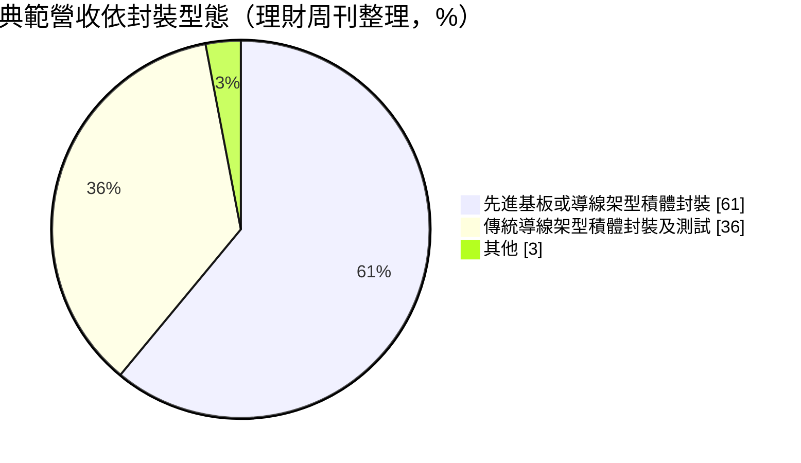
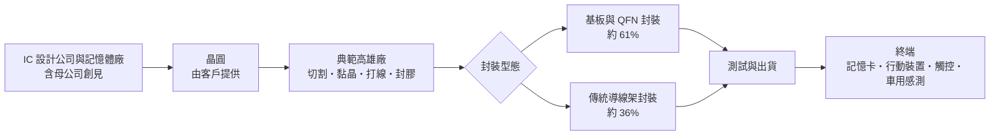
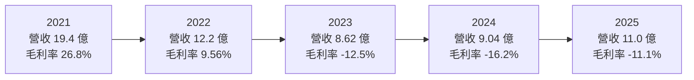
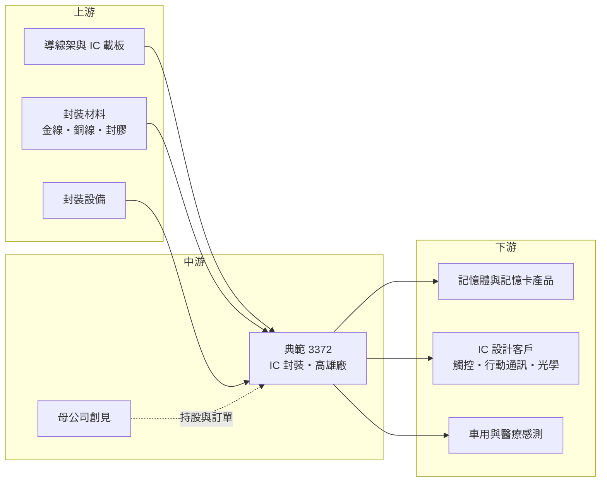

# 3372 典範

> 上櫃｜[[產業索引-半導體業|半導體業]]｜上市（櫃）日期 2005/12/16

# 第一章：企業模式與商業藍圖

> [!info] 撰寫說明
> 本文由 Claude 依公開資料整理，架構比照 [[2330台積電]] 的四章研究，資料截至 2026-10-08。財務數字來源：Goodinfo 年度獲利指標、資產負債結構與股利政策頁、聚財網季度損益表、nstock 公司資料頁、理財周刊個股報導、旺得富與鉅亨公司基本資料頁；產業描述為整理性內容，尚未逐條比對原始文件。#待校對

在評估單一個股的長期投資價值時，首要步驟是拆解企業的底層獲利邏輯。本章針對台灣典範半導體（股票代號：3372，以下簡稱典範）的商業模式進行定性分析，說明這家小型封測廠如何在記憶體品牌 [[2451創見]] 的支持下經營、為什麼它的獲利在景氣高低點之間落差極大，以及它長期面對的結構性挑戰。

## 一、核心定位：記憶體集團旗下的中小型封測廠

典範成立於 1998 年，英文名 Taiwan IC Packaging Corporation，2005 年 12 月上櫃，廠址位於高雄市前鎮區，資本額約 17.53 億元。董事長束崇萬同時是記憶體模組品牌創見的創辦人，依理財周刊報導，典範是創見轉投資的封測廠。

典範的業務幾乎全部是 IC 封裝，依旺得富資料，封裝占營收 99.98%。它提供的封裝型態涵蓋傳統[[導線架]]封裝（[[SOP]]、SSOP、[[TSOP]]、QFP 等）、超薄的 [[QFN]] 無引腳封裝、記憶卡封裝與光學 IC 封裝。這些封裝大多以[[打線]]方式把晶片接到導線架或基板上，屬於技術成熟、應用廣泛的封裝類型。

這個定位有兩個長期意義。第一，集團內的記憶體產品線提供一定的基本需求，記憶卡封裝與創見的產品相關，在景氣低迷時可以撐住部分稼動率（集團內交易比重未查得）。第二，典範的規模遠小於日月光、力成等大型封測廠，在材料議價、設備投資、客戶分散度上都處於劣勢，只能在小批量、多樣化的利基訂單中生存。

## 二、產品板塊：基板型與導線架型封裝

依理財周刊整理的營收結構（期間未標明），典範的營收可分成兩大類：

「先進基板或導線架型積體封裝」約占六成，包括 QFN 等超薄封裝、記憶卡與光學 IC 封裝，是典範近年較主要的業務。這類封裝體積較小、散熱較好，常用於行動裝置、觸控 IC 與記憶卡。「傳統導線架型封裝及測試」約占三成六，是 SOP、TSOP、QFP 等成熟封裝，技術門檻低、價格競爭激烈。

應用面涵蓋行動通訊、觸控 IC、記憶卡，以及醫療與汽車感測等新興領域。地區方面，理財周刊指內銷約 65%、外銷約 35%，旺得富資料的外銷比率則為約 25%，兩者期間可能不同，但都顯示典範以台灣客戶為主。

## 三、資本轉化邏輯（營運模式）：稼動率決定生死

封裝廠的成本結構以固定成本為主，包括廠房與機台折舊、直接人工與間接費用，材料成本則隨產量變動。這種結構使封測業具有很高的[[營運槓桿]]：產量充足時，固定成本被大量產品分攤，毛利率可以很高；產量不足時，固定成本攤不掉，毛利率會迅速轉負。

典範的五年數字把這個特性展現得非常清楚。2021 年半導體全面缺貨，封裝產能供不應求，典範營收 19.4 億元、毛利率 26.8%、營業利益率 21.3%；2023 年景氣反轉，營收掉到 8.62 億元，毛利率變成 -12.5%；2024 年更降到 -16.2%。營收減少一半多，毛利率就從正 27% 變成負 16%，這就是營運槓桿反向作用的結果。

材料成本是另一個變數。導線架、基板、金線或銅線等材料價格上漲時，若無法轉嫁給客戶，會進一步壓縮毛利。小型封測廠的材料採購量小，議價力也較弱。

## 四、企業長期藍圖：先求損益兩平

典範的首要目標是擺脫連續虧損。2025 年營收回升到約 11 億元、年增約兩成，毛利率雖然仍為負，但已從 2024 年的 -16.2% 改善到 -11.1%，2026 年上半年單季毛利率已轉正。理財周刊引述法人預估，典範有機會在 2026 年轉虧為盈，理由是主要客戶訂單持續增加。

長期而言，典範需要找到能夠穩定填滿產能的業務。醫療與汽車感測屬於量小但驗證期長的應用，若能取得認證，可以提供較穩定的訂單；記憶體市場的循環回升，則會透過母公司創見帶動記憶卡封裝需求。但典範並未大規模投入[[覆晶封裝]]或[[先進封裝]]等成長最快的技術，長期市場空間仍受限於成熟封裝的需求。

# 第二章：護城河深度與競爭優勢

「護城河」指企業抵禦競爭、維持超額利潤的保護機制。本章分析典範在封測產業中的競爭位置、主要對手，以及它能否在大廠夾擊下守住獲利。

## 一、典範護城河的核心組成要素

從 2023 至 2025 年連續三年毛利率為負來看，典範目前並沒有明顯的護城河。它能持續經營，主要依靠以下三個條件。

第一是集團支持。母公司創見是財務體質穩健的記憶體品牌，記憶卡封裝與集團產品線相關，提供一定的訂單基礎，也提供資金後盾，讓典範在虧損期間不至於面臨流動性危機。

第二是小批量、多樣化的彈性。大型封測廠偏好量大的訂單，對小批量、多樣化的成熟封裝不一定有興趣。典範可以承接這類訂單，服務中小型 IC 設計客戶，這是小廠在大廠夾縫中的生存空間。

第三是特定封裝的經驗。在記憶卡與光學 IC 封裝有長期經驗，這類封裝的製程參數需要累積，新進者不容易立即做到穩定良率。

## 二、全球主要競爭對手格局

| 對手 | 定位 | 對典範的威脅 |
|---|---|---|
| [[3711日月光投控]] | 全球最大封測集團 | 規模經濟與材料議價力遠勝 |
| [[6239力成]] | 記憶體封測龍頭 | 在記憶體與記憶卡封裝直接競爭 |
| [[2441超豐]] | 導線架型封裝為主，力成集團 | 在傳統導線架封裝同質競爭 |
| [[8150南茂]] | 記憶體與驅動 IC 封測 | 記憶體封測競爭 |
| [[2329華泰]] | 記憶體封裝與電子製造 | 記憶卡相關封裝競爭 |
| 中國封測廠（長電、通富、華天） | 政策扶植、成本低 | 壓低成熟封裝全球價格 |

## 三、優勢轉化：守得住／守不住／觀察重點

典範守得住的，是與集團記憶體產品相關的封裝訂單，以及已長期合作的中小型客戶。這些訂單提供基本的稼動率，是典範在景氣低點仍能維持營運的支撐。

守不住的，是一般傳統導線架封裝的價格。這是封測業最成熟、競爭最激烈的區塊，中國廠商與大型同業都在搶，典範難以靠規模取勝。2022 至 2024 年營收從 19.4 億元一路降到 9 億元左右，說明在景氣下行時，小型封測廠的訂單流失速度比大廠更快。

長期觀察重點是毛利率能否穩定站上正數並轉為營業獲利、營收規模能否回到 2021 年的高峰水準，以及醫療、車用等新應用能否形成穩定的訂單來源。

# 第三章：財務體質與盈利規模

資料日期：2026-10-08。數字取自 Goodinfo 年度財務資料與聚財網季度損益表，表格是撰寫當時的快照；最新月營收、毛利率、累計 EPS 由自動排程寫在本筆記的屬性欄位（月營收、毛利率、累計EPS 等）。#待校對

財務報表是檢驗護城河是否真實存在的最終標準。本章用五年的三率、ROE、現金流與資本報酬，檢視典範在景氣循環中的表現。

## 一、獲利能力的基石：三率

| 年度 | 營收（新台幣） | [[毛利率]] | [[營業利益率]] | EPS（元） | [[ROE]] |
|---|---|---|---|---|---|
| 2021 | 19.4 億 | 26.8% | 21.3% | 2.39 | 21.0% |
| 2022 | 12.2 億 | 9.56% | 1.24% | 0.49 | 3.92% |
| 2023 | 8.62 億 | -12.5% | -22.9% | -1.02 | -8.84% |
| 2024 | 9.04 億 | -16.2% | -26.7% | -1.06 | -10.3% |
| 2025 | 11.0 億 | -11.1% | -19.6% | -1.22 | -13.3% |

五年數字顯示典範的獲利高度依賴景氣。2021 年的 ROE 高達 21%，是半導體缺貨潮帶來的特殊高峰；2022 年下半年起景氣反轉，營收在兩年內腰斬，毛利率由正轉負，2023 至 2025 年連續三年每股虧損約 1 元。2021 到 2025 年的營收年複合成長率約 -13.2%（推算）。

2025 年的數字值得細看：營收增加約兩成，毛利率從 -16.2% 改善到 -11.1%，但每股虧損反而擴大到 -1.22 元。這代表營收回升的幅度還不足以覆蓋固定成本，而且業外或費用面可能有其他負擔（細節未查得）。從季度資料看，2025 年第四季毛利率已改善到約 -3%，2026 年上半年轉為小幅正值，虧損正在收斂，但距離穩定獲利仍有一段距離。

## 二、[[ROE]]：資本效率

近五年平均 ROE 約 -1.5%（推算）。扣除 2021 年的特殊高峰，其餘四年平均為負，代表典範在正常景氣下無法為股東創造報酬。每股淨值從 2021 年的 12.39 元降到 2025 年的 8.57 元，已低於面額 10 元，連續虧損正在侵蝕股東權益。若虧損持續，公司未來可能需要辦理減資彌補虧損或增資。

## 三、資本支出與自由現金流

典範的資本支出金額未查得，推估在虧損期間會壓低設備投資以保留現金。折舊屬於非現金成本，加回後的營業現金流會比帳面虧損好一些，但毛利率長期為負時，營業現金流可能接近零或為負（推估）。依 Goodinfo，2025 年股東權益約占總資產 81%，幾乎沒有長期負債，財務結構保守，短期沒有償債壓力。

股利方面，依 Goodinfo，2021 年度配發現金股利約 1 元、2022 年度 0.5 元，2023 至 2025 年度都未配息，股利完全跟隨景氣波動，不具穩定性。

## 四、[[ROIC]] 與 [[WACC]]：價值創造利差

**ROIC 推算：** 2025 年營業利益約 -2.16 億元（11.0 億 × -19.6%），營業虧損不計稅。股東權益約 15.0 億元（每股淨值 8.57 元 × 約 1.753 億股），Goodinfo 顯示沒有長期負債，以股東權益作為投入資本，ROIC 約 -14%（推算）。以同樣方法回推 2021 年，稅後營業利益約 3.31 億元（19.4 億 × 21.3% × 0.8），股東權益約 21.4 億元，ROIC 約 15.5%（推算）。

**WACC 推算：** 股東權益成本用 CAPM 估計，假設台灣 10 年期公債殖利率 1.75%、市場風險溢酬 6%、β 取封測同業常見值 1.1，股東權益成本約 8.35%。公司幾乎沒有有息負債，WACC 約 8.3%（推算）。

**結論：** 典範只有在 2021 年的缺貨高峰期，ROIC 明顯高於 WACC；其餘年份 ROIC 都低於資金成本，2023 年起更是大幅為負，代表長期而言公司在毀損經濟價值。典範的投資邏輯不是穩定的價值創造，而是「景氣循環低點的轉機」：只有在產業景氣回升、稼動率拉高時，才可能短暫創造超額報酬。

# 第四章：總體風險與地緣政治

任何企業都無法脫離宏觀環境獨立存在。本章分析典範長期必須面對的地緣政治、產業週期、營運與技術風險。

## 一、地緣政治

中國政府扶植本土封測產業，長電、通富、華天等廠商的成熟封裝產能快速擴張，對以傳統導線架封裝為主的台灣中小型廠壓力最大。中國廠商的成本優勢與政策支持，使成熟封裝的全球價格長期承壓。另一方面，典範的產能集中在高雄，客戶若有「台灣加一」的需求，小型封測廠難以提供海外產能，在地緣政治升溫時接單可能較為不利。

## 二、產業週期與市場結構

記憶卡封裝與記憶體市場連動，記憶體價格下跌時客戶縮減投片，封裝需求同步下降。封測位於製造後段，客戶的庫存調整會透過[[長鞭效應]]放大反映在封裝訂單上，典範規模小，受衝擊的幅度比大廠更明顯。2022 至 2023 年營收在兩年內減少超過一半，就是最直接的例證。

## 三、營運環境的隱性風險

淨值侵蝕是最直接的財務風險，每股淨值已低於面額，若虧損持續，可能需要減資或增資。人力與材料成本也是長期壓力，封裝業屬於勞力與材料密集，基本工資與金屬材料價格上漲都會增加成本，而小廠的轉嫁能力較弱。此外，典範對母公司的依賴使其經營策略與集團利益緊密相連，少數股東需留意集團內交易的條件。

## 四、科技演進

封裝技術的成長集中在先進封裝、晶圓級封裝與覆晶封裝，傳統導線架封裝的需求成長有限，甚至可能隨終端產品升級而萎縮。典範若無法投入新技術，長期市場會逐步縮小。另一方面，車用與醫療產品需要嚴格的品質認證，是機會也是門檻，需要投入品質系統、時間與資金，對獲利能力有限的小廠是不小的挑戰。

# 專有名詞解析

## 半導體

- **[[導線架]]**：以金屬片沖壓成型的晶片承載框架，晶片打線後連到導線架的引腳，是最傳統、成本最低的封裝方式。
- **[[QFN]]**：四方平面無引腳封裝，引腳藏在封裝底部，體積小、散熱好，常用於電源與行動裝置晶片。
- **[[SOP]]**：小外型封裝，兩側有鷗翼型引腳的傳統封裝，用於各類一般用途晶片。
- **[[TSOP]]**：薄型小外型封裝，厚度較薄，常用於早期記憶體晶片。
- **[[打線]]**：以金線或銅線把晶片上的接點連到導線架或基板，是傳統封裝最主要的連接方式。
- **[[覆晶封裝]]**：把晶片翻面、以凸塊直接連接載板的封裝方式，比打線封裝的訊號路徑短、效能較好。
- **[[先進封裝]]**：把多顆晶片以中介層、混合鍵合等方式高密度整合的封裝技術，例如 CoWoS、SoIC。

## 金融

- **[[ROE]]**：股東權益報酬率，稅後淨利除以股東權益，衡量公司運用股東資金的獲利能力。
- **[[ROIC]]**：投入資本報酬率，稅後營業利益除以股東權益加有息負債，衡量本業運用資本的效率。
- **[[WACC]]**：加權平均資金成本，股東與債權人要求報酬的加權平均，ROIC 高於它才代表創造價值。

## 產業

- **[[營運槓桿]]**：固定成本占比高的公司，營收小幅變動就會造成利潤大幅變動，封測與晶圓廠都屬此類。
- **[[長鞭效應]]**：終端需求的小幅變動，沿供應鏈往上游傳遞時被逐級放大，造成上游庫存與訂單劇烈波動。

# 核心供應鏈

## 1. 上游：封裝材料與設備
- 導線架：[[2351順德]]（產業參考，典範實際供應商未查得）
- IC 載板：[[3037欣興]]、[[8046南電]]、[[3189景碩]]（產業參考）

## 2. 中游：典範與集團
- 母公司：[[2451創見]]
- 同業：[[3711日月光投控]]、[[6239力成]]、[[2441超豐]]、[[8150南茂]]、[[2329華泰]]

## 3. 下游：應用
- 記憶卡與快閃記憶體產品（含集團產品線）
- 觸控 IC、行動通訊、光學 IC 設計公司（公司未公開名稱）
- 醫療與汽車感測產品

## 最新新聞
<!-- news:start -->
<!-- news:end -->

## 相關連結
- [公開資訊觀測站](https://mopsov.twse.com.tw/mops/web/t05st03?step=1&firstin=1&co_id=3372)
- [Goodinfo](https://goodinfo.tw/tw/StockDetail.asp?STOCK_ID=3372)
- [Yahoo 股市](https://tw.stock.yahoo.com/quote/3372)
- [鉅亨網新聞](https://www.cnyes.com/twstock/3372/news)
