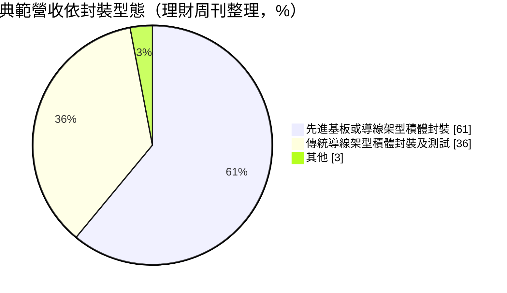
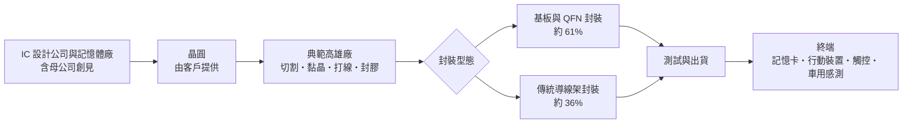
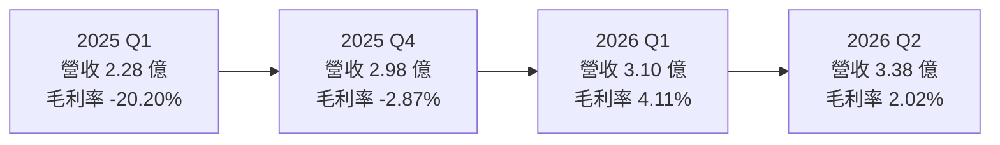
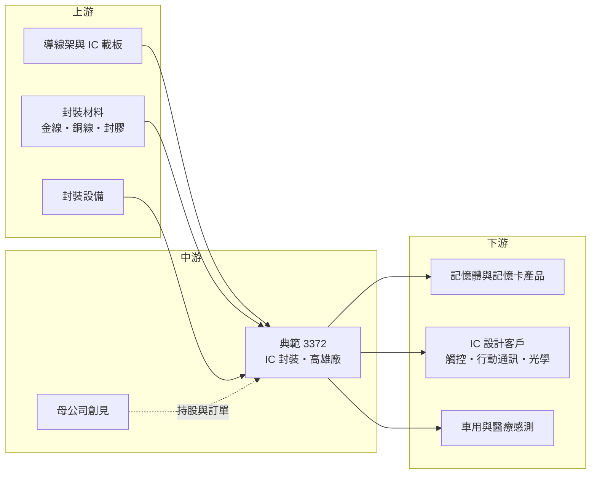

# 3372 典範

> 上櫃｜[[產業索引-半導體業|半導體業]]｜上市（櫃）日期 2005/12/16

# 第一章：企業模式與商業藍圖

> [!info] 撰寫說明
> 本文由 Claude 依公開資料整理，架構比照 [[2330台積電]] 的四章研究，資料截至 2026-10-07。財務數字來源：聚財網（stock.wearn.com）季度損益表、nstock 公司資料頁、理財周刊個股報導、旺得富與鉅亨公司基本資料頁；產業描述為整理性內容，尚未逐條比對原始文件。#待校對

在評估單一個股的長期投資價值時，首要步驟是拆解企業的底層獲利邏輯。本章針對台灣典範半導體（股票代號：3372，以下簡稱典範）的商業模式進行定性分析，說明這家小型封測廠如何在母公司創見的支持下經營、為何連續多年虧損，以及 2026 年營收回升能否帶來轉機。

## 一、核心定位：記憶體集團旗下的中小型封測廠

典範成立於 1998 年，英文名 Taiwan IC Packaging Corporation，2005 年 12 月上櫃，廠址位於高雄市前鎮區（前鎮加工出口區一帶），資本額約 17.53 億元。董事長束崇萬同時是記憶體模組品牌 [[2451創見]] 的創辦人，依理財周刊報導，典範是創見轉投資的封測廠。

典範的業務幾乎全部是 IC 封裝，依旺得富資料，封裝占營收 99.98%。它提供的封裝型態包括：

* **傳統[[導線架]]封裝：** SOP、SSOP、TSOP、QFP 等，技術成熟、單價低，是封測業最基本的產品。
* **超薄封裝：** [[QFN]] 等無引腳封裝，體積小、散熱較好，常用於行動裝置與電源 IC。
* **記憶卡封裝：** 記憶卡與快閃記憶體相關封裝，與母公司創見的記憶體產品線有關。
* **光學 IC 封裝：** 影像感測等光學元件的封裝。

這個定位有兩個商業意義：

* **集團內需求提供基本訂單：** 記憶卡封裝與創見的產品線相關，集團內的需求可以撐住一部分稼動率（推估，集團內交易比重未查得）。
* **規模小、議價力弱：** 和日月光、力成等大型封測廠相比，典範規模很小，在價格、設備投資與客戶分散度上都處於劣勢。

## 二、產品板塊：基板型與導線架型封裝

依理財周刊整理的營收結構（期間未標明）：

* **先進基板或導線架型封裝（約 61%）：** 包括 QFN 等超薄封裝、記憶卡與光學 IC 封裝，是典範近年較主要的業務。
* **傳統導線架型封裝及測試（約 36%）：** SOP、TSOP、QFP 等成熟封裝。
* **應用：** 行動通訊、觸控 IC、記憶卡，以及醫療與汽車感測等新興領域。
* **地區：** 理財周刊指內銷約 65%、外銷約 35%（主要為美洲與亞洲）；旺得富資料的外銷比率則為 25.18%，兩者期間可能不同。

## 三、資本轉化邏輯（營運模式）：稼動率決定生死

* **固定成本高：** 封裝廠的主要成本是廠房與機台折舊、人工與材料。產量不足時，固定成本攤不掉，毛利率會變成負數。典範 2024 年第三季至 2025 年第四季連續六季毛利率為負，最低到 -23%，正是稼動率不足的結果。
* **營收回升帶動毛利率快速改善：** 單季營收從 2024 年第四季的約 2.18 億元增加到 2026 年第二季的約 3.38 億元，毛利率由 -23.06% 回到 2.02%。營收每增加一點，大部分直接用來攤提固定成本，這是典型的營運槓桿。
* **材料成本：** 導線架、基板、金線或銅線等材料價格上漲時，若無法轉嫁客戶，會進一步壓縮毛利。

## 四、企業長期藍圖：先求損益兩平

* **擺脫虧損：** 理財周刊引述法人預估，典範 2026 年全年有機會轉虧為盈，理由是主要客戶訂單持續湧入。但截至 2026 年上半年累計 EPS 仍為 -0.10 元。
* **拓展新應用：** 醫療與汽車感測屬於量小但驗證期長的應用，若能取得認證，可提供較穩定的訂單（推估）。
* **依附記憶體景氣：** 2025 至 2026 年記憶體市場回溫，母公司創見營收成長，對典範的記憶卡封裝需求有正面帶動（推估）。

# 第二章：護城河深度與競爭優勢

「護城河」指企業抵禦競爭、維持超額利潤的保護機制。本章分析典範在封測產業中的競爭位置、主要對手，以及它能否在大廠夾擊下守住獲利。

## 一、典範護城河的核心組成要素

從連續多季毛利率為負來看，典範目前並沒有明顯的護城河。它能持續經營，主要依靠以下條件：

* **1. 集團支持：** 母公司創見屬財務體質穩健的記憶體品牌，記憶卡封裝與集團產品線相關，提供一定的訂單基礎與資金後盾。
* **2. 小批量、多樣化的彈性：** 大型封測廠偏好量大的訂單，典範可承接小批量、多樣化的成熟封裝，服務中小型 IC 設計客戶。
* **3. 特定封裝經驗：** 在記憶卡與光學 IC 封裝有長期經驗，這類封裝的製程參數需要累積。

## 二、全球主要競爭對手格局

| 對手 | 定位 | 對典範的威脅 |
|---|---|---|
| [[3711日月光投控]] | 全球最大封測集團 | 規模經濟與材料議價力遠勝 |
| [[6239力成]] | 記憶體封測龍頭 | 在記憶體與記憶卡封裝直接競爭 |
| [[2441超豐]] | 導線架型封裝為主，力成集團 | 在傳統導線架封裝同質競爭 |
| [[8150南茂]] | 記憶體與驅動 IC 封測 | 記憶體封測競爭 |
| [[2329華泰]] | 記憶體與電子製造 | 記憶卡相關封裝競爭 |
| 中國封測廠（長電、通富、華天） | 政策扶植、成本低 | 壓低成熟封裝全球價格 |

## 三、優勢轉化：守得住／守不住／觀察重點

* **守得住：** 與集團記憶體產品相關的封裝訂單，以及已長期合作的中小型客戶。
* **守不住：** 一般傳統導線架封裝的價格。這是封測業最成熟、競爭最激烈的區塊，中國廠商與大型同業都在搶，典範難以靠規模取勝。
* **觀察重點：** 毛利率能否穩定站上 5% 以上並轉為營業獲利；2026 年 1 至 8 月營收年增 26.78% 的成長能否延續；主要客戶訂單集中度（未查得）。

# 第三章：財務體質與盈利規模

資料日期：2026-10-07。數字取自聚財網季度損益表、nstock 公司資料頁與理財周刊報導，表格是撰寫當時的快照；最新月營收、毛利率、累計 EPS 由自動排程寫在本筆記的屬性欄位（月營收、毛利率、累計EPS 等）。#待校對

財務報表是檢驗護城河是否真實存在的最終標準。本章用三率、ROE、現金流與資本報酬，檢視典範的虧損收斂進度。

## 一、獲利能力的基石：三率

| 期間 | 營收（新台幣） | [[毛利率]] | [[營業利益率]] | EPS（元） |
|---|---|---|---|---|
| 2025 全年 | 10.99 億 | 約 -11.1%（依季度推算） | 約 -19.6%（依季度推算） | -1.22 |
| 2025 Q1 | 2.28 億 | -20.20% | -29.84% | -0.35 |
| 2025 Q2 | 2.83 億 | -12.59% | -20.89% | -0.44 |
| 2025 Q3 | 2.90 億 | -10.97% | -19.32% | -0.28 |
| 2025 Q4 | 2.98 億 | -2.87% | -10.81% | -0.15 |
| 2026 Q1 | 3.10 億 | 4.11% | -3.46% | -0.03 |
| 2026 Q2 | 3.38 億 | 2.02% | -4.53% | -0.07 |

* **[[毛利率]]：** 由 2025 年第一季的 -20.20% 一路改善，2026 年第一季轉正為 4.11%，第二季 2.02%。營收增加明顯改善了固定成本的攤提，但第二季營收更高、毛利率卻較第一季下滑，可能反映產品組合或材料成本變化（推估，原因未查得）。
* **[[營業利益率]]：** 仍為負值，2026 年第二季為 -4.53%。要轉為營業獲利，毛利率需要再提高數個百分點，或單季營收進一步擴大。
* **營收動能：** 2025 年全年營收 10.99 億元，年增 21.56%；2026 年 1 至 8 月累計 9.02 億元，年增 26.78%，8 月營收 1.28 億元，年增 30.1%。

## 二、[[ROE]]：資本效率

2025 年 EPS -1.22 元，以每股淨值約 8.46 元（鉅亨資料）估算，ROE 約為 -14%（推估）。2026 年上半年累計 EPS -0.10 元，第二季單季 ROE -0.87%，虧損明顯縮小但仍未轉正。每股淨值已低於面額 10 元，代表過去的虧損已侵蝕部分股本。

## 三、資本支出與自由現金流

* **[[CapEx]]：** 具體金額未查得。在虧損期間，封測廠通常會壓低資本支出，以維持現金。
* **[[自由現金流]]：** 毛利率長期為負時，營業現金流可能接近零或為負（推估）。折舊屬於非現金成本，加回後的現金流會比帳面虧損好一些。
* **股利：** 2025 年度未配發股利，近五年平均現金股利約 0.3 元。

## 四、[[ROIC]] 與 [[WACC]]：價值創造利差

連續多季營業虧損，ROIC 為負，明顯低於資金成本，目前並未創造經濟價值。典範的投資邏輯不是穩定的價值創造，而是「虧損收斂、轉虧為盈」的轉機題材，需要用季度毛利率與營業利益率追蹤。

# 第四章：總體風險與地緣政治

任何企業都無法脫離宏觀環境獨立存在。本章分析典範必須面對的地緣政治、產業週期、營運與技術風險。

## 一、地緣政治風險

* **成熟封裝的中國競爭：** 中國政府扶植本土封測產業，成熟封裝產能快速擴張，對以傳統導線架封裝為主的台灣中小型廠壓力最大。
* **台灣產能集中：** 典範的產能位於高雄，客戶若有「台灣加一」需求，小型封測廠難以提供海外產能。

## 二、產業週期與市場結構

* **記憶體景氣循環：** 記憶卡封裝與記憶體市場連動，記憶體價格下跌時，客戶縮減投片，封裝需求同步下降。
* **[[長鞭效應]]：** 封測位於製造後段，客戶的庫存調整會放大反映在封裝訂單上，典範規模小，受衝擊更明顯。
* **匯率：** 外銷占一定比重，新台幣升值會影響營收與匯兌損益。

## 三、營運環境的隱性風險

* **轉盈不確定：** 法人預估 2026 年轉虧為盈，但上半年仍虧損，若下半年訂單放緩，轉盈時程可能延後。
* **淨值侵蝕：** 每股淨值約 8.46 元，低於面額，若持續虧損，可能需要減資彌補虧損或增資。
* **人力與材料成本：** 封裝業為勞力與材料密集，基本工資與金屬材料價格上漲會增加成本。

## 四、科技或法規演進

* **封裝技術往先進方向移動：** 產業成長集中在[[先進封裝]]、晶圓級封裝與[[覆晶封裝]]，傳統導線架封裝的需求成長有限。典範若無法投入新技術，長期市場會萎縮。
* **車用與醫療認證：** 車用感測與醫療產品需要嚴格的品質認證，是機會也是門檻，需投入品質系統與時間。

# 專有名詞解析

## 半導體

- **[[導線架]]**：以金屬片沖壓成型的晶片承載框架，晶片打線後連到導線架的引腳，是最傳統、成本最低的封裝方式。
- **[[QFN]]**：四方平面無引腳封裝，引腳藏在封裝底部，體積小、散熱好，常用於電源與行動裝置晶片。
- **[[SOP]]**：小外型封裝，兩側有鷗翼型引腳的傳統封裝，用於各類一般用途晶片。
- **[[TSOP]]**：薄型小外型封裝，厚度較薄，常用於早期記憶體晶片。
- **[[打線]]**：以金線或銅線把晶片上的接點連到導線架或基板，是傳統封裝最主要的連接方式。
- **[[覆晶封裝]]**：把晶片翻面、以凸塊直接連接載板的封裝方式，比打線封裝的訊號路徑短、效能較好。
- **[[先進封裝]]**：把多顆晶片以中介層、混合鍵合等方式高密度整合的封裝技術，例如 CoWoS、SoIC。

## 金融

- **[[毛利率]]**：營業毛利除以營收，封測廠的毛利率高度取決於稼動率。
- **[[ROE]]**：股東權益報酬率，稅後淨利除以股東權益，衡量公司運用股東資金的獲利能力。

## 產業

- **[[營運槓桿]]**：固定成本占比高的公司，營收小幅變動就會造成利潤大幅變動，封測與晶圓廠都屬此類。
- **[[長鞭效應]]**：終端需求的小幅變動，沿供應鏈往上游傳遞時被逐級放大，造成上游庫存與訂單劇烈波動。

# 核心供應鏈

## 1. 上游：封裝材料與設備
- 導線架：[[2351順德]]（產業參考，典範實際供應商未查得）
- IC 載板：[[3037欣興]]、[[8046南電]]、[[3189景碩]]（產業參考）

## 2. 中游：典範與集團
- 母公司：[[2451創見]]
- 同業：[[3711日月光投控]]、[[6239力成]]、[[2441超豐]]、[[8150南茂]]、[[2329華泰]]

## 3. 下游：應用
- 記憶卡與快閃記憶體產品（含集團產品線）
- 觸控 IC、行動通訊、光學 IC 設計公司（公司未公開名稱）
- 醫療與汽車感測產品

## 最新新聞
<!-- news:start -->
<!-- news:end -->

## 相關連結
- [公開資訊觀測站](https://mopsov.twse.com.tw/mops/web/t05st03?step=1&firstin=1&co_id=3372)
- [Goodinfo](https://goodinfo.tw/tw/StockDetail.asp?STOCK_ID=3372)
- [Yahoo 股市](https://tw.stock.yahoo.com/quote/3372)
- [鉅亨網新聞](https://www.cnyes.com/twstock/3372/news)
