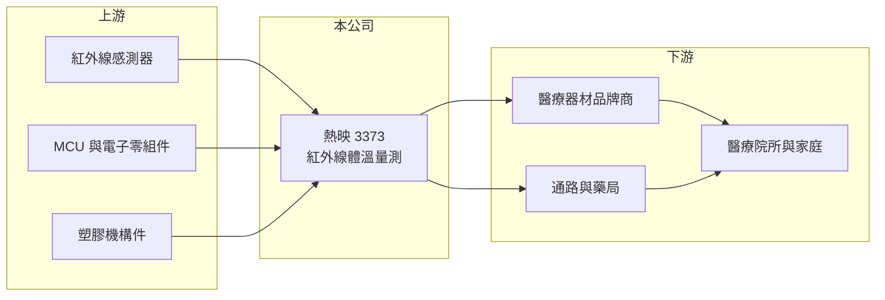

# 3373 熱映

> 上櫃｜[[產業索引-其他電子業|其他電子業]]｜上市（櫃）日期 2007/12/13

# 第一章：企業模式與商業藍圖

> [!info] 撰寫說明
> 精簡版，由 Claude 依公開資料整理，架構比照 [[2330台積電]]，資料截至 2026-10-07。來源：winvest.tw 熱映營收快訊與公司簡介。公開資料有限，營收比重與客戶未查得。#待校對

熱映是紅外線溫度量測儀廠商，主力產品為耳溫槍與額溫槍。

- **核心業務：** 製造[[紅外線測溫]]產品，包括耳溫槍、額溫槍等體溫量測器與其他紅外線溫度量測儀。
- **營收結構：** 本次未查得產品別與地區別比重，產品屬居家與醫療用的[[醫療器材]]。
- **營運據點：** 公司 2000 年成立、2007 年上市，資本額 4.76 億元，屬小型股。
- **長期方向：** 體溫量測需求在疫情後回落，公司需要擴大產品線或客戶以恢復獲利（推估）。

# 第二章：護城河深度與競爭優勢

熱映在紅外線測溫有長期經驗，但產品同質性高、競爭激烈。

- **競爭優勢：** 掌握紅外線感測與量測校正技術，具備醫療器材生產與認證經驗（推估）。
- **主要對手：** [[4737華廣]]、[[4106雃博]] 等國內體溫計與醫材廠，以及中國低價品牌（推估）。
- **觀察重點：** 能否轉虧為盈、新產品或新客戶帶來的營收，以及流感等季節性疫情對需求的影響。

# 第三章：財務體質與盈利規模

資料日期：2026-10-07，表格是撰寫當時的快照；最新月營收、毛利率、累計 EPS 由自動排程寫在本筆記的屬性欄位（月營收、毛利率、累計EPS 等）。#待校對

熱映營收規模小，近年持續虧損。

- **營收規模：** 2026 年 1 至 8 月累計約 2.90 億元、年增 8.84%；6 月營收 4,640 萬元為今年單月高點，8 月 3,863 萬元、年減 11.24%。
- **獲利：** 2026 年第二季 EPS 負 0.09 元，上半年累計負 0.35 元；2025 年全年 EPS 負 1.27 元。
- **財務特色：** 市值約 7.6 億元，虧損已延續多季，需留意現金部位與股東權益變化（推估）。

# 第四章：總體風險與地緣政治

熱映的風險主要在需求回落與價格競爭。

- **產業週期：** 體溫計需求在疫情期間暴增後大幅回落，平時需求受流感季節影響，波動大。
- **營運風險：** 營收規模小、持續虧損，固定費用占比高；若無新產品，轉盈難度大。
- **其他風險：** 中國同業低價競爭、各國[[醫材法規]]認證成本，以及美元匯率波動。

# 專有名詞解析

## 應用

- **[[紅外線測溫]]**：偵測物體發出的紅外線輻射來推算溫度，不需接觸即可量測，常見於耳溫槍與額溫槍。
- **[[醫療器材]]**：用於診斷、治療或監測人體健康的儀器與用品，上市前需取得各國主管機關許可。

## 產業

- **[[醫材法規]]**：各國對醫療器材上市前許可、品質系統與上市後監督的規範，例如美國 FDA 與歐盟 MDR。

# 核心供應鏈

- 上游：紅外線感測器、MCU 與塑膠機構件供應商（推估）
- 下游／客戶：醫療器材品牌商與通路，客戶名稱未揭露
- 同業：[[4737華廣]]、[[4106雃博]]（推估）

## 最新新聞
<!-- news:start -->
<!-- news:end -->

## 相關連結
- [公開資訊觀測站](https://mopsov.twse.com.tw/mops/web/t05st03?step=1&firstin=1&co_id=3373)
- [Goodinfo](https://goodinfo.tw/tw/StockDetail.asp?STOCK_ID=3373)
- [Yahoo 股市](https://tw.stock.yahoo.com/quote/3373)
- [鉅亨網新聞](https://www.cnyes.com/twstock/3373/news)
