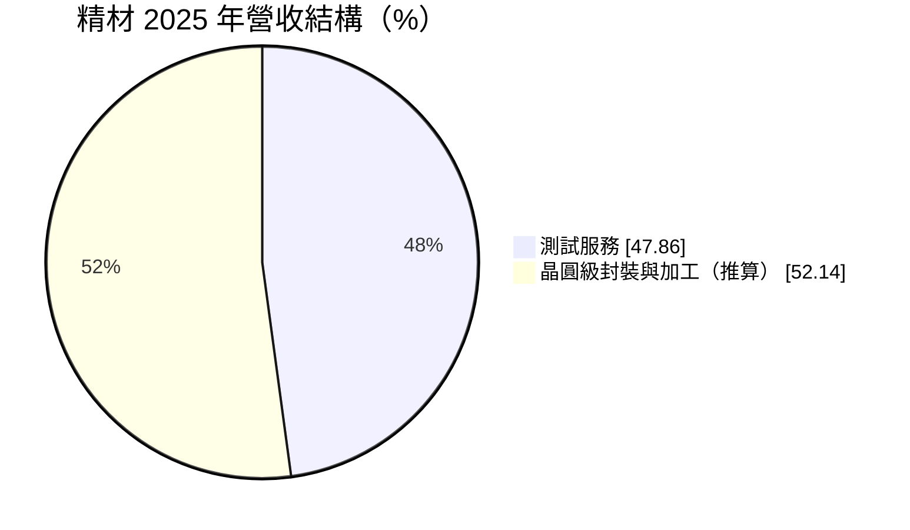
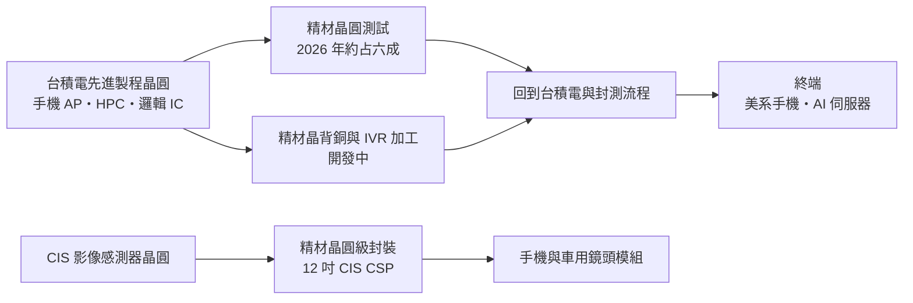
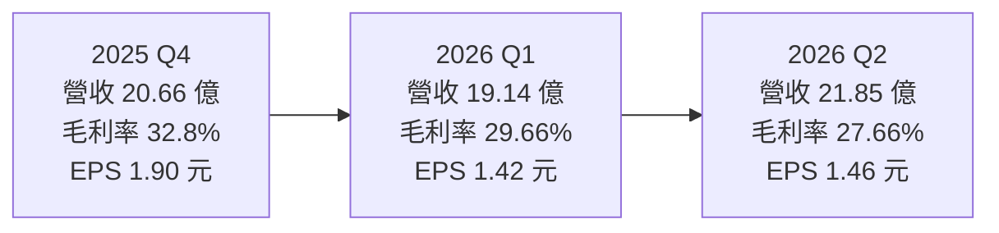
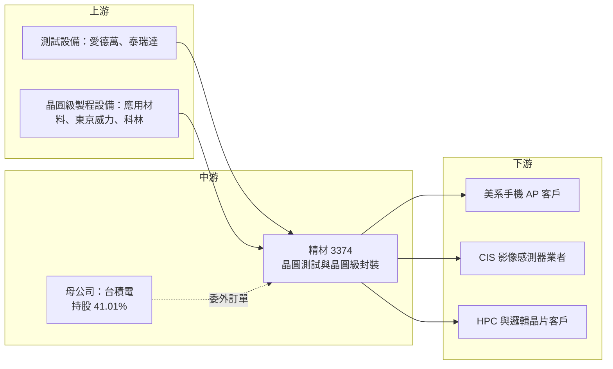

# 3374 精材

> 上櫃｜[[產業索引-半導體業|半導體業]]｜上市（櫃）日期 2015/03/30

# 第一章：企業模式與商業藍圖

> [!info] 撰寫說明
> 本文由 Claude 依公開資料整理，架構比照 [[2330台積電]] 的四章研究，資料截至 2026-10-07。財務數字來源：精材 2025 年財報報導（旺得富／中時新聞網）、理財周刊、優分析、Yahoo 股市公司基本資料、nstock、科技新報與 winvest 月營收報導、健行科大徵才公司簡介；產業描述為整理性內容，尚未逐條比對原始文件。#待校對

在評估單一個股的長期投資價值時，首要步驟是拆解企業的底層獲利邏輯。本章針對精材科技（股票代號：3374，以下簡稱精材）的商業模式進行定性分析，說明這家台積電轉投資的後段公司，如何從手機影像感測器封裝，轉型為承接台積電外溢測試與晶圓級加工的服務商。

## 一、核心定位：台積電旗下的晶圓級封裝與測試廠

精材成立於 1998 年 9 月 11 日，總部與廠區位於桃園中壢工業區，董事長兼總經理為陳家湘。依理財周刊報導，[[2330台積電]] 持有精材 41.01% 股權，是精材的最大股東，2026 年第一季對台積電的銷售占比達 74%。精材在台積電集團中扮演「後段晶圓級加工與測試的延伸產能」角色。

精材早期以晶圓級晶片尺寸封裝（[[WLCSP]]）起家，依公司徵才簡介，精材是第一家將晶圓層級封裝技術商品化的公司，業務涵蓋影像感測元件（[[CIS]]）、微機電（[[MEMS]]）封裝與客製化晶圓級架構服務。晶圓級封裝的特點是直接在整片晶圓上完成封裝，再切割成單顆晶片，封裝後尺寸接近晶片本身，適合手機鏡頭、感測器等對體積要求極高的產品。

這個定位有兩個商業意義：

* **集團信任換取訂單：** 台積電在產能不足時，優先把測試與晶圓級加工委託給集團內的精材，精材因此能分享台積電先進製程擴張的紅利。
* **單一客戶的集中風險：** 營收七成以上來自台積電，精材的成長節奏幾乎由台積電的委外策略決定。

## 二、產品板塊：測試服務躍升為最大業務

依 Yahoo 股市公司資料，精材主要業務分為測試服務、晶圓級尺寸封裝與晶圓級後護層封裝。2025 年的營收結構如下（封裝類業務合計數由總營收減去測試服務推算）：

* **測試服務：** 理財周刊報導，2025 年測試服務營收大增 78% 至 34.65 億元，占比 47.86%，首度成為最大業務。優分析報導指出，測試業務占比從 2024 年第三季的 28% 攀升到 2026 年約 60%，2026 年第二季測試服務年增 103%。成長原因是台積電全力擴充 [[CoWoS]] 產能、廠內空間受限，將美系手機客戶的 [[AP]] 等晶圓測試訂單委託精材承接，應用涵蓋 [[HPC]]、手機晶片與邏輯 IC。
* **CIS 晶圓級封裝（CSP）：** 傳統主力業務，服務手機與車用影像感測器。理財周刊報導，精材目標在 2026 年第三季把 12 吋 CIS CSP 產能擴充到月產 2,000 片。
* **晶圓級後護層與光學元件加工：** 過去替國際手機品牌的 3D 感測模組代工 [[DOE]]（繞射光學元件）等高毛利產品。旺得富報導，董事長指出 2025 年高毛利 DOE 封裝訂單大幅減少，是 2025 年毛利率下滑的主因之一。

## 三、資本轉化邏輯：承接母公司外溢的後段產能

* **產能集中中壢：** 精材主要產能集中在中壢。依優分析，2026 年資本支出預估 34.5 億至 36.6 億元，約八成投入測試新廠，2027 年資本支出將大幅減少。
* **12 吋晶背銅：** 理財周刊報導，董事會通過 2,312 萬美元資本預算，其中 2,221 萬美元用於購置 12 吋晶背銅製程設備，預計 2026 年第二季到 2027 年第二季完成。
* **IVR 銅加工：** 優分析報導，12 吋 [[IVR]]（整合式電壓調節器）銅加工預計 2026 年底完成認證，2027 年下半年放量。
* **營業費用率低：** 毛利率與營業利益率差距僅 5 至 6 個百分點，多數毛利能轉為營業利益，這是集團內服務商的特徵：不需要大量業務與行銷費用。

## 四、企業長期藍圖：緊跟台積電的先進製程與供電技術

精材的策略是緊跟台積電的先進製程與[[先進封裝]]需求：一方面承接台積電外溢的晶圓測試，另一方面發展 12 吋晶背銅、IVR 等與 AI／高效能運算晶片供電相關的晶圓級加工製程，同時維持 CIS 封裝的基本盤。這讓精材從過去依賴單一手機品牌 3D 感測訂單的公司，轉型為與 AI 與先進製程連動的後段服務商。[[背面供電]]等新架構若普及，晶背加工的需求有機會進一步擴大（推估）。

# 第二章：護城河深度與競爭優勢

在長期價值投資中，「護城河」指企業抵禦競爭、維持超額利潤的保護機制。本章分析精材的護城河構成、國內外主要競爭對手，以及這些優勢在台積電委外策略變化下能守住多少。

## 一、精材護城河的核心組成要素

精材的護城河屬於「窄」，但有一項別人很難複製的優勢：

* **1. 台積電集團身分：** 台積電持股超過四成，且是最大客戶。台積電在產能不足時優先把測試與晶圓級加工委託給集團內的精材，這種「信任與保密」關係是外部封測廠難以取代的。
* **2. 晶圓級製程能力：** 晶圓級封裝與晶背加工需要接近晶圓廠等級的潔淨室與設備，精材長期累積 WLCSP 與光學元件加工經驗，具技術門檻。
* **3. 高端測試產能：** 承接的是先進製程手機 AP 與高效能運算晶片的晶圓測試，對設備、良率數據管理與資安要求高。

## 二、全球主要競爭對手格局

| 對手 | 定位 | 對精材的威脅 |
|---|---|---|
| [[2449京元電子]] | 台灣最大專業測試廠 | 在 AI 晶片與手機晶片測試規模遠大於精材 |
| [[3711日月光投控]]、[[AMKR艾克爾]] | 大型封測集團 | 同時具備晶圓測試與晶圓級封裝產能 |
| [[6239力成]]、[[2441超豐]] | 台灣封測廠 | 在測試與封裝部分領域重疊 |
| 晶方科技（中國） | CIS 晶圓級封裝業者 | 在 CIS 封裝市場以價格競爭 |

## 三、優勢轉化：哪些市場守得住、哪些守不住

* **守得住：** 台積電體系內委外的測試與晶圓級加工，特別是需要與台積電製程緊密配合的項目。
* **守不住：** 一般 CIS 封裝面臨中國業者的價格競爭；DOE 等光學元件加工高度依賴單一手機品牌的設計選擇，訂單說沒就沒，2025 年就是例子。
* **觀察重點：** 測試訂單是「台積電產能不足時的外溢」，若台積電自身產能擴充完成，委外比例是否下降；12 吋 IVR 銅加工能否如期在 2027 年放量，成為新的成長來源；以及測試新廠完工後的折舊壓力。

# 第三章：財務體質與盈利規模

資料日期：2026-10-07。數字取自精材財報公告的媒體整理（旺得富、理財周刊、優分析、Yahoo 股市），表格是撰寫當時的快照；最新月營收、毛利率、累計 EPS 由自動排程寫在本筆記的屬性欄位（月營收、毛利率、累計EPS 等）。#待校對

財務報表是檢驗護城河是否真實存在的最終標準。本章用三率、ROE、資本支出與資本報酬，檢視精材在業務轉型與擴產期間的獲利品質。

## 一、獲利能力的基石：三率

| 項目 | 2025 全年 | 2025 Q4 | 2026 Q1 | 2026 Q2 |
|---|---|---|---|---|
| 營收（新台幣） | 72.39 億 | 20.66 億 | 19.14 億 | 21.85 億 |
| [[毛利率]] | 約 27.4% | 32.8% | 29.66% | 27.66% |
| [[營業利益率]] | 未查得 | 未查得 | 23.62% | 22.27% |
| EPS（元） | 4.99 | 1.90 | 1.42 | 1.46 |

* **2025 年：** 營收年增約 2.5%，但毛利率較前一年下降 7.9 個百分點，稅後淨利 13.54 億元，年減 19%，主因高毛利 DOE 訂單大減與新產線前期成本。
* **2026 年第二季：** EPS 依 Yahoo 股市資料為 1.46 元；nstock 標示為 1.35 元，兩者不一致，待以公開資訊觀測站財報確認。第二季毛利率季減約 2 個百分點，反映測試新產能的折舊與前期成本。
* **營收趨勢：** 2026 年上半年營收 40.98 億元，年增約 33%；7 月營收 8.61 億元、8 月營收 9.09 億元（年增 36.74%），持續創新高。營收成長、毛利率下滑，代表成長主要來自毛利較低、折舊較重的測試業務。

## 二、[[ROE]]：資本效率

精材營業費用率低，多數毛利能轉為營業利益。但 2026 年大舉擴充測試產能，理財周刊報導第一季折舊費用年增 85% 至 2.81 億元，資產規模擴大會暫時壓低資產報酬。ROE 具體數值本次未查得；理財周刊以 2026 年 7 月股價計算，股價淨值比約 10.2 倍、近四季本益比約 73.8 倍，市場評價已反映相當高的成長預期。

## 三、資本支出與自由現金流

* **[[CapEx]]：** 2026 年預估 34.5 億至 36.6 億元，約八成投入測試新廠，2027 年預計大幅減少。
* **財務結構：** 截至 2026 年 3 月底，現金 61.75 億元、負債比 40.8%、長期借款 37.34 億元。
* **[[自由現金流]]：** 資本支出高峰期間，自由現金流會受到壓縮；2027 年資本支出下降後，自由現金流有機會明顯回升（推估）。
* **股利政策：** 2025 年度股利金額本次未查得，請以公開資訊觀測站公告為準。在 2026 年資本支出高峰期間，推估配息率可能較保守。

## 四、[[ROIC]] 與 [[WACC]]：價值創造利差

企業創造價值的條件是投入資本報酬率高於資金成本。精材背靠台積電、財務結構穩健，資金成本相對不高；過去 DOE 等高毛利業務帶來較高的資本報酬，2025 年 DOE 訂單流失與 2026 年擴產，使投入資本增加、報酬率暫時下滑（推估，具體數值未查得）。關鍵在於測試新廠能否在 2027 年後維持高利用率：若台積電委外持續，新增資本可望創造正利差；若委外比例下降，新產能將成為壓低 ROIC 的負擔。

# 第四章：總體風險與地緣政治

任何企業都無法脫離宏觀環境獨立存在。本章分析精材未來必須面對的地緣政治、產業週期、營運與技術風險。

## 一、地緣政治風險

* **台灣集中：** 精材產能全部在台灣中壢，與台積電一樣面臨兩岸風險與供應鏈集中風險。
* **美國客戶與關稅：** 測試業務大量來自美系手機客戶的晶片，美國半導體關稅或「美國製造」要求若擴大到後段測試，可能影響訂單分配。
* **中國競爭：** CIS 封裝面臨中國業者在國產化政策下的低價競爭。

## 二、產業週期與市場結構風險

* **手機景氣：** 測試與 CIS 封裝都高度連動智慧型手機，旗艦手機銷量與規格變化會直接影響訂單。
* **AI 與先進製程循環：** 若 AI 投資降溫、台積電先進製程需求放緩，外溢的測試訂單可能減少。
* **[[長鞭效應]]：** 手機晶片庫存調整時，上游測試與封裝訂單的波動往往大於終端銷量變化。

## 三、營運環境的隱性風險

* **客戶高度集中：** 2026 年第一季對台積電銷售占比達 74%，台積電的委外策略是精材營運的最大變數。
* **單一產品依賴：** 2025 年 DOE 訂單大減的經驗顯示，特定手機品牌的設計改變可以在短時間內抹去一塊高毛利業務。
* **折舊攀升：** 測試新廠與 12 吋設備投入後，若訂單不如預期，折舊會快速壓縮毛利率。

## 四、科技演進風險

晶圓級封裝與晶背加工技術隨先進製程演進，例如背面供電、IVR 等新架構都需要新的製程能力。精材若無法跟上台積電的技術節奏，可能錯失新一代委外機會。測試業務也需要不斷投資新世代測試機台，技術門檻與資本需求持續墊高。

# 專有名詞解析

## 半導體

- **[[WLCSP]]**：晶圓級晶片尺寸封裝，在整片晶圓上完成封裝後再切割，封裝後尺寸接近晶片本身，適合手機等小型裝置。
- **[[CIS]]**：CMOS 影像感測器，把光線轉成電子訊號的晶片，是手機與車用鏡頭的核心元件。
- **[[MEMS]]**：微機電系統，在晶片上製作微小機械結構，例如加速度計、麥克風與壓力感測器。
- **[[DOE]]**：繞射光學元件，利用微結構控制光的方向與圖形，用於手機 3D 感測模組的結構光投射。
- **[[IVR]]**：整合式電壓調節器，把穩壓電路整合到晶片或封裝內，讓 AI 與高效能晶片獲得更穩定、更有效率的供電。
- **[[背面供電]]**：把供電線路移到晶圓背面、與訊號線路分開的晶片架構，可降低電壓損耗並釋出正面布線空間。
- **[[先進封裝]]**：把多顆晶片以中介層、混合鍵合等方式高密度整合的封裝技術，例如 CoWoS、SoIC。
- **[[CoWoS]]**：台積電的 2.5D 先進封裝技術，把 GPU 與 HBM 並排放在矽中介層上，是 AI 晶片的主流封裝方式。

## 應用

- **[[AP]]**：應用處理器，手機與平板的主晶片，整合 CPU、GPU 與數據機等功能。
- **[[HPC]]**：高效能運算，泛指資料中心伺服器、AI 加速器等需要大量運算的應用。

## 金融

- **[[自由現金流]]**：營業活動現金流減去資本支出，代表企業可自由用於配息、還債或併購的現金。
- **[[長鞭效應]]**：終端需求的小幅變動，沿供應鏈往上游傳遞時被逐級放大，造成上游庫存與訂單劇烈波動。

# 核心供應鏈

## 1. 上游：設備與材料
- 測試設備：愛德萬測試（Advantest）、泰瑞達（Teradyne）
- 晶圓級製程設備：[[AMAT應用材料]]、[[8035東京威力科創]]、[[LRCX科林研發]]

## 2. 中游：精材本身與母公司
- 大股東與最大客戶：[[2330台積電]]（持股 41.01%）
- 同集團後段夥伴：[[6789采鈺]]

## 3. 下游：終端晶片客戶（多經由台積電）
- 美系手機 AP：[[AAPL蘋果]]（推估，依報導「美系手機客戶」）
- 影像感測器業者：[[SONY索尼]]、豪威（OmniVision）等 CIS 廠（推估）
- 高效能運算與邏輯晶片客戶

## 4. 同業
- [[2449京元電子]]、[[3711日月光投控]]、[[AMKR艾克爾]]、[[6239力成]]
- CIS 封裝：晶方科技

延伸閱讀：[[台積電供應鏈]]

## 供應鏈關係
- [[2330台積電]] 子公司：晶圓級尺寸封裝與測試（台積電供應鏈 › 中游：台積電子公司 (生態系延伸)）

## 最新新聞
<!-- news:start（自動產生，請勿手動編輯此範圍） -->
- 2026-10-08 📰 媒體 15:05｜精材9月營收9.32 億元｜[TechNews 科技新報](https://news.google.com/rss/articles/CBMigAFBVV95cUxPand1MGVTUzY0ZlJkT3VFcFBGS2s2bXJ3VlpnWFlSRG4tSllsRG81d01mNjRaMDJ2MXItRGlrZDdadGk4Q0M2SjlkQ1RLRERUMmlRTlozVWhmd0dTNlZkX2NMdUxCaVBRSkhJZFI2RDNKVmFBWms4YnNwR2hjR0IxbQ?oc=5)
- 2026-10-07 📰 媒體 22:22｜精材(3374) 個股概覽 ／ 個股 - 股市｜[CMoney](https://news.google.com/rss/articles/CBMiU0FVX3lxTE5pODBIc3l1emVLellOVVliZ05rd1Y0d0plVnhWTDF1cmM4dmNZeFozNF82QW9TX1J2d2ZkV0Z4MlFtQkx1cGlWSGRoeW1YN2syaks4?oc=5)
- 2026-10-06 📰 媒體 17:00｜全模態AI引爆感測需求！精材、同欣電一度漲停，瑞昱成IC設計最大贏家，但為何這檔要當心？ ／ 個人理財 ／ 理財｜[經濟日報](https://news.google.com/rss/articles/CBMiW0FVX3lxTE0yVGp5R2NaSkxnQTFFNTRvdDVxMjl6T194Zy0wSEJncEN6STNmSjJYLUZ6ckN6UnFzTGJWajdUS0pwa2NLTHZOc2MxQkpfa3RHcG1ST0dBXy0wd1k?oc=5)

完整紀錄：[[3374精材 新聞]]
<!-- news:end -->

## 相關連結
- [公開資訊觀測站](https://mopsov.twse.com.tw/mops/web/t05st03?step=1&firstin=1&co_id=3374)
- [Goodinfo](https://goodinfo.tw/tw/StockDetail.asp?STOCK_ID=3374)
- [Yahoo 股市](https://tw.stock.yahoo.com/quote/3374)
- [鉅亨網新聞](https://www.cnyes.com/twstock/3374/news)
