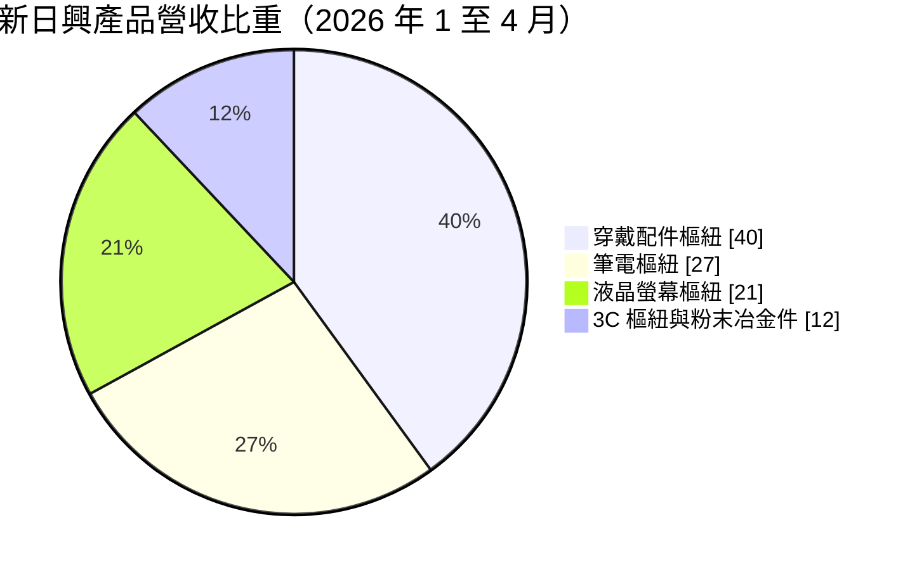
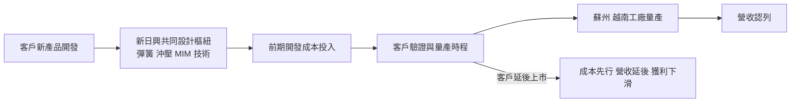
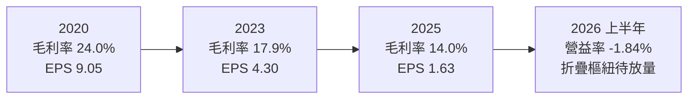
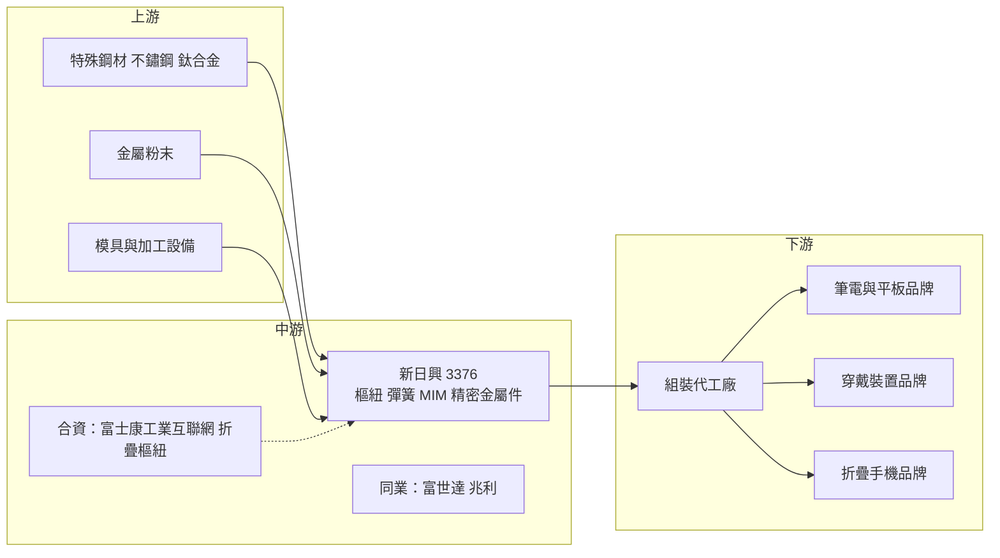

# 3376 新日興

> 上市｜[[產業索引-電子零組件業|電子零組件業]]｜上市（櫃）日期 2007/12/31

# 第一章：企業模式與商業藍圖

> [!info] 撰寫說明
> 本文由 Claude 依公開資料整理，架構比照 [[2330台積電]] 的四章研究，資料截至 2026-10-08。財務數字來源：Goodinfo 經營績效頁（2020 至 2025 年度）、證交所開放資料快照（2026 年上半年損益、資產負債、股利）、數位時代 2026 年報導、富果 2025 年 8 月法說會摘要；產業描述為整理性內容，尚未逐條比對原始文件。#待校對

在評估單一個股的長期投資價值時，首要步驟是拆解企業的底層獲利邏輯。本章針對新日興（股票代號：3376）的商業模式進行定性分析，說明一家從彈簧工廠起家的精密零件廠，如何成為全球筆電與穿戴裝置[[樞紐]]的主要供應商，以及它為何在 2025 年陷入獲利低谷、又把未來押在折疊手機上。

## 一、核心定位

新日興的前身是 1965 年呂敏文、呂勝男兄弟在三重創立的彈簧工廠（數位時代），依證交所資料公司登記成立於 1968 年。之後引進日本技術轉做精密機械零件，1990 年代隨筆電普及切入筆電樞紐，2002 年設立蘇州廠，2005 年上櫃、2007 年底轉上市。現任董事長為呂勝男。

樞紐（俗稱轉軸）是讓筆電螢幕開合、讓耳機充電盒掀蓋、讓折疊手機對折的關鍵機構件。它看起來簡單，但要在數萬次開合後仍維持相同的手感與角度，需要精密的彈簧、沖壓與熱處理技術。新日興的產品包括樞紐組件、精密彈簧、沖壓件、[[MIM]]（金屬射出成型）與 CNC 加工件，應用從筆電延伸到 AirPods 充電盒、平板鍵盤、液晶螢幕、手機與穿戴裝置。

新日興的定位可以概括為「高度集中於少數國際品牌的精密樞紐廠」。數位時代報導指出，新日興長期供應蘋果的 MacBook 樞紐、AirPods 充電盒樞紐與 iPad Pro 鍵盤樞紐，曾名列蘋果的最佳供應商名單。這種集中帶來了高品質的訂單，也帶來了高度的客戶依賴。

## 二、終端應用／產品板塊

依數位時代整理的 2026 年前四月營收結構：

* **穿戴配件樞紐（近 40%）：** 以耳機充電盒等穿戴產品為主，是新日興最大的產品線。2025 年前七月這一塊曾占 51%（富果法說摘要），2026 年比重下降，反映客戶產品換代。
* **筆電樞紐（約 27%）：** 新日興起家的產品，但總經理形容筆電樞紐已經「從比技術變成比價格」，價格競爭激烈。
* **液晶螢幕樞紐（約 21%）：** 用於螢幕支架的升降與旋轉。
* **3C 樞紐與粉末冶金件：** 平板鍵盤等 3C 產品的樞紐，以及 MIM 金屬零件。
* **折疊樞紐（新事業）：** 2026 年 3 月與富士康工業互聯網合資成立各持股 50% 的公司，切入折疊手機樞紐。數位時代引述分析師郭明錤估計，合資公司可能取得折疊 iPhone 約 65% 的樞紐訂單；折疊樞紐單價估計約 70 至 100 美元，遠高於筆電樞紐的 3 至 5 美元（是否為模組價格尚不明確）。

## 三、資本轉化邏輯（營運模式）

新日興的獲利模式是「共同開發加大量生產」。客戶開發新產品時，新日興的工程團隊參與樞紐的機構設計與手感調校，通過驗證後再以蘇州與越南的工廠大量生產。樞紐必須配合每一代新機重新設計，所以新日興的營收高度依賴客戶的新產品週期。

這套模式有一個明顯弱點：開發成本先發生、營收後到。2025 年新日興同時開發多項新產品，客戶卻延後上市時程，導致前期成本先認列、營收沒有跟上，加上筆電需求疲弱與匯率不利，獲利大幅下滑（數位時代、富果法說摘要）。

## 四、企業長期藍圖

新日興的轉型方向是從低價競爭的筆電樞紐，轉向單價較高、門檻較高的產品：穿戴、車用、非 IT 產品，以及折疊手機樞紐。公司也嘗試把精密金屬加工能力延伸到 AI 伺服器與機器人零件。製造端則持續自動化，目標減少 30% 人力需求，並導入 AI 代理協助品檢與研發知識管理。越南北江新廠採綠建築標準，是分散中國產能的重要據點。

在資本配置上，新日興長期財務保守、負債低，2026 年第二季底總負債約 62.9 億元，權益約 165.4 億元（證交所資料）。即使 2025 年獲利大幅下滑，仍配發每股 2 元現金股利，高於當年 EPS 1.63 元，顯示公司以保留盈餘維持股利。

# 第二章：護城河深度與競爭優勢

本章分析新日興的護城河構成、全球主要競爭對手，以及這些優勢在樞紐產業的價格競爭中能守住多少。

## 一、新日興護城河的核心組成要素

新日興的護城河屬於「窄護城河」，而且正在接受考驗，主要由以下三個要素組成：

* **1. 精密機構的技術累積：** 從彈簧到樞紐超過半世紀的經驗，讓新日興掌握材料、熱處理與機構設計的細節。高階客戶要求極高的手感一致性與耐用度，總經理曾表示，主要美系客戶的品質標準遠高於其他手機品牌。
* **2. 與頂級客戶的共同開發關係：** 長期參與蘋果等國際品牌的產品開發，取得新機種的設計導入機會。這種關係需要多年建立，也是新日興能爭取折疊樞紐訂單的基礎。
* **3. 垂直整合的製程：** 自有彈簧、沖壓、MIM 與 CNC 加工能力，可以控制關鍵零件的品質與成本。

但是，筆電樞紐已經進入價格競爭，富世達、兆利等台灣同業與中國廠商都在搶單，護城河在成熟產品上明顯變淺。

## 二、全球主要競爭對手格局

| 對手 | 定位 | 對新日興的威脅 |
|---|---|---|
| [[6805富世達]] | 筆電與折疊手機樞紐 | 在折疊樞紐與筆電樞紐直接競爭 |
| [[3548兆利]] | 筆電與折疊樞紐 | 在筆電樞紐以價格競爭 |
| 安費諾（Amphenol） | 全球連接器與機構件大廠 | 數位時代引述估計可能取得折疊 iPhone 約 35% 樞紐訂單 |
| 中國樞紐廠 | 中低階筆電與手機樞紐 | 以低價搶食中國品牌訂單 |

## 三、優勢轉化：哪些市場守得住、哪些守不住

* **守得住：** 需要極高品質標準的頂級客戶新產品，例如折疊手機樞紐與高階穿戴產品。這些產品驗證門檻高、單價高，少數供應商才能進入。
* **守不住：** 一般筆電樞紐的價格。產品成熟、競爭者多，價格成為主要競爭條件，新日興 2025 年毛利率降到 14.0%，2026 年第二季更降到 9.8%（數位時代）。
* **觀察重點：** 其一，折疊樞紐能否在 2026 年下半年至 2027 年實際放量，分析師預估占營收比重可能在 2026 年達三成、2027 年超過四成。其二，合資公司的利潤分配與認列方式（50% 持股可能以權益法認列，影響營業利益的呈現，待校對）。其三，穿戴產品換代後的訂單能否回升。

# 第三章：財務體質與盈利規模

資料日期：2026-10-08。數字取自 Goodinfo 經營績效頁與證交所開放資料快照，表格是撰寫當時的快照；最新月營收、毛利率、累計 EPS 由自動排程寫在本筆記的屬性欄位（月營收、毛利率、累計EPS 等）。#待校對

財務報表是檢驗護城河是否真實存在的最終標準。本章用多年度的三率、ROE、現金流與資本報酬，檢視新日興的獲利變化。

## 一、獲利能力的基石：三率

| 年度 | 營收（新台幣） | [[毛利率]] | [[營業利益率]] | EPS（元） | [[ROE]] |
|---|---|---|---|---|---|
| 2020 | 152 億 | 24.0% | 17.7% | 9.05 | 11.5% |
| 2021 | 121 億 | 20.1% | 13.0% | 6.08 | 7.49% |
| 2022 | 118 億 | 21.2% | 13.2% | 8.68 | 10.6% |
| 2023 | 101 億 | 17.9% | 9.03% | 4.30 | 5.14% |
| 2024 | 133 億 | 18.5% | 9.40% | 7.15 | 8.11% |
| 2025 | 107 億 | 14.0% | 1.56% | 1.63 | 1.81% |
| 2026 上半年 | 49.8 億 | 11.91% | -1.84% | 0.47 | 未查得 |

* **長期下滑：** 2020 至 2025 年毛利率從 24.0% 降到 14.0%，營業利益率從 17.7% 降到 1.56%，營收年複合成長率約 -6.8%（推算）。這不是單純的景氣循環，而是筆電樞紐價格競爭與產品換代造成的結構性壓力。
* **2026 年上半年轉為本業虧損：** 營收 49.8 億元，營業利益率 -1.84%，靠業外收益才維持 EPS 0.47 元（證交所資料）。富果摘要提到 2026 年第一季營業虧損約 1,000 萬元，數位時代報導第二季營業利益率 -3.1%。
* **轉折關鍵：** 下半年折疊樞紐開始出貨，董事長呂勝男表示下半年營運將優於上半年。分析師對 2026 年 EPS 的預估分歧很大，這也說明新業務的獲利貢獻仍高度不確定。

## 二、[[ROE]]：資本效率

2021 至 2025 年平均 ROE 約 6.6%（推算），2025 年只有 1.81%。新日興長年負債低，ROE 偏低的主因是利潤率下滑，加上股東權益中累積了大量保留盈餘（未分配盈餘約 100 億元，證交所股利資料），資本使用效率不高。即使在 2020 年的高峰，ROE 也只有 11.5%，說明新日興的資本效率長期不算突出。

## 三、資本支出與[[自由現金流]]

新日興的資本支出主要用於越南新廠、自動化與新產品產線，年度金額未查得。樞紐屬於機構件製造，資本密集度低於 PCB 或半導體，過去在獲利正常的年度，自由現金流應能維持為正（推估，現金流量表數字未查得）。股利方面，2025 年度配發現金股利 2 元，高於當年 EPS 1.63 元，配息率約 123%（推算），以保留盈餘支應。這種做法在短期可以維持股東報酬，但若本業持續虧損，長期無法持續。

## 四、[[ROIC]] 與 [[WACC]]：價值創造利差

* **ROIC（推算）：** 2025 年營業利益約 1.67 億元（107 億 × 1.56%），稅後約 1.34 億元。投入資本以 2026 年第二季底權益約 165.4 億元，加上有息負債估計約 20 億元（有息負債未查得，假設約占總負債 62.9 億元的三成），合計約 185 億元，ROIC 約 0.7%（推算）。對照 2020 年營業利益約 26.9 億元，當年 ROIC 推估約 13% 至 15%。
* **WACC（推算）：** 以 CAPM 推估，無風險利率 1.75%，市場風險溢酬 6%，β 未查得來源，採消費電子零組件同業常見值 0.9，股東權益成本約 7.15%。負債成本假設 2%，稅後約 1.6%；資本結構以權益 90%、負債 10% 計算，WACC 約 6.6%（推算）。
* **結論：** 2020 至 2022 年新日興的 ROIC 高於 WACC，但 2023 年起利差縮小，2025 至 2026 年 ROIC 已遠低於資金成本（推算），代表本業目前沒有創造價值。折疊樞紐若能如分析師預期貢獻三到四成營收，且維持高單價，ROIC 有機會重回 WACC 以上；反之，若只是單一客戶、單一產品的短期題材，價值創造能力仍難以恢復。

# 第四章：總體風險與地緣政治

任何企業都無法脫離宏觀環境獨立存在。本章分析新日興未來必須面對的地緣政治、產業週期與營運風險。

## 一、地緣政治風險

* **中國產能與美國關稅：** 新日興的主要產能長期在蘇州，美國對中國製電子產品的關稅與供應鏈移轉壓力，促使公司在越南設廠。越南新廠的效率與良率仍在建立，移轉期間成本較高。
* **合資夥伴的地緣因素：** 折疊樞紐合資夥伴富士康工業互聯網是中國上市公司（屬鴻海集團），合資公司的生產地點與美中政策變化可能互相影響（未查得合資公司的生產地點）。

## 二、產業週期與市場結構風險

* **筆電成熟與價格競爭：** 全球筆電出貨成長有限，樞紐又是成熟產品，價格競爭會長期壓抑毛利率。
* **客戶產品週期：** 新日興的營收高度依賴少數客戶的新產品上市時程。客戶延後或取消產品，新日興的前期開發成本就會白白付出，2025 年就是例子。
* **折疊手機市場的不確定性：** 折疊手機過去幾年滲透率成長緩慢，頂級品牌加入後能否帶動市場放大，仍需觀察實際銷售。

## 三、營運環境的隱性風險

* **客戶集中：** 單一美系大客戶占比高，議價能力偏向客戶，價格調降與訂單分配都直接影響新日興獲利。
* **合資利潤分配：** 折疊樞紐由合資公司承接，新日興實際能分到多少利潤、以何種方式認列，會影響投資人看到的營收與營業利益（待校對）。
* **匯率：** 以美元計價，新台幣升值會壓縮毛利率，富果法說摘要提到匯率是 2025 年獲利下滑的原因之一。

## 四、科技或法規演進風險

樞紐的需求取決於產品的外型設計。如果穿戴裝置或筆電改用磁吸、可拆式或其他不需要傳統樞紐的設計，需求可能減少。折疊手機的樞紐技術也在快速演進，從水滴型到更複雜的多段式結構，供應商必須持續投入研發。新日興已取得 SBTi 減碳目標核准，目標 2030 年範疇一與範疇二排放減少 42%、2050 年淨零（富果法說摘要），客戶的減碳要求會持續增加綠電與製程改善成本。

# 專有名詞解析

## 應用

- **[[折疊手機]]**：螢幕可以對折的手機，需要高強度、高耐用度的樞紐支撐數十萬次開合。
- **[[穿戴裝置]]**：戴在身上的電子產品，例如無線耳機、智慧手錶，對零件體積與重量要求高。

## 金融

- **[[權益法]]**：持股 20% 至 50% 的轉投資，以持股比例認列其損益於業外，而不併入營收。
- **[[配息率]]**：現金股利占每股盈餘的比例，反映公司把多少獲利發還給股東。
- **[[自由現金流]]**：營業活動現金流減去資本支出，代表企業可自由用於配息、還債或併購的現金。
- **[[ROIC]]**：投入資本報酬率，衡量公司每投入一元營運資本能賺多少稅後營業利益。
- **[[WACC]]**：加權平均資金成本，股東與債權人要求報酬率的加權平均，是企業投資的最低報酬門檻。

## 產業

- **[[樞紐]]**：讓產品的兩個部分可以開合或轉動的機構件，用於筆電螢幕、耳機充電盒與折疊手機。
- **[[MIM]]**：金屬射出成型，把金屬粉末與黏結劑混合後射出成型再燒結，可做出形狀複雜的小型金屬零件。
- **[[精密沖壓]]**：用模具與沖床把金屬板材壓成特定形狀的加工方式，適合大量生產小型金屬件。
- **[[合資公司]]**：兩家以上公司共同出資成立的公司，分攤投資風險並依持股分配利潤。
- **[[SBTi]]**：科學基礎減量目標倡議，審核企業的減碳目標是否符合巴黎協定的升溫控制要求。

# 核心供應鏈

## 1. 上游：金屬材料與設備
- 特殊鋼材、鈦合金與金屬粉末：國內外金屬材料廠（未查得具體名單）

## 2. 中游：新日興本身、合作夥伴與同業
- 折疊樞紐合資夥伴：富士康工業互聯網（鴻海集團中國子公司），母集團 [[2317鴻海]]
- 同業：[[6805富世達]]、[[3548兆利]]；安費諾

## 3. 下游：品牌與組裝廠
- 主要品牌客戶：[[AAPL蘋果]]（MacBook、AirPods、iPad 鍵盤樞紐，依數位時代報導）
- 組裝代工：[[2317鴻海]]、[[4938和碩]]、[[2382廣達]]（實際出貨對象依機種而定，待校對）

## 最新新聞
<!-- news:start -->
<!-- news:end -->

## 相關連結
- [公開資訊觀測站](https://mopsov.twse.com.tw/mops/web/t05st03?step=1&firstin=1&co_id=3376)
- [Goodinfo](https://goodinfo.tw/tw/StockDetail.asp?STOCK_ID=3376)
- [Yahoo 股市](https://tw.stock.yahoo.com/quote/3376)
- [鉅亨網新聞](https://www.cnyes.com/twstock/3376/news)
