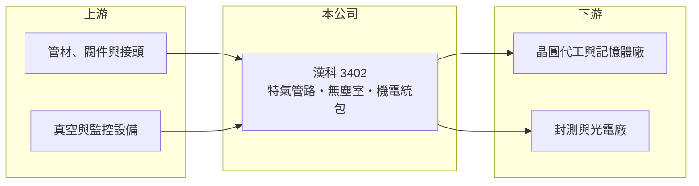

# 3402 漢科

> 上櫃｜[[產業索引-其他電子業|其他電子業]]｜上市（櫃）日期 2007/01/09

# 第一章：企業模式與商業藍圖

> [!info] 撰寫說明
> 精簡版，由 Claude 依公開資料整理，架構比照 [[2330台積電]]，資料截至 2026-10-07。來源：winvest.tw 漢科營收快訊與公司簡介、CMoney 投資快訊。公開資料有限，營收比重與客戶未查得。#待校對

漢科承攬半導體與高科技廠的特殊氣體管路與廠務系統工程。

- **核心業務：** [[特殊氣體]]與特殊管路工程、高真空系統、[[無塵室]]與[[機電工程]]統包，以及特氣供應與監控系統整合。
- **營收結構：** 本次未查得工程別或產業別比重；主要需求來自半導體與光電廠新建與擴產（推估）。
- **營運據點：** 公司 1990 年成立、2007 年上市，資本額 7.30 億元；CMoney 報導指出漢科為神基集團旗下公司。
- **長期方向：** 跟隨晶圓廠與先進封裝廠在台灣及海外的擴產，承接[[廠務工程]]訂單（推估）。

# 第二章：護城河深度與競爭優勢

漢科的優勢在於特殊氣體工程的施工經驗與安全要求。

- **競爭優勢：** 特殊氣體多具毒性或易燃性，管路與供應系統須符合高純度與安全規範，具長期施工實績的廠商較易取得晶圓廠信任。
- **主要對手：** [[6196帆宣]]、[[6139亞翔]]、[[2404漢唐]] 等廠務與無塵室工程廠（推估，未查得公司自述對手）。
- **觀察重點：** 晶圓廠擴產與海外建廠的接案狀況、在手訂單變化，以及工程毛利率是否維持。

# 第三章：財務體質與盈利規模

資料日期：2026-10-07，表格是撰寫當時的快照；最新月營收、毛利率、累計 EPS 由自動排程寫在本筆記的屬性欄位（月營收、毛利率、累計EPS 等）。#待校對

漢科 2026 年營收成長，但上半年獲利略低於去年同期。

- **營收規模：** 2026 年 1 至 8 月累計 41.38 億元、年增 21.37%；8 月營收 6.01 億元、年增 32.84%。
- **獲利：** 2026 年第二季 EPS 2.08 元，上半年累計 3.64 元、年減 8%；2025 年全年 EPS 7.5 元。CMoney 報導最近一個完整年度（推估為 2025 年）[[毛利率]]約 21.17%。
- **財務特色：** 工程業以完工比例認列營收，季度獲利受工程進度影響；股東會通過每股配發 5 元股利，配息率高。

# 第四章：總體風險與地緣政治

漢科的風險在於客戶資本支出週期與工程執行。

- **產業週期：** 訂單取決於半導體廠的[[CapEx]]，晶圓廠擴產放緩時新案會減少。
- **營運風險：** 工程延宕、成本超支或缺工會壓縮毛利；客戶集中於少數半導體大廠（推估）。
- **其他風險：** 海外建廠的當地法規與人力成本、管材與設備價格波動。

# 專有名詞解析

## 半導體

- **[[特殊氣體]]**：晶圓製程中用於蝕刻、沉積與摻雜的高純度氣體，多具毒性或易燃性，需專用管路輸送。

## 金融

- **[[CapEx]]**：資本支出，企業購置廠房、機器設備等長期資產的支出。

## 產業

- **[[無塵室]]**：控制空氣中微粒、溫濕度與壓力的密閉空間，半導體製程必須在其中進行。
- **[[機電工程]]**：廠房與建築的電力、空調、給排水、消防與管線系統工程。
- **[[廠務工程]]**：晶圓廠內支援製程運作的基礎設施工程，包括空調、氣體、化學品供應與排氣系統。

# 核心供應鏈

- 上游：不鏽鋼管材、閥件、真空與監控設備供應商（推估）
- 下游／客戶：半導體與光電廠，客戶名稱未揭露
- 同業：[[6196帆宣]]、[[6139亞翔]]、[[2404漢唐]]（推估）

## 最新新聞
<!-- news:start -->
<!-- news:end -->

## 相關連結
- [公開資訊觀測站](https://mopsov.twse.com.tw/mops/web/t05st03?step=1&firstin=1&co_id=3402)
- [Goodinfo](https://goodinfo.tw/tw/StockDetail.asp?STOCK_ID=3402)
- [Yahoo 股市](https://tw.stock.yahoo.com/quote/3402)
- [鉅亨網新聞](https://www.cnyes.com/twstock/3402/news)
