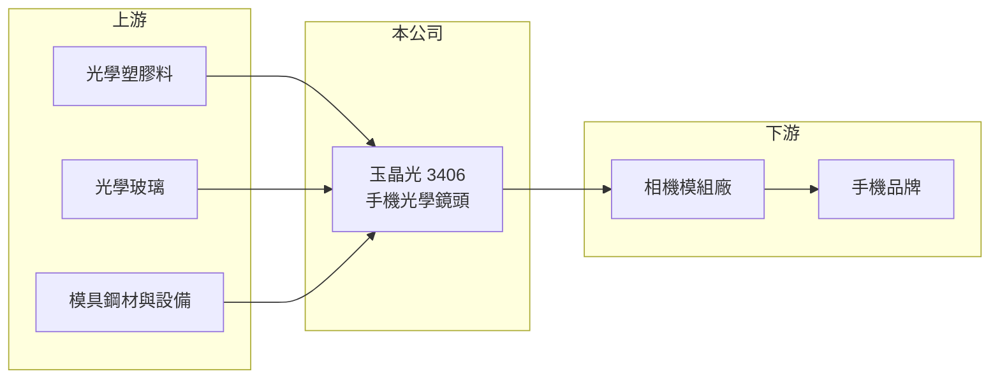

# 3406 玉晶光

> 上市｜[[產業索引-光電業|光電業]]｜上市（櫃）日期 2005/12/20

# 第一章：企業模式與商業藍圖

> [!info] 撰寫說明
> 精簡版，由 Claude 依公開資料整理，架構比照 [[2330台積電]]，資料截至 2026-10-07。來源：nstock.tw 玉晶光公司概況、科技新報月營收快訊。產品與客戶比重未查到，客戶結構為市場普遍說法，屬推估。#待校對

玉晶光是台灣第二大的手機光學鏡頭廠，營收規模與股價高度跟著高階智慧型手機鏡頭規格走。

- **核心業務：** 玉晶光成立於 1990 年，登記業務為光學儀器、模具與照明設備零件的製造與買賣，實際營收以手機相機用的[[塑膠鏡頭]]與[[玻塑混合鏡頭]]為主（推估）。
- **營收結構：** 本次未查到產品或客戶比重；市場普遍認為最大客戶是 [[AAPL蘋果]]，營收集中度高（推估）。
- **營運據點：** 總部位於中部科學園區台中市大雅區，另有中國廈門生產基地（推估，未在本次來源中查證）。
- **長期方向：** 手機鏡頭朝更多鏡片、[[潛望式鏡頭]]與更大感光面積發展，玉晶光的成長取決於能否在高階規格升級中持續拿到量產份額，並把技術延伸到 AR／VR 與車用光學（推估）。

# 第二章：護城河深度與競爭優勢

玉晶光的護城河來自精密模具與大量生產良率，但與龍頭大立光相比規模較小。

- **競爭優勢：** 手機鏡頭的鏡片數多、公差極小，模具設計與射出成型的[[良率]]需要長年累積；一旦打進大客戶的新機種，該世代的訂單通常延續一整年。
- **主要對手：** [[3008大立光]] 是全球龍頭，中國有舜宇光學等廠商以價格搶單；國內同業另有 [[3441聯一光]]、[[3504揚明光]] 等中小型光學廠。
- **觀察重點：** 新一代旗艦手機的鏡頭規格升級幅度、玉晶光在潛望式與主鏡頭的份額，以及每年下半年拉貨旺季的月營收表現。

# 第三章：財務體質與盈利規模

資料日期：2026-10-07，以下數字是撰寫當時的快照；最新月營收、毛利率、累計 EPS 由自動排程寫在本筆記的屬性欄位（月營收、毛利率、累計EPS 等）。#待校對

玉晶光 2025 年獲利創高，2026 年前八月營收仍維持雙位數成長，但下半年旺季成長已放緩。

- **營收規模：** 2025 年全年營收 249.87 億元，年增 7.8%；2026 年 1 至 8 月累計 169.65 億元，年增 11.8%，8 月單月 27.19 億元，年增僅 0.7%。
- **獲利：** 2025 年全年 EPS 32.84 元；2026 年第二季 EPS 6.09 元，[[毛利率]] 33.16%。
- **財務特色：** 資本額約 11.27 億元，股本小、單位獲利高；營收有明顯季節性，上半年淡、下半年隨新機出貨轉旺。

# 第四章：總體風險與地緣政治

玉晶光的主要風險是客戶集中與手機產業的季節性波動。

- **產業週期：** 營收跟著旗艦手機的發表與拉貨節奏起伏，淡旺季差距大，[[長鞭效應]]會放大庫存調整的影響。
- **營運風險：** 客戶集中度高（推估），單一客戶的機種規格或供應商分配改變，就會明顯影響營收與[[產能利用率]]。
- **其他風險：** 營收多以美元計價，新台幣升值會壓縮毛利率；中國生產據點面臨地緣政治與關稅風險（推估）。

# 專有名詞解析

## 半導體

- **[[良率]]**：合格產品占總產出的比例，精密光學與半導體製程的成本高度取決於此數字。

## 金融

- **[[產能利用率]]**：實際投入生產的產能占總產能的比例，製造業的毛利率高度取決於此數字。
- **[[長鞭效應]]**：終端需求的小幅變動，沿供應鏈往上游傳遞時被逐級放大，造成上游庫存與訂單劇烈波動。

## 產業

- **[[塑膠鏡頭]]**：以光學塑膠射出成型的多片鏡片堆疊而成的相機鏡頭，是手機相機的主流方案。
- **[[玻塑混合鏡頭]]**：在塑膠鏡片組中加入一片或數片玻璃鏡片，以改善成像品質與耐熱性。
- **[[潛望式鏡頭]]**：以稜鏡把光線轉向 90 度、讓鏡組橫躺在手機機身內的長焦鏡頭設計。

# 核心供應鏈

- 上游：光學塑膠原料、光學玻璃、模具鋼材與精密加工設備供應商
- 下游／客戶：相機模組廠與手機品牌，市場普遍認為以 [[AAPL蘋果]] 為主（推估）
- 同業：[[3008大立光]]、[[3441聯一光]]、[[3504揚明光]]、舜宇光學

## 最新新聞
<!-- news:start -->
<!-- news:end -->

## 相關連結
- [公開資訊觀測站](https://mopsov.twse.com.tw/mops/web/t05st03?step=1&firstin=1&co_id=3406)
- [Goodinfo](https://goodinfo.tw/tw/StockDetail.asp?STOCK_ID=3406)
- [Yahoo 股市](https://tw.stock.yahoo.com/quote/3406)
- [鉅亨網新聞](https://www.cnyes.com/twstock/3406/news)
