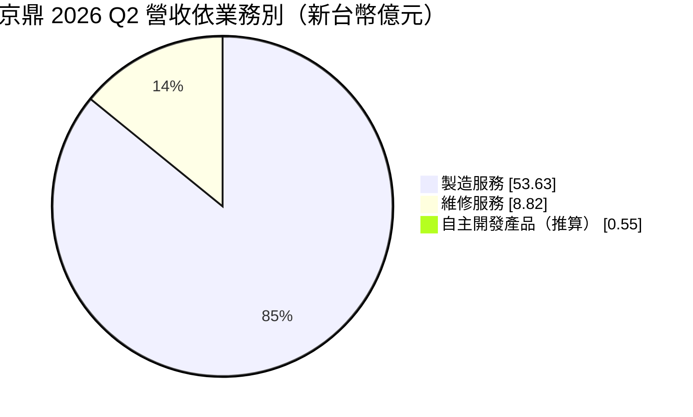
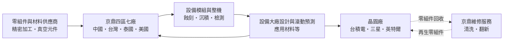
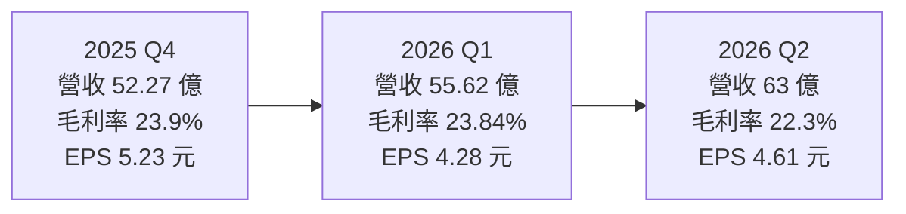
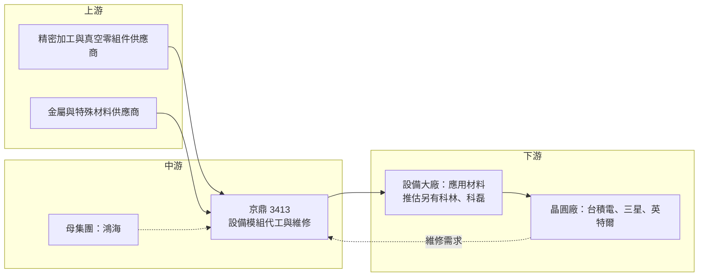

# 3413 京鼎

> 上市｜[[產業索引-半導體業|半導體業]]｜上市（櫃）日期 2015/07/28

# 第一章：企業模式與商業藍圖

> [!info] 撰寫說明
> 本文由 Claude 依公開資料整理，架構比照 [[2330台積電]] 的四章研究，資料截至 2026-10-07。財務數字來源：富果研究（2026 年 3 月法說整理）、科技新報（2026 年 6 月）、理財周刊（2026 年 7 月）、經濟日報與優分析（2026 年 9 月第二季財報報導）、winvest 月營收快訊；產業描述為整理性內容，尚未逐條比對原始文件。#待校對

在評估單一個股的長期投資價值時，首要步驟是拆解企業的底層獲利邏輯。本章針對京鼎精密（股票代號：3413，以下簡稱京鼎）的商業模式進行定性分析，說明這家鴻海集團旗下的「設備代工廠」如何依附國際設備大廠成長，以及它把新產能移出中國的策略邏輯。

## 一、核心定位：國際設備大廠背後的「設備代工廠」

京鼎是鴻海集團旗下的半導體設備製造服務公司。它不以自有品牌販售整台半導體設備，而是替國際半導體設備大廠代工製造設備的關鍵模組、子系統，甚至整機組裝，同時提供設備零組件的維修與再生服務。可以把京鼎理解為「半導體設備界的代工廠」，也就是[[設備代工]]：設備大廠負責設計、研發與銷售，京鼎負責把它們製造出來。

市場普遍認為京鼎的最大客戶是全球最大的半導體設備商 [[AMAT應用材料]]，營收高度集中在單一客戶，這是理解京鼎時最重要的特點（確切占比本次未查得）。這個定位有兩個商業意義：

* **以代工角色分享設備週期：** 晶圓廠擴產時，設備大廠的出貨增加，代工廠的訂單同步放大，京鼎因此能直接搭上 AI 帶動的晶圓廠設備投資。
* **以低議價能力換取穩定合作：** 設計與品牌在客戶手上，京鼎的毛利率維持在典型代工水準，但只要通過認證，合作關係通常延續多年。

## 二、產品板塊：製造服務為主、維修快速成長

2026 年第二季營收 63 億元，依業務別拆分如下（自主開發產品由總營收減去前兩項推算）：

* **製造服務：** 約占 85%，涵蓋[[蝕刻]]、[[薄膜沉積]]與檢測等前段製程設備的模組與系統代工。2025 年第四季，檢測設備相關營收季增 38%、年增約 1.5 倍，顯示京鼎的產品組合從傳統的蝕刻、沉積模組，逐步擴展到檢測設備。
* **維修服務：** 約占 14%，季增 37.2%、年增 124.7%，是成長最快的業務，內容包括設備零組件清洗、翻新與維修。
* **自主開發產品：** 約占 2% 至 3%（依公司口徑），包括自有的自動化與設備相關產品，規模仍小。

## 三、資本轉化邏輯：「四區七廠」的代工與維修循環

京鼎在台灣、中國、泰國、美國設有據點，公司稱為「四區七廠」：

* **中國：** 依 2026 年 6 月科技新報報導，產能占比約 60%，處於滿載狀態，公司規劃維持現有規模、不再擴大。
* **台灣：** 產能占比約 20% 至 25%。公司收回竹南科學園區總部四樓擴產，預計 2026 年 7 月落成，第三、四季開始貢獻。
* **泰國：** 羅勇廠 2025 年 1 月啟用，2026 年上半年已達損益兩平；春武里廠 2025 年 11 月啟用，2026 年 7 月起逐步放量。泰國目前占產能約 15%，預計 2027 年提升到 20% 至 25%。董事會另通過泰國二期擴產，投資 2.34 億美元，因應 2028 年後的產能需求。
* **美國：** 設有新產品導入（[[NPI]]）據點，負責與客戶共同開發新設備的早期製造。

製造服務屬於組裝與整合，固定資產比例低於晶圓廠；維修服務則與晶圓廠的機台使用量連動，而非新設備採購，能在設備週期下行時提供緩衝。

## 四、企業長期藍圖：去中國化產能與 AI 設備週期

* **產能移出中國：** 由於美中科技對抗，美國設備大廠要求供應鏈分散到中國以外。京鼎把新增產能放在泰國與台灣，中國產能維持不變，逐步降低對中國廠區的依賴。
* **搭上 AI 帶動的設備投資：** AI 晶片需要先進製程與[[先進封裝]]，帶動晶圓廠設備（[[WFE]]）投資。公司預估 2026 年全球晶圓廠設備市場成長 16% 至 24%，並以超越市場平均、全年營收成長 24% 以上為目標。
* **拉高維修與自主產品比重：** 維修服務毛利率通常較高且較不受新設備週期影響，提升其比重有助於穩定獲利。

# 第二章：護城河深度與競爭優勢

在長期價值投資中，「護城河」指企業抵禦競爭、維持超額利潤的保護機制。本章分析京鼎的護城河構成、國內外主要競爭對手，以及這些優勢在客戶高度集中的結構下能守住多少。

## 一、京鼎護城河的核心組成要素

京鼎的護城河屬於「中等偏窄」，主要來自：

* **1. 與設備大廠的深度綁定：** 設備模組的製造涉及客戶的設計圖與製程機密，客戶選擇代工夥伴時非常謹慎，一旦通過認證並導入量產，通常會長期合作。京鼎能拿到大客戶長達八季的滾動需求預測，顯示雙方關係緊密。
* **2. 鴻海集團背景：** 鴻海在精密製造、供應鏈管理與海外設廠的經驗，讓京鼎能快速在泰國等地建置產能，並維持成本競爭力。
* **3. 全球多地產能：** 中國、台灣、泰國、美國多地生產，符合國際設備大廠「中國以外產能」的要求。

## 二、全球主要競爭對手格局

| 對手 | 定位 | 對京鼎的威脅 |
|---|---|---|
| Ultra Clean（UCT） | 美國設備子系統代工商 | 爭取應用材料、科林研發等同一批客戶 |
| Ichor | 美國氣體與流體子系統代工商 | 在流體模組與子系統直接競爭 |
| [[6196帆宣]] | 台灣設備與廠務系統整合商 | 部分設備代工與整合業務重疊 |
| 台灣設備零組件廠 | 精密加工、真空零組件與維修業者 | 在個別零組件與維修服務競爭 |
| 客戶自製 | 設備大廠自家工廠 | 可把模組收回自製或在代工商間分配 |

## 三、優勢轉化：哪些市場守得住、哪些守不住

* **守得住：** 需要高度機密與複雜整合的前段設備模組，客戶轉換代工廠的成本與風險都高；京鼎在泰國的新產能也符合客戶分散供應鏈的需求。
* **守不住：** 客戶集中度高，議價能力相對弱，毛利率長期落在 22% 至 25% 左右，屬於典型代工毛利。2026 年第二季毛利率 22.3%，低於 2025 年全年的 25.1%，部分原因是泰國新廠初期成本與產品組合變化。
* **觀察重點：** 泰國春武里廠放量後毛利率能否回到公司目標的 25% 以上；維修服務能否持續高成長；大客戶以外的新客戶開發進度。這三點決定京鼎能否降低單一客戶風險並維持獲利成長。

# 第三章：財務體質與盈利規模

資料日期：2026-10-07。數字取自富果研究、科技新報、理財周刊、經濟日報與優分析等財經媒體整理，表格是撰寫當時的快照；最新月營收、毛利率、累計 EPS 由自動排程寫在本筆記的屬性欄位（月營收、毛利率、累計EPS 等）。#待校對

財務報表是檢驗護城河是否真實存在的最終標準。本章用三率、ROE、資本支出與資本報酬，檢視京鼎在設備上行週期與海外擴產期間的獲利品質。

## 一、獲利能力的基石：三率

| 項目 | 2025 全年 | 2025 Q4 | 2026 Q1 | 2026 Q2 |
|---|---|---|---|---|
| 營收（新台幣） | 208.42 億 | 52.27 億 | 55.62 億 | 63 億 |
| [[毛利率]] | 25.1% | 23.9% | 23.84% | 22.3% |
| [[營業利益率]] | 14.9% | 11.9% | 13.07% | 未查得 |
| EPS（元） | 21.44 | 5.23 | 4.28 | 4.61 |

* **2025 年：** 營收年增 26.7%，EPS 21.44 元，受惠 AI 帶動的設備投資回升。
* **2026 年上半年：** 營收 118.61 億元，年增 17.8%，歸屬母公司淨利 9.84 億元，EPS 8.89 元。第一季有效稅率約 31.8%，偏高的稅率壓低了稅後獲利。
* **營收增、毛利率降：** 營收逐季成長，但毛利率從 2025 年全年 25.1% 降到第二季 22.3%，反映泰國新廠初期成本與產品組合變化。這代表京鼎目前的成長以「量」為主，獲利率仍待新廠爬坡完成後改善。
* **月營收：** 2026 年 6 月營收 24.51 億元創單月新高，8 月營收 22.49 億元，年增 23.54%。公司預期第三季營收較第二季持續成長，下半年優於上半年。

## 二、[[ROE]]：資本效率

京鼎屬於組裝代工模式，相對晶圓廠或材料廠，固定資產占比較低，在設備景氣上行時能以較少的資本投入帶來營收成長，ROE 通常處於不錯水準。確切 ROE 數字本次未查得。不過泰國擴產與二期投資會讓資本支出階段性增加，短期資本效率可能下滑（推估）。

## 三、資本支出與自由現金流

* **[[CapEx]]：** 主要投入泰國羅勇、春武里廠與台灣竹南擴產。董事會通過的泰國二期擴產投資 2.34 億美元，是近年規模最大的單一投資案。
* **營運資金與[[自由現金流]]：** 代工業務需要準備大量零組件庫存，設備景氣快速上升時，存貨與應收帳款同步增加，會暫時壓縮營業現金流與自由現金流。
* **股利政策：** 京鼎 2025 年度配發現金股利 11 元，配發率約 51.3%。在擴產期間，公司維持約五成的配發率，兼顧股東回報與資本支出需求。

## 四、[[ROIC]] 與 [[WACC]]：價值創造利差

企業創造價值的條件是投入資本報酬率高於資金成本。京鼎的代工模式資本需求較輕，在設備上行週期中 ROIC 應能高於 WACC（推估，具體數值未查得）。主要變數有兩個：一是泰國新廠爬坡期間投入資本增加、獲利尚未跟上，短期會壓低 ROIC；二是存貨與應收帳款隨營收放大而增加，營運資金也屬於投入資本的一部分。泰國廠若如期在 2027 年提升到產能兩成以上並恢復 25% 毛利率，新增資本才能維持正利差。

# 第四章：總體風險與地緣政治

任何企業都無法脫離宏觀環境獨立存在。本章分析京鼎未來必須面對的地緣政治、產業週期、營運與技術風險。

## 一、地緣政治風險

* **中國產能占比高：** 中國廠區占產能約六成，在美中科技對抗下，美國設備商對中國製造的零組件與模組可能面臨關稅或供應鏈審查，這是京鼎把新產能放到泰國與台灣的主要原因。
* **美國出口管制：** 美國限制先進半導體設備出口到中國，會影響設備大廠在中國市場的銷售，間接影響京鼎的訂單。
* **泰國營運風險：** 泰國的政治環境、勞動力素質與供應鏈成熟度，與中國、台灣仍有差距。

## 二、產業週期與市場結構風險

* **半導體設備週期：** 京鼎的營收跟隨晶圓廠設備投資，設備市場有明顯的景氣循環，晶圓廠延後擴產時，訂單會迅速下滑。設備代工位於供應鏈較上游，[[長鞭效應]]會放大需求變化。
* **客戶集中：** 營收高度集中在單一大客戶，若客戶市占下滑、調整代工策略或轉單給競爭對手，衝擊會非常直接。

## 三、營運環境的隱性風險

* **新廠爬坡成本：** 泰國春武里廠剛開始放量，初期良率、人力訓練與供應鏈建置都會推高成本，2026 年上半年毛利率已低於 2025 年全年。
* **稅率與匯率：** 多地營運帶來稅務複雜度，2026 年第一季有效稅率偏高；營收以美元計價為主，新台幣升值會影響獲利。

## 四、科技演進風險

先進製程與先進封裝不斷推出新設備，例如檢測、混合鍵合（[[Hybrid Bonding]]）等新機種。京鼎需要持續跟上客戶的新產品導入速度；若客戶的新世代設備改由其他代工商或自製，京鼎的市占可能被侵蝕。

# 專有名詞解析

## 半導體

- **[[WFE]]**：晶圓廠設備，指晶圓製造前段使用的微影、蝕刻、沉積、檢測等設備，其市場規模是設備產業景氣的主要指標。
- **[[蝕刻]]**：用化學或電漿把晶圓表面不需要的材料去除，形成電路圖形的製程步驟。
- **[[薄膜沉積]]**：在晶圓表面堆疊一層極薄材料的製程，包括化學氣相沉積、物理氣相沉積等方法。
- **[[先進封裝]]**：把多顆晶片以中介層、混合鍵合等方式高密度整合的封裝技術，例如 CoWoS、SoIC。
- **[[Hybrid Bonding]]**：混合鍵合，以銅對銅直接接合兩片晶圓或晶片，不需凸塊，可大幅提高連接密度。

## 金融

- **[[自由現金流]]**：營業活動現金流減去資本支出，代表企業可自由用於配息、還債或併購的現金。
- **[[長鞭效應]]**：終端需求的小幅變動，沿供應鏈往上游傳遞時被逐級放大，造成上游庫存與訂單劇烈波動。
- **[[CapEx]]**：資本支出，企業購置廠房、設備等長期資產的支出。

## 產業

- **[[NPI]]**：新產品導入，產品從設計完成到量產之間的試產、驗證與製程調整階段。
- **[[設備代工]]**：替設備品牌商製造模組、子系統或整機的服務，設計與銷售由品牌商負責，代工商賺取製造利潤。

# 核心供應鏈

## 1. 上游：零組件與材料
- 精密機械加工件、真空零組件、管路與氣體元件供應商
- 金屬與特殊材料供應商

## 2. 中游：京鼎本身與集團資源
- 母集團：[[2317鴻海]]
- 同業與潛在對手：Ultra Clean、Ichor、[[6196帆宣]]

## 3. 下游：半導體設備客戶
- 主要客戶（市場普遍認為）：[[AMAT應用材料]]
- 其他國際設備商（推估）：[[LRCX科林研發]]、[[KLAC科磊]]

## 4. 終端：晶圓廠
- [[2330台積電]]、[[005930三星電子]]、[[INTC英特爾]]

延伸閱讀：[[台積電供應鏈]]

## 供應鏈關係
- 供應給 [[2330台積電]]：應用材料 (AMAT) 設備代工（台積電供應鏈 › 上游：在地設備零組件與代工）

## 最新新聞
<!-- news:start（自動產生，請勿手動編輯此範圍） -->
- 2026-10-06 📰 媒體 15:22｜京鼎9月營收23.59 億元｜[TechNews 科技新報](https://news.google.com/rss/articles/CBMifkFVX3lxTE85ZnJGVDdlM2U1WDYxVk03a2diNlpTSjBhT0Q2NW1CSlppdVlrdGhvczhzVGJKc3UyZXYyVU5ZRUxzYS0zZWxCYWc0bmxpUW0zcUZlWFFfam9YTlAyS1JfbllpRWxIeWptN1lZVHM4UHFWMVVMV3ZzdzBHVTVoUQ?oc=5)
- 2026-10-06 📰 媒體 15:15｜京鼎(3413) 個股概覽 ／ 個股 - 股市｜[CMoney](https://news.google.com/rss/articles/CBMiSkFVX3lxTE1WNmxNYTJRQ3NSM1A4UUlfMUg2cVRPN0pVbXFRRW5nMTR2MnhicXZ6TjR5VzhQZzFGZU84YmFrZXFmOXlYWE9zNkdB?oc=5)
- 2026-10-06 📰 媒體 14:04｜營收：京鼎(3413)9月營收23億5899萬元，月增率4.89%，年增率14.55%｜[富聯網](https://news.google.com/rss/articles/CBMiiAFBVV95cUxPTXl1RjZCcmpYSnUwYy15R0piTFpibGpBdmZCcEF6cFlVMzRLc1ZnblZWdHJCTy10OUJJVVZmNmVFYld4WWJtbWhVUDJhS0xGakFSUmVyQ09Ec01paFY4emNIaXRlVnVfXzAtZ0RfZkREakpsRzFlTFA2VkNnbWdaQ0RvVVZLS0JN?oc=5)
- 2026-10-06 📰 媒體 14:03｜《業績-半導體》京鼎9月營收為23.59億元，年增14.55%｜[富聯網](https://news.google.com/rss/articles/CBMikgFBVV95cUxNaEYyaFdOU1dkbGowUURwOWxOUHhZaTRZdVcxWDNKOHM0bVc3SGpLcW5FMUZSRUlvWUFzWjNpT1l3M2J2NU50bGh2a0pOWlpIVzlWUmx4eEYzbE14ZWE0SzE0SkV4NnM1THllb0d4RlFVU1o1eWZuOGt3clJHN3dGZmNZSWpoaUNkbE1kQThTZS10Zw?oc=5)
- 2026-10-05 📰 媒體 13:56｜京鼎(3413)站上300元是遲早的事情｜[CMoney](https://news.google.com/rss/articles/CBMiWEFVX3lxTE91UUw0dnh0VmRSdDl6a25NT2NpckRaNlJqZkZSRXNtQnFLVFFzNzdsbXRfVFQ4NU9qWXcyR2hnUzFYTHRHWTlUaE1DcGNvNmVteHhwRFpOc3g?oc=5)

完整紀錄：[[3413京鼎 新聞]]
<!-- news:end -->

## 相關連結
- [公開資訊觀測站](https://mopsov.twse.com.tw/mops/web/t05st03?step=1&firstin=1&co_id=3413)
- [Goodinfo](https://goodinfo.tw/tw/StockDetail.asp?STOCK_ID=3413)
- [Yahoo 股市](https://tw.stock.yahoo.com/quote/3413)
- [鉅亨網新聞](https://www.cnyes.com/twstock/3413/news)
