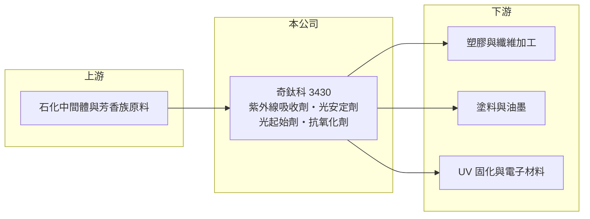

# 3430 奇鈦科

> 上櫃｜[[產業索引-化學工業|化學工業]]｜上市（櫃）日期 2022/09/08

# 第一章：企業模式與商業藍圖

> [!info] 撰寫說明
> 精簡版，由 Claude 依公開資料整理，架構比照 [[2330台積電]]，資料截至 2026-10-08。來源：winvest 營收快訊（公司簡介與 EPS）、富邦證券（MoneyDJ）財務比率年表、櫃買中心開放資料（基本資料、2026 年上半年損益與資產負債、股利）。產品別營收比重與客戶名稱未查得。#待校對

奇鈦科技是專做高分子添加劑的特用化學品公司，產品用量很小、卻決定塑膠與塗料能否耐曬耐用，或能否在紫外光下快速固化，屬於「小用量、高附加價值」的利基材料。

- **核心業務：** 公司研發、生產與銷售[[紫外線吸收劑]]、[[光安定劑]]、[[光起始劑]]與抗氧化劑。前兩者加在塑膠、塗料與纖維中，防止材料被陽光照射後變黃、脆化；光起始劑則是 UV 固化油墨、塗料與電子材料的關鍵成分，照到紫外光就啟動聚合反應，讓材料在幾秒內硬化。
- **營收結構：** 產品別比重未查得。依產品性質，營收可分為「耐候添加劑」（紫外線吸收劑、光安定劑、抗氧化劑）與「UV 固化材料」（光起始劑）兩條線，前者跟著塑膠與塗料用量走，後者跟著印刷、電子與 3D 列印等光固化應用成長（推估）。
- **營運據點：** 公司 1998 年成立，總部位於台北，2022 年 9 月登錄櫃買中心掛牌，資本額約 3.37 億元。產品多數外銷，客戶分布於亞洲、歐美的塑膠、塗料與油墨廠（推估）。
- **長期方向：** 耐候添加劑的長期需求來自汽車、建材、太陽能與戶外用品對材料壽命的要求；光固化則因為比熱固化省能源、少溶劑，是塗料與油墨的長期替代趨勢。奇鈦科的成長取決於能否持續開發新分子結構並取得國際客戶認證。

# 第二章：護城河深度與競爭優勢

特用添加劑需要分子合成能力與長期認證，奇鈦科的護城河來自技術與客戶認證，但必須和國際化工大廠競爭。

- **競爭優勢：** 添加劑雖然只占配方很小比例，卻直接影響終端產品的品質與保固，客戶換料前必須重新做耐候與老化測試，耗時較長。因此一旦被列入配方，供應關係通常能維持多年，這是奇鈦科毛利率長期維持在 20% 以上的原因。
- **主要對手：** 國際上有歐洲化工集團的添加劑部門，以及中國大陸的光穩定劑與光起始劑大廠；台灣同業有 [[4764雙鍵]] 等（推估）。中國同業擴產時，標準品價格容易下跌。
- **經營與資本配置：** 2025 年度配發現金股利 1.6 元，以 EPS 3.15 元計算配息率約 51%。公司保留約一半盈餘支應研發與產能，負債比由 2020 年的 53% 降到 2025 年約 31%，財務結構逐年改善。
- **觀察重點：** 高毛利新品的占比、中國同業擴產對標準品報價的影響，以及光固化應用（電子、3D 列印）能否成為新動能。

# 第三章：財務體質與盈利規模

資料日期：2026-10-08，表格是撰寫當時的快照；最新月營收、毛利率、累計 EPS 由自動排程寫在本筆記的屬性欄位（月營收、毛利率、累計EPS 等）。#待校對

奇鈦科近 5 年營收穩中有升，ROE 多數年度在一成以上，但 2025 年毛利率明顯下滑。

| 年度 | 營收（億元，推算） | 營收年增率 | [[毛利率]] | [[營業利益率]] | EPS（元） | [[ROE]] |
|---|---|---|---|---|---|---|
| 2021 | 約 14.9 | 29.09% | 23.12% | 11.79% | 4.40 | 21.43% |
| 2022 | 約 15.9 | 6.72% | 26.56% | 13.14% | 6.33 | 23.49% |
| 2023 | 約 12.6 | -20.98% | 27.79% | 10.51% | 3.57 | 11.88% |
| 2024 | 約 14.7 | 16.64% | 28.31% | 13.43% | 4.79 | 15.05% |
| 2025 | 約 17.1 | 16.19% | 22.97% | 9.03% | 3.15 | 9.39% |

註：年增率、毛利率、營業利益率、EPS、ROE 取自富邦證券（MoneyDJ）財務比率年表（合併報表）；營收金額依 2025 年 EPS、股本與稅後淨利率推算，再以各年年增率回推，屬推算值。

- **營收規模：** 2021 至 2025 年營收年複合成長率約 3.5%（推算）。2023 年隨全球化工去庫存衰退約兩成，2024 與 2025 年連續成長，顯示需求具有景氣循環特性。
- **獲利：** 近 5 年平均 ROE 約 16.2%。2025 年營收創高，但毛利率從 28.31% 降到 22.97%，代表成長來自較低毛利的產品或售價壓力，獲利沒有跟著營收成長。
- **財務特色：** 2026 年第二季底股東權益約 11.86 億元、負債總計約 6.65 億元，負債比約 36%，每股淨值約 35.16 元。
- **[[ROIC]] 與 [[WACC]]：** 以 2025 年推算營收約 17.1 億元、營業利益率 9.03%、稅率 20% 計算，稅後營業利益約 1.24 億元；投入資本以股東權益 11.86 億元加有息負債（未查得，介於 0 與負債總計 6.65 億元之間）計，ROIC 約 6.7% 至 10.4%（推算）；若以近 5 年平均營業利益率 11.6% 計算，ROIC 約 10% 上下（推算）。WACC 以 CAPM 推估：無風險利率 1.75%、市場風險溢酬 6%、β 取化工中小型股常見值 0.9（未查得個股 β），股權成本約 7.2%；稅前負債成本假設 2.5%、稅後 2.0%，有息負債約占資本兩成，WACC 約 6%（推算）。正常年度 ROIC 高於 WACC，代表奇鈦科長期有創造價值，但 2025 年的利差已明顯縮小。

# 第四章：總體風險與地緣政治

奇鈦科的風險來自化工景氣循環、中國同業的價格競爭與匯率。

- **產業週期：** 添加劑需求跟著塑膠、塗料與油墨的生產量起伏，下游去化庫存時訂單會被放大縮減，2023 年營收衰退兩成就是例子。
- **營運風險：** 中國大陸光穩定劑與光起始劑產能龐大，標準品價格容易被壓低；奇鈦科需要靠新品與客製化產品維持毛利率。化學合成也涉及工安、廢水與環評管理。
- **其他風險：** 產品以外銷為主，新台幣升值會壓縮毛利；部分原料依賴中國供應，地緣政治與出口管制可能影響供料；歐盟等地的化學品註冊與禁用法規，也會增加新品上市的成本。

# 專有名詞解析

## 金融

- **[[ROIC]]**：投入資本報酬率，稅後營業利益除以股東權益加有息負債，衡量本業運用資本的效率。
- **[[WACC]]**：加權平均資金成本，股東與債權人要求報酬率的加權平均，是 ROIC 要超過的門檻。

## 產業

- **[[紫外線吸收劑]]**：加入塑膠、塗料中吸收紫外線的添加劑，可減緩材料受陽光照射後變黃與脆化。
- **[[光安定劑]]**：捕捉材料受光照產生的自由基、延長塑膠與塗料壽命的添加劑，常與紫外線吸收劑搭配使用。
- **[[光起始劑]]**：照射紫外光後產生活性物質、啟動樹脂聚合的成分，是 UV 固化油墨與塗料的關鍵原料。

# 核心供應鏈

- 上游：石化中間體、芳香族化合物等合成原料供應商（推估）
- 下游／客戶：塑膠與纖維加工廠、塗料與油墨廠、UV 固化材料與電子材料廠（推估，公司未揭露客戶名稱）
- 同業：[[4764雙鍵]]、國際化工集團的添加劑部門與中國大陸光穩定劑、光起始劑廠（推估）

## 最新新聞
<!-- news:start -->
<!-- news:end -->

## 相關連結
- [公開資訊觀測站](https://mopsov.twse.com.tw/mops/web/t05st03?step=1&firstin=1&co_id=3430)
- [Goodinfo](https://goodinfo.tw/tw/StockDetail.asp?STOCK_ID=3430)
- [Yahoo 股市](https://tw.stock.yahoo.com/quote/3430)
- [鉅亨網新聞](https://www.cnyes.com/twstock/3430/news)
