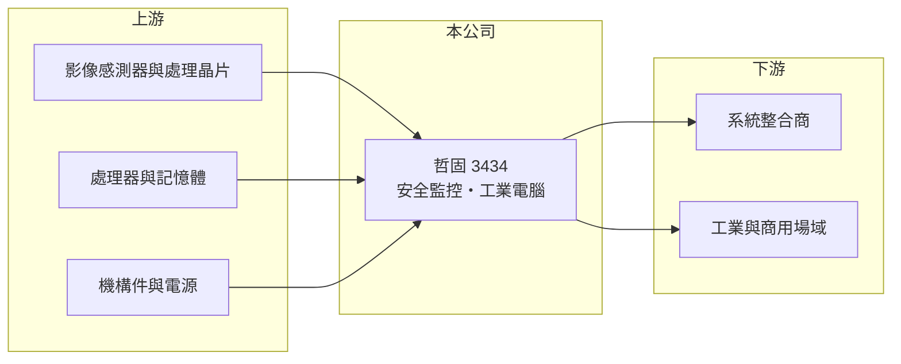

# 3434 哲固

> 上櫃｜[[產業索引-光電業|光電業]]｜上市（櫃）日期 2008/01/28

# 第一章：企業模式與商業藍圖

> [!info] 撰寫說明
> 精簡版，由 Claude 依公開資料整理，架構比照 [[2330台積電]]，資料截至 2026-10-07。來源：winvest.tw 哲固營收快訊與公司概況。公開資料有限，營收比重與營運據點未查到。#待校對

哲固是小型的監控與工業電腦產品公司，營收規模每月僅數千萬元，波動很大。

- **核心業務：** 哲固資訊科技成立於 1993 年，2008 年掛牌，業務涵蓋安全監控產品、[[工業電腦]]產品及相關週邊產品（產品細項推估包含監控攝影機與錄影設備）。
- **營收結構：** 本次未查到產品或地區營收比重。
- **營運據點：** 營運與生產據點本次未查到，本文不推測。
- **長期方向：** 監控產業正走向網路化與 AI 影像分析，工業電腦則受惠[[邊緣運算]]需求；哲固能否在這兩條線找到利基產品，決定營收能否穩定。

# 第二章：護城河深度與競爭優勢

哲固規模小，護城河有限，主要靠利基市場與客製化接單生存。

- **競爭優勢：** 同時具備監控與工業電腦兩條產品線，可替系統整合商提供較完整的硬體組合（推估）。
- **主要對手：** 監控有 [[3356奇偶]]、3454晶睿、[[3128昇銳]] 與中國大廠海康威視、大華；工業電腦有 [[2395研華]] 等大廠。
- **觀察重點：** 月營收能否擺脫大起大落，以及獲利能否維持正數。

# 第三章：財務體質與盈利規模

資料日期：2026-10-07，以下數字是撰寫當時的快照；最新月營收、毛利率、累計 EPS 由自動排程寫在本筆記的屬性欄位（月營收、毛利率、累計EPS 等）。#待校對

哲固 2026 年累計營收明顯衰退，但仍維持小幅獲利。

- **營收規模：** 2026 年 1 至 8 月累計營收 3.36 億元，年減 30.86%；8 月營收 5,480.4 萬元，年增 41.95%，7 月則僅 2,502.7 萬元、年減 50.53%，單月波動大。
- **獲利：** 2025 年全年 EPS 0.47 元；2026 年第二季 EPS 0.10 元，上半年累計 0.18 元。[[毛利率]]本次未查到。
- **財務特色：** 資本額約 3.58 億元，市值約 10 億元，屬小型股，成交量與股價波動可能較大。

# 第四章：總體風險與地緣政治

哲固的風險主要在規模小、營收不穩定。

- **產業週期：** 監控與工業電腦需求跟著政府標案、企業資本支出與專案時程起伏，訂單認列時點不固定。
- **營運風險：** 營收規模小，少數大案的有無就足以讓單月營收大幅增減，固定費用攤提壓力也較大，[[營運槓桿]]會放大獲利波動。
- **其他風險：** 監控市場面對中國品牌價格競爭；零組件多仰賴外購，記憶體與晶片價格、匯率波動會影響毛利。

# 專有名詞解析

## 應用

- **[[邊緣運算]]**：在資料產生的現場附近處理運算，不必全部傳回雲端，可降低延遲與頻寬需求。

## 金融

- **[[營運槓桿]]**：固定成本占比高時，營收小幅變動就會讓獲利大幅增減；營收萎縮時虧損也會被放大。

## 產業

- **[[工業電腦]]**：用於工廠、交通、醫療等場域的電腦，強調耐用、長期供貨與客製化，而非最新效能。

# 核心供應鏈

- 上游：影像感測器與處理晶片、處理器與記憶體、機構件與電源供應商
- 下游／客戶：系統整合商、工業與商用場域（推估）
- 同業：[[3356奇偶]]、3454晶睿、[[3128昇銳]]、[[2395研華]]、海康威視、大華

## 最新新聞
<!-- news:start -->
<!-- news:end -->

## 相關連結
- [公開資訊觀測站](https://mopsov.twse.com.tw/mops/web/t05st03?step=1&firstin=1&co_id=3434)
- [Goodinfo](https://goodinfo.tw/tw/StockDetail.asp?STOCK_ID=3434)
- [Yahoo 股市](https://tw.stock.yahoo.com/quote/3434)
- [鉅亨網新聞](https://www.cnyes.com/twstock/3434/news)
