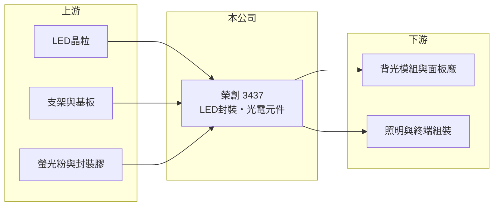

# 3437 榮創

> 上市｜[[產業索引-光電業|光電業]]｜上市（櫃）日期 2014/07/09

# 第一章：企業模式與商業藍圖

> [!info] 撰寫說明
> 精簡版，由 Claude 依公開資料整理，架構比照 [[2330台積電]]，資料截至 2026-10-07。來源：nstock.tw 榮創公司概況、winvest.tw 營收快訊。公開資料有限，營收比重與客戶未查到；集團關係為市場普遍說法，屬推估。#待校對

榮創是 LED 元件廠，2026 年營收大幅衰退且毛利轉負，處於虧損階段。

- **核心業務：** 榮創成立於 1999 年，2014 年掛牌，業務為發光二極體的研發、測試、製造與銷售，以及電子零組件製造，屬 [[LED封裝]]與光電元件廠。
- **營收結構：** 本次未查到產品比重；一般認為產品以顯示器背光與照明用 LED 為主（推估）。
- **營運據點：** 生產據點本次未查到；市場普遍將榮創歸為 [[2317鴻海]] 集團旗下 LED 公司（推估），客戶可能與集團的面板與組裝業務相關。
- **長期方向：** LED 產業正從一般背光與照明轉向 [[Micro LED]]、車用與特殊光源，榮創能否轉進高附加價值產品，是止虧的關鍵。

# 第二章：護城河深度與競爭優勢

榮創在高度競爭的 LED 產業中缺乏明顯護城河，主要依靠集團資源。

- **競爭優勢：** 若與鴻海集團的面板及終端組裝業務有綁定，可取得較穩定的基本訂單（推估）。
- **主要對手：** 國內有 3698隆達、[[2393億光]]、[[6168宏齊]] 等 LED 廠，中國則有木林森、三安光電等大廠，以規模與低價競爭。
- **觀察重點：** 毛利率能否回到正數、營收衰退能否止穩，以及是否有產品轉型或組織調整的動作。

# 第三章：財務體質與盈利規模

資料日期：2026-10-07，以下數字是撰寫當時的快照；最新月營收、毛利率、累計 EPS 由自動排程寫在本筆記的屬性欄位（月營收、毛利率、累計EPS 等）。#待校對

榮創 2026 年營收持續下滑，第二季毛利率為負、單季虧損。

- **營收規模：** 2025 年全年營收約 16 億元；2026 年 1 至 8 月累計約 8.89 億元，8 月營收 7,037.9 萬元，月減 35.98%、年減 42.51%。
- **獲利：** 2026 年第二季 EPS -0.69 元，[[毛利率]] -1.38%，代表銷貨收入已不足以支應生產成本（可能含[[存貨跌價損失]]，推估）。
- **財務特色：** 資本額約 14.45 億元，市值約 26 億元；股本相對營收規模偏大，虧損時每股淨值會持續被侵蝕。

# 第四章：總體風險與地緣政治

榮創的主要風險是 LED 價格競爭與持續虧損。

- **產業週期：** LED 背光與照明已是成熟產品，需求跟著電視、顯示器出貨起伏，價格長期向下。
- **營運風險：** 營收規模縮小、毛利轉負，若無法止虧，可能需要減產、處分資產或調整組織。
- **其他風險：** 中國同業的產能與補貼使報價承壓；原物料與匯率變動也會影響成本。

# 專有名詞解析

## 半導體

- **[[LED封裝]]**：把 LED晶粒固定在支架或基板上、接上電極並封膠，做成可直接使用的發光元件。

## 金融

- **[[存貨跌價損失]]**：存貨的可回收價值低於帳面成本時提列的損失，會直接計入銷貨成本、壓低毛利率。

## 產業

- **[[Micro LED]]**：以微米級 LED 直接當作畫素的顯示技術，亮度高、壽命長，但量產成本仍高。

# 核心供應鏈

- 上游：LED晶粒（如 2448晶電）、支架與基板、螢光粉與封裝膠材供應商
- 下游／客戶：背光模組與面板廠、照明與終端組裝廠，可能包括 [[2317鴻海]] 集團（推估）
- 同業：3698隆達、[[2393億光]]、[[6168宏齊]]、木林森、三安光電

## 最新新聞
<!-- news:start -->
<!-- news:end -->

## 相關連結
- [公開資訊觀測站](https://mopsov.twse.com.tw/mops/web/t05st03?step=1&firstin=1&co_id=3437)
- [Goodinfo](https://goodinfo.tw/tw/StockDetail.asp?STOCK_ID=3437)
- [Yahoo 股市](https://tw.stock.yahoo.com/quote/3437)
- [鉅亨網新聞](https://www.cnyes.com/twstock/3437/news)
