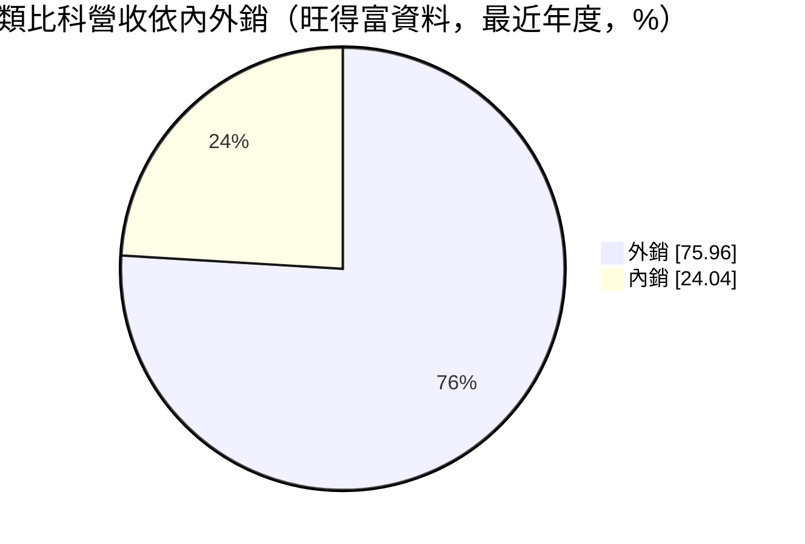
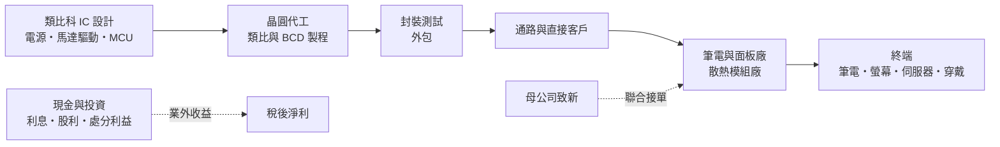
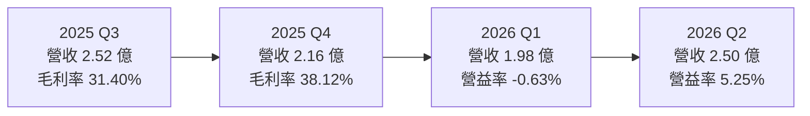
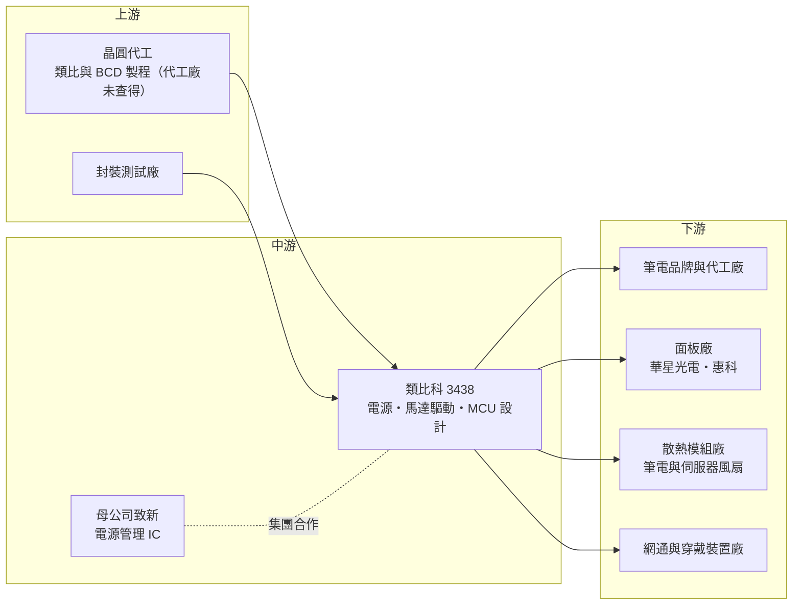

# 3438 類比科

> 上櫃｜[[產業索引-半導體業|半導體業]]｜上市（櫃）日期 2006/07/19

# 第一章：企業模式與商業藍圖

> [!info] 撰寫說明
> 本文由 Claude 依公開資料整理，架構比照 [[2330台積電]] 的四章研究，資料截至 2026-10-07。財務數字來源：聚財網（stock.wearn.com）季度損益表、nstock 公司資料頁、富果研究 2025 年 10 月法說會整理、旺得富公司基本資料頁、工商時報、優分析；產業描述為整理性內容，尚未逐條比對原始文件。#待校對

在評估單一個股的長期投資價值時，首要步驟是拆解企業的底層獲利邏輯。本章針對台灣類比科技（股票代號：3438，以下簡稱類比科）的商業模式進行定性分析，說明這家小型類比 IC 設計公司的產品線、與母公司 [[8081致新]] 的關係，以及它為何毛利率不低、本業獲利卻很薄。

## 一、核心定位：致新集團旗下的小型類比 IC 設計公司

類比科成立於 1999 年，總部位於新竹縣竹北市台元科技園區，2006 年 7 月上櫃，資本額約 4.72 億元，董事長為吳錦川。依工商時報報導，類比科是電源管理 IC 廠致新的子公司，兩家公司為母子公司關係（持股比例未查得）。

類比科是 [[Fabless]] 的類比 IC 設計公司，營收 100% 來自積體電路，專業領域為三條產品線：

* **[[PMIC]]（電源管理 IC）：** 用於中小尺寸 TFT 與 [[OLED]] 螢幕、智慧穿戴、網通設備的電源。
* **馬達驅動 IC：** 主要用於 IT 散熱系統，例如筆電、桌機與伺服器的散熱風扇；另有磁場感測 IC（[[霍爾感測器]]）。
* **[[MCU]]：** 用於遙控器、玩具等小型消費電子。

這個定位有兩個商業意義：

* **類比 IC 生命週期長：** 類比與電源 IC 不像數位晶片追求最新製程，一顆產品可以賣很多年，研發成果的回收期較長，毛利率也較穩定。
* **集團分工：** 母公司致新主攻筆電與面板電源管理的大客戶，類比科則在馬達驅動、磁感測與中小尺寸電源等利基產品發揮，兩者可以聯合爭取同一批客戶。工商時報曾報導兩家公司聯手拿下全球前五大非蘋筆電廠的訂單，並打入華星光電、惠科等中國面板廠。

## 二、終端應用／產品板塊

類比科未公開產品線的營收比重，可查得的是地區結構：依旺得富資料，外銷比率為 75.96%。

* **顯示器電源：** 中小尺寸 TFT 與 OLED 面板的電源 IC，客戶包括中國面板廠。螢幕往高解析度、OLED 升級時，電源規格提高，有助單價。
* **散熱風扇馬達驅動：** 筆電、桌機與伺服器的散熱風扇需要馬達驅動 IC 與霍爾感測器。AI 伺服器散熱需求增加，是這條產品線的潛在成長來源（推估）。
* **網通與穿戴：** 網通設備與智慧穿戴的電源轉換。
* **消費性 MCU：** 遙控器、玩具等，屬低單價、量大的產品。

## 三、資本轉化邏輯（營運模式）：高毛利、高研發費用、業外撐獲利

* **毛利率在 31% 至 39% 之間：** 類比 IC 的毛利率通常高於元件型產品，但類比科規模小，研發與管理費用占營收比重高，近八季營業利益率多在 -1% 至 7% 之間。
* **業外收益是獲利主力：** 多個季度營業利益為負，但稅後淨利為正，代表利息、投資收益等業外項目貢獻顯著。依優分析，2025 年第二季末現金約 6.71 億元，接近資本額的 1.4 倍。
* **轉投資收益：** 類比科持有中國顯示驅動 IC 公司新相微的股份，2025 年 7 月至 9 月處分 127 萬股，處分利益約 7,305 萬元（依會計處理計入保留盈餘，不影響每股盈餘），處分後仍持股約 1.99%。

## 四、企業長期藍圖

公司在 2025 年 10 月法說會上未提供具體的長期財務目標或新產品時程，策略以深耕既有應用為主。可觀察的方向包括：

* **跟隨母公司打入大客戶：** 透過致新的客戶關係，擴大筆電與面板電源 IC 的出貨。
* **散熱應用升級：** 伺服器與 AI 設備的散熱需求增加，馬達驅動 IC 有機會往高階規格移動（推估）。
* **高解析度與 OLED 顯示：** 4K、8K 與 OLED 螢幕需要更高規格的電源 IC，是單價提升的機會。

# 第二章：護城河深度與競爭優勢

「護城河」指企業抵禦競爭、維持超額利潤的保護機制。本章分析類比科在類比 IC 市場的競爭優勢、主要對手，以及優勢能否轉為穩定的本業獲利。

## 一、類比科護城河的核心組成要素

類比科的毛利率不低，代表產品本身有一定的差異化，但規模小使本業獲利薄。護城河主要來自：

* **1. 類比設計經驗：** 類比與電源 IC 的設計高度依賴工程師經驗，不容易被快速複製，產品導入後在客戶端的生命週期長。
* **2. 集團綜效：** 與母公司致新的客戶與供應鏈資源共享，能共同爭取筆電與面板大廠訂單，小公司單獨難以打入。
* **3. 利基產品組合：** 散熱風扇馬達驅動與霍爾感測屬於規模不大的市場，國際大廠投入意願較低，台灣小型設計公司較有機會。

## 二、全球主要競爭對手格局

| 對手 | 定位 | 對類比科的威脅 |
|---|---|---|
| [[6415矽力-KY]] | 大型類比電源 IC 公司 | 產品線廣、規模大，在電源 IC 全面競爭 |
| 德州儀器、亞德諾等國際類比大廠 | 全球類比 IC 龍頭 | 高階市場技術與品牌領先 |
| [[6138茂達]] | 電源管理與馬達驅動 IC | 在散熱風扇馬達驅動直接競爭 |
| [[6719力智]] | 電源管理 IC | 筆電電源 IC 競爭 |
| [[4919新唐]]、[[8016矽創]] | MCU 與顯示相關 IC | 在 MCU 與顯示電源競爭 |
| 中國類比 IC 公司 | 政策扶植、價格低 | 搶中國面板與消費性客戶 |

## 三、優勢轉化：守得住／守不住／觀察重點

* **守得住：** 已在筆電、面板客戶導入的電源與馬達驅動料號，以及透過集團關係取得的大客戶訂單。
* **守不住：** 消費性 MCU 與一般電源 IC 的價格。2025 年上半年毛利率由前一年同期的 40% 降到 33%，公司說明主因是產品週期性降價與組合變動，顯示價格競爭存在。
* **觀察重點：** 毛利率能否維持在 38% 左右（2025 年第四季至 2026 年第二季均約 38%）；營業利益率能否穩定轉正；2026 年 1 至 9 月營收年減 16.69%，需觀察衰退是來自客戶庫存調整還是市占下滑。

# 第三章：財務體質與盈利規模

資料日期：2026-10-07。數字取自聚財網季度損益表、nstock 公司資料頁與富果研究法說會整理，表格是撰寫當時的快照；最新月營收、毛利率、累計 EPS 由自動排程寫在本筆記的屬性欄位（月營收、毛利率、累計EPS 等）。#待校對

財務報表是檢驗護城河是否真實存在的最終標準。本章用三率、ROE、現金流與資本報酬，檢視類比科的獲利品質。

## 一、獲利能力的基石：三率

| 期間 | 營收（新台幣） | [[毛利率]] | [[營業利益率]] | EPS（元） |
|---|---|---|---|---|
| 2025 全年 | 10.11 億 | 約 33.8%（依季度推算） | 約 2.2%（依季度推算） | 1.00 |
| 2025 Q1 | 2.58 億 | 34.03% | 3.77% | 0.33 |
| 2025 Q2 | 2.85 億 | 32.58% | 6.12% | -0.19 |
| 2025 Q3 | 2.52 億 | 31.40% | -1.10% | 0.43 |
| 2025 Q4 | 2.16 億 | 38.12% | -0.86% | 0.43 |
| 2026 Q1 | 1.98 億 | 38.67% | -0.63% | 0.24 |
| 2026 Q2 | 2.50 億 | 38.14% | 5.25% | 0.39 |

* **[[毛利率]]：** 2025 年第三季低點 31.40%，之後回升到 38% 左右，反映產品組合改善。
* **[[營業利益率]]：** 營收規模在每季 2 至 3 億元之間，費用相對固定，營收稍低就會出現營業虧損。2026 年第二季營收回到 2.5 億元，營業利益率才回到 5.25%。
* **[[淨利率]]與業外：** 2025 年第二季營業利益率 6.12%，卻因新台幣升值產生約 2,700 萬元的匯兌損失差異，稅後虧損，EPS -0.19 元。2025 年第三、四季營業利益為負，但 EPS 各 0.43 元，主要靠業外收益。投資人評估時，應把本業與業外分開看。
* **營收動能：** 2025 年全年營收 10.11 億元；2026 年 1 至 9 月累計 6.62 億元，年減 16.69%，9 月營收約 0.7 億元，年減 0.84%，衰退幅度已收斂。

## 二、[[ROE]]：資本效率

2025 年 EPS 1.00 元，以資本額 4.72 億元計算，稅後淨利約 0.47 億元。類比科帳上現金充裕（2025 年第二季末約 6.71 億元），大量現金壓低了 ROE，估計在個位數（推估，每股淨值未查得）。資本效率偏低，是現金過多而本業規模不足的典型結果。

## 三、資本支出與自由現金流

* **[[CapEx]]：** Fabless 模式不需建廠，資本支出低（具體金額未查得）。
* **[[自由現金流]]：** 輕資產與穩定的毛利率，使營業現金流大致為正（推估），現金持續累積。
* **股利：** 2025 年度現金股利 1.5 元，高於當年 EPS 1.00 元，配發率約 150%，代表公司動用過去累積的盈餘配息；近五年平均現金股利約 1.7 元。高配息有賴充沛的現金，若本業獲利未改善，長期高配息不易維持。

## 四、[[ROIC]] 與 [[WACC]]：價值創造利差

若只看本業，營業利益率長期在 0% 上下，扣除稅後的本業 ROIC 很低，多數期間低於合理的資金成本（推估）。公司的整體報酬有相當部分來自業外與投資收益。本業 ROIC 能否改善，取決於營收規模擴大到足以攤提研發費用。

# 第四章：總體風險與地緣政治

任何企業都無法脫離宏觀環境獨立存在。本章分析類比科必須面對的地緣政治、產業週期、營運與技術風險。

## 一、地緣政治風險

* **依賴中國市場：** 外銷比率約 76%，客戶包括中國面板廠，中國推動晶片國產化，中國面板廠可能優先採用本土電源 IC。
* **中國轉投資：** 持有中國 IC 設計公司新相微股份，處分收益受中國股市與兩岸政策影響。
* **關稅與供應鏈轉移：** 筆電與面板組裝地若因關稅外移，客戶結構可能隨之改變。

## 二、產業週期與市場結構

* **消費性電子週期：** 筆電、螢幕、穿戴裝置都屬消費性產品，需求轉弱時客戶會先調整庫存。
* **[[長鞭效應]]：** 2026 年前三季營收年減 16.69%，可能部分反映客戶庫存調整。
* **晶圓代工價格：** 成熟製程或 8 吋代工若漲價，IC 設計公司需要轉嫁，否則毛利率受壓。

## 三、營運環境的隱性風險

* **規模過小：** 營收約 10 億元，研發與營業費用相對固定，營收波動直接造成營業虧損。
* **獲利依賴業外：** 業外收益（利息、投資、處分利益）波動大，不能視為穩定獲利。
* **匯率：** 外銷比重高，新台幣升值會產生匯兌損失，2025 年第二季即為一例。
* **母公司關係：** 致新為母公司，集團內分工與客戶分配會影響類比科的成長空間。

## 四、科技或法規演進

* **顯示技術轉換：** 面板從 LCD 轉向 OLED、Mini LED 等新技術，電源 IC 規格隨之改變，若產品開發跟不上，會失去客戶。
* **散熱技術轉換：** AI 伺服器散熱逐漸導入液冷，若液冷取代部分風扇，伺服器散熱風扇的馬達驅動需求可能受影響（推估）。

# 專有名詞解析

## 半導體

- **[[PMIC]]**：電源管理 IC，負責電壓轉換、穩壓與電池充放電管理，是幾乎所有電子產品都需要的類比晶片。
- **[[類比IC]]**：處理電壓、電流等連續訊號的晶片，如電源與感測 IC，產品生命週期長，不追求最先進製程。
- **[[MCU]]**：微控制器，把處理器、記憶體與輸入輸出介面整合在一顆晶片，用於家電、玩具與工業控制。
- **[[霍爾感測器]]**：利用霍爾效應偵測磁場變化的感測元件，常用於無刷馬達判斷轉子位置與轉速。
- **[[Fabless]]**：只做晶片設計、把製造外包給晶圓代工廠的商業模式。
- **[[BCD]]**：Bipolar-CMOS-DMOS 製程，把類比、數位與高功率元件整合在同一晶片，主要用於電源管理 IC。

## 應用

- **[[OLED]]**：有機發光二極體顯示技術，每個像素自行發光，色彩與對比優於 LCD，電源規格要求也較高。
- **[[馬達驅動IC]]**：控制馬達轉速與方向的晶片，筆電與伺服器的散熱風扇都需要。

## 金融

- **[[業外收益]]**：本業以外的收入，如利息、投資收益、處分資產利益與匯兌損益，波動大、不一定能持續。
- **[[配發率]]**：現金股利除以每股盈餘，超過 100% 代表動用過去累積的盈餘配息。

## 產業

- **[[長鞭效應]]**：終端需求的小幅變動，沿供應鏈往上游傳遞時被逐級放大，造成上游庫存與訂單劇烈波動。

# 核心供應鏈

## 1. 上游：晶圓代工與封測
- 類比 IC 常用的成熟製程代工：[[2303聯電]]、[[5347世界先進]]、[[6770力積電]]（產業參考，類比科實際代工廠未查得）

## 2. 中游：集團與同業
- 母公司：[[8081致新]]
- 同業：[[6415矽力-KY]]、[[6138茂達]]、[[6719力智]]、[[4919新唐]]

## 3. 下游：客戶與應用
- 筆電：全球前五大非蘋筆電品牌（工商時報報導，未具名）
- 面板：華星光電、長沙惠科
- 散熱：筆電、桌機與伺服器散熱風扇模組廠，如 [[3017奇鋐]]、[[3324雙鴻]]（產業參考，非公司揭露客戶）

## 4. 轉投資
- 新相微（中國顯示驅動 IC 公司，持股約 1.99%）

## 最新新聞
<!-- news:start -->
<!-- news:end -->

## 相關連結
- [公開資訊觀測站](https://mopsov.twse.com.tw/mops/web/t05st03?step=1&firstin=1&co_id=3438)
- [Goodinfo](https://goodinfo.tw/tw/StockDetail.asp?STOCK_ID=3438)
- [Yahoo 股市](https://tw.stock.yahoo.com/quote/3438)
- [鉅亨網新聞](https://www.cnyes.com/twstock/3438/news)
