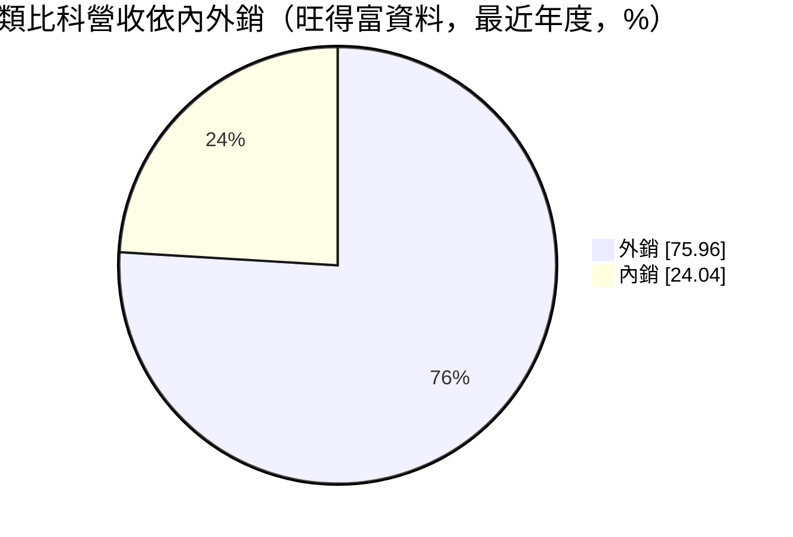
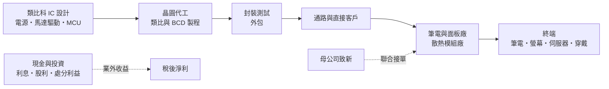
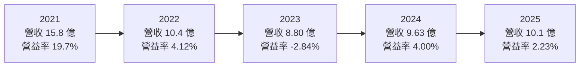
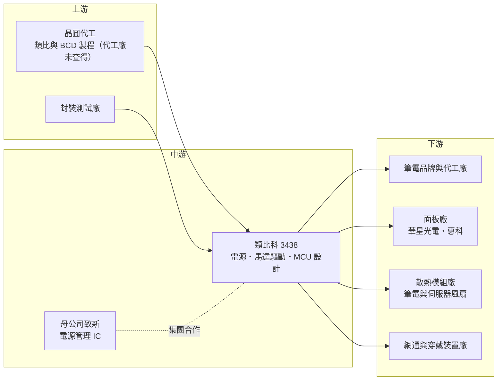

# 3438 類比科

> 上櫃｜[[產業索引-半導體業|半導體業]]｜上市（櫃）日期 2006/07/19

# 第一章：企業模式與商業藍圖

> [!info] 撰寫說明
> 本文由 Claude 依公開資料整理，架構比照 [[2330台積電]] 的四章研究，資料截至 2026-10-08。財務數字來源：Goodinfo 年度獲利指標、資產負債結構與股利政策頁、聚財網季度損益表、nstock 公司資料頁、富果研究 2025 年 10 月法說會整理、旺得富公司基本資料頁、工商時報、優分析；產業描述為整理性內容，尚未逐條比對原始文件。#待校對

在評估單一個股的長期投資價值時，首要步驟是拆解企業的底層獲利邏輯。本章針對台灣類比科技（股票代號：3438，以下簡稱類比科）的商業模式進行定性分析，說明這家小型類比 IC 設計公司的產品線、與母公司 [[8081致新]] 的關係，以及它為什麼毛利率不低、本業獲利卻很薄。

## 一、核心定位：致新集團旗下的小型類比 IC 設計公司

類比科成立於 1999 年，總部位於新竹縣竹北市台元科技園區，2006 年 7 月上櫃，資本額約 4.72 億元，董事長為吳錦川。依工商時報報導，類比科是電源管理 IC 廠致新的子公司（持股比例未查得）。

類比科是 [[Fabless]] 的[[類比IC]]設計公司，營收 100% 來自積體電路，專注三條產品線。第一條是[[PMIC]]（電源管理 IC），用於中小尺寸 TFT 與 [[OLED]] 螢幕、智慧穿戴與網通設備的電源。第二條是[[馬達驅動IC]]與磁場感測 IC（[[霍爾感測器]]），主要用於筆電、桌機與伺服器的散熱風扇。第三條是 [[MCU]]（微控制器），用於遙控器、玩具等小型消費電子。

類比 IC 與數位 IC 的生意邏輯很不一樣。數位晶片追求最先進的製程與最快的速度，產品世代更替快；類比與電源 IC 則多在成熟製程或 [[BCD]] 製程生產，一顆產品可以賣很多年，研發成果的回收期長，毛利率也較穩定。這是類比科毛利率長期維持在三成以上的原因。

集團分工則是理解類比科的另一個關鍵。母公司致新主攻筆電與面板電源管理的大客戶，類比科在馬達驅動、磁感測與中小尺寸電源等利基產品發揮。工商時報曾報導兩家公司聯手拿下全球前五大非蘋筆電品牌的訂單，並打入華星光電、惠科等中國面板廠，這種「母子聯手」讓小公司得以接觸自己單獨難以打入的大客戶。

## 二、終端應用／產品板塊

類比科未公開產品線的營收比重，可查得的是地區結構：依旺得富資料，外銷比率約 76%。

顯示器電源是重要的應用板塊，涵蓋中小尺寸 TFT 與 OLED 面板的電源 IC，客戶包括中國面板廠。螢幕往高解析度與 OLED 升級時，電源規格隨之提高，有助於提升單價。散熱風扇的馬達驅動是第二個板塊，筆電、桌機與伺服器的散熱風扇都需要馬達驅動 IC 與霍爾感測器；伺服器與 AI 設備的散熱需求增加，是這條產品線的潛在成長來源（推估）。網通與穿戴裝置的電源轉換，以及遙控器、玩具等消費性 MCU，則屬於量大、單價較低的業務。

## 三、資本轉化邏輯（營運模式）：高毛利、高研發費用、業外撐獲利

類比科的獲利結構有一個明顯的特點：毛利率高，但營業利益率很低。過去五年毛利率在 31% 至 42% 之間，但研發與管理費用相對固定，以年營收約 10 億元的規模來說，費用占營收比重很高，2022 至 2025 年營業利益率都在 -3% 到 4% 之間。換句話說，類比科的產品本身有定價能力，問題在於規模太小，攤不掉研發費用。

業外收益因此成為獲利的重要來源。類比科帳上現金充裕，依 Goodinfo，2025 年現金約占總資產 26%，股東權益占總資產約 87%，幾乎沒有負債。此外，類比科持有中國顯示驅動 IC 公司新相微的股份，2025 年處分約 127 萬股，處分利益約 7,305 萬元（依會計處理計入保留盈餘，不影響每股盈餘），處分後仍持股約 1.99%。這筆投資讓類比科的淨值在本業獲利有限的情況下仍明顯成長：每股淨值從 2022 年的 30.37 元升到 2025 年的 45.39 元，推估主要來自新相微上市後的投資評價利益。

## 四、企業長期藍圖

公司在 2025 年 10 月法說會上沒有提出具體的長期財務目標或新產品時程，策略以深耕既有應用為主。從產品組合與集團關係來看，可以觀察三個長期方向：一是透過母公司致新的客戶關係，擴大筆電與面板電源 IC 的出貨；二是伺服器散熱需求增加，馬達驅動 IC 往高階規格移動；三是 4K、8K 與 OLED 螢幕需要更高規格的電源 IC，帶來單價提升的機會。這些方向能否落實，最終會反映在營收規模能否擴大到足以攤提研發費用。

# 第二章：護城河深度與競爭優勢

「護城河」指企業抵禦競爭、維持超額利潤的保護機制。本章分析類比科在類比 IC 市場的競爭優勢、主要對手，以及優勢能否轉為穩定的本業獲利。

## 一、類比科護城河的核心組成要素

類比科的毛利率長期在三成以上，代表產品有一定差異化，但規模小使本業獲利薄。它的護城河主要來自三個方面。

第一是類比設計經驗。類比與電源 IC 的設計高度依賴工程師的經驗，電路在不同溫度、電壓下的穩定性需要長期累積的知識，不容易被快速複製。產品一旦導入客戶端，生命週期通常長達數年。

第二是集團綜效。與母公司致新共享客戶與供應鏈資源，可以共同爭取筆電與面板大廠的訂單。對一家年營收約 10 億元的公司來說，單獨打入全球前五大筆電品牌幾乎不可能，集團關係是關鍵的敲門磚。

第三是利基產品組合。散熱風扇馬達驅動與霍爾感測屬於規模不大的市場，國際類比大廠投入意願較低，台灣小型設計公司較有機會在這類市場站穩腳步。

## 二、全球主要競爭對手格局

| 對手 | 定位 | 對類比科的威脅 |
|---|---|---|
| [[6415矽力-KY]] | 大型類比電源 IC 公司 | 產品線廣、規模大，在電源 IC 全面競爭 |
| 德州儀器、亞德諾等國際類比大廠 | 全球類比 IC 龍頭 | 高階市場技術與品牌領先 |
| [[6138茂達]] | 電源管理與馬達驅動 IC | 在散熱風扇馬達驅動直接競爭 |
| [[6719力智]] | 電源管理 IC | 筆電電源 IC 競爭 |
| [[8016矽創]] | 顯示相關 IC | 在顯示電源與驅動相關產品競爭 |
| 中國類比 IC 公司 | 政策扶植、價格低 | 搶中國面板與消費性客戶 |

## 三、優勢轉化：守得住／守不住／觀察重點

類比科守得住的，是已在筆電、面板客戶導入的電源與馬達驅動料號，以及透過集團關係取得的大客戶訂單。這些訂單重視可靠度與長期供貨，客戶不會輕易更換。

守不住的，是消費性 MCU 與一般電源 IC 的價格。2025 年上半年毛利率由前一年同期的約 40% 降到約 33%，公司說明主因是產品週期性降價與組合變動，顯示在同質性較高的產品上，價格競爭始終存在，中國類比 IC 公司的崛起會讓這種壓力長期化。

長期觀察重點是營收規模能否回到 2021 年的 15 億元以上，讓營業利益率穩定轉正；以及公司如何運用帳上大量的現金與投資部位，是用於研發、併購，還是持續以高股利回饋股東。

# 第三章：財務體質與盈利規模

資料日期：2026-10-08。數字取自 Goodinfo 年度財務資料、聚財網季度損益表與富果研究法說會整理，表格是撰寫當時的快照；最新月營收、毛利率、累計 EPS 由自動排程寫在本筆記的屬性欄位（月營收、毛利率、累計EPS 等）。#待校對

財務報表是檢驗護城河是否真實存在的最終標準。本章用五年的三率、ROE、現金流與資本報酬，檢視類比科的獲利品質。

## 一、獲利能力的基石：三率

| 年度 | 營收（新台幣） | [[毛利率]] | [[營業利益率]] | EPS（元） | [[ROE]] |
|---|---|---|---|---|---|
| 2021 | 15.8 億 | 42.2% | 19.7% | 5.14 | 17.1% |
| 2022 | 10.4 億 | 34.2% | 4.12% | 2.29 | 7.24% |
| 2023 | 8.80 億 | 31.0% | -2.84% | 0.00 | 0.0% |
| 2024 | 9.63 億 | 38.1% | 4.00% | 1.51 | 3.56% |
| 2025 | 10.1 億 | 33.8% | 2.23% | 1.00 | 2.21% |

五年數字清楚顯示營收規模與獲利的關係。2021 年 IC 缺貨、營收 15.8 億元，毛利率 42.2%、營業利益率 19.7%，EPS 5.14 元；2022 年營收降到約 10 億元，營業利益率立刻掉到 4%，之後三年都在 -3% 到 4% 之間。毛利率並沒有崩跌，但營收少了三分之一，研發與管理費用卻無法同比例縮減，營業利益幾乎被吃光。2021 到 2025 年的營收年複合成長率約 -10.6%（推算）。

[[淨利率]]方面，近年稅後淨利多高於營業利益，原因是利息與投資收益等業外項目。2025 年第二季則因新台幣升值出現大額匯兌損失，單季轉為虧損。投資人評估類比科時，應把本業與業外分開看。

## 二、[[ROE]]：資本效率

近五年平均 ROE 約 6.0%（推算），2022 年以後都在 7% 以下，2025 年只有 2.21%。ROE 偏低有兩個原因：一是本業獲利薄；二是淨值龐大，每股淨值已達約 45 元，其中相當部分是現金與新相微的投資部位，這些資產的報酬率遠低於本業應有的水準。這是典型的「現金與投資過多、本業規模不足」造成的資本效率低落。

## 三、資本支出與自由現金流

Fabless 模式不需建廠，資本支出低（具體金額未查得），在毛利率穩定的情況下，營業現金流大致為正（推估），現金持續累積。依 Goodinfo，2021 至 2025 年度現金股利分別為 3.6、1.4、0.5、1.5、1.5 元。2024 與 2025 年度的配息都接近或超過當年 EPS，2025 年度配息率約 150%（推算），代表公司動用過去累積的盈餘回饋股東。高配息有充沛的現金支撐，但若本業獲利沒有改善，長期維持這個水準並不容易。

## 四、[[ROIC]] 與 [[WACC]]：價值創造利差

**ROIC 推算：** 2025 年營業利益約 0.225 億元（10.1 億 × 2.23%），扣除 20% 稅率後的稅後營業利益約 0.18 億元。股東權益約 21.4 億元（每股淨值 45.39 元 × 約 0.472 億股），Goodinfo 顯示沒有長期負債。以股東權益作為投入資本，ROIC 約 0.8%（推算）；若扣除約 26% 總資產的現金（約 6.5 億元，推算）只算營運資本，ROIC 約 1.2%（推算）。以同樣方法回推 2021 年，稅後營業利益約 2.49 億元、股東權益約 15.6 億元，ROIC 約 16%（推算）。

**WACC 推算：** 股東權益成本用 CAPM 估計，假設台灣 10 年期公債殖利率 1.75%、市場風險溢酬 6%、β 取類比 IC 設計同業常見值 1.0，股東權益成本約 7.75%。公司幾乎沒有有息負債，WACC 約 7.75%（推算）。

**結論：** 只有在 2021 年的景氣高峰，類比科的本業 ROIC 明顯高於 WACC；2022 年以後本業 ROIC 都在 3% 以下，低於資金成本，代表本業長期並未創造經濟價值。股東報酬目前主要來自業外投資與累積現金的配發，而不是本業。要改變這個局面，類比科需要把營收規模擴大到足以攤提研發費用，或更積極地運用帳上資本。

# 第四章：總體風險與地緣政治

任何企業都無法脫離宏觀環境獨立存在。本章分析類比科長期必須面對的地緣政治、產業週期、營運與技術風險。

## 一、地緣政治

類比科的外銷比率約 76%，客戶包括中國面板廠，中國推動晶片國產化，中國面板廠可能優先採用本土電源 IC，長期壓縮台灣類比 IC 公司的市場。類比科持有中國 IC 設計公司新相微的股份，這筆投資的價值與處分收益，會受到中國股市與兩岸政策的影響。筆電與面板的組裝地若因關稅外移，客戶結構也可能隨之改變。

## 二、產業週期與市場結構

筆電、螢幕、穿戴裝置都屬於消費性產品，需求轉弱時客戶會先調整庫存，並透過[[長鞭效應]]放大反映在 IC 訂單上。成熟製程或 8 吋晶圓代工若漲價，IC 設計公司需要轉嫁給客戶，否則毛利率會受壓。匯率也是長期變數，外銷比重高，新台幣升值會產生匯兌損失。

## 三、營運環境的隱性風險

規模過小是最根本的風險，營收約 10 億元，研發與營業費用相對固定，營收稍有波動就會造成營業虧損。其次是獲利依賴業外，利息、投資與處分利益波動大，不能視為穩定的獲利來源。最後是母公司關係，致新為母公司，集團內的分工與客戶分配，會直接影響類比科的成長空間。

## 四、科技演進

顯示技術正從 LCD 轉向 OLED、Mini LED 等新技術，電源 IC 的規格隨之改變，若產品開發跟不上，就會失去客戶。散熱技術也在演進，AI 伺服器逐漸導入液冷，若液冷取代部分風扇，伺服器散熱風扇的馬達驅動需求可能受影響（推估）。類比科需要持續跟隨終端技術的變化調整產品線。

# 專有名詞解析

## 半導體

- **[[PMIC]]**：電源管理 IC，負責電壓轉換、穩壓與電池充放電管理，是幾乎所有電子產品都需要的類比晶片。
- **[[類比IC]]**：處理電壓、電流等連續訊號的晶片，如電源與感測 IC，產品生命週期長，不追求最先進製程。
- **[[MCU]]**：微控制器，把處理器、記憶體與輸入輸出介面整合在一顆晶片，用於家電、玩具與工業控制。
- **[[霍爾感測器]]**：利用霍爾效應偵測磁場變化的感測元件，常用於無刷馬達判斷轉子位置與轉速。
- **[[Fabless]]**：只做晶片設計、把製造外包給晶圓代工廠的商業模式。
- **[[BCD]]**：Bipolar-CMOS-DMOS 製程，把類比、數位與高功率元件整合在同一晶片，主要用於電源管理 IC。

## 應用

- **[[OLED]]**：有機發光二極體顯示技術，每個像素自行發光，色彩與對比優於 LCD，電源規格要求也較高。
- **[[馬達驅動IC]]**：控制馬達轉速與方向的晶片，筆電與伺服器的散熱風扇都需要。

## 金融

- **[[業外收益]]**：本業以外的收入，如利息、投資收益、處分資產利益與匯兌損益，波動大、不一定能持續。
- **[[ROIC]]**：投入資本報酬率，稅後營業利益除以股東權益加有息負債，衡量本業運用資本的效率。
- **[[WACC]]**：加權平均資金成本，股東與債權人要求報酬的加權平均，ROIC 高於它才代表創造價值。

## 產業

- **[[長鞭效應]]**：終端需求的小幅變動，沿供應鏈往上游傳遞時被逐級放大，造成上游庫存與訂單劇烈波動。

# 核心供應鏈

## 1. 上游：晶圓代工與封測
- 類比 IC 常用的成熟製程代工：[[2303聯電]]、[[5347世界先進]]、[[6770力積電]]（產業參考，類比科實際代工廠未查得）

## 2. 中游：集團與同業
- 母公司：[[8081致新]]
- 同業：[[6415矽力-KY]]、[[6138茂達]]、[[6719力智]]

## 3. 下游：客戶與應用
- 筆電：全球前五大非蘋筆電品牌（工商時報報導，未具名）
- 面板：華星光電、長沙惠科
- 散熱：筆電、桌機與伺服器散熱風扇模組廠，如 [[3017奇鋐]]、[[3324雙鴻]]（產業參考，非公司揭露客戶）

## 4. 轉投資
- 新相微（中國顯示驅動 IC 公司，持股約 1.99%）

## 最新新聞
<!-- news:start -->
<!-- news:end -->

## 相關連結
- [公開資訊觀測站](https://mopsov.twse.com.tw/mops/web/t05st03?step=1&firstin=1&co_id=3438)
- [Goodinfo](https://goodinfo.tw/tw/StockDetail.asp?STOCK_ID=3438)
- [Yahoo 股市](https://tw.stock.yahoo.com/quote/3438)
- [鉅亨網新聞](https://www.cnyes.com/twstock/3438/news)
