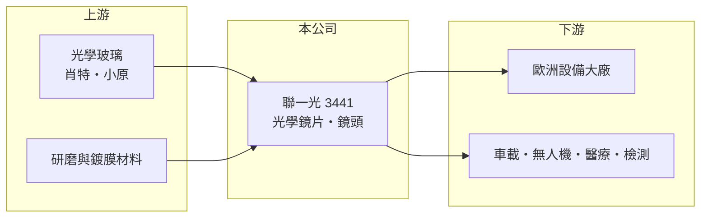

# 3441 聯一光

> 上櫃｜[[產業索引-光電業|光電業]]｜上市（櫃）日期 2010/10/04

# 第一章：企業模式與商業藍圖

> [!info] 撰寫說明
> 精簡版，由 Claude 依公開資料整理，架構比照 [[2330台積電]]，資料截至 2026-10-07。來源：nstock.tw 聯一光電公司概況、工商時報 2026-07-31 報導。公開資料有限，營收比重未查到。#待校對

聯一光是小型光學元件廠，2026 年受惠歐洲客戶訂單與新應用，營收與獲利明顯回升。

- **核心業務：** 聯一光電成立於 1984 年，業務為光學儀器、鏡頭等光學用器具的製造加工與買賣，以玻璃光學鏡片與鏡頭為主。
- **營收結構：** 本次未查到產品或地區比重；依報導，近期成長主要來自歐洲大廠訂單。
- **營運據點：** 生產據點本次未查到，本文不推測。
- **長期方向：** 公司積極布局車載、[[無人機]]、醫療、機器人與檢測設備等新應用，並與德國肖特（SCHOTT）、日本小原（OHARA）合作確保[[光學玻璃]]材料供應。

# 第二章：護城河深度與競爭優勢

聯一光的優勢在於少量多樣的精密玻璃光學加工，而非手機鏡頭的大量生產。

- **競爭優勢：** 工業、醫療與[[機器視覺]]光學需要客製化設計與穩定品質，認證後轉換成本較高；與國際玻璃材料大廠的合作有助於取得高品質材料。
- **主要對手：** 國內有 [[3504揚明光]]、[[3362先進光]] 等光學廠，國際上有日本與中國的精密光學加工廠。
- **觀察重點：** 歐洲客戶訂單能否延續，以及公司「每季都比去年同期好、全年雙位數成長」的目標能否達成。

# 第三章：財務體質與盈利規模

資料日期：2026-10-07，以下數字是撰寫當時的快照；最新月營收、毛利率、累計 EPS 由自動排程寫在本筆記的屬性欄位（月營收、毛利率、累計EPS 等）。#待校對

聯一光 2026 年上半年獲利已超過 2025 全年。

- **營收規模：** 2025 年全年營收 4.25 億元；2026 年 1 至 8 月累計 3.51 億元，8 月 0.44 億元；6 月營收 4,138 萬元，年增 73.63%。
- **獲利：** 2025 年全年 EPS 1.06 元；2026 年第一季 EPS 0.47 元、第二季 0.69 元，上半年合計 1.16 元；第二季[[毛利率]] 37.83%。
- **財務特色：** 營收規模小，少數大客戶訂單的變動就會明顯影響單季獲利。

# 第四章：總體風險與地緣政治

聯一光的風險在於客戶集中與規模小。

- **產業週期：** 工業與車用光學的需求跟著設備投資與車市景氣起伏，訂單有專案性質。
- **營運風險：** 近期成長仰賴歐洲大廠訂單，若客戶調整庫存或轉單，營收可能快速回落。
- **其他風險：** 光學玻璃材料依賴少數國際供應商；外銷比重高時，歐元與美元匯率波動會影響獲利。

# 專有名詞解析

## 應用

- **[[無人機]]**：無人駕駛飛行器，需要相機鏡頭、感測器與通訊模組，近年在國防與產業應用快速成長。
- **[[機器視覺]]**：以相機與影像演算法讓機器辨識物體與檢測瑕疵，廣泛用於工廠自動化與檢測設備。

## 產業

- **[[光學玻璃]]**：成分與折射率經過精密控制的玻璃材料，是鏡片與稜鏡的原料，德國肖特與日本小原為主要供應商。

# 核心供應鏈

- 上游：光學玻璃（德國肖特、日本小原）、研磨與鍍膜材料供應商
- 下游／客戶：歐洲設備大廠，以及車載、無人機、醫療、機器人與檢測設備廠
- 同業：[[3504揚明光]]、[[3362先進光]]、[[3406玉晶光]]

## 最新新聞
<!-- news:start -->
<!-- news:end -->

## 相關連結
- [公開資訊觀測站](https://mopsov.twse.com.tw/mops/web/t05st03?step=1&firstin=1&co_id=3441)
- [Goodinfo](https://goodinfo.tw/tw/StockDetail.asp?STOCK_ID=3441)
- [Yahoo 股市](https://tw.stock.yahoo.com/quote/3441)
- [鉅亨網新聞](https://www.cnyes.com/twstock/3441/news)
