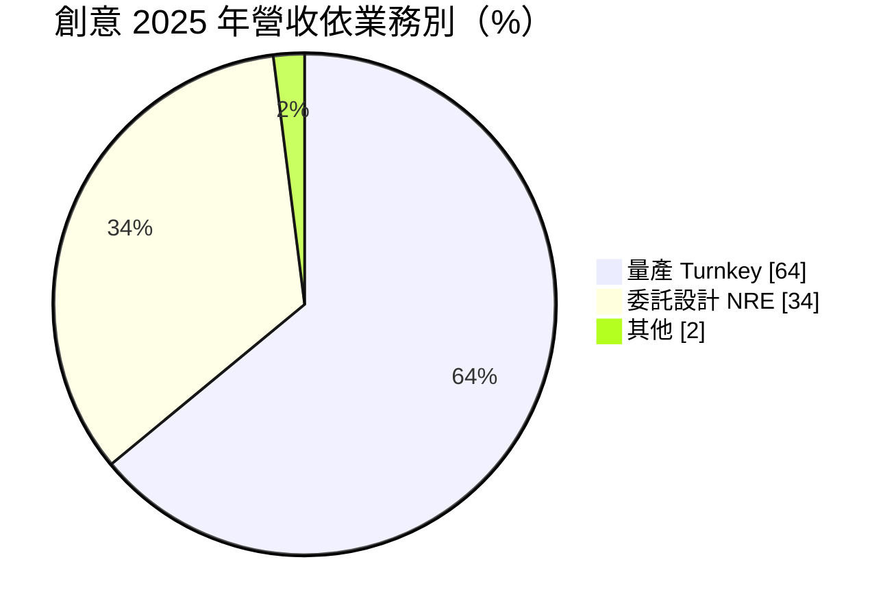
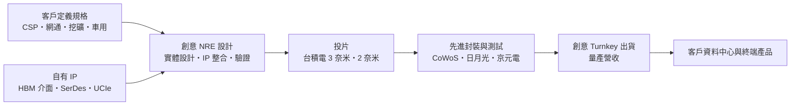
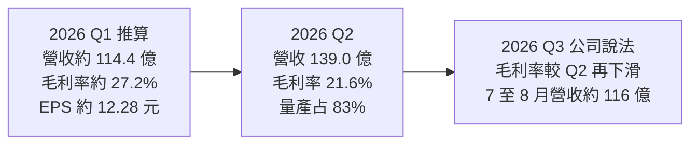
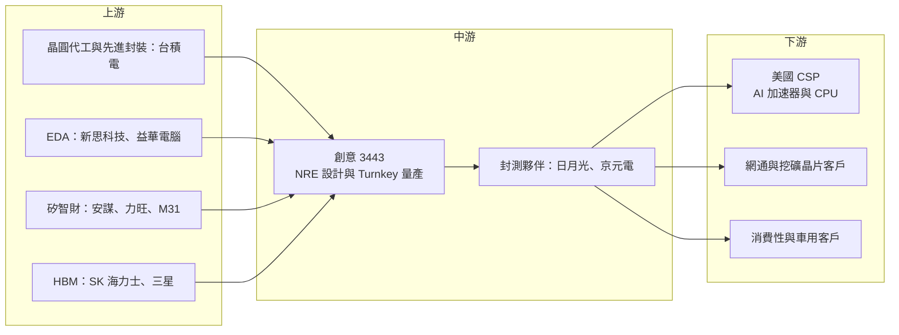

# 3443 創意

> 上市｜[[產業索引-半導體業|半導體業]]｜上市（櫃）日期 2006/11/03

# 第一章：企業模式與商業藍圖

> [!info] 撰寫說明
> 本文由 Claude 依公開資料整理，架構比照 [[2330台積電]] 的四章研究，資料截至 2026-10-07。財務數字來源：創意 2025 年營收與 2026 年第二季財報、法說會相關報導（經濟日報、聯合新聞網、工商時報、財訊快報、優分析）、nstock 公司資料頁；產業描述為整理性內容，尚未逐條比對原始文件。#待校對

在評估單一個股的長期投資價值時，首要步驟是拆解企業的底層獲利邏輯。本章針對創意電子（股票代號：3443，以下簡稱創意）的商業模式進行定性分析，說明這家台積電轉投資的設計服務公司，如何把雲端業者的自研晶片需求轉為營收，以及量產比重拉高後獲利結構的變化。

## 一、核心定位：台積電體系內的 ASIC 設計服務公司

創意成立於 1998 年 1 月，總部位於新竹科學園區，最大股東為 [[2330台積電]]。創意的角色是客製化晶片（[[ASIC]]）[[設計服務]]：客戶提出晶片的規格與功能需求，創意負責後段實體設計、[[IP]] 整合、驗證、投片，並在量產階段代為向台積電下單、安排封裝測試，最後把成品晶片交給客戶。

創意的客戶多是有能力定義晶片、但不想或無法自建完整後段設計與供應鏈團隊的公司，例如美國雲端服務業者（[[CSP]]）自研的 AI 加速器與 CPU、網通設備商、加密貨幣挖礦晶片公司，以及消費性電子與車用客戶。由於與台積電的關係緊密，創意能取得最先進製程（3 奈米、2 奈米）與先進封裝（[[CoWoS]]）的設計資源與產能，這是其主要賣點。

這個定位有兩個商業意義：

* **以台積電生態系換取先進專案：** 想用最先進製程、又要搶時間上市的 AI 晶片客戶，透過創意能更快取得台積電的設計套件、IP 與封裝產能。
* **以量產代工放大營收規模：** 設計階段只是開始，一旦晶片量產，創意代客戶採購晶圓與封測，營收規模會跳升數倍，但毛利率會被稀釋。

## 二、產品板塊：委託設計與量產兩條收入線

2025 年的營收結構如下：

* **委託設計（[[NRE]]）：** 收取設計服務、IP 授權與光罩相關費用，毛利率較高，但金額隨專案進度波動。2025 年約占營收 34%。
* **量產（[[Turnkey]]）：** 晶片進入量產後，由創意代為採購晶圓、封裝與測試並出貨，營收規模大但毛利率較低。2025 年約占 64%，2026 年第二季提高到 83%。

依應用別，2025 年 AI 相關營收約占 25%，上半年加密貨幣占比一度超過 30%，下半年起重心轉向 CSP 專案。公司預估 2026 年 AI 相關營收占比將超過 30%。依財訊快報報導，兩家美國 CSP 的 CPU 與 AI 推論晶片在 2026 年進入量產，是量產營收大幅成長的主因。

## 三、資本轉化邏輯：輕資產的設計與量產管理

* **營運據點：** 創意以新竹為總部，在美國、日本、中國、歐洲等地設有業務與設計支援據點，就近服務國際客戶。
* **輕資產模式：** 創意本身沒有晶圓廠與封測廠，生產全部委由台積電與其封測合作夥伴。資本支出主要是設計工具授權、IP 開發與測試設備，金額相對營收很小。
* **營運槓桿：** 量產營收雖然毛利率低，但幾乎不需要增加研發人力，營業費用率會隨營收放大而下降，營業利益仍能成長。

## 四、企業長期藍圖：從 NRE 走向先進封裝與 CPO

* **先進製程 AI ASIC：** 以 3 奈米、2 奈米製程承接 CSP 的 AI 加速器與 CPU 專案。
* **HBM 與高速介面 IP：** 開發 [[HBM]] 控制器與 PHY、高速 [[SerDes]]、晶粒互連（[[UCIe]] 等）介面，支援 AI 晶片與記憶體的整合。
* **先進封裝與矽光子：** 依財訊快報描述，創意的發展路徑是「NRE 設計 → 量產 → 先進封裝 → 共同封裝光學（[[CPO]]）」，2026 年[[矽光子]]與先進封裝相關技術預期逐步商品化。
* **新應用：** 公司提到新的 CPU 專案與自駕車晶片開發。
* **2026 年展望：** 依優分析整理，公司預期全年 NRE 營收年增 15% 至 19%、量產營收成長一倍以上，全年毛利率維持 20% 以上、營業利益率維持雙位數。

# 第二章：護城河深度與競爭優勢

在長期價值投資中，「護城河」指企業抵禦競爭、維持超額利潤的保護機制。本章分析創意的護城河構成、全球主要競爭對手，以及這些優勢在客製化 AI 晶片的激烈競爭中能守住多少。

## 一、創意護城河的核心組成要素

創意的護城河屬於「中等寬度」，主要來自：

* **1. 台積電的生態系位置：** 台積電是最大股東，創意能優先取得先進製程設計套件、IP 與 CoWoS 等先進封裝資源，對需要搶時間上市的 AI 晶片客戶極具吸引力。
* **2. 先進製程設計經驗：** 3 奈米、2 奈米晶片的實體設計、時序收斂、功耗與散熱管理難度極高，成功量產的經驗本身就是門檻。
* **3. 自有 IP 組合：** HBM 介面、高速 SerDes 等關鍵 IP 能縮短客戶開發時間，並提高轉換成本。
* **4. 專案綁定效應：** 一顆 ASIC 從設計到量產需要一到兩年，客戶一旦在創意完成設計並量產，後續世代通常會延續合作。

## 二、全球主要競爭對手格局

| 對手 | 定位 | 對創意的威脅 |
|---|---|---|
| [[AVGO博通]]、[[MRVL邁威爾]] | 全球最大客製化 AI 晶片供應商，設計、IP、封裝一條龍 | 承接谷歌、Meta 等大型 CSP 核心 AI 晶片，規模與議價力遠大於創意 |
| [[3661世芯-KY]] | 台積電體系的設計服務公司 | 在 AI ASIC 專案上直接競爭 |
| [[2454聯發科]] | 手機晶片大廠切入 CSP 客製化晶片 | 以自有 IP 與規模爭取大型專案 |
| [[3035智原]] | 聯電體系的設計服務公司 | 近年也承接先進製程專案 |
| Socionext 等 | 日韓設計服務公司 | 在特定客戶與區域競爭 |

此外，部分 CSP 擴大自建後段設計團隊的內部化趨勢，也是潛在競爭來源。

## 三、優勢轉化：哪些市場守得住、哪些守不住

* **守得住：** 對想降低晶片成本、不想付給博通高額溢價的 CSP 而言，創意以設計服務的成本結構提供替代選擇；台積電體系的資源也讓創意在先進製程專案上具有可信度。
* **守不住：** 大型 CSP 的核心 AI 晶片仍多交給博通、邁威爾，創意的單一專案規模與議價能力有限；量產營收占比提高後，毛利率結構性下滑，2026 年第二季毛利率已降至約 21.6%。營收高度依賴少數 CSP 專案，單一客戶轉單或延後就會造成明顯波動。
* **觀察重點：** 量產營收大增後毛利率能否守住 20%、2 奈米專案的取得與投片進度、HBM4 等新介面 IP 的競爭力，以及 CSP 客戶下一世代晶片是否續留創意。

# 第三章：財務體質與盈利規模

資料日期：2026-10-07。數字取自財報與法說會相關財經報導（經濟日報、聯合新聞網、工商時報、優分析）與 nstock 公司資料頁，表格是撰寫當時的快照；最新月營收、毛利率、累計 EPS 由自動排程寫在本筆記的屬性欄位（月營收、毛利率、累計EPS 等）。#待校對

財務報表是檢驗護城河是否真實存在的最終標準。本章用三率、ROE、資本支出與資本報酬，檢視創意在量產放量、毛利率稀釋的轉換期中的獲利品質。

## 一、獲利能力的基石：三率

| 項目 | 2025 全年 | 2025 Q4 | 2026 Q1 | 2026 Q2 |
|---|---|---|---|---|
| 營收（新台幣） | 341.4 億 | 約 124 億 | 約 114.4 億 | 139.0 億 |
| [[毛利率]] | 未查得 | 未查得 | 約 27.2% | 21.6% |
| [[營業利益率]] | 未查得 | 未查得 | 約 15.9% | 12.1% |
| 稅後淨利 | 未查得 | 未查得 | 約 16.5 億 | 15.6 億 |
| EPS（元） | 28.13 | 未查得 | 約 12.28 | 11.61 |

* **2025 年：** 營收年增 36.3%，第四季營收季增 44%、年增 105.9%。
* **2026 年第二季：** 營收創新高，季增 21.4%、年增 127.6%；毛利率較 2025 年同期的約 33.3% 下滑約 11.7 個百分點，主因量產營收占比升至 83%。
* **2026 年上半年：** 營收 253.4 億元、年增 93.1%，毛利率 24.1%，稅後淨利 32 億元、年增 83.7%，EPS 合計 23.89 元。第一季數字由上半年減去第二季推算，屬約略值。
* **月營收：** 7 月營收 57.7 億元、年增 158.4%，8 月營收 58.4 億元、年增 111.0%，前 8 月累計 369.5 億元、年增 103.8%，已超過 2025 年全年。公司指出第三季毛利率將較第二季進一步下滑。

## 二、[[ROE]]：資本效率

創意屬輕資產公司，不需自建晶圓廠，股本約 13.4 億元，獲利成長會直接反映在 ROE 上（本次未查得具體數值）。量產營收雖拉低毛利率，但營業費用率同步下降，形成營運槓桿；第二季研發費用約 10.5 億元，年增 25%。

## 三、資本支出與自由現金流

* **[[CapEx]]：** 主要用於設計工具授權、IP 開發與測試設備，金額相對營收很小。
* **營運資金：** 量產業務需要先向台積電支付晶圓款項，營運資金需求會隨量產規模擴大而增加，需留意存貨與應收帳款的變化，這會影響[[自由現金流]]的時間點。
* **股利政策：** 依 nstock 整理，創意以 2025 年度盈餘配發現金股利每股 20 元，過去五年平均現金股利約 14.2 元，歷年填息速度快。

## 四、[[ROIC]] 與 [[WACC]]：價值創造利差

企業創造價值的條件是投入資本報酬率高於資金成本。創意幾乎沒有廠房設備，投入資本以營運資金與 IP 研發為主，在獲利倍增的 2026 年，ROIC 應明顯高於 WACC（推估，具體數值未查得）。量產模式的關鍵在於營運資金週轉：若存貨與應收帳款增加速度快於獲利，投入資本會膨脹、ROIC 被稀釋；反之，只要週轉維持正常，低毛利但高周轉的量產業務仍能創造可觀的價值利差。

# 第四章：總體風險與地緣政治

任何企業都無法脫離宏觀環境獨立存在。本章分析創意未來必須面對的地緣政治、產業週期、營運與技術風險。

## 一、地緣政治風險

* **美國出口管制：** 創意承接的 AI 晶片若涉及中國客戶或被認定為先進運算晶片，可能受美國出口管制限制，影響接單範圍。
* **對台積電與台灣的依賴：** 生產全部委由台積電，先進製程與先進封裝產能集中在台灣，兩岸風險與台積電的產能分配都會影響創意出貨。
* **美國關稅與在地化：** 若美國要求 AI 晶片在美國生產，創意需要配合台積電海外廠的產能與成本結構。

## 二、產業週期與市場結構風險

* **AI 資本支出週期：** 營收高度連動 CSP 的 AI 投資。若 CSP 縮減資本支出或改變自研晶片策略，量產營收可能大幅波動。
* **加密貨幣需求：** 2025 年上半年加密貨幣曾占營收三成以上，這類需求隨幣價劇烈波動。
* **客戶集中：** 少數 CSP 專案貢獻大部分營收，單一專案延後或轉單即可影響全年表現。

## 三、營運環境的隱性風險

* **毛利率稀釋：** 量產占比提高使毛利率結構性下滑，若晶圓與封裝成本上漲而無法轉嫁，獲利率可能進一步承壓。
* **先進封裝產能：** CoWoS 等先進封裝產能緊張時，量產出貨可能受限。
* **專案執行風險：** 先進製程設計失敗或需要重新投片，會產生高額成本並損害客戶信任。

## 四、科技演進風險

* **製程世代轉換：** 2 奈米以下製程的設計複雜度與成本快速上升，創意需持續投入研發與 IP。
* **CSP 內部化：** 大型 CSP 若擴大自建後段設計團隊，設計服務公司的角色可能被壓縮（推估）。
* **介面標準演進：** HBM4、UCIe 等介面規格快速更新，IP 若落後一個世代，就可能失去下一代專案。

# 專有名詞解析

## 半導體

- **[[ASIC]]**：特定應用積體電路，為單一客戶或用途客製設計的晶片，例如雲端業者自研的 AI 加速器。
- **[[設計服務]]**：替客戶完成晶片後段實體設計、驗證、投片與量產管理的服務，代表廠商為創意、世芯、智原。
- **[[NRE]]**：一次性工程費用，指晶片設計、IP 授權與光罩等開發階段的收費，毛利率較高但隨專案波動。
- **[[Turnkey]]**：量產統包服務，設計服務公司代客戶採購晶圓、封裝與測試並出貨成品晶片，營收規模大但毛利率較低。
- **[[IP]]**：矽智財，可重複授權使用的電路設計模組，例如處理器核心、記憶體介面與高速傳輸介面。
- **[[HBM]]**：高頻寬記憶體，把多層 DRAM 垂直堆疊並以寬匯流排連接處理器，是 AI 加速器的關鍵記憶體。
- **[[SerDes]]**：串列器與解串器，把平行資料轉成高速串列訊號傳輸，是晶片之間與網路連線的關鍵介面。
- **[[UCIe]]**：通用晶粒互連標準，規範同一封裝內不同小晶片之間的連接介面，讓不同來源的晶粒可以組合。
- **[[CoWoS]]**：台積電的 2.5D 先進封裝技術，把 GPU 與 HBM 並排放在矽中介層上，是 AI 晶片的主流封裝方式。
- **[[CPO]]**：共同封裝光學，把光收發元件與交換器或運算晶片封裝在一起，縮短電訊號路徑、降低功耗。
- **[[矽光子]]**：在矽晶片上製作光學元件，以光取代電傳輸資料，可降低 AI 資料中心的傳輸耗電。

## 應用

- **[[CSP]]**：雲端服務供應商，例如谷歌、微軟、亞馬遜、Meta，近年大量自研 AI 與 CPU 晶片。

## 金融

- **[[自由現金流]]**：營業活動現金流減去資本支出，代表企業可自由用於配息、還債或併購的現金。

# 核心供應鏈

## 1. 上游：晶圓代工、封測、IP 與 EDA
- 晶圓代工與先進封裝：[[2330台積電]]
- 封裝測試：[[3711日月光投控]]、[[2449京元電子]]
- [[EDA]]：[[SNPS新思科技]]、[[CDNS益華電腦]]
- 矽智財：[[ARM安謀]]、[[3529力旺]]、[[6643M31]]
- HBM 記憶體：SK 海力士、[[005930三星電子]]

## 2. 中游：創意本身
- ASIC 委託設計（NRE）與量產服務（Turnkey）
- 大股東：[[2330台積電]]

## 3. 下游：主要客戶類型
- 美國雲端服務業者 AI 與 CPU 晶片：[[GOOGL谷歌]]、[[MSFT微軟]]、[[AMZN亞馬遜]]、[[META臉書]]（個別合作關係未經證實，此處列為潛在客戶類型）
- 網通與加密貨幣挖礦晶片客戶

## 4. 同業與競爭者
- 國內：[[3661世芯-KY]]、[[3035智原]]、[[2454聯發科]]
- 國外：[[AVGO博通]]、[[MRVL邁威爾]]、Socionext

延伸閱讀：[[台積電供應鏈]]

## 供應鏈關係
- 供應給 [[2330台積電]]：台積電專屬 ASIC 設計服務（台積電供應鏈 › 上游：晶片設計工具、IP與設計服務 (ASIC)）

## 最新新聞
<!-- news:start（自動產生，請勿手動編輯此範圍） -->
- 2026-10-09 📰 媒體 01:22｜焦點股》創意：台積電最強「親兒子」 明日出關噴漲停再創天價｜[自由時報](https://news.google.com/rss/articles/CBMiWEFVX3lxTE1mOTJLNlFYUEsxSF9kNGVEb2NZa0U5LXBEM0oydnlTSURjWU82Yl9hVl9WMmxmek9SS1dtRFJhZEtjMnNTZG1XZ1dyY2VlZFU3NW5VUXhyTGM?oc=5)
- 2026-10-08 📰 媒體 04:10｜權證市場焦點－創意 AI ASIC訂單旺｜[中時新聞網](https://news.google.com/rss/articles/CBMia0FVX3lxTE1mVXphUnJIaXE1MHhOUy04TGFjV1hkd29mQ0RoMERTZHZIdTVSelZnXzJ6c1RDQ2dkWE40eS1FMjdJcElVOUhEV1Q5MkFmRlNFWmwyR2J0OTRyWHRXcWliQkdha1lCeHQ3YTZN?oc=5)
- 2026-10-08 📰 媒體 00:53｜熱門股》通吃ASIC大單 創意寫新天價｜[自由時報](https://news.google.com/rss/articles/CBMiWEFVX3lxTE56ME85U0lxYW4ydlBwX3VxTktxXzU3M0hwTnQxcWpjVTVDU1lyc0djUjBwcFdzY1dpUTFmOGl2S0pjc3hhMDNMX0tOSG9CNWczWVNfV2JYRGs?oc=5)
- 2026-10-07 📰 媒體 22:51｜創意：ASIC成長率將超越GPU｜[自由時報](https://news.google.com/rss/articles/CBMiWEFVX3lxTFBWeTVKU192cENiRjZwN04yaGJ1ZnNMZGRBVDJRZm51LXg4T1k2ZTFobW41N1l4QlI5Z2UwX1NwLWxnSUw3ZU53WlpBSzB2TGwtVDFNY2JYUFg?oc=5)
- 2026-10-07 📰 媒體 13:32｜第3季營收大幅超標 法人調高創意獲利預估值及目標價｜[UDN](https://news.google.com/rss/articles/CBMiUEFVX3lxTE9ITXhkYWhYMXlWQWItaXEwYkI4U1V4R1ktY3lFc1c0OUtUQmdtMHpPbGRvZ1ZqZjFyV3ZpaWdYTmFhbnVuZGkwSWF0X0w3dmll0gFWQVVfeXFMUHVnMTI5Vk1UTmJkWGRsYkZXanF4WjVOdGpXQUlwZGJhc1ZDOHAzRjYtb21RVkVwWmhxcnBSOXZSUUgtWGxUZ0xmNm9KQXUwNnEtYThwdlE?oc=5)

完整紀錄：[[3443創意 新聞]]
<!-- news:end -->

## 相關連結
- [公開資訊觀測站](https://mopsov.twse.com.tw/mops/web/t05st03?step=1&firstin=1&co_id=3443)
- [Goodinfo](https://goodinfo.tw/tw/StockDetail.asp?STOCK_ID=3443)
- [Yahoo 股市](https://tw.stock.yahoo.com/quote/3443)
- [鉅亨網新聞](https://www.cnyes.com/twstock/3443/news)
