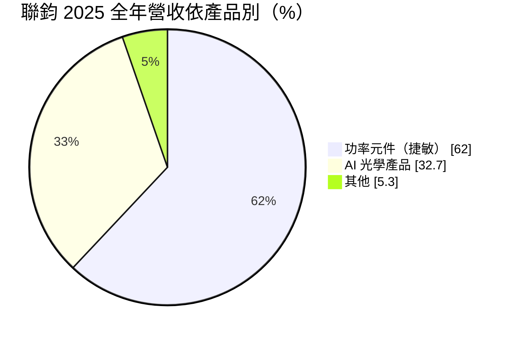
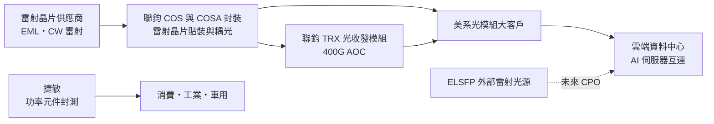
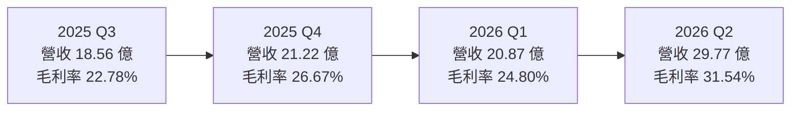
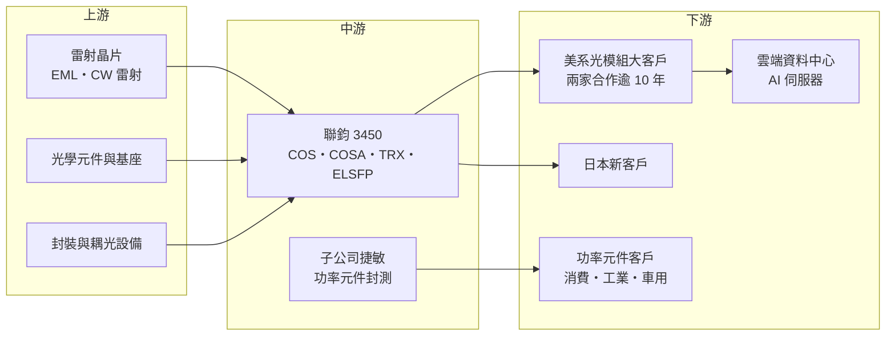

# 3450 聯鈞

> 上市｜[[產業索引-半導體業|半導體業]]｜上市（櫃）日期 2006/04/12

# 第一章：企業模式與商業藍圖

> [!info] 撰寫說明
> 本文由 Claude 依公開資料整理，架構比照 [[2330台積電]] 的四章研究，資料截至 2026-10-07。財務數字來源：聚財網（stock.wearn.com）季度損益表、nstock 公司資料頁、富果研究 2025 年 11 月與 2026 年 8 月法說會整理、優分析、工商時報、旺得富公司基本資料頁；產業描述為整理性內容，尚未逐條比對原始文件。#待校對

在評估單一個股的長期投資價值時，首要步驟是拆解企業的底層獲利邏輯。本章針對聯鈞光電（股票代號：3450，以下簡稱聯鈞）的商業模式進行定性分析，說明它如何從傳統光電封裝轉型為 AI 光通訊的雷射封裝供應商，以及功率半導體封測子公司捷敏在集團中的角色。

## 一、核心定位：AI 光通訊的雷射封裝代工廠＋功率元件封測

聯鈞成立於 2000 年，總部位於新北市中和區，2006 年 4 月上市，資本額約 14.57 億元，董事長鄭祝良、總經理宋天增。公司業務分成三塊：光資訊及光通訊產品、功率半導體封裝測試（子公司捷敏）、[[矽光子]]相關產品。

聯鈞在光通訊的核心能力是「雷射晶片的委外封裝」。AI 資料中心的高速光模組，每顆需要 4 至 8 顆雷射晶片，這些雷射晶片要先封裝成[[COS]]（晶片貼裝在基座上）或光學次模組（[[COSA]]），再組成光收發模組。依優分析報導，聯鈞的 COSA 產品涵蓋 65G 至 200G 的 [[EML]] 雷射晶片，維持全球委外封裝的領導地位。這個定位有兩個商業意義：

* **卡位 AI 光通訊的瓶頸環節：** 公司在 2026 年 8 月法說會表示，AI 光通訊供給仍遠落後需求，雷射封裝產能「被客戶追著跑」。在供給吃緊的環節，議價力相對較高。
* **與美系大客戶長期綁定：** 主要客戶為「三家美國公司中的兩家」，合作超過 10 年，近期新增一家日本客戶。

## 二、終端應用／產品板塊

依 2026 年 8 月法說會，2025 年全年營收結構如下：

到 2026 年 7 月，AI 光學產品比重已升到 45.5%，功率元件降到 50.4%，結構快速轉向光通訊。

* **AI 光學產品：** 三大平台為 COSA（光學次模組，產能自 2024 年起逐年翻倍）、TRX（光收發模組，400G [[AOC]] 已量產，良率 99%）、[[ELSFP]]（外部雷射光源，處於工程試產與小量生產）。
* **功率元件封測（捷敏）：** 子公司捷敏提供功率半導體封裝測試，應用於消費電子、工業與車用。2026 年 7 月營收 6.14 億元，創歷史新高，年增 32%。
* **傳統光電：** 光資訊產品等舊業務，比重逐步下降。

## 三、資本轉化邏輯（營運模式）：以設備擴產換取雷射封裝份額

* **資本支出快速放大：** 2024 年資本支出 2.6 億元、2025 年 11 億元、2026 年預計 16 億元（全為機器設備，不含廠房）。COS 產能在 2025 年較前一年擴充五倍以上。
* **發行可轉債籌資：** 發行 30 億元可轉換公司債，用於償還借款與購置設備。
* **毛利結構：** 法說會揭露聯鈞本身毛利率 35% 以上、子公司源傑 30% 多、捷敏近 30%，光通訊封裝的毛利率高於功率元件封測。光學產品比重提高，會帶動整體毛利率上升。

## 四、企業長期藍圖：從 COSA 走向 CPO 外部光源

* **COSA 持續翻倍：** 公司預期 COSA 未來每年翻倍成長，以「1、3、5、7」的序列比喻成長節奏。
* **800G 與 1.6T：** 800G 光模組在 2025 年下半年完成驗證，2026 年起逐季放量，但 2026 年 8 月法說會表示明年份額仍待確定。
* **[[CPO]] 與外部光源：** 共同封裝光學需要獨立的外部雷射光源，聯鈞開發可插拔式 [[ELS]] 與 ELSFP，卡位 CPO 與 NPO 的必要供應鏈。公司表示 ELSFP 明年下半年可能小量出貨，大量供應「沒那麼快」，2025 年法說會則預估 CPO 相關量產在 2027 年之後。

# 第二章：護城河深度與競爭優勢

「護城河」指企業抵禦競爭、維持超額利潤的保護機制。本章分析聯鈞在光通訊雷射封裝的護城河、主要競爭對手，以及它的優勢能否延續到 CPO 世代。

## 一、聯鈞護城河的核心組成要素

* **1. 精密耦光與封裝的製程經驗：** 雷射晶片封裝需要次微米等級的對位與耦光，良率高度依賴製程經驗。400G AOC 良率達 99%，代表製程成熟度高。
* **2. 長期大客戶關係：** 與兩家美系主要客戶合作超過 10 年，產能擴充主要是為了滿足這兩家客戶的需求增長。光通訊元件需要長時間驗證，客戶不輕易更換封裝夥伴。
* **3. 產能先行：** 在雷射封裝供不應求時大舉擴產（COS 產能五倍、2026 年資本支出 16 億元），先取得產能就先取得訂單份額。
* **4. 功率元件業務的穩定基盤：** 捷敏的功率元件封測提供相對穩定的營收與現金流，降低光通訊訂單波動的衝擊。

## 二、全球主要競爭對手格局

| 對手 | 定位 | 對聯鈞的威脅 |
|---|---|---|
| 中際旭創、新易盛等中國光模組廠 | 全球前段班的光模組製造商，部分自製封裝 | 垂直整合後可能減少委外封裝 |
| Coherent、Lumentum | 美系雷射晶片與光模組 IDM | 自有封裝產能，同時也是潛在客戶 |
| Fabrinet | 泰國光通訊代工龍頭 | 在光模組組裝與封裝直接競爭 |
| [[4979華星光]]、[[3163波若威]]、[[4908前鼎]] | 台灣光通訊元件與模組 | 在光模組與次模組競爭 |
| [[3081聯亞]] | 台灣雷射磊晶與晶片 | 屬上游夥伴，也可能延伸下游 |
| [[3711日月光投控]] | 大型封測廠切入矽光子與 CPO | CPO 世代可能由大型封測廠主導 |

## 三、優勢轉化：守得住／守不住／觀察重點

* **守得住：** 400G 與 800G 世代的 COS、COSA 雷射封裝，以及兩家美系客戶的既有訂單。
* **守不住：** 光模組（TRX）業務。2025 年第二、三季光模組因客戶庫存調節，出貨大幅下滑、產能利用率極低，第三季毛利率掉到 22.78%，顯示模組業務的訂單波動大、議價力較弱。
* **觀察重點：** 800G 在主要客戶的份額；ELSFP 能否在 2027 年進入量產；CPO 世代雷射光源的封裝是否仍委外，還是被晶圓廠與大型封測廠內化；捷敏的功率元件業務能否維持成長。

# 第三章：財務體質與盈利規模

資料日期：2026-10-07。數字取自聚財網季度損益表、nstock 公司資料頁與富果研究、優分析法說會整理，表格是撰寫當時的快照；最新月營收、毛利率、累計 EPS 由自動排程寫在本筆記的屬性欄位（月營收、毛利率、累計EPS 等）。#待校對

財務報表是檢驗護城河是否真實存在的最終標準。本章用三率、ROE、現金流與資本報酬，檢視聯鈞在 AI 光通訊擴產期的獲利品質。

## 一、獲利能力的基石：三率

| 期間 | 營收（新台幣） | [[毛利率]] | [[營業利益率]] | EPS（元） |
|---|---|---|---|---|
| 2025 全年 | 85.85 億 | 約 29.8%（依季度推算） | 約 18.7%（依季度推算） | 5.01 |
| 2025 Q1 | 27.58 億 | 36.16% | 24.08% | 2.34 |
| 2025 Q2 | 18.49 億 | 30.81% | 22.28% | 0.53 |
| 2025 Q3 | 18.56 億 | 22.78% | 10.50% | 0.61 |
| 2025 Q4 | 21.22 億 | 26.67% | 15.62% | 1.53 |
| 2026 Q1 | 20.87 億 | 24.80% | 12.75% | 0.69 |
| 2026 Q2 | 29.77 億 | 31.54% | 21.21% | 2.09 |

* **[[毛利率]]：** 隨光模組出貨大幅波動，2025 年第一季 36.16% 為高點，第三季因光模組出貨未達預期掉到 22.78%，2026 年第二季回升到 31.54%。2023 至 2025 年前三季的毛利率分別約 15%、27%、31%，長期趨勢明顯上升。
* **[[營業利益率]]：** 2026 年第二季 21.21%，營收季增 42.6% 帶動營運槓桿。
* **[[淨利率]]與匯率：** 2025 年第二季營業利益率 22.28%，稅後淨利率卻只有 7.15%，主要是新台幣升值造成的匯兌損失；2025 年第三季匯兌損失約 8,900 萬元。
* **營收動能：** 2026 年 1 至 9 月累計營收 88.19 億元，年增 36.47%，已超過 2025 年全年；9 月營收 12.89 億元，年增 99.78%，創歷史新高。7 月單月稅後純益 1.48 億元、EPS 1.02 元，前七月累計 EPS 3.8 元。

## 二、[[ROE]]：資本效率

依 nstock 資料，2026 年第二季單季 ROE 為 6.11%，年化約 24%（推估）。光通訊業務毛利率高、成長快，帶動 ROE 上升；但 30 億元可轉債若轉換為股本，會稀釋每股盈餘與 ROE，需要持續觀察。

## 三、資本支出與自由現金流

* **[[CapEx]]：** 2024 年 2.6 億元、2025 年 11 億元、2026 年預計 16 億元，兩年內放大約六倍，全部用於機器設備。
* **[[自由現金流]]：** 擴產期間資本支出快速增加，加上 2025 年第三季底存貨升至約 11 億元，自由現金流承壓（具體金額未查得）。公司以 30 億元可轉債支應設備與償還借款。
* **股利：** 2025 年度現金股利 1 元，以 EPS 5.01 元計算配發率約 20%，近五年平均現金股利約 0.76 元。低配發率反映公司把盈餘保留用於擴產。

## 四、[[ROIC]] 與 [[WACC]]：價值創造利差

在雷射封裝供不應求的環境下，新增設備能很快填滿，投入資本的報酬率高於資金成本（推估，具體 ROIC 未查得）。風險在於光模組產業的訂單波動大，2025 年第二、三季曾出現光模組產能利用率極低的情況。若 AI 資本支出放緩或客戶轉單，大量新增設備可能閒置，ROIC 會快速下滑。

# 第四章：總體風險與地緣政治

任何企業都無法脫離宏觀環境獨立存在。本章分析聯鈞必須面對的地緣政治、產業週期、營運與技術風險。

## 一、地緣政治風險

* **美中科技競爭：** 主要客戶為美國公司，中國光模組廠是全球主要競爭者。美國對中國光通訊產品的管制，可能讓台灣供應商受惠於轉單；但若美國要求光通訊元件在美國或特定地區生產，產能配置需要調整。
* **生產據點：** 聯鈞與子公司的生產據點分布未完整查得，若有部分產能在中國，可能受到美國客戶「非中國製造」要求的影響（推估）。

## 二、產業週期與市場結構

* **AI 資本支出波動：** 光模組需求高度依賴雲端業者的 AI 資本支出，雲端業者若放緩投資，光通訊訂單會迅速縮減。
* **[[長鞭效應]]與庫存調整：** 2025 年第二、三季客戶庫存調節，光模組出貨大幅下滑，就是長鞭效應的實例。
* **匯率：** 外銷比率約 53%，美元計價為主，2025 年兩度出現大額匯兌損失。

## 三、營運環境的隱性風險

* **客戶集中：** 光通訊業務主要依賴兩家美國客戶，任一客戶轉單或改為自製都會造成重大影響。
* **擴產執行：** 兩年內資本支出放大六倍，設備交期、人力與良率爬坡都可能影響產能釋放進度。
* **股本稀釋：** 30 億元可轉債轉換後會增加股本。

## 四、科技或法規演進

* **技術路線轉換：** 光通訊從可插拔光模組走向 CPO，雷射光源與封裝方式會改變。若 CPO 由晶圓代工廠與大型封測廠主導，委外雷射封裝的空間可能縮小；但外部雷射光源（ELS）仍需要專業封裝，是聯鈞的機會。
* **矽光子與[[VCSEL]]、EML 之爭：** 不同速率與距離採用不同的雷射技術，若主流方案轉向聯鈞較不熟悉的技術，需要重新投入研發與驗證。

# 專有名詞解析

## 半導體

- **[[CPO]]**：共同封裝光學，把光學收發元件和交換器晶片封裝在一起，縮短電訊號路徑、降低 AI 資料中心耗電。
- **[[矽光子]]**：在矽晶片上製作光學元件，以光取代電傳輸資料，可降低 AI 資料中心的傳輸耗電。
- **[[VCSEL]]**：垂直共振腔面射型雷射，成本低，常用於短距離多模光通訊與 3D 感測。
- **[[功率元件]]**：MOSFET、IGBT 等負責開關與轉換電力的半導體元件，用於電源、車用與工業設備。

## 應用

- **[[COS]]**：Chip on Submount，把雷射晶片貼裝在基座上的封裝形式，是雷射元件封裝的第一步。
- **[[COSA]]**：光學次模組，包含發射端 TOSA 與接收端 ROSA，把雷射或光偵測器與光學元件封裝成可組裝進光模組的單元。
- **[[EML]]**：電吸收調變雷射，速度快、傳輸距離長，是 800G 與 1.6T 單模光模組的主流雷射晶片。
- **[[AOC]]**：主動式光纖纜線，兩端已整合光電轉換模組的光纖線，用於資料中心內短距離高速連線。
- **[[ELS]]**：外部雷射光源，CPO 架構中把雷射從交換器晶片旁移出、獨立供光的模組，便於散熱與更換。
- **[[ELSFP]]**：可插拔式外部雷射光源模組規格，讓 CPO 系統的雷射光源可以像光模組一樣插拔更換。

## 金融

- **[[可轉換公司債]]**：可依約定價格轉換成公司股票的債券，公司可用較低利率籌資，但轉換後會稀釋股本。
- **[[CapEx]]**：資本支出，企業購置廠房與設備的支出。

## 產業

- **[[長鞭效應]]**：終端需求的小幅變動，沿供應鏈往上游傳遞時被逐級放大，造成上游庫存與訂單劇烈波動。

# 核心供應鏈

## 1. 上游：雷射晶片與光學元件
- 雷射磊晶與晶片：[[3081聯亞]]、Coherent、Lumentum、三菱電機（產業參考，聯鈞實際供應商未查得）
- 光學元件：[[3363上詮]]、[[4977眾達-KY]]（產業參考）

## 2. 中游：聯鈞與集團
- 子公司：捷敏（功率元件封測）、源傑
- 光通訊同業：[[4979華星光]]、[[3163波若威]]、[[4908前鼎]]、Fabrinet、中際旭創

## 3. 下游：客戶與終端
- 美系光模組與網通大廠兩家（公司未公開名稱）、日本新客戶一家
- 雲端資料中心與 AI 伺服器：[[NVDA輝達]]、[[GOOGL谷歌]]、[[MSFT微軟]]、[[AMZN亞馬遜]]、[[META臉書]]（產業終端參考）

## 4. 未來應用：CPO
- CPO 與外部光源相關：[[2330台積電]] 矽光子平台、[[AVGO博通]] 交換器晶片（產業參考）

延伸閱讀：[[台積電供應鏈]]

## 最新新聞
<!-- news:start（自動產生，請勿手動編輯此範圍） -->
- 2026-10-07 📰 媒體 19:50｜營收速報 - 聯鈞(3450)9月營收12.89億元年增率高達99.78％｜[鉅亨網](https://news.cnyes.com/news/id/6623954)
- 2026-10-06 📰 媒體 19:49｜聯鈞自結8月獲利年增2.5倍 搭上光通訊商機有望爆發｜[鉅亨網](https://news.cnyes.com/news/id/6622902)
- 2026-10-06 🏛️ 重訊 15:58｜係因本公司有價證券於集中交易市場達公布注意交易資訊標準， 故公布相關財務業務等重大訊息，以利投資人區別瞭解｜[觀測站](https://mops.twse.com.tw/mops/#/web/t05st01)

完整紀錄：[[3450聯鈞 新聞]]
<!-- news:end -->

## 相關連結
- [公開資訊觀測站](https://mopsov.twse.com.tw/mops/web/t05st03?step=1&firstin=1&co_id=3450)
- [Goodinfo](https://goodinfo.tw/tw/StockDetail.asp?STOCK_ID=3450)
- [Yahoo 股市](https://tw.stock.yahoo.com/quote/3450)
- [鉅亨網新聞](https://www.cnyes.com/twstock/3450/news)
