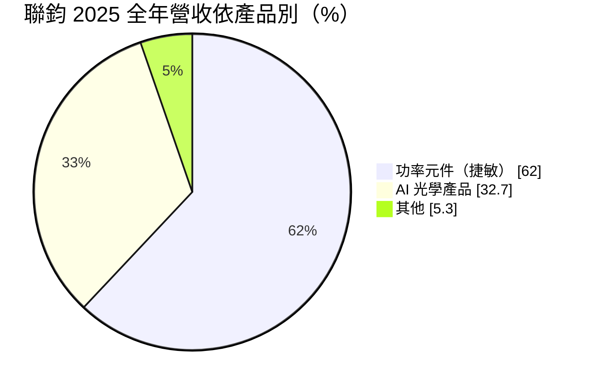
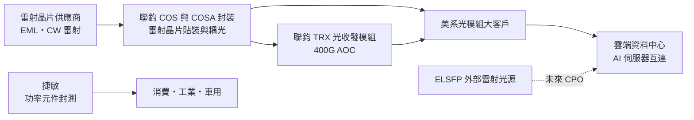
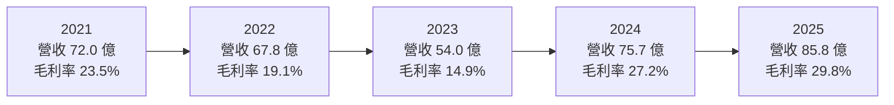
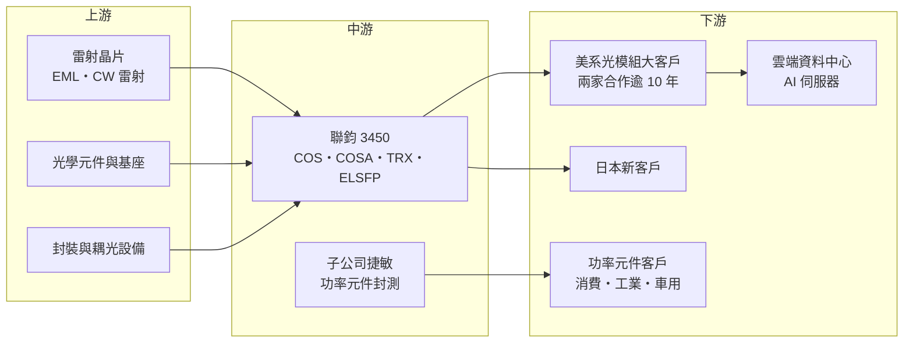

# 3450 聯鈞

> 上市｜[[產業索引-半導體業|半導體業]]｜上市（櫃）日期 2006/04/12

# 第一章：企業模式與商業藍圖

> [!info] 撰寫說明
> 本文由 Claude 依公開資料整理，架構比照 [[2330台積電]] 的四章研究，資料截至 2026-10-08。財務數字來源：Goodinfo 年度獲利指標、資產負債結構與股利政策頁、聚財網季度損益表、nstock 公司資料頁、富果研究 2025 年 11 月與 2026 年 8 月法說會整理、優分析、工商時報、旺得富公司基本資料頁；產業描述為整理性內容，尚未逐條比對原始文件。#待校對

在評估單一個股的長期投資價值時，首要步驟是拆解企業的底層獲利邏輯。本章針對聯鈞光電（股票代號：3450，以下簡稱聯鈞）的商業模式進行定性分析，說明它如何從傳統光電封裝轉型為 AI 光通訊的雷射封裝供應商，以及功率半導體封測子公司捷敏在集團中扮演的穩定角色。

## 一、核心定位：AI 光通訊的雷射封裝代工廠＋功率元件封測

聯鈞成立於 2000 年，總部位於新北市中和區，2006 年 4 月上市，資本額約 14.57 億元，董事長鄭祝良、總經理宋天增。公司業務分成三塊：光資訊及光通訊產品、功率半導體封裝測試（子公司捷敏），以及[[矽光子]]相關產品。

聯鈞在光通訊的核心能力，是雷射晶片的委外封裝。資料中心裡的高速光模組，每顆需要 4 至 8 顆雷射晶片，這些晶片必須先貼裝在基座上做成 [[COS]]，再和光學元件組成光學次模組（[[COSA]]），最後才能組進光收發模組。這些步驟需要次微米等級的對位與耦光精度，良率高度依賴製程經驗。依優分析報導，聯鈞的 COSA 產品涵蓋 65G 至 200G 的 [[EML]] 雷射晶片，在全球委外封裝中居領導地位。

這個定位有兩個長期意義。第一，聯鈞卡位的是 AI 光通訊供應鏈中的瓶頸環節。雲端業者建置 AI 資料中心時，光模組的需求快速放大，而雷射封裝產能擴充需要設備與熟練人力，短期內不容易跟上，在供給吃緊的環節，供應商的議價力相對較高。第二，聯鈞與美系大客戶長期綁定，依 2026 年 8 月法說會，主要客戶是「三家美國公司中的兩家」，合作超過 10 年，近期又新增一家日本客戶。光通訊元件的驗證週期長，長期合作關係本身就是門檻。

## 二、終端應用／產品板塊

依 2026 年 8 月法說會，2025 年全年營收結構如下：

功率元件封測是目前最大的板塊，由子公司捷敏經營，提供功率半導體的封裝測試，應用於消費電子、工業與車用。這塊業務成長穩定，毛利率接近三成，提供集團穩定的營收與現金流。

AI 光學產品是成長最快的板塊，2026 年比重已明顯提高。它包含三大平台：COSA 光學次模組，產能自 2024 年起逐年翻倍；TRX 光收發模組，400G [[AOC]] 已量產；以及 [[ELSFP]] 外部雷射光源，處於工程試產與小量生產階段。傳統光資訊產品則是早年的業務，比重逐步下降。

## 三、資本轉化邏輯（營運模式）：以設備擴產換取雷射封裝份額

聯鈞的成長模式是「先擴產、再接單」。依法說會，資本支出由 2024 年的 2.6 億元、2025 年的 11 億元，增加到 2026 年預計的 16 億元，兩年內放大約六倍，全部用於機器設備；COS 產能在 2025 年較前一年擴充五倍以上。為支應擴產，公司發行 30 億元可轉換公司債，用於償還借款與購置設備。

毛利結構方面，法說會揭露聯鈞本身（光通訊業務）的毛利率在 35% 以上，子公司源傑約 30% 多，捷敏接近 30%。光學產品比重越高，集團整體毛利率就越高，這是聯鈞近年毛利率從 2023 年的 14.9% 一路升到 2025 年的 29.8% 的主要原因。

## 四、企業長期藍圖：從 COSA 走向 CPO 外部光源

聯鈞的長期藍圖跟著光通訊的技術演進走。短中期是 800G 與 1.6T 光模組的世代交替，800G 產品在 2025 年下半年完成驗證，之後逐步放量，公司預期 COSA 動能每年翻倍。

更長期的方向是共同封裝光學（[[CPO]]）。CPO 把光學元件和交換器晶片封裝在一起，雷射光源因為發熱與壽命問題，需要獨立出來做成外部雷射光源（[[ELS]]）。聯鈞開發可插拔式的 ELS 與 ELSFP，卡位 CPO 的必要供應鏈。公司坦承這條路「沒那麼快」，ELSFP 的大量供應預計要到 2027 年之後。這代表聯鈞在可插拔光模組世代建立的封裝優勢，能否延續到 CPO 世代，是未來十年最重要的命題。

# 第二章：護城河深度與競爭優勢

「護城河」指企業抵禦競爭、維持超額利潤的保護機制。本章分析聯鈞在光通訊雷射封裝的護城河、主要競爭對手，以及它的優勢能否延續到 CPO 世代。

## 一、聯鈞護城河的核心組成要素

聯鈞的護城河由四個要素組成。第一是精密耦光與封裝的製程經驗。雷射晶片封裝需要次微米等級的對位與耦光，良率決定成本，400G AOC 良率達 99%，代表製程成熟度高，新進者需要長時間才能追上。

第二是長期大客戶關係。與兩家美系主要客戶合作超過 10 年，產能擴充主要是為了滿足這兩家客戶的需求成長。光通訊元件需要長時間驗證，客戶在同一世代產品中不輕易更換封裝夥伴。

第三是產能先行。在雷射封裝供不應求時大舉擴產，先取得產能就先取得訂單份額，這在快速成長的市場中是重要的競爭手段。

第四是功率元件業務的穩定基盤。捷敏的功率元件封測提供相對穩定的營收與現金流，在光通訊訂單波動時，可以降低對集團整體獲利的衝擊。

## 二、全球主要競爭對手格局

| 對手 | 定位 | 對聯鈞的威脅 |
|---|---|---|
| 中際旭創、新易盛等中國光模組廠 | 全球前段班的光模組製造商，部分自製封裝 | 垂直整合後可能減少委外封裝 |
| Coherent、Lumentum | 美系雷射晶片與光模組 IDM | 自有封裝產能，同時也是潛在客戶 |
| Fabrinet | 泰國光通訊代工龍頭 | 在光模組組裝與封裝直接競爭 |
| [[4979華星光]]、[[3163波若威]]、[[4908前鼎]] | 台灣光通訊元件與模組 | 在光模組與次模組競爭 |
| [[3081聯亞]] | 台灣雷射磊晶與晶片 | 屬上游夥伴，也可能延伸下游 |
| [[3711日月光投控]] | 大型封測廠切入矽光子與 CPO | CPO 世代可能由大型封測廠主導 |

## 三、優勢轉化：守得住／守不住／觀察重點

聯鈞守得住的，是 400G 與 800G 世代的 COS、COSA 雷射封裝，以及兩家美系客戶的既有訂單。在供給吃緊的情況下，這些訂單的能見度與價格都相對穩定。

守不住的，是光收發模組（TRX）業務。2025 年第二、三季光模組因客戶庫存調節，出貨大幅下滑、產能利用率極低，第三季毛利率掉到約 23%，說明模組業務的訂單波動大、議價力較弱，也直接面對中國光模組大廠的競爭。

長期觀察重點有三個：800G 與 1.6T 世代在主要客戶的份額；ELSFP 能否如期在 2027 年後進入量產；以及 CPO 世代的雷射光源封裝是否仍然委外，還是被晶圓代工廠與大型封測廠內化。

# 第三章：財務體質與盈利規模

資料日期：2026-10-08。數字取自 Goodinfo 年度財務資料、聚財網季度損益表與富果研究、優分析法說會整理，表格是撰寫當時的快照；最新月營收、毛利率、累計 EPS 由自動排程寫在本筆記的屬性欄位（月營收、毛利率、累計EPS 等）。#待校對

財務報表是檢驗護城河是否真實存在的最終標準。本章用五年的三率、ROE、現金流與資本報酬，檢視聯鈞在 AI 光通訊轉型中的獲利品質。

## 一、獲利能力的基石：三率

| 年度 | 營收（新台幣） | [[毛利率]] | [[營業利益率]] | EPS（元） | [[ROE]] |
|---|---|---|---|---|---|
| 2021 | 72.0 億 | 23.5% | 15.5% | 2.55 | 13.3% |
| 2022 | 67.8 億 | 19.1% | 8.98% | 1.32 | 10.5% |
| 2023 | 54.0 億 | 14.9% | 3.36% | -0.52 | 2.16% |
| 2024 | 75.7 億 | 27.2% | 15.5% | 3.82 | 16.6% |
| 2025 | 85.8 億 | 29.8% | 18.7% | 5.01 | 16.7% |

五年數字呈現一個 V 型轉折。2021 至 2023 年營收從 72 億元降到 54 億元，毛利率從 23.5% 降到 14.9%，2023 年每股虧損 0.52 元，是轉型前的低谷。2024 年起 AI 光通訊需求爆發，營收回升到 75.7 億元，2025 年再成長到 85.8 億元，毛利率升到 29.8%、營業利益率 18.7%，都是五年最高。2021 到 2025 年的營收年複合成長率約 4.5%（推算），但真正的變化不在營收規模，而在產品組合：高毛利的光通訊產品比重提高，帶動整體獲利率大幅改善。

[[淨利率]]方面要留意匯率。聯鈞外銷比率約 53%，美元計價為主，2025 年第二季營業利益率超過 22%，稅後淨利率卻只有約 7%，第三季也有約 8,900 萬元的匯兌損失，新台幣升值對獲利的影響很明顯。

## 二、[[ROE]]：資本效率

近五年平均 ROE 約 11.9%（推算），但這個平均掩蓋了轉折：2023 年只有 2.16%，2024 與 2025 年回升到約 16.6% 至 16.7%。ROE 的改善主要來自營業利益率提高，而不是財務槓桿。需要留意的是，30 億元可轉換公司債若轉換為股本，會增加股數、稀釋每股盈餘與 ROE。

## 三、資本支出與自由現金流

聯鈞正處於明顯的擴產期，資本支出由 2024 年的 2.6 億元、2025 年的 11 億元，增加到 2026 年預計的 16 億元。擴產期間的[[自由現金流]]會承壓，加上 2025 年第三季底存貨升到約 11 億元，營運資金的需求也同步增加（自由現金流具體金額未查得）。公司以可轉債籌資支應設備投資與償還借款。

股利方面，依 Goodinfo，2021 至 2025 年度現金股利分別為 1.8、0.5、0、0.5、1.0 元。2025 年度以 EPS 5.01 元計算配息率約 20%（推算），低配發率反映公司把大部分盈餘保留用於擴產，股利會隨獲利與投資需求波動，穩定度不高。

## 四、[[ROIC]] 與 [[WACC]]：價值創造利差

**ROIC 推算：** 2025 年營業利益約 16.0 億元（85.8 億 × 18.7%），扣除 20% 稅率後的稅後營業利益約 12.8 億元。股東權益約 50.6 億元（每股淨值 34.76 元 × 約 1.457 億股），有息負債以 Goodinfo 資產結構中長期負債占總資產 6.35% 估算約 5.5 億元，投入資本約 56.1 億元，ROIC 約 22.9%（推算）。由於流動負債中可能還有短期借款（未查得），且合併報表包含子公司的非控制權益，實際 ROIC 可能略低，保守估計約 18% 至 23%。以同樣方法回推 2023 年，稅後營業利益約 1.45 億元、股東權益約 38.1 億元，ROIC 約 3.8%（推算）。

**WACC 推算：** 股東權益成本用 CAPM 估計，假設台灣 10 年期公債殖利率 1.75%、市場風險溢酬 6%、β 取光通訊同業常見值 1.3，股東權益成本約 9.55%。負債成本假設 2.5%，稅後約 2.0%。資本結構以權益約 90%、負債約 10% 計算，WACC 約 8.8%（推算）。

**結論：** 2023 年聯鈞的 ROIC 約 3.8%，低於 WACC；2024 至 2025 年 AI 光通訊業務放量後，ROIC 升到約 20% 左右，遠高於約 8.8% 的 WACC，利差超過 10 個百分點，代表公司正在大量創造經濟價值。這個利差能否長期維持，取決於兩件事：大幅擴充的產能能否持續被客戶需求填滿，以及 CPO 世代來臨時，聯鈞能否保住雷射封裝的關鍵地位。

# 第四章：總體風險與地緣政治

任何企業都無法脫離宏觀環境獨立存在。本章分析聯鈞長期必須面對的地緣政治、產業週期、營運與技術風險。

## 一、地緣政治

聯鈞的主要客戶為美國公司，而全球最大的光模組廠多在中國。美國若持續限制中國光通訊產品進入美國資料中心，台灣供應商可能因轉單而受惠；但若美國進一步要求光通訊元件在美國或特定地區生產，聯鈞的產能配置就需要調整。聯鈞與子公司的生產據點分布未完整查得，若有部分產能位於中國，可能受到美國客戶「非中國製造」要求的影響（推估）。

## 二、產業週期與市場結構

光模組需求高度依賴雲端業者的 AI 資本支出，雲端業者一旦放緩投資，光通訊訂單會迅速縮減。2025 年第二、三季客戶庫存調節、光模組出貨大幅下滑，就是[[長鞭效應]]的實例。光通訊產業過去也有多次「擴產過頭、價格崩跌」的循環，2021 至 2023 年聯鈞營收與毛利率的下滑，就是上一輪循環的縮影。匯率則是長期變數，新台幣升值會直接侵蝕以台幣計算的獲利。

## 三、營運環境的隱性風險

客戶集中是最主要的隱性風險，光通訊業務主要依賴兩家美國客戶，任一客戶轉單或改為自製都會造成重大影響。擴產執行也是風險，兩年內資本支出放大約六倍，設備交期、人力招募與良率爬坡都可能影響產能釋放的速度。最後，30 億元可轉債轉換後會增加股本，稀釋既有股東的每股盈餘。

## 四、科技演進

光通訊正從可插拔光模組走向 CPO，雷射光源與封裝方式會跟著改變。若 CPO 由晶圓代工廠與大型封測廠主導，委外雷射封裝的空間可能縮小；但外部雷射光源仍需要專業封裝，這是聯鈞的機會所在。此外，不同速率與傳輸距離採用不同的雷射技術，包括 EML、[[VCSEL]] 與矽光子搭配的連續波雷射，若主流方案轉向聯鈞較不熟悉的技術，公司需要重新投入研發與驗證。

# 專有名詞解析

## 半導體

- **[[CPO]]**：共同封裝光學，把光學收發元件和交換器晶片封裝在一起，縮短電訊號路徑、降低 AI 資料中心耗電。
- **[[矽光子]]**：在矽晶片上製作光學元件，以光取代電傳輸資料，可降低 AI 資料中心的傳輸耗電。
- **[[VCSEL]]**：垂直共振腔面射型雷射，成本低，常用於短距離多模光通訊與 3D 感測。

## 應用

- **[[COS]]**：Chip on Submount，把雷射晶片貼裝在基座上的封裝形式，是雷射元件封裝的第一步。
- **[[COSA]]**：光學次模組，包含發射端 TOSA 與接收端 ROSA，把雷射或光偵測器與光學元件封裝成可組裝進光模組的單元。
- **[[EML]]**：電吸收調變雷射，速度快、傳輸距離長，是 800G 與 1.6T 單模光模組的主流雷射晶片。
- **[[AOC]]**：主動式光纖纜線，兩端已整合光電轉換模組的光纖線，用於資料中心內短距離高速連線。
- **[[ELS]]**：外部雷射光源，CPO 架構中把雷射從交換器晶片旁移出、獨立供光的模組，便於散熱與更換。
- **[[ELSFP]]**：可插拔式外部雷射光源模組規格，讓 CPO 系統的雷射光源可以像光模組一樣插拔更換。

## 金融

- **[[可轉換公司債]]**：可依約定價格轉換成公司股票的債券，公司可用較低利率籌資，但轉換後會稀釋股本。
- **[[ROIC]]**：投入資本報酬率，稅後營業利益除以股東權益加有息負債，衡量本業運用資本的效率。
- **[[WACC]]**：加權平均資金成本，股東與債權人要求報酬的加權平均，ROIC 高於它才代表創造價值。

## 產業

- **[[長鞭效應]]**：終端需求的小幅變動，沿供應鏈往上游傳遞時被逐級放大，造成上游庫存與訂單劇烈波動。

# 核心供應鏈

## 1. 上游：雷射晶片與光學元件
- 雷射磊晶與晶片：[[3081聯亞]]、Coherent、Lumentum、三菱電機（產業參考，聯鈞實際供應商未查得）
- 光學元件：[[3363上詮]]、[[4977眾達-KY]]（產業參考）

## 2. 中游：聯鈞與集團
- 子公司：捷敏（功率元件封測）、源傑
- 光通訊同業：[[4979華星光]]、[[3163波若威]]、[[4908前鼎]]、Fabrinet、中際旭創

## 3. 下游：客戶與終端
- 美系光模組與網通大廠兩家（公司未公開名稱）、日本新客戶一家
- 雲端資料中心與 AI 伺服器：[[NVDA輝達]]、[[GOOGL谷歌]]、[[MSFT微軟]]、[[AMZN亞馬遜]]、[[META臉書]]（產業終端參考）

## 4. 未來應用：CPO
- CPO 與外部光源相關：[[2330台積電]] 矽光子平台、[[AVGO博通]] 交換器晶片（產業參考）

延伸閱讀：[[台積電供應鏈]]

## 最新新聞
<!-- news:start（自動產生，請勿手動編輯此範圍） -->
- 2026-10-07 📰 媒體 19:50｜營收速報 - 聯鈞(3450)9月營收12.89億元年增率高達99.78％｜[鉅亨網](https://news.cnyes.com/news/id/6623954)
- 2026-10-06 📰 媒體 19:49｜聯鈞自結8月獲利年增2.5倍 搭上光通訊商機有望爆發｜[鉅亨網](https://news.cnyes.com/news/id/6622902)
- 2026-10-06 🏛️ 重訊 15:58｜係因本公司有價證券於集中交易市場達公布注意交易資訊標準， 故公布相關財務業務等重大訊息，以利投資人區別瞭解｜[觀測站](https://mops.twse.com.tw/mops/#/web/t05st01)

完整紀錄：[[3450聯鈞 新聞]]
<!-- news:end -->

## 相關連結
- [公開資訊觀測站](https://mopsov.twse.com.tw/mops/web/t05st03?step=1&firstin=1&co_id=3450)
- [Goodinfo](https://goodinfo.tw/tw/StockDetail.asp?STOCK_ID=3450)
- [Yahoo 股市](https://tw.stock.yahoo.com/quote/3450)
- [鉅亨網新聞](https://www.cnyes.com/twstock/3450/news)
